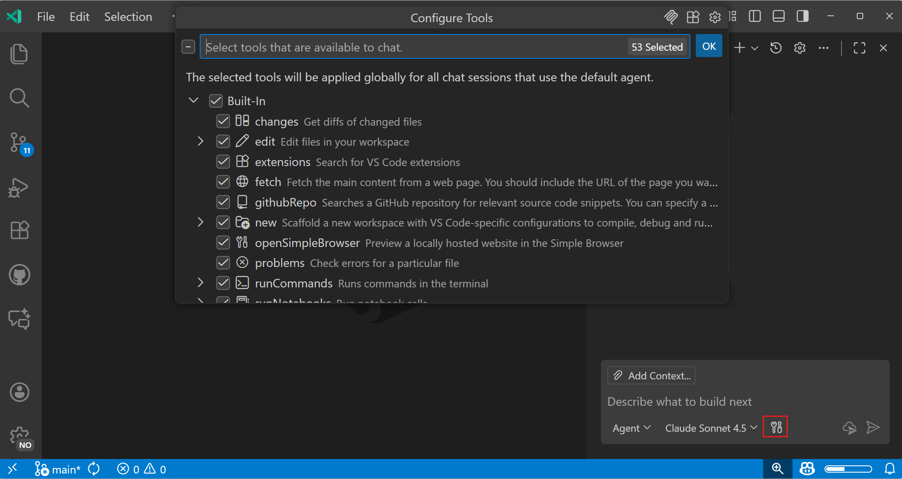
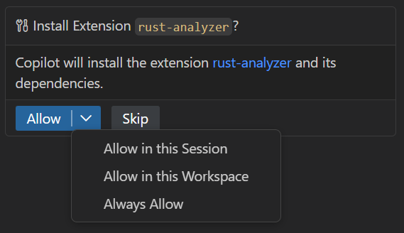
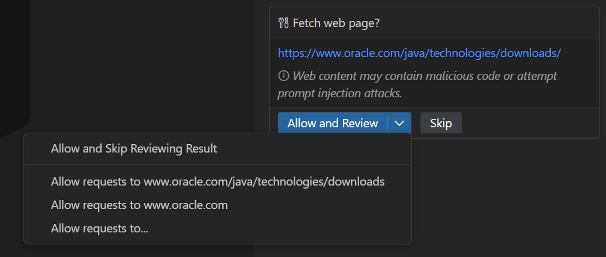
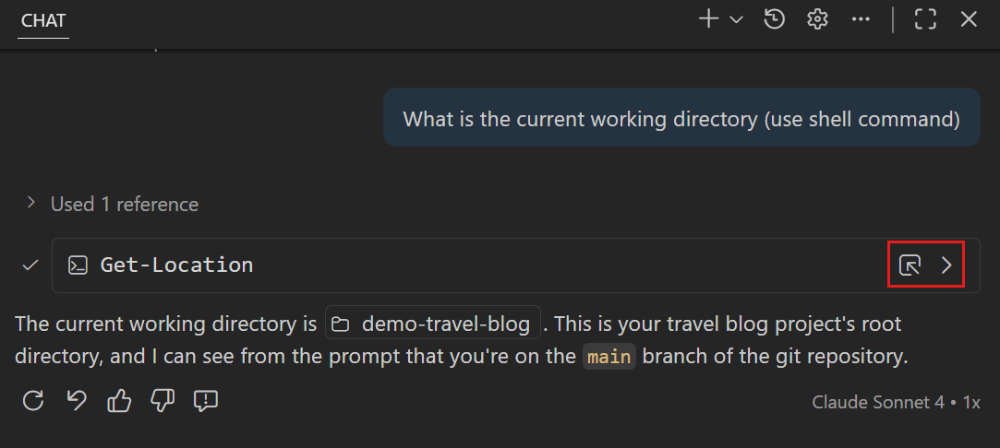
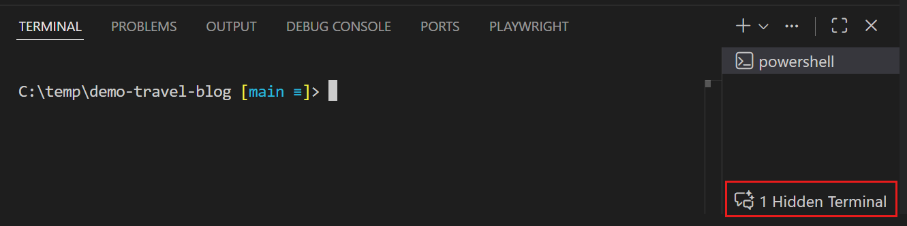
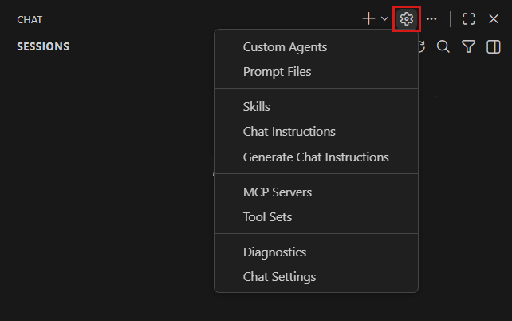

# Ajanlarla araçları kullanma

Araçlar, Visual Studio Code'daki ajanları kod arama, komut çalıştırma, web içeriği getirme veya API çağırma gibi belirli görevleri tamamlamak için özelleştirilmiş işlevsellikle genişletir. VS Code üç tür araç destekler: yerleşik araçlar, Model Context Protocol (MCP) araçları ve uzantı araçları.

Bu makale VS Code'da mevcut farklı araç türlerini, sohbet promptlarınızda nasıl kullanacağınızı ve araç çağrıları ile onayları nasıl yöneteceğinizi açıklar.

<video src="../images/chat-tools/chat-tools-picker.mp4" title="Video showing how to select and configure tools in the chat tools picker." loop controls muted poster="../images/chat-tools/chat-tools-picker.png"></video>

## Araç türleri

VS Code sohbette kullanabileceğiniz üç tür araç destekler:

<details>
<summary>Yerleşik araçlar</summary>

VS Code, sohbette otomatik olarak kullanılabilen kapsamlı bir yerleşik araç seti sağlar. Bu araçlar yaygın geliştirme görevlerini kapsar ve çalışma alanınızda çalışmak için optimize edilmiştir.

Yerleşik araçlar herhangi bir kurulum veya yapılandırma gerektirmez ve sohbeti kullanmaya başladığınız anda kullanılabilir. Örneğin, tarayıcı araçları ajanların web uygulamalarını test etmek ve doğrulamak için entegre tarayıcıda web sayfalarıyla etkileşim kurmasını sağlar.

Yerleşik araçların ve açıklamalarının tam listesi için [Sohbet araçları referansına](/docs/copilot/reference/copilot-vscode-features.md#chat-tools) bakın. Web uygulamalarını tarayıcı ajan araçlarıyla test etmeyi öğrenmek için [tarayıcı ajan araçlarıyla web uygulamalarını test etme](/docs/copilot/guides/browser-agent-testing-guide.md) bölümüne bakın.

</details>

<details>
<summary>MCP araçları</summary>

Model Context Protocol (MCP), yapay zeka modellerinin birleşik bir arayüz aracılığıyla harici araçları ve hizmetleri kullanmasını sağlayan açık bir standarttır. MCP sunucuları, sohbeti ek yeteneklerle genişletmek için VS Code'a ekleyebileceğiniz araçlar sağlar.

Sohbette MCP araçlarını kullanmadan önce MCP sunucularını yüklemeniz ve yapılandırmanız gerekir. MCP sunucuları makinenizde yerel olarak çalışabilir veya uzaktan barındırılabilir. MCP araçları [MCP Apps](/docs/copilot/customization/mcp-servers.md#use-mcp-apps) aracılığıyla etkileşimli UI bileşenleri de döndürebilir.

[VS Code'da MCP sunucularını yapılandırma](/docs/copilot/customization/mcp-servers.md) hakkında daha fazla bilgi edinin.

> [!IMPORTANT]
> Kuruluşunuz VS Code'da MCP sunucularının kullanımını devre dışı bırakmış veya hangi MCP sunucularını kullanabileceğinizi kısıtlamış olabilir. Daha fazla bilgi için yöneticinizle iletişime geçin.

</details>

<details>
<summary>Uzantı araçları</summary>

VS Code uzantıları editörle derinlemesine entegre olan araçlar katkıda bulunabilir. Uzantı araçları, VS Code uzantı API'lerinin tam yelpazesine erişirken özelleştirilmiş işlevsellik sağlamak için Language Model Tools API kullanır.

Uzantı araçları, bunları katkıda bulunan bir uzantı yüklediğinizde otomatik olarak kullanılabilir. Kullanıcıların uzantıyı kendisini yüklemenin ötesinde ayrı kurulum veya yapılandırmaya ihtiyacı yoktur.

Uzantı araçları oluşturmak isteyen geliştiriciler için [Language Model Tools API kılavuzuna](/api/extension-guides/ai/tools.md) bakın.

</details>

## Sohbet için araçları etkinleştirme

Sohbette araçları kullanmadan önce bunları Sohbet görünümünde etkinleştirmeniz gerekir. Araç seçiciyi kullanarak her istek temelinde araçları etkinleştirebilir veya devre dışı bırakabilirsiniz. [MCP sunucuları](/docs/copilot/customization/mcp-servers.md) yükleyerek veya araç katkıda bulunan [uzantıları](/docs/getstarted/extensions.md) yükleyerek daha fazla araç ekleyebilirsiniz.

> [!TIP]
> Sonuçlarınızı iyileştirmek için yalnızca promptunuzla ilgili araçları seçin.

Araç seçiciye erişmek için:

1. Sohbet görünümünü açın ve ajan seçiciden **Agent** seçin.

1. Sohbet giriş alanındaki **Configure Tools** düğmesini seçin.

    

1. Mevcut istek için hangi araçların kullanılabilir olduğunu kontrol etmek için araçları seçin veya seçimini kaldırın.

    Araç listesini filtrelemek için arama kutusunu kullanın.

Sohbeti [prompt dosyaları](/docs/copilot/customization/prompt-files.md) veya [özel ajanlarla](/docs/copilot/customization/custom-agents.md) özelleştirdiğinizde, belirli bir prompt veya mod için hangi araçların kullanılabilir olduğunu belirtebilirsiniz. [Araç listesi öncelik sırası](/docs/copilot/customization/custom-agents.md#tool-list-priority) hakkında daha fazla bilgi edinin.

## Promptlarınızda araçları kullanma

[Ajanları](/docs/copilot/agents/local-agents.md) kullanırken ajan, promptunuz ve isteğinizin bağlamına dayalı olarak etkin araçlardan hangilerini kullanacağını otomatik olarak belirler. Ajan görevi tamamlamak için gerektiğinde ilgili araçları özerk olarak seçer ve çağırır.

Ayrıca promptlarınızda `#` ve ardından araç adını yazarak araçlara açıkça atıfta bulunabilirsiniz. Belirli bir aracın kullanılmasını sağlamak istediğinizde bu yararlıdır. Sohbet giriş alanına `#` yazın ve yerleşik araçlar, yüklü sunuculardan MCP araçları, uzantı araçları ve araç setleri dahil olmak üzere mevcut araçların listesini görün.

**Açık araç atıfı örnekleri:**

* `"Summarize the content from #fetch https://code.visualstudio.com/updates"`
* `"How does routing work in Next.js? #githubRepo vercel/next.js"`
* `"Fix the issues in #problems"`
* `"Explain the authentication flow #codebase"`

Bazı araçlar parametreleri doğrudan promptta kabul eder. Örneğin `#fetch` bir URL gerektirir ve `#githubRepo` bir depo adı gerektirir.

> [!TIP]
> Varsayılan olarak araç çağrısı ayrıntıları sohbet görüşmesinde daraltılmıştır. Bunları sohbette araç özet satırını seçerek genişletebilir veya `setting(chat.agent.thinking.collapsedTools)` ayarıyla (deneysel) varsayılan davranışı değiştirebilirsiniz.

## Araç onayı

Bazı araçlar çalışmadan önce onayınızı gerektirir. Bu bir güvenlik önlemidir çünkü araçlar dosyaları değiştiren, ortamınızı değiştiren veya kötü niyetli araç çıktısı aracılığıyla prompt enjeksiyonu saldırıları deneyen eylemler gerçekleştirebilir.

Bir araç onay gerektirdiğinde araç ayrıntılarını gösteren bir onay iletişim kutusu görünür. Aracı onaylamadan önce bilgileri dikkatle inceleyin. Aracı tek kullanım, mevcut oturum, mevcut çalışma alanı veya gelecekteki tüm çağrılar için onaylayabilirsiniz.



Araçlar ve ajan eylemleri dosya değişikliklerine yol açabilir. Çalışma alanınızda hassas dosyalara yanlışlıkla [düzenlemelere](/docs/copilot/chat/review-code-edits.md#edit-sensitive-files) nasıl engel olacağınızı öğrenin.

> [!IMPORTANT]
> Özellikle dosyaları değiştiren, komut çalıştıran veya harici hizmetlere erişen araçlar için onaylamadan önce araç parametrelerini her zaman dikkatle inceleyin. VS Code'da yapay zeka kullanımı için [Güvenlik hususlarına](/docs/copilot/security.md) bakın.

### Araç otomatik onayını etkinleştirme veya devre dışı bırakma (Deneysel)

Varsayılan olarak herhangi bir aracı otomatik olarak onaylamayı seçebilirsiniz. Yanlışlıkla onayları önlemek için `setting(chat.tools.eligibleForAutoApproval)` ayarıyla belirli araçlar için otomatik onayları devre dışı bırakabilirsiniz. Değeri `false` olarak ayarlayarak o araç için her zaman manuel onay gerektirin.

Kuruluşlar ayrıca belirli araçlar için manuel onayları zorunlu kılmak üzere cihaz yönetimi politikalarını kullanabilir. [Kurumsal belgelere](/docs/enterprise/ai-settings.md) bakın.

### URL onayı

`fetch` aracı gibi bir araç bir URL'ye erişmeye çalıştığında, kötü niyetli veya beklenmedik içerikten korunmak için iki adımlı bir onay süreci kullanılır. VS Code, Sohbet görünümünde incelemeniz için URL ayrıntılarıyla bir onay iletişim kutusu gösterir.

* **Ön onay: URL'ye yapılan isteğin onaylanması**

    Bu adım, iletişime geçilen etki alanına güvendiğinizden emin olur ve hassas verilerin güvenilmeyen sitelere gönderilmesini önleyebilirsiniz.

    

    Tek seferlik onay veya belirli URL veya etki alanı için gelecekteki istekleri otomatik onaylama seçenekleriniz vardır. Otomatik onay seçimi sonuçların incelenmesi ihtiyacını etkilemez. **Allow requests to** seçtiğinizde URL veya etki alanı için hem ön hem de son onayları yapılandırmayı seçebilirsiniz.

    > [!NOTE]
    > Ön onay ["Trusted Domains" özelliğine](/docs/editing/editingevolved.md#_outgoing-link-protection) saygı gösterir. Bir etki alanı orada listelenmişse, o etki alanına istek yapmak için otomatik olarak onaylanırsınız ve yanıt inceleme adımı ertelenir.

* **Son onay: URL'den getirilen yanıt içeriğinin onaylanması**

    Bu adım, içeriğin sohbete eklenmeden veya diğer araçlara geçirilmeden önce incelediğinizden emin olur; bu da potansiyel prompt enjeksiyonu saldırılarını önler.

    Örneğin GitHub.com gibi iyi bilinen bir siteden içerik getirme isteğini onaylayabilirsiniz. Ancak sorun açıklaması veya yorumlar gibi içerik kullanıcı tarafından oluşturulduğu için modelin davranışını manipüle edebilecek zararlı içerik içerebilir.

    Tek seferlik onay veya belirli URL veya etki alanından gelecekteki yanıtları otomatik onaylama seçenekleriniz vardır.

    > [!IMPORTANT]
    > Son onay adımı "Trusted Domains" özelliğiyle bağlantılı değildir ve her zaman incelemenizi gerektirir. Bu, aksi takdirde güvendiğiniz bir etki alanında güvenilmeyen içerikle ilgili sorunları önlemek için bir güvenlik önlemidir.

`setting(chat.tools.urls.autoApprove)` ayarı otomatik onay URL desenlerinizi depolamak için kullanılır. Ayar değeri hem istekler hem de yanıtlar için otomatik onayları etkinleştirmek veya devre dışı bırakmak üzere bir boolean veya ayrıntılı kontrol için `approveRequest` ve `approveResponse` özelliklerine sahip bir nesne olabilir. Tam URL'ler, glob desenleri veya joker karakterler kullanabilirsiniz.

URL otomatik onay örnekleri:

```jsonc
{
"chat.tools.urls.autoApprove": {
    "https://www.example.com": false,
    "https://*.contoso.com/*": true,
    "https://example.com/api/*": {
        "approveRequest": true,
        "approveResponse": false
    }
}
}
```

### Araç onaylarını sıfırlama

Kaydedilmiş tüm araç onaylarını temizlemek için Komut Paleti'nde (`kb(workbench.action.showCommands)`) **Chat: Reset Tool Confirmations** komutunu kullanın.

## Araç parametrelerini düzenleme

Bir araç çalışmadan önce girdi parametrelerini inceleyebilir ve düzenleyebilirsiniz:

1. Araç onay iletişim kutusu göründüğünde ayrıntılarını genişletmek için araç adının yanındaki oku seçin.

1. Gerekli araç girdi parametrelerini düzenleyin.

1. Değiştirilmiş parametrelerle aracı çalıştırmak için **Allow** seçin.

## Terminal komutları

Ajan görevleri tamamlamak için iş akışının bir parçası olarak terminal komutları kullanabilir. Ajan terminal komutları çalıştırmaya karar verdiğinde bunları VS Code içindeki entegre terminalde yürütmek için yerleşik terminal aracını kullanır.

Sohbet görüşmesinde ajan çalıştırdığı komutları gösterir. Komutun çıktısını sohbette satır içi olarak komutun yanındaki **Show Output** (`>`) seçerek görüntüleyebilirsiniz. Tam çıktıyı **Show Terminal** seçerek entegre terminalde de görüntüleyebilirsiniz.



Terminal komut çıktısının nerede görüneceğini yapılandırmak için deneysel `setting(chat.tools.terminal.outputLocation)` ayarını kullanın: sohbette satır içi veya entegre terminalde.

Terminal panosunda ajanın bir sohbet oturumu için kullandığı terminallerin listesini görebilirsiniz. Ayrıca terminaller listesindeki sohbet simgesiyle ajan terminallerini ayırt edebilirsiniz.



### Terminal komutlarını arka planda sürdürme

Ajan bir geliştirme sunucusu başlatma veya izleme modunda derleme çalıştırma gibi uzun süren bir terminal komutu çalıştırdığında, komutu arka plana alabilirsiniz. Bu ajanın komutun bitmesini beklemeden diğer görevlere devam etmesini sağlar.

Bir komut çalışırken sohbet görüşmesindeki terminal komutunun yanında **Continue in Background** düğmesi görünür. Komutu arka plana taşımak için bu düğmeyi seçin. Komut çalışmaya devam eder ve ajan daha sonra çıktısını kontrol edebilir veya terminali diğer görevler için kullanabilir.

Ajan terminal komutları çalıştırırken bir zaman aşımı da belirtebilir. Zaman aşımına ulaşıldığında ajan komutu izlemeyi durdurur ve şu ana kadar toplanan çıktıyı döndürür. Ajanın belirttiği zaman aşımı değerinin uygulanıp uygulanmayacağını kontrol etmek için `setting(chat.tools.terminal.enforceTimeoutFromModel)` ayarını kullanın.

### Terminal komutlarını otomatik onaylama

`setting(chat.tools.terminal.autoApprove)` ayarını kullanarak hangi terminal komutlarının otomatik onaylanacağını yapılandırabilirsiniz. İzin verilen ve reddedilen komutları belirtebilirsiniz:

* Komutları otomatik onaylamak için `true` olarak ayarlayın
* Her zaman onay gerektirmek için `false` olarak ayarlayın
* Desenleri `/` karakterleri içine alarak normal ifadeler kullanın

Örneğin:

```jsonc
{
  // `mkdir` komutuna izin ver
  "mkdir": true,
  // `git status` ve `git show` ile başlayan komutlara izin ver
  "/^git (status|show\\b.*)$/": true,

  // `del` komutunu engelle
  "del": false,
  // "dangerous" içeren herhangi bir komutu engelle
  "/dangerous/": false
}
```

Varsayılan olarak desenler tek tek alt komutlarla eşleşir. Otomatik onay için bir komutun tüm alt komutları bir `true` girişiyle eşleşmeli ve `false` girişiyle eşleşmemelidir.

Gelişmiş senaryolar için tam komut satırıyla eşleşmek üzere `matchCommandLine` özelliğiyle nesne sözdizimini kullanın.

İlgili ayarlar:

* `setting(chat.tools.terminal.enableAutoApprove)`: otomatik onay işlevini kalıcı olarak devre dışı bırakır
* `setting(chat.tools.terminal.blockDetectedFileWrites)` (deneysel): dosya yazma algılama (deneysel)
* `setting(chat.tools.terminal.ignoreDefaultAutoApproveRules)` (deneysel): tüm varsayılan kuralları (hem izin ver hem de engelle) devre dışı bırakır; tüm kurallar üzerinde tam kontrol verir.

> [!CAUTION]
> Terminal komutlarını otomatik onaylamak _en iyi çaba_ korumaları sağlar ve ajanın kötü niyetli davranmadığını varsayar. Terminal otomatik onayı etkinleştirdiğinizde prompt enjeksiyonundan kendinizi korumak önemlidir çünkü bazı komutların geçmesi mümkün olabilir. Algılamanın başarısız olabileceği bazı örnekler:
>
> * VS Code PowerShell ve bash ağaç sitter gramerlerini alt komutları çıkarmak için kullanır, bu nedenle bu gramerler onları algılamazsa desenler algılanmaz.
> * VS Code zsh veya fish grameri olmadığı için bash grameri kullanır, bu nedenle bazı alt komutlar algılanmaz.
> * Dosya yazma algılama şu anda minimal olduğundan, terminal aracılığıyla dosyalara yazma, dosya düzenleme ajan araçları kullanarak mümkün olmayan yazma mümkün olabilir.
> * Tırnak birleştirme gibi çeşitli tekniklerle otomatik onayı atlamak mümkündür. Örneğin `find -exec` normalde engellenir ancak `find -e"x"ec` aynı şeyi yapmasına rağmen engellenmez.
>
> Prompt enjeksiyonu olasılığı varsa veya yüksek riskli bir ortamda çalışıyorsanız [terminal sandbox'ını etkinleştirmeyi](#sandbox-terminal-commands-experimental) veya VS Code'u bir konteyner içinde çalıştırmayı düşünün.

### Sandbox terminal komutları

> [!NOTE]
> Terminal sandbox'ı şu anda önizlemededir ve yalnızca macOS ve Linux'ta desteklenir. Windows'ta sandbox ayarlarının etkisi yoktur.

Terminal sandbox'ı, ajan tarafından çalıştırılan komutlar için dosya sistemi ve ağ erişimini kısıtlar. Sandbox etkinleştirildiğinde terminal komutları kontrollü bir ortamda çalıştığından kullanıcı onayı gerektirmeden otomatik onaylanır.

Terminal sandbox'ı etkinleştirmek için `setting(chat.tools.terminal.sandbox.enabled)` ayarını `true` olarak ayarlayın.

Sandbox etkinleştirildiğinde:

* Komutlar varsayılan olarak mevcut çalışma dizinine okuma ve yazma erişimine sahiptir
* Tüm etki alanları için varsayılan olarak ağ erişimi engellenir
* Komutlar standart onay iletişim kutusu olmadan çalışır

#### Dosya sistemi erişimini yapılandırma

Dosya sistemi erişimini kontrol etmek için `setting(chat.tools.terminal.sandbox.linuxFileSystem)` veya `setting(chat.tools.terminal.sandbox.macFileSystem)` ayarını kullanın:

```jsonc
{
  "chat.tools.terminal.sandbox.macFileSystem": {
    // Çalışma dizinine yazma izni ver
    "allowWrite": ["."],
    // Belirli alt dizinlere yazmayı engelle
    "denyWrite": ["./secrets/"],
    // Belirli yollardan okumayı engelle
    "denyRead": ["/etc/passwd"]
  }
}
```

`denyWrite` ve `denyRead` kuralları `allowWrite` kurallarından önceliklidir.

#### Ağ erişimini yapılandırma

Belirli etki alanlarına izin vermek için `setting(chat.tools.terminal.sandbox.network)` ayarını kullanın:

```jsonc
{
  "chat.tools.terminal.sandbox.network": {
    // Belirli etki alanlarına ağ erişimine izin ver
    "allowedDomains": ["api.github.com", "*.npmjs.org"],
    // Trusted Domains listesindeki etki alanlarını dahil et
    "allowTrustedDomains": true
  }
}
```

Sandbox etkinleştirildiğinde varsayılan olarak tüm etki alanları için ağ erişimi engellenir.

`allowTrustedDomains` `true` olarak ayarlandığında, [Trusted Domains](/docs/editing/editingevolved.md#outgoing-link-protection) listenizdeki etki alanları ağ erişimi için izin verilen etki alanlarına otomatik olarak dahil edilir. Sandbox yapılandırması Trusted Domains listesi değiştiğinde otomatik olarak güncellenir.

## Araç setleriyle araçları gruplandırma

Araç seti, promptlarınızda tek bir varlık olarak atıfta bulunabileceğiniz araçların bir koleksiyonudur. Araç setleri ilgili araçları düzenlemenize yardımcı olur ve sohbet promptunda, [prompt dosyalarında](/docs/copilot/customization/prompt-files.md) ve [özel sohbet ajanlarında](/docs/copilot/customization/custom-agents.md) kullanmayı kolaylaştırır. Yerleşik araçların bazıları `#edit` ve `#search` gibi önceden tanımlanmış araç setlerinin parçasıdır.

### Araç seti oluşturma

Araç seti oluşturmak için:

1. Komut Paleti'nden **Chat: Configure Tool Sets** komutunu çalıştırın ve **Create new tool sets file** seçin.

    Alternatif olarak Sohbet görünümünde **Configure Chat** > **Tool Sets** > **Create new tool sets file** seçin.

    

1. Açılan `.jsonc` dosyasında araç setinizi tanımlayın.

    Araç setinin aşağıdaki yapısı vardır:

    ```json
    {
        "reader": {
            "tools": [
                "changes",
                "codebase",
                "problems",
                "usages"
            ],
            "description": "Tools for reading and gathering context",
            "icon": "book"
        }
    }
    ```

    Araç seti özellikleri:

    * `tools`: Araç adları dizisi (yerleşik araçlar, MCP araçları veya uzantı araçları)
    * `description`: Araç seçicide görüntülenen kısa açıklama
    * `icon`: Araç seti için simge ([Product Icon Reference](/api/references/icons-in-labels.md)'a bakın)

### Araç seti kullanma

Promptlarınızda araç setine `#` ve ardından araç seti adını yazarak atıfta bulunun:

* `"Analyze the codebase for security issues #reader"`
* `"Where is the DB connection string defined? #search"`

Araç seçicide araç setleri ilgili araçların daraltılabilir grupları olarak kullanılabilir. Birden fazla ilgili aracı hızlıca etkinleştirmek veya devre dışı bırakmak için tüm araç setlerini tek seferde seçebilir veya seçimini kaldırabilirsiniz.

## Sık sorulan sorular

### Hangi araçların kullanılabilir olduğunu nasıl bilirim?

Mevcut tüm araçların listesini görmek için sohbet giriş alanına `#` yazın. Araç listesini görüntülemek ve yönetmek için sohbetteki araç seçicisini de kullanabilirsiniz.

### "Cannot have more than 128 tools per request." (İstek başına 128'den fazla araç olamaz) hatası alıyorum.

Bir sohbet isteğinde aynı anda en fazla 128 araç etkin olabilir. 128 araç sınırı aşıldığına dair bir hata görürseniz:

* Sohbet görünümündeki araç seçicisini açın ve sayıyı azaltmak için bazı araçları veya tüm MCP sunucularını seçimini kaldırın.

* Alternatif olarak büyük araç setlerini otomatik yönetmek için `setting(github.copilot.chat.virtualTools.threshold)` ayarıyla sanal araçları etkinleştirin.

### Ajan neden Command Prompt'u terminal kabuğu olarak kullanmıyor?

Ajan, varsayılan olarak terminal için yapılandırdığınız kabuğu kullanır, cmd hariç. Bunun nedeni [kabuk entegrasyonunun](https://code.visualstudio.com/docs/terminal/shell-integration) Command Prompt ile desteklenmemesidir; bu da ajanın terminalin içinde olup bitenlere çok sınırlı görünürlüğe sahip olduğu anlamına gelir. Komutların çalıştığı veya çalışmayı bitirdiği doğrudan sinyaller almak yerine ajan devam etmek için zaman aşımına ve terminalin boşta kalmasını izlemeye güvenmek zorundadır. Bu yavaş ve kararsız bir deneyime yol açar.

Yine de `setting(chat.tools.terminal.terminalProfile.windows)` ayarıyla ajanı Command Prompt kullanacak şekilde yapılandırabilirsiniz, ancak bu PowerShell kullanmaya kıyasla daha düşük bir deneyimle sonuçlanır.

```json
"chat.tools.terminal.terminalProfile.windows": {
  "path": "C:\\WINDOWS\\System32\\cmd.exe"
}
```

### Tüm araçları ve terminal komutlarını otomatik onaylayabilir miyim?

> [!CAUTION]
> Bu ayar yıkıcı eylemler dahil tüm manuel onayları devre dışı bırakır. Kritik güvenlik korumalarını kaldırır ve saldırganın makineyi tehlikeye atmasını kolaylaştırır. Yalnızca sonuçlarını anlıyorsanız bu ayarı etkinleştirin. Daha fazla ayrıntı için [Güvenlik belgelerine](/docs/copilot/security.md) bakın.
>
> Tüm araçların ve terminal komutlarının kullanıcı onayı istemeden çalışmasına izin vermek için `chat.tools.global.autoApprove` ayarını etkinleştirin. Bu ayar tüm çalışma alanlarınızda global olarak geçerlidir!

Ayrıca `/yolo` veya `/autoApprove` eğik çizgi komutunu kullanarak etkinleştirmek veya `/disableYolo` veya `/disableAutoApprove` kullanarak devre dışı bırakmak suretiyle global otomatik onayı doğrudan sohbetten açıp kapatabilirsiniz. Global otomatik onayı ilk kez etkinleştirdiğinizde bir uyarı iletişim kutusu onaylamanızı ister.

### Araçlar ile sohbet katılımcıları arasındaki fark nedir?

Sohbet katılımcıları, sohbette alan özelinde sorular sormanızı sağlayan uzman asistanlardır. Sohbet katılımcısını, sohbet isteğinizi devralan ve geri kalanına bakan bir alan uzmanı olarak düşünün.

Araçlar ajan akışının bir parçası olarak çağrılır ve belirli görevlere katkıda bulunur ve gerçekleştirir. Tek bir sohbet isteğinde birden fazla araç dahil edebilirsiniz ancak aynı anda yalnızca bir sohbet katılımcısı etkin olabilir.

### Kendi araçlarımı oluşturabilir miyim?

Evet. Araçları iki şekilde oluşturabilirsiniz:

* [Language Model Tools API](/api/extension-guides/ai/tools.md) kullanarak araçlar katkıda bulunan bir VS Code uzantısı geliştirin
* Araçlar sağlayan bir MCP sunucusu oluşturun. [MCP geliştirici kılavuzuna](/docs/copilot/guides/mcp-developer-guide.md) bakın

## İlgili kaynaklar

* [Sohbet araçları referansı](/docs/copilot/reference/copilot-vscode-features.md#chat-tools)
* [Ajan hook'ları](/docs/copilot/customization/hooks.md) - Araç yaşam döngüsü olaylarında özel komutlar çalıştırma
* [VS Code'da yapay zeka kullanımı için güvenlik hususları](/docs/copilot/security.md)
