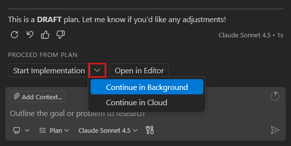
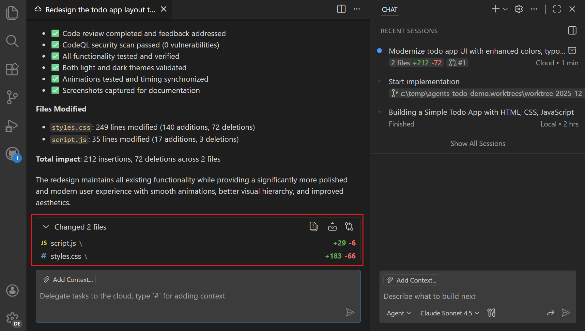

# Öğretici: VS Code'da ajanlarla çalışma

Bu öğretici Visual Studio Code'da farklı ajan türlerini kullanarak size yol gösterir. Sıfırdan bir todo uygulaması oluşturur, tema geçişi ekler ve yerel, plan, arka plan ve bulut ajanları arasında iş devrederek düzeni yeniden tasarlarsınız.

> [!TIP]
> Henüz Copilot aboneliğiniz yoksa [Copilot Free planına](https://github.com/github-copilot/signup) kaydolarak satır içi öneriler ve sohbet etkileşimleri için aylık limite sahip olarak ücretsiz kullanabilirsiniz.

<div class="docs-action" data-show-in-doc="false" data-show-in-sidebar="true" title="Test web apps with browser agent tools">
Web uygulamaları oluşturmak ve otomatik test etmek için tarayıcı ajan araçlarını kullanın.

* [Browser agent testing guide](/docs/copilot/guides/browser-agent-testing-guide.md)

</div>

## Ön koşullar

Bu öğreticiyi tamamlamak için şunlar gerekir:

* [Bilgisayarınıza yüklenmiş Visual Studio Code](/download)
* [GitHub hesabı](https://docs.github.com/en/get-started/start-your-journey/creating-an-account-on-github) (bulut ajan iş akışı için)
* [GitHub Copilot aboneliği](/docs/copilot/setup.md)

## Adım 1: Uygulama iskeletini oluşturmak için yerel ajan kullanma

Bu adımda ilk todo uygulaması yapısını oluşturmak için yerel bir ajan kullanırsınız. Yerel ajanlar anında geri bildirim ve sonuçlar istediğiniz etkileşimli görevler için idealdir; örneğin yeni proje iskeleti oluşturma veya yeni özellik üzerinde yineleme.

1. Yeni bir proje klasörü oluşturun ve Git sürüm kontrolü altında olduğundan emin olun.

    ```bash
    mkdir todo-app
    cd todo-app
    git init
    ```

1. Proje klasörünü VS Code'da açın.

1. Sohbet görünümünü (`kb(workbench.action.chat.open)`) açın ve Agents açılır menüsünden **Agent** seçin.

    Tercihiniz varsa belirli bir dil modeli seçebilirsiniz.

    > [!IMPORTANT]
    > Ajan seçeneğini görmüyorsanız VS Code ayarlarınızda ajanların etkin olduğundan emin olun (`setting(chat.agent.enabled)`). Kuruluşunuz ajanları devre dışı bırakmış da olabilir; bu işlevi etkinleştirmek için yöneticinizle iletişime geçin.

1. Todo uygulamasını oluşturmak için sohbet giriş alanına aşağıdaki promptu girin ve **Send** seçin.

    ```prompt
    Create a simple todo app with HTML, CSS, and JavaScript. Include an input field to add todos, a list to display them, and a delete button for each item.
    ```

    <video src="../images/agents-tutorial/local-agent-todo-app-scaffold-v2.mp4" alt="Video showing a local agent scaffolding a todo app in VS Code." muted loop controls></video>

1. Ajan uygulama için farklı dosyaları oluştururken inceleyin. Gerektiğinde değişiklikleri kabul etmek veya geri almak için **Keep** veya **Undo** kullanın.

1. Değişiklikleri entegre tarayıcıda önizleyebilirsiniz.

    * `localhost` URL'leri için entegre tarayıcıyı `setting(workbench.browser.openLocalhostLinks)` yapılandırarak etkinleştirin

    * `index.html` dosyasını açın ve **Preview** düğmesini seçin.

1. Uygulamayı daha da geliştirmek için ek promptlar gönderin. Önizlemenin değişiklik yaparken canlı güncellendiğini fark edin.

    Örneğin şunu sorabilirsiniz:

    ```prompt
    Mark todos as completed with a strikethrough effect.
    ```

Artık ek özelliklerle genişletebileceğiniz çalışan bir todo uygulamanız var. Yerel ajan kullanarak etkileşimli olarak gerçek zamanlı kod oluşturup iyileştirebilirsiniz.

## Adım 2: Özellik planını uygulamak için arka plan ajanı kullanma

Bu adımda tema geçişi için plan ajanını kullanarak bir uygulama planı oluşturur, ardından uygulamayı arka plan ajanına devredersiniz. Arka plan ajanları anında etkileşim gerektirmeyen görevleri devretmek için idealdir. Ana çalışma alanınızdan dosya değişikliklerini izole etmek ve çakışmaları önlemek için Git worktree'lerini kullanırlar.

1. Önce Source Control görünümünde mevcut değişikliklerinizi işleyerek temiz bir durum elde edin.

1. Sohbet görünümünde **New Chat (+)** > **New Chat** seçerek yeni bir yerel ajan oturumu başlatın. Önceki sohbet oturumunuzun ajan oturumları listesinde korunduğunu fark edin.

1. Agents açılır menüsünden **Plan** seçerek plan ajanına geçin ve aşağıdaki promptu girin:

    ```prompt-plan
    Create a plan to add a dark/light theme toggle to the app. The toggle should switch between themes and persist the user's preference.
    ```

1. Plan ajanı planı iyileştirmek için açıklayıcı sorular sorabilir. Gerekirse yanıtlayın.

1. Hazır olduğunuzda planı arka plan ajanına devretmek için **Start Implementation** > **Continue in Background** seçin.

    

1. Arka plan ajanı özelliği uygulamaya başladığı bir Git worktree oluşturur. Arka plan ajanını **Sessions** görünümünde takip edebilirsiniz. İlerlemesiyle ilgili ayrıntıları görmek için oturumu seçin.

    <video src="../images/agents-tutorial/background-agent-theme-switcher-v2.mp4" alt="Video showing a background agent implementing a theme switcher feature in VS Code." muted loop controls></video>

    > [!TIP]
    > Arka plan ajanı çalışırken ana çalışma alanınızda çakışma olmadan düzenlemeye devam edebilirsiniz.

1. Arka plan ajanı tamamladığında değiştirilen dosyalardan herhangi birini incelemek için seçin veya tüm değişiklikleri açmak için **View All Changes** seçin.

    > [!TIP]
    > Özelliğe ayarlama veya iyileştirme yapmak için arka plan ajanına takip promptları gönderebilirsiniz.

1. Sohbet görünümünde değişiklikleri ana çalışma alanınıza uygulamak için **Apply** seçin.

Arka planda görevi özerk olarak gerçekleştirmek için arka plan ajanını başarıyla kullandınız. Ana iş akışınızı kesintiye uğratmadan farklı görevler için birden fazla arka plan ajanı başlatabilirsiniz.

## Adım 3: Özellik üzerinde iş birliği yapmak için bulut ajanı kullanma

Bu adımda uygulama düzenini yeniden tasarlamak ve GitHub'da pull request ve iş birliği özellikleri kullanmak için bulut ajanını (Copilot coding agent) kullanırsınız. Copilot coding agent uzak altyapıda çalışır ve anında geri bildirim gerektirmeyen, yerel çalıştırılması gerekmeyen veya GitHub aracılığıyla iş birliği gerektiren görevler için idealdir.

1. Önce projeyi GitHub deposuna yayınlayın ve projenizde Copilot coding agent kullanmak için remote ekleyin.

    1. Komut Paleti'nden (`kb(workbench.action.showCommands)`) **Publish to GitHub** komutunu çalıştırın ve yeni bir depo oluşturmak için istemleri izleyin.

    1. Komut Paleti'nden **Git: Add Remote** komutunu çalıştırın ve GitHub deponuzu remote olarak eklemek için istemleri izleyin.

1. Sohbet görünümünde **New Chat (+)** > **New Chat** seçin.

1. Bulut ajanına geçmek için oturum türü açılır menüsünden **Cloud** seçin ve aşağıdaki promptu girin:

    ```text
    Redesign the todo app layout to improve user experience. Update colors, spacing, typography, and add animations to give it a modern look.
    ```

1. Bulut ajanı isteğiniz üzerinde çalışmak için yeni bir oturum başlatır. GitHub deponuzda bir dal ve pull request oluşturur.

    <video src="../images/agents-tutorial/cloud-agent-redesign-todo-app-v2.mp4" alt="Video showing a cloud agent redesigning a todo app in VS Code." muted loop controls></video>

1. Bulut ajanını Sohbet görünümündeki **Sessions** görünümünde takip edebilir veya pull request ayrıntılarını görüntülemek için bağlantıyı seçebilirsiniz.

    > [!TIP]
    > GitHub Pull Requests uzantısı yüklüyse pull request ilerlemesini GitHub Pull Requests görünümündeki **Copilot on my Behalf** görünümünde de takip edebilirsiniz.

1. Tamamlandığında bulut ajanı pull request'i incelemeniz için size atar.

    

1. **Sessions** görünümünde bulut ajan oturumuna sağ tıklayarak ek seçenekleri görün veya oturumu seçip **Checkout** veya **Apply** seçin.

GitHub kullanarak bir özellik üzerinde iş birliği yapmak için bulut ajanını başarıyla kullandınız. Bulut ajanları uzak kaynakları kullanmanızı ve GitHub sorunları ve pull request'leri aracılığıyla değişiklikler üzerinde iş birliği yapmanızı sağlar.

## Sonraki adımlar

Farklı ajan türlerini kullanarak todo uygulamasını oluşturmayı, geliştirmeyi ve yeniden tasarlamayı başarıyla tamamladınız. Ajanları keşfetmeye devam edin:

* [Ajan türleri ve ne zaman kullanılacakları](/docs/copilot/agents/overview.md) hakkında bilgi edinin
* [Özel ajanlar oluşturmayı](/docs/copilot/customization/custom-agents.md) keşfedin
