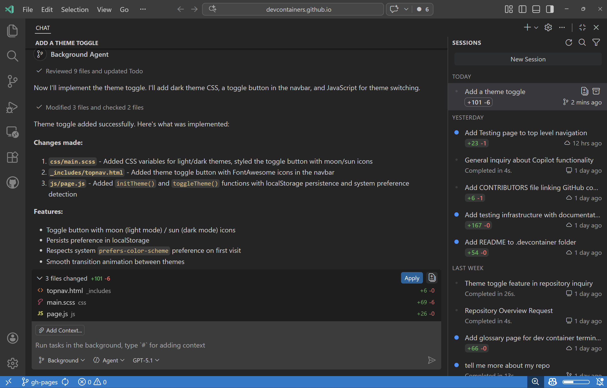
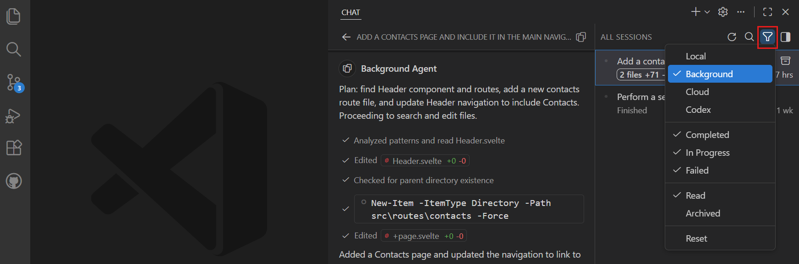
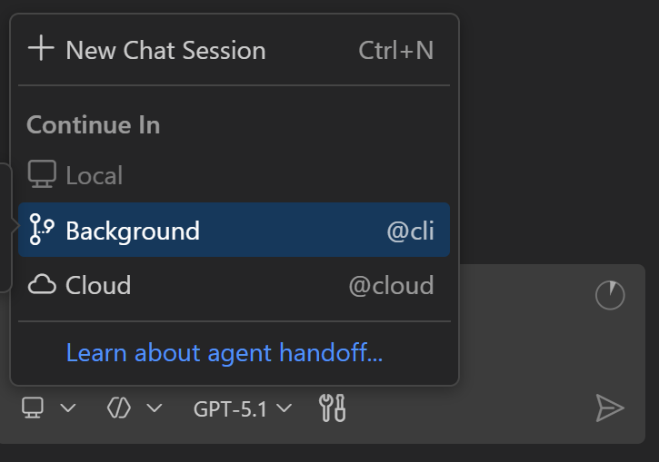
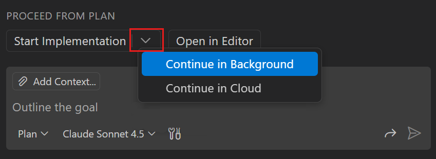
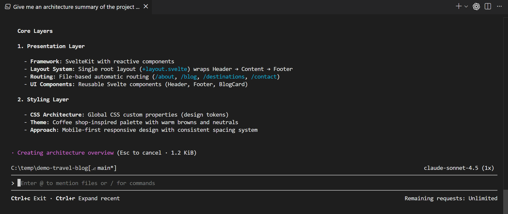
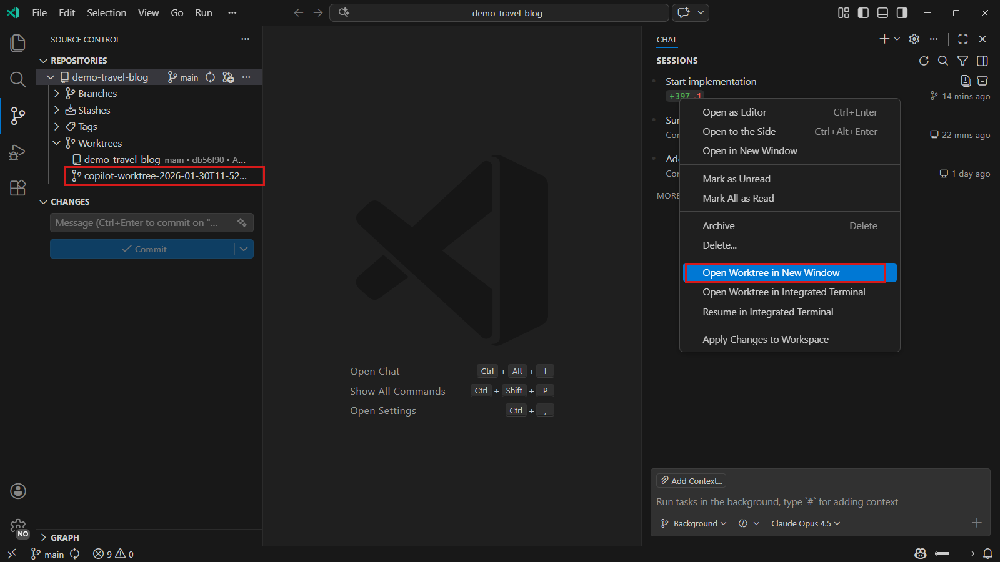
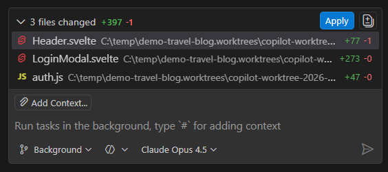
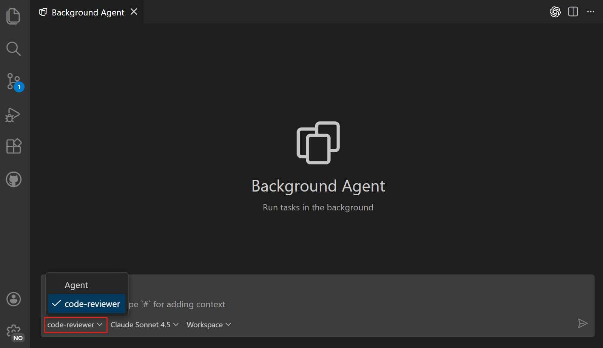

# Visual Studio Code'da arka plan ajanları

> [!NOTE]
> "Arka plan ajanı" terimi bir deney çalıştırılırken VS Code arayüzünde "Copilot CLI" veya "worktree" olarak da görünebilir.

Visual Studio Code'daki arka plan ajanları doğrudan VS Code'dan başlatılır ve editörde diğer işlere devam ederken makinenizde özerk çalışır. Birleşik Sohbet görünümüne ilerleme bildirir ve ana çalışma alanınızdan çalışmanızla çakışmaları önlemek için Git worktree'leri kullanarak izole çalışır. Bağımsız görevleri aynı anda ele almak için birden fazla arka plan oturumunu paralel çalıştırın.

Bu makale arka plan ajanlarının temel özelliklerini ve Copilot CLI'dan arka plan oturumlarını başlatma ve yönetme konusunu kapsar.

> [!TIP]
> OpenAI Codex gibi üçüncü taraf sağlayıcılar da arka plan ajan yetenekleri sunar. [Üçüncü taraf ajanlar](/docs/copilot/agents/third-party-agents.md) hakkında daha fazla bilgi edinin.

VS Code'da yerel, arka plan ve bulut ajanlarını deneyimlemek için uygulamalı öğreticiyi izleyin.

* [Start tutorial](/docs/copilot/agents/agents-tutorial.md)

## Arka plan ajanları nedir?

VS Code'un editör bağlamında çalışan ve bu bağlamın farkında olan yerel ajanların aksine arka plan ajanları komut satırı arayüzleri (CLI'lar) aracılığıyla makinenizde bağımsız çalışır. Tüm arka plan ajan oturumlarınızı VS Code'daki birleşik Sohbet görünümünden görüntüleyebilir ve yönetebilirsiniz. Bu görünüm ayrıca VS Code'dan doğrudan yeni arka plan ajan oturumları oluşturmanıza veya yerel ajan sohbetlerini arka plan ajanlarına devretmenize olanak tanır.

Arka plan ajanları iyi tanımlanmış kapsamı ve gerekli tüm bağlamı olan görevler için uygundur çünkü kullanıcı etkileşimi olmadan arka planda çalışırlar. Örnekler arasında bir plandan özellik uygulama, proof of concept'in birden fazla varyantını oluşturma veya net tanımlanmış düzeltmeler veya özellikler uygulama sayılabilir.

Yeni arka plan ajan oturumunu doğrudan sohbette arka plan oturum türünü seçerek başlatabilirsiniz. Alternatif olarak yerel oturumu arka plan ajanına devredebilirsiniz.

Arka plan ajanları sohbette [yeniden kullanılabilir promptlar](/docs/copilot/customization/prompt-files.md), [ajan becerileri](/docs/copilot/customization/agent-skills.md), [hook'lar](/docs/copilot/customization/hooks.md) ve uzun görüşmeleri yönetmek için `/compact` dahil eğik çizgi komutlarını destekler. Arka plan oturumunun sohbet girişine `/` yazarak mevcut komutları görün.

Aktif editördeki çalışmanızla çakışmayı önlemek için arka plan ajanları değişiklikleri [izole ortamda](#create-background-agent-session) yapmak üzere Git worktree'leri kullanır; ana çalışma alanınızı etkilemez. Arka plan ajan oturumu başlattığınızda VS Code oturum için otomatik olarak ayrı bir klasör oluşturur.

### Arka plan ajanlarının sınırlamaları

* Arka plan ajanları prompta bağlamı açıkça eklemediğiniz sürece VS Code yerleşik araçlarına ve çalışma zamanı bağlamına (başarısız testler veya metin seçimleri gibi) doğrudan erişemez.
* Uzantı tarafından sağlanan araçlara erişimi yoktur ve CLI aracı aracılığıyla mevcut modellerle sınırlıdır.
* Şu anda kimlik doğrulama gerektirmeyen yalnızca yerel MCP sunucularına erişebilir.

### Copilot CLI

**Copilot CLI** VS Code'daki birincil arka plan ajandır. Oturumları Sohbet görünümünden veya VS Code terminalinden doğrudan Copilot CLI kullanarak başlatıp yönetebilirsiniz.

VS Code Copilot CLI'yi sizin için otomatik yükler ve yapılandırır. CLI'dan doğrudan bir oturum başlattığınızda bu oturum da oturumlar listesinde görünür; ilerlemesini takip edebilir ve daha fazla etkileşimde bulunabilirsiniz.

[Terminalden Copilot CLI kullanma](#use-copilot-cli-from-the-terminal) veya GitHub'da [Copilot CLI](https://docs.github.com/en/copilot/concepts/agents/about-copilot-cli) belgelerine bakın.

## Arka plan ajan oturumlarını görüntüleme ve yönetme

Tüm arka plan ajan oturumlarınızı VS Code'daki Sohbet görünümünden görüntüleyebilir ve yönetebilirsiniz. Filtre seçeneklerinden **Background Agents** seçerek oturum listesini yalnızca arka plan ajan oturumlarını gösterecek şekilde filtreleyin.

Listeden bir arka plan ajan oturumu seçerek Sohbet görünümünde oturum ayrıntılarını açın. Oturumu editör sekmesinde (sohbet editörü) görüntülemeyi tercih ediyorsanız oturuma sağ tıklayın ve **Open as Editor** seçin. Oturumlarla etkileşim için [terminalden Copilot CLI kullanabilirsiniz](#use-copilot-cli-from-the-terminal).

## Arka plan ajan oturumu başlatma

İş akışınıza bağlı olarak arka plan ajan oturumlarını birkaç şekilde başlatabilirsiniz. CLI kullanarak doğrudan görev ayrıntılarıyla yeni oturum oluşturabilir veya VS Code'daki [Sohbet görünümünden](/docs/copilot/agents/overview.md#agent-sessions-list) yeni oturum başlatabilirsiniz.

Başka bir yaklaşım - özellikle karmaşık görevler için - önce VS Code sohbetinde [Plan ajanı](/docs/copilot/agents/planning.md) gibi yerel bir ajanda kapsamı ve ayrıntıları netleştirmek, ardından gerçek kodlamayı arka plan ajanına devretmektir.

### Copilot CLI arka plan ajan oturumu oluşturma

VS Code'da yeni Copilot CLI arka plan ajan oturumu birkaç yolla oluşturabilirsiniz:

* Sohbet görünümünden:

    1. Sohbet görünümünü (`kb(workbench.action.chat.open)`) açın

    1. **Delegate Session** açılır menüsünü > **Background** seçin

* Yerel sohbet oturumundayken:

    * Bir prompt girin, **Delegate Session** açılır menüsünü > **Background** seçin

* Komut Paleti'nden (`kb(workbench.action.showCommands)`) **Chat: New Background Agent** komutunu çalıştırın

Yeni arka plan ajan oturumu açılır; ek görev ayrıntıları sağlayabilir ve Copilot CLI oturumunun ilerlemesini takip edebilirsiniz.

Arka plan oturumu için görsel bağlam sağlamak üzere sohbet girişine görsel ekleyebilirsiniz.

### Ajan oturumunu arka plan ajanına devretme

Karmaşık görevler için önce VS Code sohbetinde yerel ajanda gereksinimleri netleştirmek, ardından özerk yürütme için görevi arka plan ajanına devretmek yararlı olabilir. Yerel ajan sohbetini arka plan ajan oturumuna devrettiğinizde tam sohbet geçmişi ve bağlam arka plan ajanına geçirilir.

Yerel ajan oturumunu arka plan ajan oturumunda sürdürmek için:

1. Sohbet görünümünü (`kb(workbench.action.chat.open)`) açın

1. Arka plan ajanına devretmeye hazır olana kadar yerel ajanda etkileşimde bulunun

1. Arka plan ajanına devretmek için aşağıdaki seçenekleriniz vardır:

    * **Delegate Session** açılır menüsünü açın ve **Background** seçin

        

    * [Plan ajanını](/docs/copilot/agents/planning.md) kullanıyorsanız uygulamayı arka plan ajan oturumunda çalıştırmak için **Start Implementation** açılır menüsünü seçin ve **Continue in Background** seçin

        

Arka plan ajan oturumu tam sohbet geçmişi ve bağlamla otomatik başlar. Arka plan ajanının ilerlemesini Sohbet görünümünde izleyebilirsiniz.

## Terminalden Copilot CLI kullanma

Arka plan ajan oturumlarını Sohbet görünümünden başlatmaya ek olarak VS Code terminalinden doğrudan Copilot CLI kullanabilirsiniz.

### Copilot CLI terminali açma

Kullanabileceğiniz özel bir Copilot CLI terminali için VS Code **GitHub Copilot CLI** terminal profilini kaydeder. Copilot CLI terminalini birkaç yolla açabilirsiniz:

* Terminal panelindeki **+** düğmesinin yanındaki açılır menüyü seçin ve **GitHub Copilot CLI** seçin

* Komut Paleti'nden panelde Copilot CLI terminali açmak için **Chat: New CLI Session** komutunu çalıştırın veya mevcut editörünüzün yanında editör sekmesinde açmak için **Chat: New CLI Session to the Side** çalıştırın

* Komut Paleti'nden (`kb(workbench.action.showCommands)`) **Terminal: Create New Terminal (With Profile)** komutunu çalıştırın ve **GitHub Copilot CLI** seçin

* Herhangi bir VS Code entegre terminalinde `copilot` yazarak doğrudan Copilot CLI'yı başlatın

Copilot CLI terminali aşağıdaki kabukları destekler:

* macOS ve Linux'ta **bash** ve **zsh**
* Windows'ta **PowerShell** ve **Command Prompt**

### Terminalden oturumları başlatma ve sürdürme

Copilot CLI terminalinden yeni oturum başlattığınızda VS Code oturumu otomatik algılar ve Sohbet görünümü oturumlar listesinde görüntüler. Ardından ilerlemeyi, takip promptları göndermeyi veya değişiklikleri incelemeyi terminal veya Sohbet görünümünden yapabilirsiniz.

Mevcut arka plan ajan oturumunu terminalde sürdürmek için Sohbet görünümünde oturuma sağ tıklayın ve **Resume Agent Session in Terminal** seçin.

VS Code Copilot CLI terminali için kimlik doğrulamayı otomatik halleder; ayrıca oturum açmanız gerekmez.

## Arka plan ajan oturumu oluşturma

Arka plan ajan oturumları ana çalışma alanınızdan değişiklikleri izole etmek için otomatik olarak [Git worktree'leri](/docs/sourcecontrol/branches-worktrees.md#understanding-worktrees) kullanır. Arka plan ajan oturumu başlattığınızda VS Code oturum için ayrı bir klasör oluşturur. Arka plan ajanı aktif çalışmanızla çakışmayı önlemek için bu izole klasörde çalışır.

Git worktree'leriyle arka plan ajan oturumu başlatmak için:

1. Sohbet görünümünde **Delegate Session** açılır menüsünü seçin ve oturum türü açılır menüsünden **Background** seçin.

1. Ajan oturumunu başlatmak için bir prompt girin. VS Code otomatik olarak yeni bir Git worktree oluşturur.

    Arka plan ajanının yaptığı tüm değişiklikler worktree klasörüne uygulanır; ana çalışma alanınızdan izole edilir.

    Arka plan ajanları her turun sonunda worktree'ye değişiklikleri işler; oturum geçmişi commit geçmişiyle hizalı kalır.

    > [!TIP]
    > Arka plan ajan oturumunun worktree'sini açmak için oturum listesinde sağ tıklayıp **Open Worktree in New Window** seçin. Worktree'yi Source Control görünümü depo gezgininde (`scm.repositories.explorer`) de görüntüleyebilirsiniz.
    >
    > 

1. Arka plan ajanının ilerlemesini Sohbet görünümünde izleyin. Ajan oturumları listesi worktree'deki değişikliklerle eşleşen diff istatistiklerini gösterir.

1. Arka plan ajanı görevi tamamladıktan sonra worktree'deki değişiklikleri ana çalışma alanınıza gözden geçirin ve uygulayın.

    Oturumun altındaki çalışma seti arka plan ajan oturumu sırasında değişen dosyaları gösterir ve **Apply** ve **View All Changes** eylemleri sağlar.

    <!-- TODO: update screenshot to show the new Apply/View Changes UI (Keep/Undo buttons removed) -->
    

1. Değişiklikleri uyguladığınızda VS Code çalışma ağacınız veya staged dosyalarınızla oluşan çakışmaları halleder. Çakışma olursa bir birleştirme çözümleme deneyimi çözmenize yardımcı olur.

VS Code kaynak denetiminde [Git worktree'leri kullanma](/docs/sourcecontrol/branches-worktrees.md) hakkında daha fazla bilgi edinin.

<!-- TODO: delete obsolete screenshot images/background-agents/isolated-run-mode.png (isolation mode picker removed) -->

## Çoklu depo çalışma alanları

Çalışma alanınız birden fazla Git deposu içerdiğinde VS Code arka plan ajan oturumu başlattığınızda sohbet girişinde depo seçicisi görüntüler. Worktree'nin hangi depoda oluşturulacağını seçmek için bu seçiciyi kullanın.

Oturum başladıktan sonra depo seçici o oturum için devre dışı kalır. Worktree Source Control Repositories görünümündeki **Worktrees** düğümü altında seçilen deponun altında görünür.

> [!TIP]
> Çalışma alanınızdaki tüm depoları görüntülemek için `setting(scm.repositories.explorer)` ayarını etkinleştirin ve Source Control görünümünü açın.

## Arka plan ajanlarıyla özel ajanlar kullanma (Deneysel)

[Özel ajanlar](/docs/copilot/customization/custom-agents.md) VS Code'da ajanlar için özel kişilikler ve roller tanımlamanızı sağlar. Örneğin kod incelemeleri yapmak için özel bir ajan oluşturabilirsiniz. Özel ajanlar belirli talimatlar ve davranışlar tanımlayabilir.

Arka plan ajan oturumu oluşturduğunuzda görevi ele alacak özel ajanı seçebilirsiniz. Arka plan ajanı özel ajanın tanımlanan davranışına göre çalışır.

Arka plan ajanlarıyla özel ajanları etkinleştirmek için:

1. `setting(github.copilot.chat.cli.customAgents.enabled)` ayarıyla arka plan ajanları için özel ajanları etkinleştirin

1. Komut Paleti'nden (`kb(workbench.action.showCommands)`) **Chat: New Custom Agent** komutunu çalıştırarak çalışma alanınızda özel ajan oluşturun

    > [!NOTE]
    > Şu anda yalnızca çalışma alanında tanımlanan özel ajanlar arka plan ajan oturumları için kullanılabilir. [Özel ajan oluşturma](/docs/copilot/customization/custom-agents.md#create-a-custom-agent) hakkında daha fazla bilgi edinin.

1. Yeni arka plan ajan oturumu oluşturun ve Agents açılır menüsünden özel ajanı seçin

    

1. Bir prompt girin ve görevin özel ajan tarafından ele alındığını fark edin

## İlgili kaynaklar

* [Ajanlara genel bakış](/docs/copilot/agents/overview.md): Farklı ajan türlerini ve ajanlar arasında görev devrini anlayın
* [Üçüncü taraf ajanlar](/docs/copilot/agents/third-party-agents.md): OpenAI Codex ve diğer üçüncü taraf ajan entegrasyonları hakkında bilgi edinin
* [Bulut ajanları](/docs/copilot/agents/cloud-agents.md): GitHub entegrasyonu gerektiren görevler için bulut ajanları hakkında bilgi edinin
* [Özel ajanlar](/docs/copilot/customization/custom-agents.md): Özel ajan rolleri ve kişilikleri oluşturun
* [GitHub Copilot CLI belgeleri](https://cli.github.com/manual/gh_copilot)
