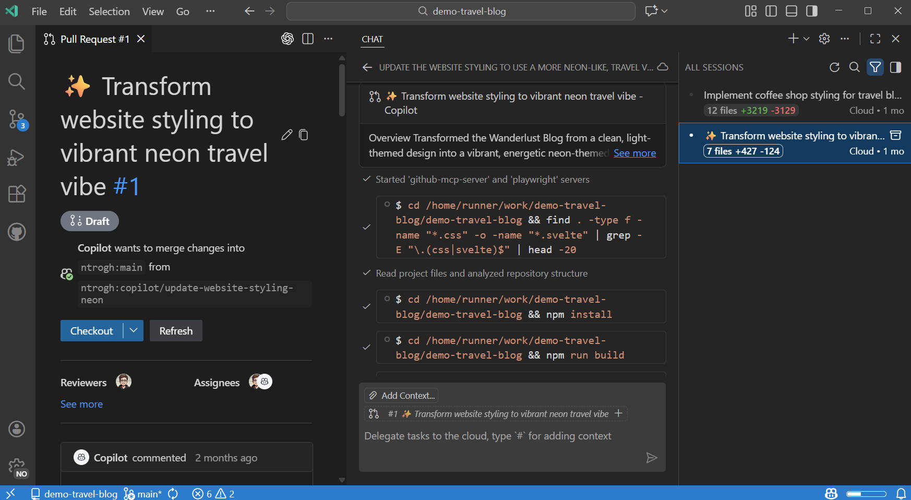
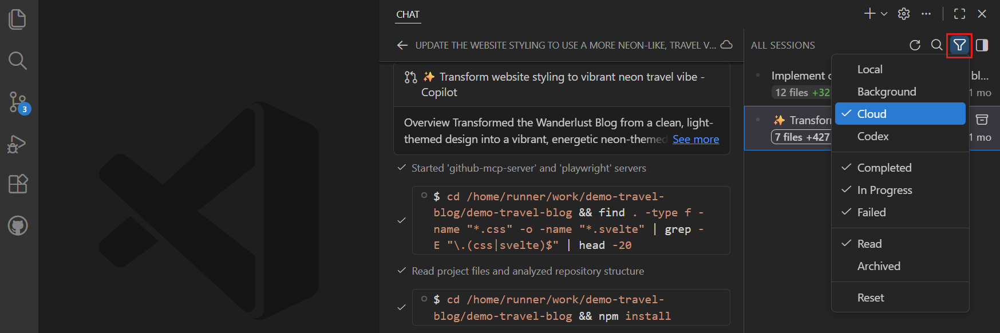

# Visual Studio Code'da bulut ajanları

Bulut ajanları yapay zeka destekli kodlama görevlerini gerçekleştirir ve ölçeklenebilir, izole yürütme için uzak altyapıda çalışır. Bulut ajanları uzak altyapıda özerk çalışır. Örneğin GitHub Copilot coding agent GitHub'ın altyapısında çalışır ve ekip iş birliği için GitHub depolarınızla entegre olur.

Bu makale bulut ajanlarının temel özelliklerini ve basitten karmaşığa kadar kodlama görevleri için bulut ajan oturumlarını başlatma ve yönetme konusunu kapsar.



<div class="docs-action" data-show-in-doc="false" data-show-in-sidebar="true" title="Get started with agents">
VS Code'da yerel, arka plan ve bulut ajanlarını deneyimlemek için uygulamalı öğreticiyi izleyin.

* [Start tutorial](/docs/copilot/agents/agents-tutorial.md)

</div>

## Bulut ajanları nedir?

Yerel ve arka plan ajanlarının makinenizde çalışmasının aksine Copilot coding agent gibi bulut ajanları uzak altyapıda çalışır. Tüm bulut ajan oturumlarınızı VS Code'daki birleşik Sohbet görünümünden görüntüleyebilir ve yönetebilirsiniz. Bu görünüm ayrıca VS Code'dan doğrudan yeni bulut ajan oturumları oluşturmanıza veya yerel veya arka plan ajan sohbetlerini bulut ajanlarına devretmenize olanak tanır.

VS Code Copilot coding agent ve Claude ile Codex gibi [üçüncü taraf ajanlar](/docs/copilot/agents/third-party-agents.md) dahil farklı bulut ajanları destekler.

Bulut ajanları kullanıcı etkileşimi olmadan uzaktan çalıştığından iyi tanımlanmış kapsamı ve gerekli tüm bağlamı olan görevler için uygundur. Pull request entegrasyonu onları ekip iş birliği için çok etkili kılar.

Uzak yürütme ortamları nedeniyle bulut ajanları VS Code yerleşik araçlarına ve çalışma zamanı bağlamına (başarısız testler veya metin seçimleri gibi) doğrudan erişemez. Bulut ajan hizmetinde yapılandırılan MCP sunucuları ve dil modelleriyle sınırlıdırlar.

Bulut ajanına görev atamak için Sohbet görünümünden doğrudan yeni bir bulut oturumu oluşturabilir veya yerel veya arka plan ajan sohbetini VS Code'dan bulut ajanına devredebilirsiniz.

### GitHub Copilot coding agent

**GitHub Copilot coding agent** Copilot aboneliğinizle VS Code'da kullanılabilen birincil bulut ajandır.

Temel yetenekler:

* GitHub deponuz genelinde büyük ölçekli refaktör
* Üst düzey gereksinimlerden tam özellik uygulaması
* Ayrıntılı açıklamalarla otomatik pull request oluşturma
* Kod inceleme entegrasyonu ve geri bildirim ele alma

### Üçüncü taraf bulut ajanları

VS Code, bulut ajan oturumları için Claude coding agent ve Codex coding agent gibi üçüncü taraf bulut ajanlarını seçenek olarak destekler. VS Code'da kullanmadan önce Copilot hesap ayarlarınızda buluttaki üçüncü taraf ajanlar için desteği etkinleştirmeniz gerekir.

VS Code'da bulut ajanlarını kullanmak için sağlayıcının VS Code uzantısını yüklemeniz gerekmez.

[VS Code'da üçüncü taraf ajanlar](/docs/copilot/agents/third-party-agents.md) ve nasıl etkinleştirileceği hakkında daha fazla bilgi edinin.

## Bulut ajan oturumu başlatma

Bulut ajan oturumunu doğrudan bir sohbet promptunu bulut ajanına göndererek veya devam eden yerel veya arka plan görüşmesini bulut ajanına devrederek başlatabilirsiniz. Devam eden görüşmeyi devretmek özellikle özerk yürütmeden önce başlangıç netleştirmesi veya planlama gerektiren karmaşık görevler için yararlıdır.

Tarayıcıda çalışmayı tercih ediyorsanız [GitHub Copilot coding agent](https://docs.github.com/en/copilot/how-tos/use-copilot-agents/manage-agents) kullanarak GitHub.com üzerinden doğrudan bulut ajan oturumları da başlatabilirsiniz.

### Yeni bulut ajan oturumu oluşturma

Yeni bulut ajan oturumu oluşturmak için:

1. Sohbet görünümünde oturum listesi açılır menüsünden **New Chat** seçin ve oturum türü açılır menüsünden **Cloud** seçin

    Alternatif olarak Komut Paleti'nden (`kb(workbench.action.showCommands)`) **Chat: New Cloud Agent** komutunu çalıştırabilirsiniz.

1. Açılır menüden bulut ajan sağlayıcısını seçin ve isteğe bağlı olarak özel ajan ve model seçin.

1. Promptunuzu girin ve bulut ajanının görev üzerinde çalışmasına izin verin

   Örneğin şunları girebilirsiniz:

   ```text
   Refactor the authentication module to improve security and performance. Implement OAuth2 and JWT for token management, and optimize database queries for user sessions.
   ```

1. Bulut ajanı görev üzerinde uzaktan çalışmaya başlar. Sohbet görünümünde oturumun ilerlemesini izleyebilir ve etkileşime devam edebilirsiniz.

> [!NOTE]
> GitHub.com'da Copilot coding agent'a bir sorun veya pull request atadıysanız oturum otomatik olarak VS Code'daki oturum listesinde görünür.

### Ajan oturumunu bulut ajanına devretme

Karmaşık görevler için önce örneğin Plan ajanıyla VS Code sohbetinde bir yerel ajanda gereksinimleri netleştirmek, ardından özerk yürütme için görevi bulut ajanına devretmek yararlı olabilir. Yerel ajan sohbetini bulut ajan oturumuna devrettiğinizde tüm sohbet bağlamı bulut ajanına geçirilir.

Yerel ajan oturumunu bulut ajan oturumuna devretmek için:

1. Sohbet görünümünde devam eden yerel ajan oturumunu açın.

1. Oturum türü açılır menüsünü seçin ve oturumu bulut ajanı olarak sürdürmek için **Cloud** seçin.

    [Plan ajanını](/docs/copilot/agents/planning.md) kullanıyorsanız plan uygulamasını bulut ajan oturumunda çalıştırmak için **Start Implementation** açılır menüsünden **Continue in Cloud** seçebilirsiniz

Arka plan ajan oturumunu bulut ajan oturumuna devretmek için arka plan ajan oturumunun sohbet girişine `/delegate` yazın. Bu komut tam sohbet geçmişini ve bağlamı yeni bir bulut ajan oturumuna geçirir; bunu Sohbet görünümünde izleyebilirsiniz.

## Bulut ajan oturumlarını görüntüleme ve yönetme

Tüm bulut ajan oturumlarınızı VS Code'daki Sohbet görünümünden görüntüleyebilir ve yönetebilirsiniz. Filtre seçeneklerinden **Cloud Agents** seçerek oturum listesini yalnızca bulut ajan oturumlarını gösterecek şekilde filtreleyin.



Listeden bir bulut ajan oturumu seçerek Sohbet görünümünde oturum ayrıntılarını açın. Oturumu editör sekmesinde (sohbet editörü) görüntülemeyi tercih ediyorsanız oturuma sağ tıklayın ve **Open as Editor** seçin.


## İlgili kaynaklar

* [Ajanlara genel bakış](/docs/copilot/agents/overview.md): Farklı ajan türlerini ve devri anlayın
* [Arka plan ajanları](/docs/copilot/agents/background-agents.md): İzole geliştirme için CLI tabanlı özerk ajanlar hakkında bilgi edinin
* [Özel ajanlar](/docs/copilot/customization/custom-agents.md): Özel ajan rolleri ve kişilikleri oluşturun
* [GitHub Copilot coding agent](https://docs.github.com/en/copilot/how-tos/use-copilot-agents/manage-agents): GitHub.com'da ajanları yönetme
