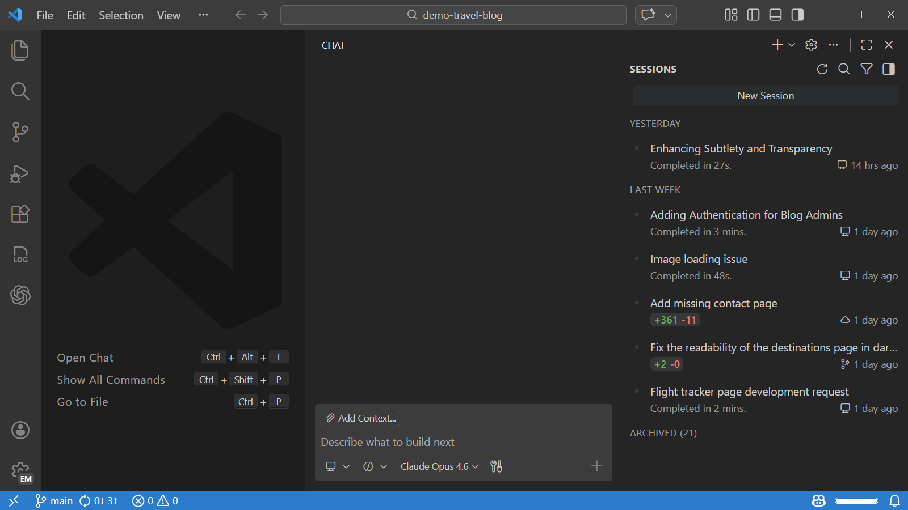
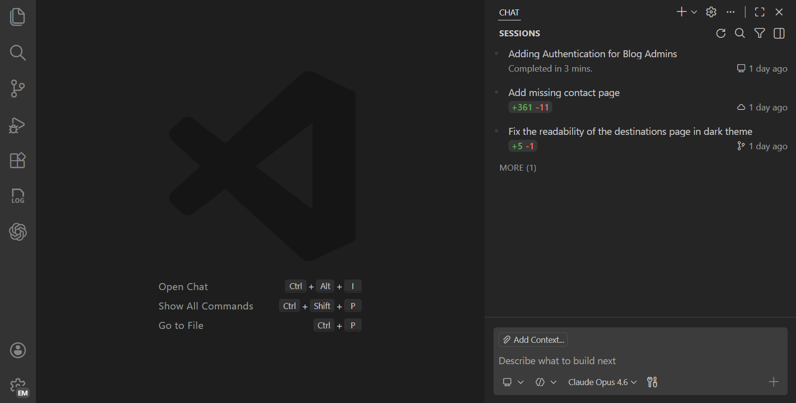
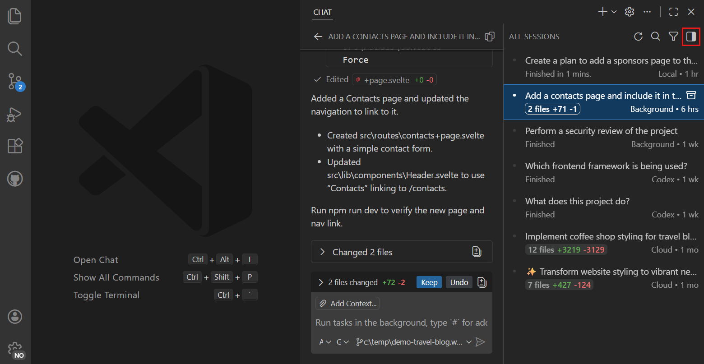
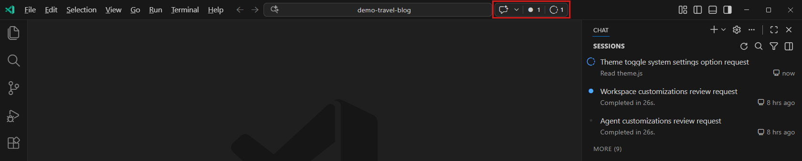
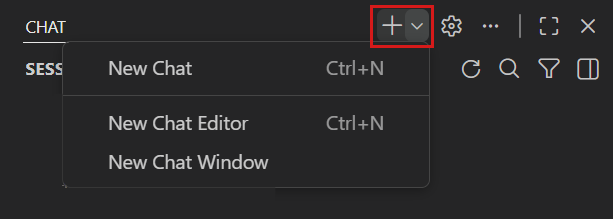
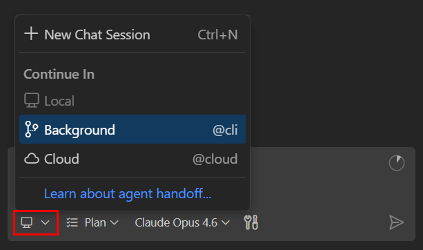
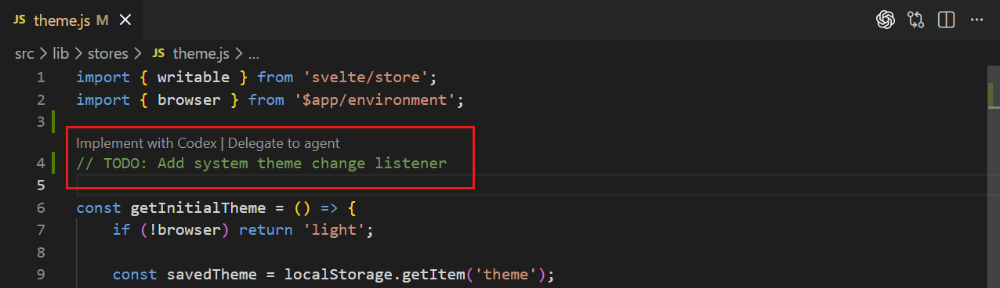
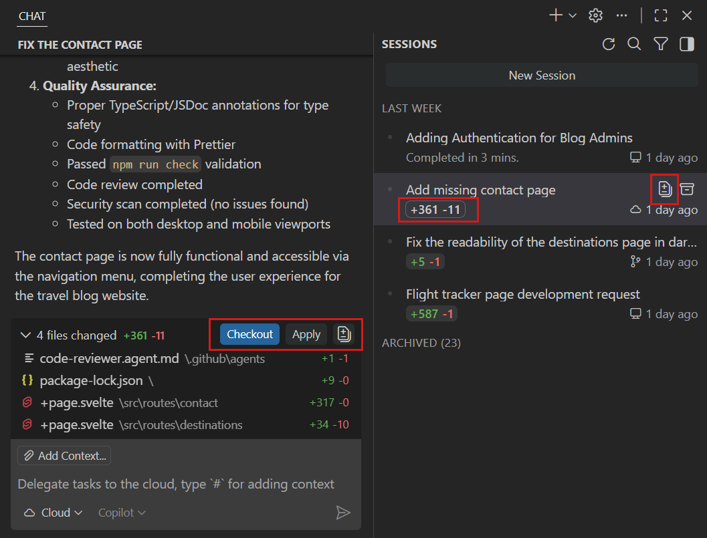
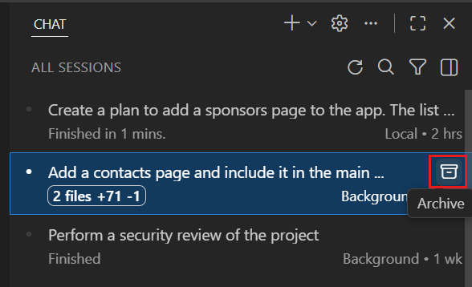

# Visual Studio Code'da ajanları kullanma

Ajanlar, birden fazla dosyada özellik uygulamaktan mimari düzeyinde refactoring ve framework geçişlerine kadar kodlama görevlerini uçtan uca otomatikleştirir. Visual Studio Code'da yerel veya bulutta, etkileşimli veya arka planda çalışan ajan oturumları oluşturabilirsiniz. Copilot, Claude ve Codex gibi üçüncü taraf ajanlar veya kendi özel ajanlarınız arasından seçim yapın. Farklı ajan türlerinin benzersiz güçlü yönlerinden yararlanmak için görevleri aralarında devredin. Birleşik Chat görünümü, nerede çalıştıklarına bakılmaksızın tüm ajan oturumlarınızı yönetmek ve izlemek için merkezi bir yer sağlar.

Bu makale çeşitli ajan türlerine genel bakış, ajan oturumlarının nasıl oluşturulacağı ve yönetileceği, ajanlar arasında görev devri ve ilerlemelerinin nasıl izleneceği sunar.



<div class="docs-action" data-show-in-doc="false" data-show-in-sidebar="true" title="Create a basic game">
Tercih ettiğiniz dilde bir tic-tac-toe oyunu oluşturmak için VS Code'da ajanları kullanın.

* [Open in VS Code](vscode://GitHub.Copilot-Chat/chat?agent=agent%26prompt=%23newWorkspace%20Create%20a%20basic%20tic-tac-toe%20game.%20Ask%20the%20user%20about%20their%20language%20of%20choice)

</div>

> [!IMPORTANT]
> VS Code ayarlarınızda ajanları etkinleştirin (`setting(chat.agent.enabled)`). Kuruluşunuz da ajanları devre dışı bırakmış olabilir; bu işlevi etkinleştirmek için yöneticinizle iletişime geçin.

## Ajanlar nedir?

Ajanlar kodlama görevlerini uçtan uca tamamlar. Projenizi dosyalar arasında analiz eder, koordineli değişiklikler yapar, komutlar çalıştırır ve sonuçlara göre uyum sağlar. Yeni özellik uygulama, mimari düzeyinde refactoring veya framework'ler arası geçiş yapma olsun, ajanlar tam çok adımlı iş akışını özerk olarak yönetir.

<div class="docs-action" data-show-in-doc="true" data-show-in-sidebar="false" title="Learn about AI core concepts">
VS Code'da AI temel kavramları ve AI ajanlarının nasıl çalıştığı hakkında genel bakış edinin.

* [AI temel kavramlarını öğrenin](/docs/copilot/core-concepts.md)

</div>

Örneğin başarısız bir testiniz olduğunu düşünün. Düzeltme önermek yerine bir ajan:

* Hata iletisini okuyup birden fazla dosyada kök nedeni belirleyebilir
* İlgili kodu güncelleyebilir
* Düzeltmenin işe yaradığını doğrulamak için testleri tekrar çalıştırabilir
* Değişiklikleri işleyebilir

Ajan'a üst düzey bir görev verirsiniz; görevi adımlara böler, bu adımları araçlarla uygular ve hata aldığında kendini düzeltir.

Her biri farklı bir göreve odaklanan birden fazla ajan oturumunu paralel çalıştırabilirsiniz. Yeni ajan oturumu oluşturduğunuzda önceki oturum etkin kalır ve [ajan oturumları listesi](#agent-sessions-list) üzerinden görevler arasında geçiş yapabilirsiniz.

### Temel kavramlar

Aşağıdaki kavramlar VS Code'da ajanlarla çalışmanın farklı yönlerini açıklar:

| Kavram | Açıklama | Örnek |
|---|---|---|
| **[Ajan türü](#types-of-agents)** | Bir ajanın *nerede* ve *nasıl* çalıştığı: [yerel](/docs/copilot/agents/local-agents.md), [arka plan](/docs/copilot/agents/background-agents.md), [bulut](/docs/copilot/agents/cloud-agents.md) veya [üçüncü taraf](/docs/copilot/agents/third-party-agents.md). | Ekip iş birliği gerektiren görevler için bulut ajanı başlatın. |
| **[Yerleşik ajan](/docs/copilot/agents/local-agents.md#builtin-agents)** | VS Code'da önceden yapılandırılmış ajan: **Agent**, **Plan** ve **Ask**. Bu ajanlar herhangi bir kurulum olmadan kullanıma hazırdır. | Yeni özellik oluşturmak için yapılandırılmış plan oluşturmak üzere Plan ajanını seçin. |
| **[Özel ajan](/docs/copilot/customization/custom-agents.md)** | Bir ajana belirli rol, araçlar ve talimatlar veren yeniden kullanılabilir *yapılandırma* (`.agent.md` dosyasında tanımlı). Özel ajanlar herhangi bir ajan türüyle çalışır. | Güvenlik açıklarını belirlemeye odaklanan salt okunur araçlı "Güvenlik İnceleyicisi" özel ajanı oluşturun. |
| **[Alt ajan](/docs/copilot/agents/subagents.md)** | Oturum içinde kendi izole bağlam penceresinde alt görevi yönetmek için başlatılan alt ajan. | Bir konuyu araştıran ajan bilgi toplamak için alt ajan başlatır, yalnızca özet geri alır. |
| **[Hand off](#hand-off-a-session-to-another-agent)** | Oturumu bir ajan türünden diğerine aktarma, sohbet geçmişini taşıyarak. | Yerel ajanla planlama yapın, ardından pull request olarak uygulamak için bulut ajanına devredin. |
| **[Bellek](/docs/copilot/agents/memory.md)** | Ajanların konuşmalar arasında kaydedip geri çağırdığı kalıcı notlar. Kullanıcı, depo ve oturum olmak üzere üç kapsamda düzenlenir. | Gelecek oturumlarda uygulanması için ajan'dan kodlama tercihlerinizi hatırlamasını isteyin. |

## Ajan türleri

VS Code farklı kullanım senaryoları ve etkileşim düzeyleri için tasarlanmış dört ana ajan kategorisini destekler:


### Hangi ajanı kullanmalıyım?

Göreviniz için doğru ajan türünü bulmak için aşağıdaki tabloyu kullanın:

| İstediğim... | Kullanın |
|---|---|
| Fikir üzerinde etkileşimli beyin fırtınası yapmak, keşfetmek veya yinelemek | [Yerel ajan](/docs/copilot/agents/local-agents.md) |
| Kod tabanım hakkında cevap almak | [Yerel ajan](/docs/copilot/agents/local-agents.md) (Ask) |
| Yapılandırılmış uygulama planı oluşturmak | [Yerel ajan](/docs/copilot/agents/local-agents.md) (Plan) |
| Editör bağlamı gerektiren sorunu düzeltmek (test hataları, lint hataları, hata ayıklama çıktısı) | [Yerel ajan](/docs/copilot/agents/local-agents.md) |
| Entegre tarayıcı ile web uygulamaları oluşturup test etmek _(Deneysel)_ | [Yerel ajan](/docs/copilot/agents/local-agents.md). [Tarayıcı ajan test rehberine](/docs/copilot/guides/browser-agent-testing-guide.md) bakın. |
| Belirli VS Code uzantı araçlarını veya MCP sunucularını kullanmak | [Yerel ajan](/docs/copilot/agents/local-agents.md) |
| Tanımlı görevi uygularken çalışmaya devam etmek | [Arka plan ajanı](/docs/copilot/agents/background-agents.md) veya [Bulut ajanı](/docs/copilot/agents/cloud-agents.md) |
| Birden fazla varyant veya proof of concept keşfetmek | [Arka plan ajanı](/docs/copilot/agents/background-agents.md) veya [Bulut ajanı](/docs/copilot/agents/cloud-agents.md) |
| Ekip incelemesi ve iş birliği için PR oluşturmak | [Bulut ajanı](/docs/copilot/agents/cloud-agents.md) |
| GitHub sorununu ajana atamak | [Bulut ajanı](/docs/copilot/agents/cloud-agents.md) |
| Belirli AI sağlayıcısı kullanmak (Anthropic, OpenAI) | [Üçüncü taraf ajan](/docs/copilot/agents/third-party-agents.md) |

### Yerel ajanlar

Yerel ajanlar doğrudan makinenizde VS Code içinde çalışır. İstemlerinize anında yanıt almak için sohbet aracılığıyla yerel ajanlarla etkileşime girersiniz. Yerel ajanlar çalışma alanınıza, araçlarınıza ve modellerinize tam erişime sahiptir. Beyin fırtınası, planlama veya keşif çalışması gibi anında geri bildirim gerektiren etkileşimli görevler için yerel ajanları kullanın.

Yerel ajan oturumları üç yerleşik ajandan birini kullanır: karmaşık kodlama görevleri için **Agent**, yapılandırılmış uygulama planları oluşturmak için **Plan** ve kod tabanınız hakkında soru yanıtlamak için **Ask**. Daha özelleştirilmiş iş akışları için [özel ajanlar](/docs/copilot/customization/custom-agents.md) da oluşturabilirsiniz.

[VS Code'da yerel ajanlar](/docs/copilot/agents/local-agents.md) hakkında daha fazla bilgi edinin.

### Arka plan ajanları

> [!NOTE]
> "Arka plan ajanı" terimi bir deneme çalıştırılırken VS Code arayüzünde "Copilot CLI" veya "worktree" olarak da görünebilir.

Arka plan ajanları, Copilot CLI gibi CLI tabanlı ajanlardır; ana çalışma alanınızla çakışmaları önlemek için Git worktree'leri kullanarak makinenizde etkileşim olmadan arka planda çalışır. Tüm gerekli bağlama sahip iyi tanımlanmış görevler için arka plan ajanlarını kullanın; örneğin bir planın uygulanması.

[VS Code'da arka plan ajanları](/docs/copilot/agents/background-agents.md) hakkında daha fazla bilgi edinin.

### Bulut ajanları

Bulut ajanları, Copilot kodlama ajanı gibi uzak altyapıda çalışır ve GitHub depoları ve pull request'leriyle ekip iş birliği ve kod incelemeleri için entegre olur. Ekip üyeleriyle pull request'ler aracılığıyla iş birliği yapmak istediğiniz veya anında geri bildirim gerektirmeyen iyi tanımlanmış görevler için bulut ajanlarını kullanın.

[VS Code'da bulut ajanları](/docs/copilot/agents/cloud-agents.md) hakkında daha fazla bilgi edinin.

### Üçüncü taraf ajanlar

VS Code Anthropic ve OpenAI gibi üçüncü taraf AI sağlayıcılarından ajanları destekler. Üçüncü taraf ajanları kullanarak bu sağlayıcıların benzersiz yeteneklerini mevcut GitHub Copilot aboneliğinizle kullanabilir, VS Code'un birleşik oturum yönetimi ve zengin editör deneyiminden yararlanabilirsiniz. Sağlayıcıya göre üçüncü taraf ajanlar yerel veya bulutta çalışabilir.

[VS Code'da üçüncü taraf ajanlar](/docs/copilot/agents/third-party-agents.md) hakkında daha fazla bilgi edinin.

## Ajan oturumları listesi

Chat görünümü, nerede çalıştıklarına bakılmaksızın tüm ajan oturumlarınızı yönetmek için birleşik görünüm sağlar. Varsayılan olarak son oturumlarınızı gösterir; durum, tür ve dosya değişiklikleri hakkında bilgi verir. Listeyi genişleterek tüm ajan oturumlarınızı görebilir ve filtreleyebilirsiniz.

Oturum listesi çalışma alanınıza kapsamlıdır. Çalışma alanı açık değilse liste tüm çalışma alanlarınızdaki oturumları gösterir. Oturumlar **Bugün** veya **Geçen Hafta** gibi zaman dilimlerine göre gruplandırılır.

Chat görünümü iki modda çalışır: kompakt ve yan yana. Chat görünümünün sağ üst köşesindeki geçiş kontrolünü kullanarak modlar arasında manuel geçiş yapabilirsiniz.

* **Kompakt**:

    Kompakt görünümde oturum listesi Chat görünümüne gömülüdür. Listeden bir oturum seçtiğinizde Chat görünümü o oturuma geçer. Oturumlar listesine dönmek için geri düğmesini kullanın.

    

* **Yan yana**

    Yan yana görünümde oturum listesi Chat görünümüyle yan yana gösterilir. Ayrıntıları Chat görünümünde görmek için listeden bir oturum seçin.

    

    > [!TIP]
    > Chat görünümünü genişlettiğinizde otomatik olarak yan yana moda geçer. Oturumlar listesinde sağ tıklayıp **Sessions Orientation** seçerek bu davranışı değiştirebilirsiniz (`setting(chat.viewSessions.orientation)`). Geçiş düğmesini de kullanabilirsiniz.

Listedeki bir oturuma sağ tıklayarak oturum ayrıntılarını açma, oturumu arşivleme veya pull request kontrol etme (bulut ajan oturumları için) gibi ek eylemleri görebilirsiniz.

Chat görünümünden oturum listesini gizlemek için boş bir sohbette sağ tıklayın ve **Show Sessions** seçimini kaldırın (`setting(chat.viewSessions.enabled)`).

> [!NOTE]
> Uzantı geliştiricileri [`chatSessionsProvider`](https://github.com/microsoft/vscode/blob/main/src/vscode-dts/vscode.proposed.chatSessionsProvider.d.ts) önerilen API'sini kullanarak Agents görünümüyle entegrasyon hakkında bilgi edinebilir. API şu anda önerilen durumda ve değişikliğe tabidir.

### Ajan durum göstergesi (Deneysel)

Ajan durum göstergesi başlık çubuğundaki komut merkezinden ajan oturumlarınıza hızlı erişim sağlar. Gösterge okunmamış iletiler ve devam eden oturumlar için görsel rozetler gösterir; AI ajan etkinliğiniz hakkında görünümü değiştirmeden bilgilendirilirsiniz.



Gösterge şunları gösterir:

* **Okunmamış oturumlar rozeti**: Yeni iletileri olan sohbet oturumlarının sayısı. Rozeti seçerek oturumlar listesini yalnızca okunmamış oturumları gösterecek şekilde filtreleyin.
* **Devam eden oturumlar rozeti**: Çalışan ajanları olan oturumların sayısı. Rozeti seçerek oturumlar listesini yalnızca devam eden oturumları gösterecek şekilde filtreleyin.
* **Parlak simge**: Sohbet ve oturum yönetimi seçeneklerine hızlı erişim sağlar.

Göstergenin davranışını `setting(chat.agentsControl.clickBehavior)` ayarıyla sohbet görünürlüğünü değiştirerek, sohbet durumları arasında geçiş yaparak (göster, büyüt, gizle) veya sohbet girişine odaklanarak yapılandırabilirsiniz.

Filtre etkin olduğunda oturumlar listesi eşleşen tüm oturumları göstermek için otomatik olarak genişler. Filtreyi temizleyip varsayılan görünüme dönmek için rozeti tekrar seçin.

> [!NOTE]
> Ajan durum göstergesi deneysel bir özelliktir. `setting(chat.agentsControl.enabled)` ile etkinleştirin. Okunmamış ve devam eden göstergeleri `setting(chat.viewSessions.enabled)` etkin olmalıdır.

## Ajan oturumu oluşturma

Her biri farklı bir göreve odaklanan birden fazla ajan oturumunu paralel oluşturabilirsiniz. Yeni ajan oturumu oluşturduğunuzda önceki oturum etkin kalır ve [ajan oturumları listesi](#agent-sessions-list) üzerinden görevler arasında geçiş yapabilirsiniz.

Yeni ajan oturumu oluşturduğunuzda boş bir bağlam penceresiyle başlar. Her ajan oturumu bağımsızdır; dolayısıyla bir oturumun bağlamı diğerine taşınmaz.

Chat görünümünden veya Komut Paleti'ndeki ilgili komutları kullanarak yeni ajan oturumu oluşturabilirsiniz.

1. Chat görünümünü açın ve **New Session** açılır menüsünü (`+`) seçin.

    

1. Açılır menüden ajan türünü seçin. İsteğe bağlı olarak model seçiciden bir dil modeli seçin.

    

1. Ajan'a görev atamak için bir istem girin. Ajan görev üzerinde çalışmaya başlar.

    ```prompt
    Generate a diagram that gives a high-level overview of the architecture of this project.
    ```

> [!TIP]
> Ajan hala çalışırken takip istemleri gönderebilirsiniz. [İsteği kuyruğa alma, mevcut isteği yönlendirme veya durdurup hemen gönderme](/docs/copilot/chat/chat-sessions.md#send-messages-while-a-request-is-running) arasında seçim yapın.

<div class="docs-action" data-show-in-doc="false" data-show-in-sidebar="true" title="Get started with agents">
VS Code'da yerel, arka plan ve bulut ajanlarını deneyimlemek için uygulamalı öğreticiyi takip edin.

* [Öğreticiyi başlat](/docs/copilot/agents/agents-tutorial.md)

</div>

## Oturumu başka bir ajana devretme

Mevcut bir görevi başka bir ajana devrederek benzersiz güçlü yönlerinden yararlanabilirsiniz. Örneğin yerel ajanla plan oluşturun, proof of concept için arka plan ajanına devredin, ardından ekip incelemesi için bulut ajanına pull request göndermek üzere devam edin.

Yerel ajan oturumunu devretmek için sohbet giriş kutusundaki oturum türü açılır menüsünden farklı bir ajan türü seçin. VS Code sohbet geçmişini ve bağlamı taşıyan yeni oturum oluşturur. Orijinal oturum devirden sonra arşivlenir.



Arka plan ajan oturumunda sohbet giriş kutusuna `/delegate` komutunu yazarak bulut ajanına devredebilirsiniz. `/delegate` komutundan sonra ek talimatlar ekleyebilirsiniz.

### Kodlama görevini ajana atama

[GitHub Pull Requests](https://marketplace.visualstudio.com/items?itemName=GitHub.vscode-pull-request-github) uzantısını yüklerseniz ajan'a kodunuzdaki `TODO` yorumlarını uygulaması için atayabilirsiniz.



GitHub.com veya GitHub Pull Requests uzantısı kullanarak GitHub sorunlarını Copilot kodlama ajanına sorunu `copilot`'a atayarak veya sorun yorumunda veya pull request'te bahsederek kod incelemesi istemek suretiyle atayabilirsiniz.

## Dosya değişikliklerini inceleme ve uygulama

Ajan oturumu tamamlandığında ve projenize kod değişiklikleri yaptığında oturum listesi o oturum için dosya değişiklik istatistiklerini gösterir. Ajanın yaptığı değişiklikleri incelemek için oturumu listeden seçerek oturum ayrıntılarını açın.



Ajan türüne bağlı olarak ajanın yaptığı değişiklikleri yerel çalışma alanınıza uygulama veya ajan oturumundan dalı kontrol etme (bulut ajanları için) seçenekleriniz vardır.

## Ajan oturumlarını arşivleme

Oturum listesini düzenli tutmak için tamamlanmış veya etkin olmayan oturumları arşivleyin. Oturumu arşivlemek silmez; yalnızca etkin oturumlar listesinden taşır. İstediğiniz zaman bir oturumu arşivden çıkararak etkin oturumlar listesine geri yükleyebilirsiniz.

Oturumu arşivlemek için oturum listesinde oturumun üzerine gelin ve **Archive** seçin. Arşivledikten sonra oturum listeden kaybolur. Aynı şekilde arşivlenmiş oturumu arşivden çıkarabilirsiniz.



Arşivlenmiş oturumlarınızı görüntülemek için oturumlar listesindeki filtre seçeneklerini kullanın ve **Archived** filtresini seçin.

## Ajan oturumlarını silme

Ajan oturumunu kalıcı olarak silmek için oturumlar listesinde oturuma sağ tıklayın ve **Delete** seçin. Oturumu silmek kalıcıdır ve geri alınamaz. [Arka plan ajan oturumları](/docs/copilot/agents/background-agents.md) için oturumu silmek o oturum için oluşturulan tüm worktree'leri de kaldırır.

> [!IMPORTANT]
> Oturumu silmek geri alınamaz. Yalnızca oturumu gizlemek istiyorsanız [arşivlemeyi](#archive-agent-sessions) düşünün.

## İlgili kaynaklar

* [Ajanlar öğreticisi](/docs/copilot/agents/agents-tutorial.md): Farklı ajan türleriyle çalışma için uygulamalı öğretici.

* [Araçlar](/docs/copilot/agents/agent-tools.md): Yerleşik, MCP ve uzantı araçlarıyla ajanları genişletin.

* [Hook'lar](/docs/copilot/customization/hooks.md): Otomasyon ve politika uygulama için yaşam döngüsü olaylarında özel komutlar çalıştırın

* [Özel ajanlar](/docs/copilot/customization/custom-agents.md): Kendi AI ajanlarınızı ve uzantılarınızı oluşturun.
