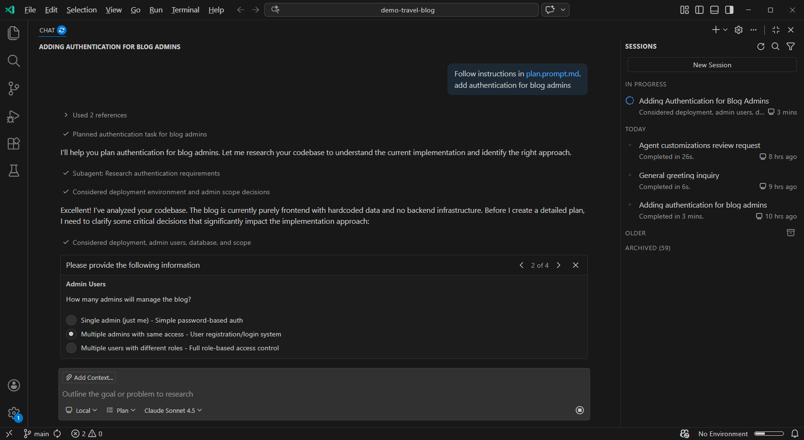
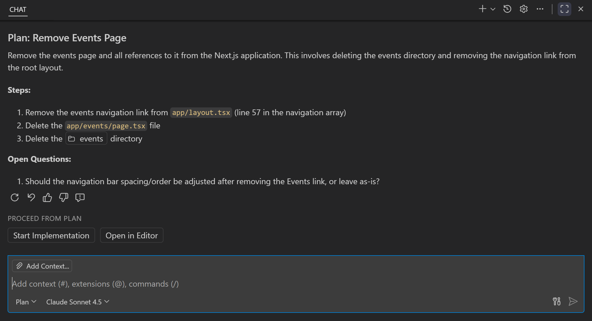

# VS Code'da ajanlarla planlama

Visual Studio Code'daki ajanlar karmaşık kodlama görevlerini özerk olarak gerçekleştirmenize yardımcı olur. Plan ajanı, kodlamaya başlamadan önce tüm gereksinimlerin karşılandığından emin olmak için ayrıntılı uygulama planları oluşturmanızı sağlar. Todo listeleriyle ajan genel hedeflere odaklı kaldığından emin olabilir ve ilerlemeyi etkili şekilde takip edebilir.

Planlar ve todolar kullanarak kodlama başlamadan önce ajanla uygulama ayrıntılarını yapılandırıp inceleyebilir, oluşturulan kodun kalitesini ve güvenilirliğini artırabilirsiniz. Plan ve todolar ayrıca ajanın daha karmaşık ve uzun görevleri sistematik şekilde çalışması için daha iyi rehberlik sağlar.

Bu makale VS Code'da ajanlarla geliştirme görevlerini araştırma ve planlama dahil plan ajanı ve todo listelerinin nasıl kullanılacağını açıklar.

<div class="docs-action" data-show-in-doc="false" data-show-in-sidebar="true" title="Plan a feature with agents">
Yeni bir özellik için yapılandırılmış bir uygulama planı oluşturmak üzere Plan ajanını kullanın.

* [Open in VS Code](vscode://GitHub.Copilot-Chat/chat?agent=agent%26prompt=%2Fplan%20a%20terminal%20UI%20app%20to%20track%20my%20todo%20list.)

</div>

## Ayrıntılı görev araştırması için plan ajanı

Yerleşik plan ajanı, bunları yürütmeden önce sizinle birlikte ayrıntılı uygulama planları oluşturur. Bu, herhangi bir kod değişikliği yapılmadan önce tüm gereksinimlerin düşünülüp ele alındığından emin olur. Plan ajanı planı siz inceleyip onaylayana kadar herhangi bir kod değişikliği yapmaz. Onaylandıktan sonra planı varsayılan ajana devredebilir veya daha fazla iyileştirme, inceleme veya ekip tartışması için planı kaydedebilirsiniz.

Plan ajanı şunlar için tasarlanmıştır:

* Gereksinimleri ve kısıtlamaları belirlemek için salt okunur araçlar ve kod tabanı analizi kullanarak kapsamlı görev araştırması yapmak
* Planı taslaklamadan önce belirsizlikleri çözmek için etkileşimli açıklayıcı sorular sormak
* Net doğrulama kriterleri ve belgelenmiş kararlarla görevi yönetilebilir, uygulanabilir adımlara bölmek
* Standartlaştırılmış plan formatına dayalı özet bir plan taslağı sunmak; kullanıcı incelemesi ve yineleme için

Plan ajanı 4 aşamalı yinelemeli iş akışı kullanır: **Discovery** (araştırma) → **Alignment** (soru sor) → **Design** (plan taslağı) → **Refinement** (yinele). Sorular yanıt verene kadar ajanı duraklatan etkileşimli istemler aracılığıyla sorulur; kod değişiklikleri yapılmadan önce niyetinizle daha iyi hizalama sağlanır.

### Görev planlama

1. `kb(workbench.action.chat.open)` tuşuna basarak Sohbet görünümünü açın ve ajanlar açılır menüsünden **Plan** seçin veya görev açıklamanızı ` `/plan` ile yazın.

2. Üst düzey bir görev (özellik, refaktör, hata vb.) girin ve gönderin. Örneğin:

    ```prompt-plan
    Implement a user authentication system with OAuth2 and JWT
    ```

    ```prompt-plan
    Add unit tests for all API endpoints
    ```

3. Plan ajanı görevinizi araştırdıktan sonra sorduğu açıklayıcı soruları yanıtlayın.

    

4. Önerilen plan taslağını önizleyin ve yineleme için geri bildirim verin.

    Plan ajanı üst düzey özet, adım dökümü, test için doğrulama adımları ve planlama sırasında verilen kararlar sunar.

    

    > [!TIP]
    > Uygulamaya başlamadan önce planı iyileştirmek için plan modunda kalın. Gereksinimleri netleştirmek, kapsamı ayarlamak veya ek bağlam sağlamak için birden fazla kez yineleyebilirsiniz.

5. Son haline getirildiğinde planı uygulamaya başlamak veya daha fazla inceleme için editörde açmak için düğmeleri kullanın.

    Planı aynı sohbet oturumunda uygulayabilir veya uygulamayı arka planda veya bulutta [ajan oturumunda](/docs/copilot/agents/overview.md) özerk olarak çalıştırmak için arka plan veya bulut ajanı başlatabilirsiniz.

    Plan uygulamasına başlarken hala "UI ile başla" veya "yalnızca 1 ve 2. adımlar" gibi açıklayıcı talimatlar verebilirsiniz.

## Todo listesiyle ilerlemeyi takip etme

Karmaşık görevler üzerinde çalışırken VS Code'un ajanı ilerlemeyi takip etmek için bir todo listesi oluşturur. Todo listesi isteğinizi tek tek görevlere böler ve yapay zeka her adımı tamamladıkça otomatik güncellenir. Bu ilerlemeyi izlemenize ve ajanın uzun süren görevlerde odaklı kalmasına yardımcı olur.

<video src="../images/chat-planning/todo-list-demo.mp4" title="Video showing the todo list control in the Chat view to track the progress of a chat request." loop controls muted></video>

> [!TIP]
> Todo listesini "adım 1'i x yapacak şekilde revize et" veya "başka bir görev ekle" gibi doğal dil kullanarak güncelleyebilirsiniz. Ajan todoları beklediğiniz gibi değilse listeyi temizleyebilirsiniz; aksi halde geri bildiriminize ve çalışırken topladığı bilgilere dayalı olarak güncellemeleri otomatik yönetir.

## Plan modunda oturum belleği

Plan ajanı uygulama planını otomatik olarak bir oturum bellek dosyasına (`/memories/session/plan.md`) kaydeder. **Chat: Show Memory Files** komutunu çalıştırarak bu dosyayı oturum sırasında görüntüleyebilirsiniz. Oturum belleği görüşme bittiğinde temizlendiğinden plan sonraki oturumlarda mevcut değildir.

Oturum belleği ajanların notları kalıcı tutmak için kullandığı üç bellek kapsamından biridir. [VS Code ajanlarında bellek](/docs/copilot/agents/memory.md) hakkında daha fazla bilgi edinin.

## İlgili kaynaklar

* [VS Code ajanlarında bellek](/docs/copilot/agents/memory.md)
* [Ajanlar için araçları yapılandırma](/docs/copilot/agents/agent-tools.md)
* [Bağlam mühendisliği kullanıcı kılavuzu](/docs/copilot/guides/context-engineering-guide.md)
