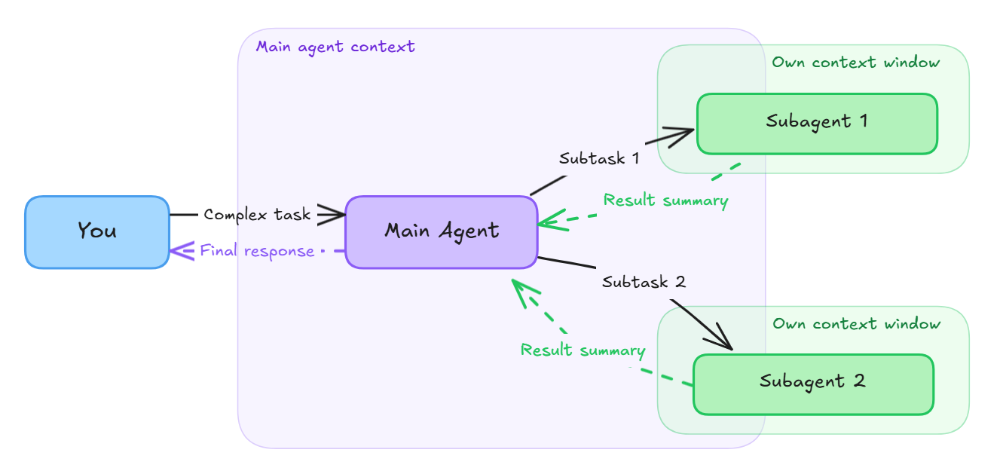

# Visual Studio Code'da alt ajanlar

Karmaşık görevler üzerinde çalışırken alt görevleri alt ajanlara devredebilirsiniz. Alt ajan, bir konuyu araştırma, kodu analiz etme veya değişiklikleri inceleme gibi odaklanmış iş yapan ve sonuçları ana ajana bildiren bağımsız bir yapay zeka ajanıdır. Her alt ajan kendi bağlam penceresinde çalıştığı için ana sohbetinize gürültü eklemez. VS Code ayrıca çok parçalı görevleri hızlandırmak için birden fazla alt ajanı paralel çalıştırabilir.

Örneğin yerleşik [Plan ajanı](/docs/copilot/agents/planning.md) uygulama planı oluşturmadan önce araştırma ve analiz yapmak için alt ajanları kullanır. Her alt ajan özerk çalışır ve yalnızca bulgularını döndürür. Plan ajanı bu bulguları nihai bir planda sentezler.

Varsayılan olarak alt ajanlar ana sohbet oturumuyla aynı modeli ve araçları kullanır ancak temiz bir bağlam penceresiyle başlar. Alt ajanlar ana ajanın talimatlarını veya sohbet geçmişini devralmaz. Yalnızca sağladığınız görev promptunu alırlar. Belirli görevler için [özel bir ajanı](/docs/copilot/customization/custom-agents.md) alt ajan olarak çalıştırarak özelleştirilmiş davranış, araçlar ve modeller uygulayabilirsiniz.

## Alt ajan yürütmesi nasıl çalışır

Aşağıdaki diyagram alt ajanların nasıl çalıştığını gösterir. Ana ajan görevinizi alır, izole bağlam pencerelerinde çalışan bir veya daha fazla alt ajana alt görevleri devreder ve sonuçları birleştirir.



Alt ajanlar **senkrondur**: ana ajan devam etmeden önce alt ajan sonuçlarını bekler. Bu engelleme davranışı kasıtlıdır: alt ajan bulguları tipik olarak görevin bir sonraki adımını bilgilendirir. Alt ajan sonuçları olmadan ana ajan etkili ilerlemek için gereken bilgiden yoksundur.

Ancak VS Code **birden fazla alt ajanı paralel** başlatabilir. Paralel analiz istediğinizde (örneğin "güvenlik, performans ve erişilebilirliği aynı anda analiz et") VS Code bu alt ajanları eşzamanlı çalıştırır ve ana ajan devam etmeden önce tüm sonuçları bekler.

> [!NOTE]
> Alt ajanlar yeni bir ajan oturumu başlatmaktan farklıdır. Yeni oturum mevcut görevinizle bağlantısı olmayan tamamen ayrı bir sohbet oluşturur. Alt ajanlar ilişkiyi korur: odaklanmış iş yaparlar ve ana ajana rapor verirler; ana ajan genel görev üzerinde kontrolü elinde tutar.

### Kullanıcının gördüğü

Bir alt ajan çalıştığında sohbette daraltılabilir bir araç çağrısı olarak görünür. Varsayılan olarak alt ajan daraltılmıştır ve şunları gösterir:

* Özel ajan adı (belirttiyseniz)
* Şu anda çalışan araç (örneğin "Reading file..." veya "Searching codebase...")

Alt ajan araç çağrısını seçerek tüm ayrıntıları görüntüleyebilirsiniz; alt ajanın yaptığı tüm araç çağrıları, alt ajana geçirilen prompt ve döndürülen sonuç dahil.

Bu görünürlük ara adımlarla ana sohbetinizi kalabalıklaştırmadan ne kadar ayrıntı göreceğiniz üzerinde kontrol sağlar.

## Alt ajanları neden kullanmalı?

Alt ajanlar karmaşık yapay zeka destekli iş akışlarını daha etkili yönetmenize yardımcı olur:

* **Ana ajan bağlamını odaklı tutun**: Ana ajanın bağlam penceresi her prompt ve yanıttan bilgi biriktirir. Araştırma, analiz veya uygulama görevlerini alt ajanlara aktararak bağlam şişmesini önler ve ana ajanın genel görevi orkestre etmeye odaklanmasına yardımcı olursunuz.

* **Paralel yürütmeyle performansı artırın**: VS Code birden fazla alt ajanı eşzamanlı çalıştırabilir. Örneğin bir özellik uygularken kimlik doğrulama desenlerini araştırabilir, mevcut kod yapısını analiz edebilir ve belgeleri paralel olarak inceleyebilirsiniz.

* **Deneysel veya keşif çalışmasını izole edin**: Alt ajanlar bir yöne bağlanmadan seçenekleri keşfetmek istediğiniz görevler için idealdir. Bir alt ajanın araştırması çıkmaza giderse yalnızca son özet ana bağlamınızı etkiler, tüm ara keşif değil.

* **Belirli görevler için özelleştirilmiş davranış uygulayın**: Alt ajanları [özel ajanlarla](/docs/copilot/customization/custom-agents.md) birleştirerek belirli alt görevler için özelleştirilmiş araçlar, talimatlar ve modeller uygulayabilirsiniz. Örneğin güvenlik odaklı özel bir ajanı savunmasızlıklar için kod incelemesi yaparken bir belge ajanı kullanıcı kılavuzları oluşturur.

* **Token kullanımını ve maliyetleri azaltın**: Alt ajanların kendi bağlam pencereleri olduğundan ana ajanın bağlamına tam sohbet geçmişlerini eklemezler. Yalnızca nihai sonuç döndürülür; bu karmaşık görevler için genel token tüketimini önemli ölçüde azaltabilir.

## Kullanım senaryoları

Aşağıdaki senaryolar alt ajanların yapay zeka destekli geliştirme iş akışınızı ne zaman iyileştirebileceğini gösterir.

<details>
<summary>Uygulamadan önce araştırma</summary>

Yeni bir özellik oluştururken ana ajan uygulamaya başlamadan önce en iyi uygulamaları araştırmak, kütüphaneleri değerlendirmek veya kod tabanında mevcut desenleri analiz etmek için bir alt ajan kullanın:

```prompt
Use a subagent to research OAuth 2.0 implementation patterns for Node.js applications.
Compare passport.js vs auth0 vs custom implementation. Return a recommendation with pros and cons.
```

Ana ajan yalnızca nihai öneriyi alır; bağlamı gerçek uygulama işi için temiz tutar.

</details>

<details>
<summary>Paralel kod analizi</summary>

Refaktör veya kod incelemesi yaparken farklı yönleri analiz etmek için birden fazla alt ajanı paralel çalıştırın:

```prompt
Analyze this codebase for refactoring opportunities. Use subagents to:
1. Find duplicate code patterns
2. Identify unused exports and dead code
3. Review error handling consistency
4. Check for security vulnerabilities

Compile the findings into a prioritized action plan.
```

</details>

<details>
<summary>Birden fazla çözümü keşfedin</summary>

En iyi yaklaşımdan emin olmadığınızda ana bağlamınızı kirletmeden farklı seçenekleri keşfetmek için alt ajanları kullanın:

```prompt
I need to implement caching for this API. Run three subagents in parallel to:
1. Design a Redis-based caching solution
2. Design an in-memory caching solution with LRU eviction
3. Design a hybrid approach with tiered caching

Compare the results and recommend the best approach for our use case.
```

</details>

<details>
<summary>Özelleştirilmiş odakla kod incelemesi</summary>

Farklı inceleme perspektifleri uygulamak için özel ajanları alt ajan olarak kullanın:

```prompt
Review the changes in this PR using subagents:
- Run the security-reviewer agent to check for vulnerabilities
- Run the performance-reviewer agent to identify bottlenecks
- Run the accessibility-reviewer agent to verify a11y compliance

Consolidate findings into a single review summary.
```

</details>

## Alt ajan çağırma

### Ajan başlatan vs. kullanıcı başlatan

Alt ajanlar tipik olarak **ajan tarafından başlatılır**, sohbette kullanıcılar tarafından doğrudan çağrılmaz. Ana ajanın alt ajan başlatmasına izin vermek için `runSubagent` aracının etkin olduğundan emin olun.

Ana ajan bağlam izolasyonunun ne zaman yardımcı olacağına karar verir. Her görev için manuel olarak "alt ajan çalıştır" yazmanız gerekmez. Desen şöyle işler:

1. Siz (veya özel ajan talimatlarınız) karmaşık bir görev tanımlarsınız.
1. Ana ajan görevin izole bağlamdan faydalanan kısmını tanır.
1. Ajan yalnızca ilgili alt görevi geçirerek bir alt ajan başlatır.
1. Alt ajan özerk çalışır ve bir özet döndürür.
1. Ana ajan sonucu birleştirir ve devam eder.

İzole araştırma veya paralel analiz öneren promptunuzla alt ajan devrinin istendiğine ipucu verebilirsiniz. Ana ajan bir alt ajan başlatacak, görevi ona geçirecek ve yalnızca nihai sonucu alacaktır.

> [!TIP]
> Tutarlı alt ajan davranışı için alt ajanların ne zaman kullanılacağını özel ajan talimatlarınızda tanımlayın; her seferinde manuel olarak istemek yerine.

Alt ajan performansını optimize etmek için görevi ve beklenen çıktıyı net tanımlayın. Bu, alt ajanın gereksiz bağlamı ana ajana geri geçirmeden belirli hedefe odaklanmasına yardımcı olur.

Alt ajan çağıran promptların nasıl yapılandırılacağına dair örnekler için [kullanım senaryoları](#usage-scenarios) bölümüne bakın.

### Prompt dosyasında alt ajan çağırma

Prompt dosyası içinde alt ajan çağırmak için `tools` frontmatter özelliğinde `runSubagent` veya `agent` aracının dahil olduğundan emin olun:

```markdown
---
name: document-feature
tools: ['agent', 'read', 'search', 'edit']
---
Run a subagent to research the new feature implementation details and return only information relevant for user documentation.
Then update the docs/ folder with the new documentation.
```

Prompt talimatlarında belirli alt görevler için izole araştırma veya paralel analiz önererek ajana alt ajan kullanmasına ipucu verebilirsiniz.

## Alt ajan olarak özel ajan çalıştırma (Deneysel)

Varsayılan olarak alt ajan ana sohbet oturumundan ajanı devralır ve aynı modeli ve araçları kullanır. Alt ajan için belirli davranış tanımlamak üzere [özel bir ajan](/docs/copilot/customization/custom-agents.md) kullanın. Özel ajanlar kendi modelini, araçlarını ve talimatlarını belirtebilir. Alt ajan olarak kullanıldığında bu ayarlar ana oturumdan devralınan varsayılanları geçersiz kılar.

### Alt ajan çağrısını kontrol etme

Özel bir ajanın nasıl çağrılabileceğini iki frontmatter özelliğiyle kontrol edebilirsiniz:

* `user-invocable`: Ajanın sohbetteki ajanlar açılır menüsünde görünüp görünmeyeceğini kontrol eder (varsayılan `true`). Yalnızca alt ajan olarak erişilebilir ajanlar oluşturmak için `false` yapın.
* `disable-model-invocation`: Ajanın diğer ajanlar tarafından alt ajan olarak çağrılmasını engeller (varsayılan `false`). Ajanlar yalnızca kullanıcılar tarafından açıkça tetiklendiğinde `true` yapın.

Örneğin yalnızca alt ajan olarak kullanılabilen (açılır menüde görünmeyen) bir ajan oluşturmak için:

```markdown
---
name: internal-helper
user-invocable: false
---

This agent can only be invoked as a subagent.
```

> [!NOTE]
> `infer` özelliği kullanım dışıdır. Daha ayrıntılı kontrol için `user-invocable` ve `disable-model-invocation` kullanın.

Alt ajan olarak özel veya yerleşik bir ajan çalıştırmak için yapay zekaya özel ajanı kullanmasını isteyin. Örneğin:

* `Run the Research agent as a subagent to research the best auth methods for this project.`
* `Use the Plan agent in a subagent to create an implementation plan for myfeature. Then save the plan in plans/myfeature.plan.md`

### Hangi alt ajanların kullanılabileceğini kısıtlama (Deneysel)

Varsayılan olarak `disable-model-invocation: true` olmayan tüm özel ajanlar alt ajan olarak kullanılabilir. İki veya daha fazla ajanın benzer adları veya açıklamaları varsa yapay zeka yanlışlıkla istenmeyen bir ajanı seçebilir.

Ana ajanın frontmatter'ında `agents` özelliğini belirterek ve izin verilen özel ajanların listesini sağlayarak hangi özel ajanların alt ajan olarak kullanılabileceğini kısıtlayabilirsiniz.

`agents` özelliği şunları kabul eder:

* Yalnızca belirli ajanlara izin vermek için ajan adları listesi (örneğin `['Edit', 'Search']`)
* Tüm mevcut ajanlara izin vermek için `*` (varsayılan davranış)
* Herhangi bir alt ajan kullanımını engellemek için boş dizi `[]`

> [!NOTE]
> `agents` dizisinde açıkça bir ajan listelemek `disable-model-invocation: true`'u geçersiz kılar. Bu, genel alt ajan kullanımından korunmuş ancak onları açıkça izin veren belirli koordinatör ajanlardan hala erişilebilir ajanlar oluşturmanıza olanak tanır.

Örneğin test güdümlü geliştirme (TDD) ajanı yalnızca `Red`, `Green` ve `Refactor` ajanlarını alt ajan olarak kullanmalıdır. Kısıtlama olmadan TDD ajanı testleri uygulamak yerine daha genel bir kodlama ajanı seçebilir.

```markdown
---
name: TDD
tools: ['agent']
agents: ['Red', 'Green', 'Refactor']
---
Implement the following feature using test-driven development. Use subagents to guide the following steps:
1. Use the Red agent to write failing tests
2. Use the Green agent to implement code to pass the tests
3. Use the Refactor agent to improve the code quality
```

## Orkestrasyon desenleri

Alt ajanlar, bir koordinatör ajanın uzmanlaşmış işçi ajanlara iş devrettiği **orkestrasyon desenlerini** etkinleştirir. Bu yaklaşım her ajanı en iyi yaptığına odaklı tutarken sofistike iş akışları oluşturmanıza yardımcı olur.

### Koordinatör ve işçi deseni

Koordinatör ajan genel görevi yönetir ve uzmanlaşmış alt ajanlara alt görevleri devreder. Her işçi ajanının özelleştirilmiş bir araç seti olabilir. Örneğin planlama ve inceleme ajanlarına yalnızca salt okunur erişim gerekir, oysa uygulayıcı düzenleme yeteneklerine ihtiyaç duyar.

```markdown
---
name: Feature Builder
tools: ['agent', 'edit', 'search', 'read']
agents: ['Planner', 'Plan Architect', 'Implementer', 'Reviewer']
---
You are a feature development coordinator. For each feature request:

1. Use the Planner agent to break down the feature into tasks.
2. Use the Plan Architect agent to validate the plan against codebase patterns.
3. If the architect identifies reusable patterns or libraries, send feedback to the Planner to update the plan.
4. Use the Implementer agent to write the code for each task.
5. Use the Reviewer agent to check the implementation.
6. If the reviewer identifies issues, use the Implementer agent again to apply fixes.

Iterate between planning and architecture, and between review and implementation, until each phase converges.
```

İşçi ajanlarının her biri kendi araç erişimini tanımlar ve daha dar odakları olduğundan daha hızlı veya maliyet etkin bir model seçebilir:

```markdown
---
name: Planner
user-invocable: false
tools: ['read', 'search']
---
Break down feature requests into implementation tasks. Incorporate feedback from the Plan Architect.
```

```markdown
---
name: Plan Architect
user-invocable: false
tools: ['read', 'search']
---
Validate plans against the codebase. Identify existing patterns, utilities, and libraries that should be reused. Flag any plan steps that duplicate existing functionality.
```

```markdown
---
name: Implementer
user-invocable: false
model: ['Claude Haiku 4.5 (copilot)', 'Gemini 3 Flash (Preview) (copilot)']
---
Write code to complete assigned tasks.
```

Bu desen koordinatörün bağlamını üst düzey iş akışına odaklı tutarken her işçi ajanı belirli işi için temiz bağlam ve uygun izinlere sahiptir.

### Çok perspektifli kod incelemesi

Kod incelemesi birden fazla perspektiften faydalanır. Tek bir geçiş genellikle farklı bir mercekten bakıldığında belirgin hale gelen sorunları kaçırır. Her inceleme perspektifini paralel alt ajan olarak çalıştırın, sonra bulguları sentezleyin.

```markdown
---
name: Thorough Reviewer
tools: ['agent', 'read', 'search']
---
You review code through multiple perspectives simultaneously. Run each perspective as a parallel subagent so findings are independent and unbiased.

When asked to review code, run these subagents in parallel:
- Correctness reviewer: logic errors, edge cases, type issues.
- Code quality reviewer: readability, naming, duplication.
- Security reviewer: input validation, injection risks, data exposure.
- Architecture reviewer: codebase patterns, design consistency, structural alignment.

After all subagents complete, synthesize findings into a prioritized summary. Note which issues are critical versus nice-to-have. Acknowledge what the code does well.
```

Bu desen işe yarar çünkü her alt ajan kodu taze yaklaşır, diğer perspektiflerin bulduklarıyla sabitlenmez. Bu örnekte orkestratör her alt ajanın odak alanını promptu aracılığıyla şekillendirir. Bu ek ajan dosyası gerektirmeyen hafif bir yaklaşımdır.

> [!TIP]
> Daha fazla kontrol için her inceleme perspektifi kendi özel ajanı olabilir ve özelleştirilmiş araç erişimine sahip olabilir. Örneğin bir güvenlik inceleyicisi güvenlik odaklı bir MCP sunucusu kullanırken, kod kalitesi inceleyicisi lint CLI araçlarına erişime sahip olabilir. Bu yaklaşım her perspektifin kendi odağı için en iyi araçları kullanmasına olanak tanır.

## İlgili kaynaklar

* [Ajanlara genel bakış](/docs/copilot/agents/overview.md) - VS Code'daki farklı ajan türlerini öğrenin
* [Özel ajanlar](/docs/copilot/customization/custom-agents.md) - Kendi yapay zeka ajanlarınızı oluşturun
* [Sohbet oturumları](/docs/copilot/chat/chat-sessions.md) - VS Code'da sohbet oturumlarını yönetin
