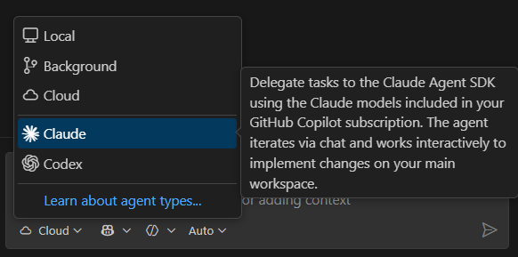
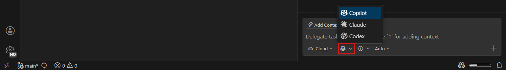
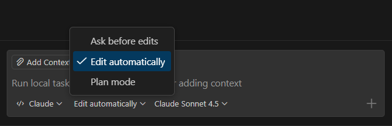
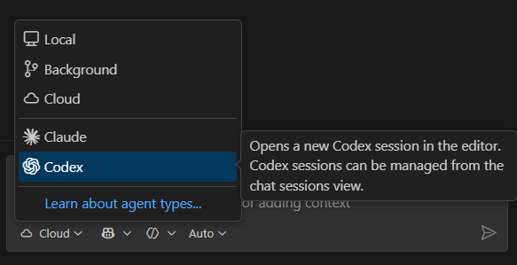

# Visual Studio Code'da üçüncü taraf ajanlar

Visual Studio Code'daki üçüncü taraf ajanlar Anthropic ve OpenAI gibi harici sağlayıcılar tarafından geliştirilen yapay zeka ajanlarıdır. Üçüncü taraf ajanlar bu yapay zeka sağlayıcılarının benzersiz yeteneklerini kullanmanızı sağlarken VS Code'daki birleşik ajan oturumları yönetiminden ve kodlama, hata ayıklama, test ve daha fazlası için zengin editör deneyiminden yararlanırsınız. Ayrıca mevcut GitHub Copilot aboneliğinizle bu sağlayıcıları kullanabilirsiniz.

VS Code sağlayıcının SDK'sını ve ajan altyapısını kullanarak ajanın benzersiz yeteneklerine erişir. Hem yerel hem de bulut tabanlı üçüncü taraf ajanları VS Code'da kullanabilirsiniz. Bulut tabanlı üçüncü taraf ajanlarla entegrasyon GitHub Copilot planınız aracılığıyla etkinleştirilir.

> [!NOTE]
> Buluttaki üçüncü taraf kodlama ajanları şu anda önizlemededir.

## Üçüncü taraf ajanları neden kullanmalı?

VS Code'da üçüncü taraf ajanları kullanmanın avantajları:

* **Benzersiz yeteneklerden yararlanın**: Her üçüncü taraf ajanın kendi güçlü yönleri ve uzmanlaşmış özellikleri vardır. VS Code sağlayıcının SDK'sını ve ajan altyapısını kullanarak bu yeteneklere erişir; kodlama görevleriniz için en iyi ajanı seçmenizi sağlar.
* **Birleşik deneyim**: Üçüncü taraf ajanlar dahil tüm ajan oturumlarınızı aynı VS Code ajan deneyiminden yönetin.
* **Zengin editör entegrasyonu**: Ajanın yetenekleriyle birlikte zengin hata ayıklama ve test gibi VS Code'un kodlama özelliklerini kullanın.
* **Faturalandırma**: Ek kurulum olmadan mevcut GitHub Copilot aboneliğiniz üzerinden kimlik doğrulama ve faturalandırma yönetimi.

## Üçüncü taraf bulut ajanlarını etkinleştirme

VS Code'da kullanmadan önce Copilot hesap ayarlarınızda buluttaki üçüncü taraf ajanlar için desteği etkinleştirmeniz gerekir. GitHub belgelerinde [Depolarınızda üçüncü taraf kodlama ajanlarını etkinleştirme veya devre dışı bırakma](https://docs.github.com/en/copilot/how-tos/manage-your-account/manage-policies#enabling-or-disabling-third-party-coding-agents-in-your-repositories) adımlarını izleyin.

VS Code'da bulut ajanlarını kullanmak için sağlayıcının VS Code uzantısını yüklemeniz gerekmez.

## Claude Agent (Önizleme)

Claude ajan oturumları Anthropic'in Claude Agent SDK'sı tarafından desteklenen ajanik kodlama yeteneklerini doğrudan VS Code'da sağlar. Claude ajanı kendi araç seti ve yetenekleriyle çalışma alanınızda planlama, yürütme ve kodlama görevlerinde yineleme yapmak üzere özerk çalışır.

Claude ajan oturumları için desteği `setting(github.copilot.chat.claudeAgent.enabled)` ayarıyla etkinleştirip devre dışı bırakabilirsiniz.

### Claude ajan oturumu başlatma

Yeni Claude ajan oturumu başlatmak için:

1. Sohbet görünümünü (`kb(workbench.action.chat.open)`) açın ve **New Chat** (`+`) seçin.

1. Yerel veya bulut ajan oturumu arasında seçim yapın:

    * Yerel oturum için **Session Type** açılır menüsünden **Claude** seçin

        

    * Bulut oturumu için **Session Type** açılır menüsünden **Cloud** seçin. Ardından **Partner Agent** açılır menüsünden **Claude** seçin.

        

1. Promptunuzu girin ve ajanın görev üzerinde çalışmasına izin verin

    Claude ajanı hangi araçları kullanacağını özerk belirler ve çalışma alanınızda değişiklik yapar.

### Claude ajan eğik çizgi komutları

Claude ajanı gelişmiş iş akışları için özelleştirilmiş eğik çizgi komutları sağlar. Mevcut komutları görmek için sohbet giriş kutusuna `/` yazın.

| Eğik çizgi komutu | Açıklama |
|-------------------|----------|
| `/agents` | Belirli görevler için uzmanlaşmış Claude ajanları oluşturun ve yönetin. Sihirbaz aracılığıyla özel ajan davranışlarını tanımlayın. [Claude alt ajanları](https://code.claude.com/docs/en/sub-agents) hakkında daha fazla bilgi edinin. |
| `/hooks` | Claude ajan oturumları sırasında araç yürütmesinden önce veya sonra gibi kritik noktalarda çalışan yaşam döngüsü hook'larını yapılandırın. [Claude hook'ları](https://code.claude.com/docs/en/hooks) hakkında daha fazla bilgi edinin. |
| `/memory` | Claude ajan için oturumlar arasında kalıcı bağlam sağlayan `CLAUDE.md` bellek dosyalarını açın ve düzenleyin. |
| `/init` | Projeniz için yeni bir `CLAUDE.md` bellek dosyası başlatın. |
| `/pr-comments` | Pull request'ten yorumları alın. |
| `/review` | Geçerli daldaki bekleyen kod değişikliklerini inceleyin. |
| `/security-review` | Geçerli daldaki bekleyen kod değişikliklerinin güvenlik incelemesini yapın. |

### İzin modları

Claude ajanı belirli işlemleri gerçekleştirmeden önce izin ister. Varsayılan olarak çalışma alanınızdaki dosya düzenlemeleri otomatik onaylanır; terminal komutları çalıştırma gibi diğer işlemler onay gerektirebilir.

Ajanın çalışma alanınızda değişiklikleri nasıl uygulayacağını seçebilirsiniz:

* **Edit automatically**: Claude ajanı görev üzerinde çalışırken çalışma alanınızda değişiklikleri özerk yapar.
* **Request approval**: Claude ajanı çalışma alanınızda değişiklik yapmadan önce incelemenizi ister.
* **Plan**: Claude ajanı işe başlamadan önce niyet edilen yaklaşımı özetler.

> [!CAUTION]
> `setting(github.copilot.chat.claudeAgent.allowDangerouslySkipPermissions)` ayarı tüm izin kontrollerini atlar. Bunu yalnızca internet erişimi olmayan izole sandbox ortamlarında etkinleştirin.

## OpenAI Codex

OpenAI Codex ajanı kodlama görevlerini özerk gerçekleştirmek için OpenAI'nin Codex'ini kullanır. Codex VS Code'da etkileşimli olarak veya arka planda gözetimsiz çalışabilir.

OpenAI Codex ajanını devre dışı bırakmak için VS Code'da [OpenAI Codex](https://marketplace.visualstudio.com/items?itemName=openai.chatgpt) uzantısını devre dışı bırakın veya kaldırın.

### Ön koşullar

* Kimlik doğrulama için Copilot Pro+ aboneliği
* Yerel oturumlar için [OpenAI Codex](https://marketplace.visualstudio.com/items?itemName=openai.chatgpt) uzantısı

VS Code'daki OpenAI Codex ek kurulum olmadan kimlik doğrulama ve Codex erişimi için Copilot Pro+ aboneliğinizi kullanmanızı sağlar. GitHub belgelerinde [GitHub Copilot faturalandırma ve premium istekler](https://docs.github.com/en/copilot/concepts/billing/copilot-requests) hakkında daha fazla bilgi edinin.

### Codex oturumu başlatma

Yeni OpenAI Codex ajan oturumu başlatmak için:

1. Sohbet görünümünü (`kb(workbench.action.chat.open)`) açın ve **New Chat** (`+`) seçin.

1. Yerel veya bulut ajan oturumu arasında seçim yapın:

    * Yerel oturum için **Session Type** açılır menüsünden **Codex** seçin

        

    * Bulut oturumu için **Session Type** açılır menüsünden **Cloud** seçin. Ardından **Partner Agent** açılır menüsünden **Codex** seçin.

        

1. Sohbet editörü girişine promptunuzu yazın ve ajanın görev üzerinde çalışmasına izin verin

## Sık sorulan sorular

Mevcut Copilot aboneliğimle üçüncü taraf ajanları kullanabilir miyim?

Evet, VS Code'daki üçüncü taraf ajanlar mevcut GitHub Copilot aboneliğiniz üzerinden kimlik doğrulama ve faturalandırma yönetir. Bulut tabanlı üçüncü taraf ajanlar için ajanı etkinleştirme adımlarını izleyin.

Bulut tabanlı üçüncü taraf ajanlar için kullanılabilirlik Copilot abonelik planınıza göre sınırlı olabilir. GitHub belgelerinde [Üçüncü taraf ajanlar hakkında](https://docs.github.com/en/copilot/concepts/agents/about-third-party-agents) bölümünde daha fazla bilgi edinin.

Üçüncü taraf ajanlar sağlayıcının VS Code uzantısını kullanmaktan nasıl farklı?

Hem sağlayıcının VS Code uzantısı hem de VS Code'daki üçüncü taraf ajan entegrasyonu sağlayıcının yapay zeka yeteneklerini ve ajan altyapısını kullanmanızı sağlar. Fark faturalandırmadadır: VS Code'daki üçüncü taraf ajanları kullandığınızda GitHub sizi Copilot aboneliğiniz üzerinden faturalandırır. Sağlayıcının uzantısını kullandığınızda sağlayıcının aboneliği üzerinden faturalandırılırsınız.

İki Claude/Codex ajanı neden var?

VS Code sağlayıcının kullanılabilirliğine bağlı olarak yerel ve bulut tabanlı üçüncü taraf ajanlar arasında seçim yapmanızı sağlar. **Session Type** açılır menüsünden üçüncü taraf ajanı seçtiğinizde o sağlayıcı için yerel ajan oturumu oluşturulur.

Bulut tabanlı üçüncü taraf ajan seçmek için önce **Session Type** açılır menüsünden **Cloud** seçeneğini seçin, ardından sağlayıcıyı **Partner Agent** açılır menüsünden seçin.

## İlgili kaynaklar

* [Ajanlara genel bakış](/docs/copilot/agents/overview.md): Farklı ajan türlerini ve ajanlar arasında görev devrini anlayın
* [Üçüncü taraf ajanlar hakkında](https://docs.github.com/en/copilot/concepts/agents/about-third-party-agents): GitHub belgelerinde üçüncü taraf ajanlar hakkında daha fazla bilgi edinin
