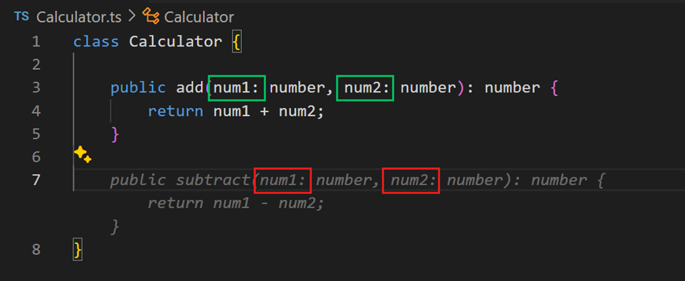
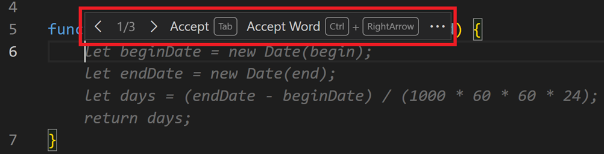
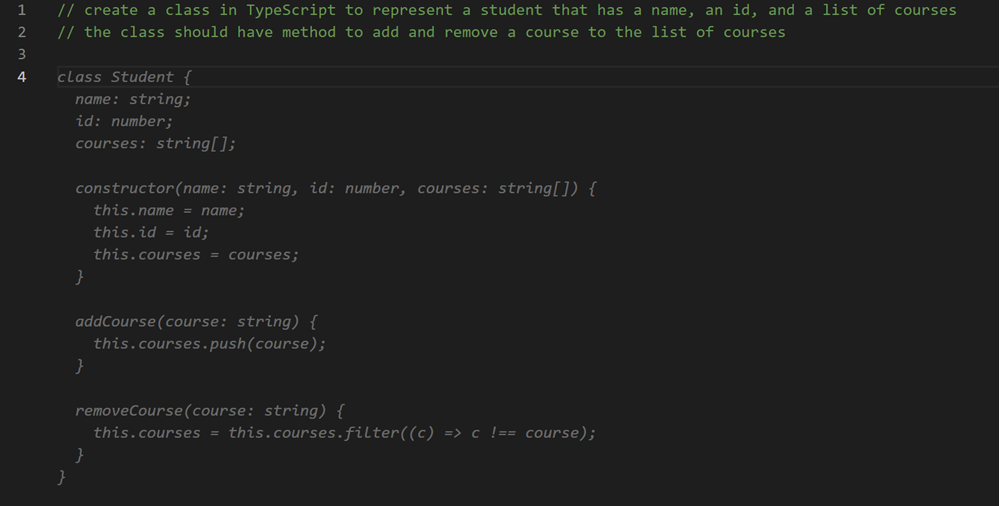
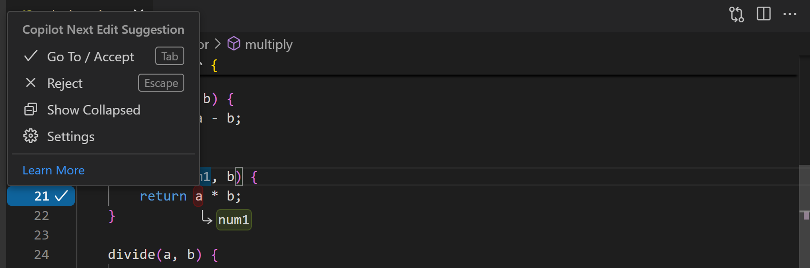
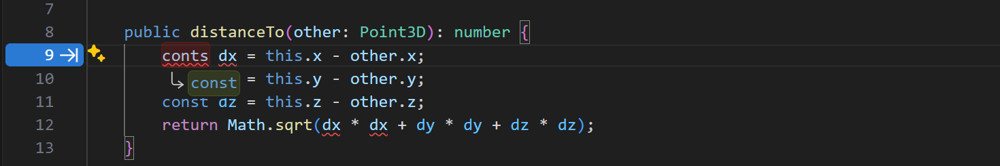
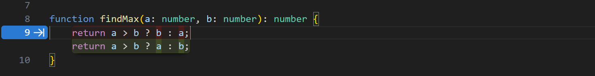
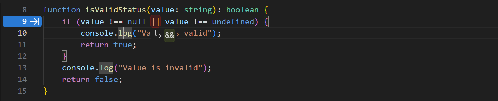
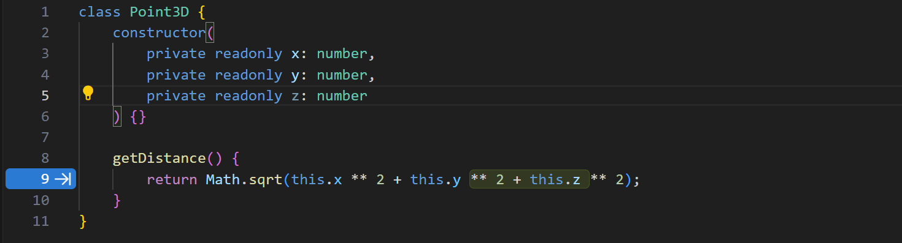
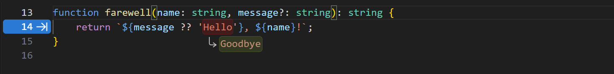

# VS Code'da GitHub Copilot satır içi önerileri

GitHub Copilot VS Code'da yazarken kodunuzu, yorumlarınızı, testlerinizi ve daha fazlasını tamamlayan AI destekli satır içi öneriler sunar. Satır içi öneriler geniş bir programlama dili ve framework yelpazesiyle çalışır. Bunlar VS Code'daki birkaç AI arayüzünden biridir; otonom çok dosyalı görevler için [ajanlar](/docs/copilot/agents/overview.md), [chat](/docs/copilot/chat/copilot-chat.md) ve [akıllı eylemler](/docs/copilot/copilot-smart-actions.md) ile birlikte.

Copilot'tan iki tür satır içi öneri deneyimleyebilirsiniz; ikisi de kodlama tarzınıza uyar ve mevcut kodunuzu dikkate alır:

* **Hayalet metin önerileri** - Editörde yazmaya başlayın, Copilot mevcut imleç konumunuzda soluk *hayalet metin* önerileri sunar.

* **Sonraki düzenleme önerileri** - Copilot sonraki düzenleme önerileri (Copilot NES) ile bir sonraki kod düzenlemenizi tahmin edin. Yaptığınız düzenlemelere dayanarak NES hem bir sonraki düzenlemeyi yapmak isteyeceğiniz konumu hem de o düzenlemenin ne olması gerektiğini tahmin eder.

VS Code'da AI ile ilk uygulamanızı oluşturmak için uygulamalı öğreticiyi takip edin.

* [Öğreticiyi başlat](/docs/copilot/getting-started.md)

## Başlarken

1. GitHub Copilot uzantılarını yükleyin.

    > <a class="install-extension-btn" href="vscode:extension/GitHub.copilot?referrer=docs-copilot-ai-powered-suggestions">GitHub Copilot uzantılarını yükle</a>

1. Copilot kullanmak için GitHub hesabınızla oturum açın.

    > [!TIP]
    > Henüz Copilot aboneliğiniz yoksa, [Copilot Ücretsiz planına](https://github.com/github-copilot/signup) kaydolarak ücretsiz olarak Copilot kullanabilir ve aylık satır içi öneri ve sohbet etkileşimi limiti alabilirsiniz.

1. [Copilot Hızlı Başlangıç](/docs/copilot/getting-started.md) ile VS Code'da Copilot'un temel özelliklerini keşfedin.

## İlk önerilerinizi alın

Copilot yazarken soluk *hayalet metin* önerileri sunar: bazen mevcut satırın tamamlanması, bazen tamamen yeni bir kod bloğu. Bir öneriyi tamamen veya kısmen kabul edebilir veya yazmaya devam edip önerileri yok sayabilirsiniz.

Aşağıdaki örnekte Copilot'un `calculateDaysBetweenDates` JavaScript fonksiyonunun uygulamasını soluk *hayalet metin* kullanarak nasıl önerdiğine dikkat edin:

Satır içi bir öneri sunulduğunda `kbstyle(Tab)` tuşuyla kabul edebilirsiniz.

Copilot kodunuzda zaten bulunan kodlama tarzını uygulamaya çalışır. Aşağıdaki örnekte Copilot'un `add` metodu için önerilen `subtract` metodunda aynı giriş parametre adlandırma şemasını uyguladığına dikkat edin.

### Önerileri kısmen kabul etme

GitHub Copilot'tan bir önerinin tamamını kabul etmek istemeyebilirsiniz. Önerinin bir sonraki kelimesini veya bir sonraki satırını kabul etmek için `kb(editor.action.inlineSuggest.acceptNextWord)` klavye kısayolunu kullanabilirsiniz.

### Alternatif öneriler

Herhangi bir giriş için Copilot birden fazla alternatif öneri sunabilir. Önerinin üzerine gelerek diğer önerilerden herhangi birini seçebilirsiniz.

### Kod yorumlarından öneri oluşturma

Copilot'un öneri sunmasına güvenmek yerine, kod yorumları kullanarak ne tür kod beklediğinize ipuçları verebilirsiniz. Örneğin kullanılacak algoritma veya kavram türünü belirtebilirsiniz (örneğin "use recursion" veya "use a singleton pattern") veya bir sınıfa eklenecek metod ve özellikleri.

Aşağıdaki örnek TypeScript'te bir öğrenciyi temsil edecek bir sınıf oluşturmak için Copilot'a nasıl talimat verileceğini, özellikler ve metodlar hakkında bilgi sağlanarak göstermektedir:

## Sonraki düzenleme önerileri

Hayalet metin önerileri bir kod bölümünü otomatik tamamlamada iyidir. Ancak çoğu kodlama etkinliği mevcut kodu düzenlemek olduğundan, satır içi önerilerin hem imleçte hem de daha uzakta düzenlemelere yardımcı olması doğal bir evrimdir. Düzenlemeler genellikle izole yapılmaz - farklı senaryolarda hangi düzenlemelerin yapılması gerektiğine dair mantıksal bir akış vardır. Sonraki düzenleme önerileri (Copilot NES) bu evrimdir.

<video src="./images/inline-suggestions/nes-video.mp4" title="Video showing next edit suggestions in action on a Point typescript class." loop controls muted poster="./images/inline-suggestions/point3d.png"></video>

Yaptığınız düzenlemelere dayanarak sonraki düzenleme önerileri hem bir sonraki düzenlemeyi yapmak isteyeceğiniz konumu hem de o düzenlemenin ne olması gerektiğini tahmin eder. Copilot NES mevcut işinizle ilgili gelecekteki değişiklikleri önererek akışta kalmanıza yardımcı olur ve Copilot'un önerilerine hızlıca gidip kabul etmek için `kbstyle(Tab)` kullanabilirsiniz. Öneriler potansiyel değişikliğin kapsamına bağlı olarak tek bir sembol, tüm bir satır veya birden fazla satırı kapsayabilir.

Copilot NES ile başlamak için VS Code ayarını etkinleştirin: `setting(github.copilot.nextEditSuggestions.enabled)`.

### Düzenleme önerilerine gidin ve kabul edin

Önerilen kod değişikliklerine `kbstyle(Tab)` tuşuyla hızlıca gidebilirsiniz; bu size bir sonraki ilgili düzenlemeyi bulmak için zaman kazandırır (dosyalar veya referanslar arasında manuel arama gerekmez). Ardından öneriyi tekrar `kbstyle(Tab)` tuşuyla kabul edebilirsiniz.

Kenar boşluğundaki bir ok, düzenleme önerisinin mevcut olup olmadığını gösterir. Ok mevcut imleç konumunuza göre sonraki düzenleme önerisinin nerede bulunduğunu gösterir.

Düzenleme önerisi menüsünü keşfetmek için okun üzerine gelebilirsiniz; klavye kısayolları ve ayar yapılandırması dahildir:

> [!IMPORTANT]
> [VS Code vim uzantısı](https://marketplace.visualstudio.com/items?itemName=vscodevim.vim) kullanıcısıysanız, NES ile klavye kısayollarında çakışmaları önlemek için uzantının en son sürümünü kullanın.

### Düzenleme önerileriyle dikkat dağılmasını azaltın

Varsayılan olarak düzenleme önerileri kenar boşluğu oku ve editördeki kod değişiklikleriyle gösterilir. Öneriye gitmek veya kenar boşluğu okunun üzerine gelene kadar editörde kod değişikliklerini yalnızca `kbstyle(Tab)` tuşuna basana kadar göstermek için `setting(editor.inlineSuggest.edits.showCollapsed)` ayarını etkinleştirin. Alternatif olarak kenar boşluğu okunun üzerine gelin ve menüden **Show Collapsed** seçeneğini seçin.

### Sonraki düzenleme önerileri için kullanım senaryoları

**Hataları yakalama ve düzeltme**

* **Copilot basit yazım hatalarıyla yardımcı olur.** Eksik veya yer değiştirilmiş harfler gibi düzeltmeler önerir, örneğin `cont x = 5` veya `conts x = 5` aslında `const x = 5` olmalıydı.

    

* **Copilot mantıktaki daha zorlu hatalarla da yardımcı olabilir**, örneğin ters çevrilmiş bir üçlü ifade:

    

    Veya `||` yerine `&&` kullanılması gereken bir karşılaştırma:

    

**Niyet değiştirme**

* **Copilot niyetteki yeni bir değişiklikle eşleşen kodun geri kalanındaki değişiklikleri önerir.** Örneğin bir sınıfı `Point`'ten `Point3D`'ye değiştirdiğinizde Copilot sınıf tanımına `z` değişkeni eklemeyi önerecektir. Değişikliği kabul ettikten sonra Copilot NES mesafe hesaplamasına `z` eklenmesini önerir:

    

**Yeniden düzenleme**

* **Bir dosyada bir değişkeni bir kez yeniden adlandırın, Copilot her yerde güncellemeyi önerecektir.** Yeni bir isim veya isimlendirme deseni kullanırsanız Copilot sonraki kodu benzer şekilde güncellemeyi önerir.

    

* **Kod stili eşleştirme**. Biraz kodu kopyalayıp yapıştırdıktan sonra Copilot yapıştırmanın yapıldığı mevcut koda nasıl uyarlanacağını önerir.

## Satır içi önerileri etkinleştir veya devre dışı bırak

Satır içi önerileri tüm diller için veya yalnızca belirli diller için etkinleştirebilir veya devre dışı bırakabilirsiniz. Satır içi önerileri etkinleştirmek veya devre dışı bırakmak için Durum Çubuğu'ndaki Copilot menüsünü seçin, ardından satır içi önerileri etkinleştirmek veya devre dışı bırakmak için seçenekleri işaretleyin veya işaretini kaldırın. Belirli bir dil için satır içi önerileri devre dışı bırakma seçeneği etkin editörün diline bağlıdır.

Alternatif olarak Ayar editöründe `setting(github.copilot.enable)` ayarını değiştirin. Satır içi önerileri etkinleştirmek veya devre dışı bırakmak istediğiniz her dil için bir giriş ekleyin. Tüm diller için satır içi önerileri etkinleştirmek veya devre dışı bırakmak için `*` değerini `true` veya `false` olarak ayarlayın.

Editördeki tüm satır içi önerileri geçici olarak devre dışı bırakmak için Durum Çubuğu'ndaki Copilot menüsünü seçin, ardından Durdurma zamanını beş dakika artırmak için **Snooze** düğmesini seçin. Satır içi önerileri sürdürmek için Copilot menüsündeki **Cancel Snooze** düğmesini seçin.

Alternatif olarak Komut Paleti'ndeki **Snooze Inline Suggestions** ve **Cancel Snooze Inline Suggestions** komutlarını kullanın.

## Öneriler için AI modelini değiştir

Farklı Büyük Dil Modelleri (LLM) farklı veri türleriyle eğitilir ve farklı yeteneklere ve güçlü yönlere sahip olabilir. VS Code'da [farklı AI dil modelleri arasında nasıl seçim yapılacağı](/docs/copilot/customization/language-models.md) hakkında daha fazla bilgi edinin.

Editörde hayalet metin önerileri oluşturmak için kullanılan dil modelini değiştirmek için:

1. Komut Paleti'ni açın (`kbstyle(F1)`).

1. **change completions model** yazın ve **GitHub Copilot: Change Completions Model** komutunu seçin.

1. Açılır menüde kullanmak istediğiniz modeli seçin.

> [!NOTE]
> Mevcut modellerin listesi değişebilir ve zamanla güncellenebilir. Model seçici her zaman birden fazla model göstermeyebilir; önizleme modelleri ve ek satır içi öneri modelleri piyasaya sürdüğümüzde orada mevcut olacaktır. Copilot Business veya Enterprise kullanıcısıysanız, yöneticinizin organizasyonunuz için belirli modelleri etkinleştirmesi için GitHub.com'daki [Copilot politika ayarlarında](https://docs.github.com/en/enterprise-cloud@latest/copilot/managing-copilot/managing-github-copilot-in-your-organization/managing-policies-for-copilot-in-your-organization#enabling-copilot-features-in-your-organization) `Editor Preview Features`'a katılım yapması gerekir.

## İpuçları ve püf noktaları

### Bağlam

İlgili satır içi öneriler sunmak için Copilot bağlamı analiz etmek ve uygun öneriler oluşturmak üzere editördeki mevcut ve açık dosyalara bakar. Copilot kullanırken VS Code'da ilgili dosyaların açık olması bu bağlamı ayarlamaya yardımcı olur ve Copilot'a projenizin daha geniş bir resmini verir.

## Ayarlar

### Hayalet metin önerileri ayarları

* `setting(github.copilot.enable)` - tüm veya belirli diller için satır içi tamamlamaları etkinleştir veya devre dışı bırak.

* `setting(editor.inlineSuggest.fontFamily)` - satır içi tamamlamalar için yazı tipini yapılandırın.

* `setting(editor.inlineSuggest.showToolbar)` - satır içi tamamlamalar için görünen araç çubuğunu etkinleştir veya devre dışı bırak.

* `setting(editor.inlineSuggest.syntaxHighlightingEnabled)` - satır içi tamamlamalar için sözdizimi vurgulamayı etkinleştir veya devre dışı bırak.

### Sonraki düzenleme önerileri ayarları

* `setting(github.copilot.nextEditSuggestions.enabled)` - Copilot sonraki düzenleme önerilerini (Copilot NES) etkinleştir.

* `setting(editor.inlineSuggest.edits.allowCodeShifting)` - Copilot NES'in bir öneri göstermek için kodunuzu kaydırıp kaydıramayacağını yapılandırın.

* `setting(editor.inlineSuggest.edits.renderSideBySide)` - Copilot NES'in daha büyük önerileri mümkünse yan yana göstermesini veya Copilot NES'in her zaman daha büyük önerileri ilgili kodun altında göstermesini yapılandırın.

     * **auto (varsayılan)**: görünüm alanında yeterli alan varsa daha büyük düzenleme önerilerini yan yana göster, aksi halde öneriler ilgili kodun altında gösterilir.
     * **never**: önerileri asla yan yana gösterme, her zaman önerileri ilgili kodun altında göster.

* `setting(github.copilot.nextEditSuggestions.fixes)` - tanı teşhislere (squiggles) dayalı sonraki düzenleme önerilerini etkinleştir. Örneğin eksik importlar.

* `setting(editor.inlineSuggest.minShowDelay)` - Satır içi önerileri göstermeden önce beklenecek milisaniye. Varsayılan `0`.

## Sonraki adımlar

* [Hızlı Başlangıç](/docs/copilot/getting-started.md)'ta temel özellikleri keşfedin.

* [VS Code'da chat](/docs/copilot/chat/copilot-chat.md) ile AI sohbet konuşmaları kullanın.

* YouTube'daki [VS Code Copilot Serimizdeki](https://www.youtube.com/playlist?list=PLj6YeMhvp2S5_hvBl2SE-7YCHYlLQ0bPt) videoları izleyin.
