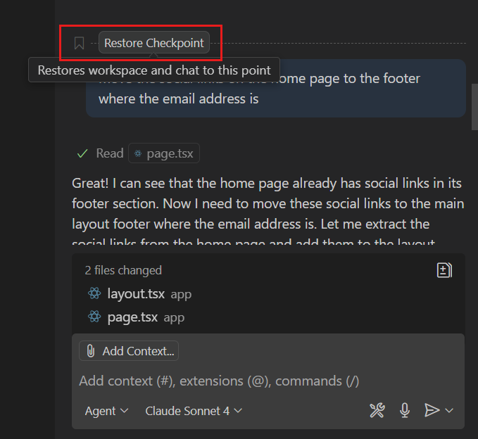
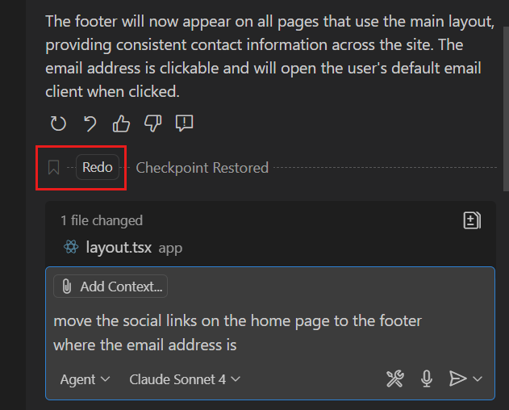
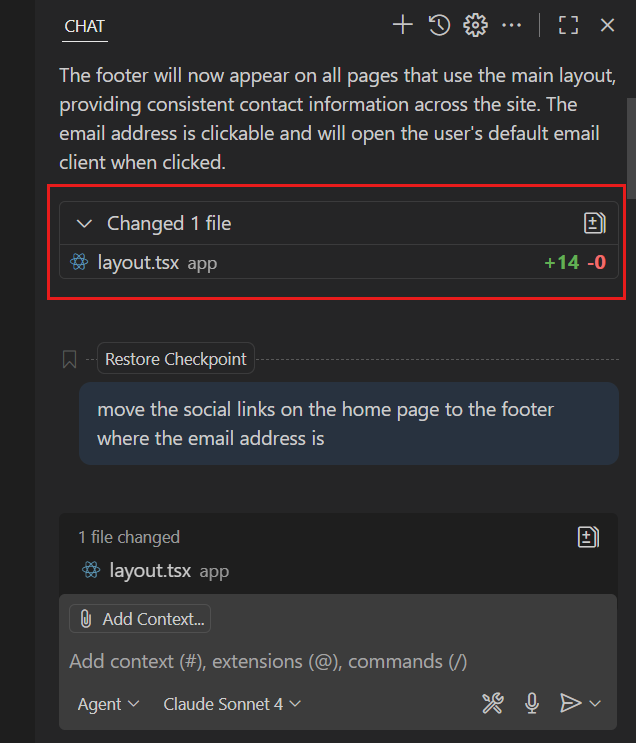

# Kontrol noktaları ve istek düzenleme ile değişiklikleri geri alın

Visual Studio Code'daki chat oturumu çalışma alanınızdaki bir veya daha fazla dosyada değişikliklere neden olabilir. VS Code bu değişiklikleri geri almanın veya revize etmenin iki yolunu sunar:

* **Önceki bir isteği düzenleyin**: zaten gönderdiğiniz bir istemi değiştirin. VS Code o istek ve ardından gelen tüm isteklerin yaptığı değişiklikleri geri alır, sonra düzenlenen istemi yeniden gönderir. Bir isteği yeniden ifade edip farklı sonuçlar almak istediğinizde kullanın.
* **Kontrol noktasına geri yükleyin**: tüm dosya değişikliklerini konuşmadaki belirli bir noktaya geri alın. İstemlerinizi değiştirmeden bilinen iyi bir duruma dönmek istediğinizde kullanın.

Her iki özellik de tek tek düzenlemeleri kabul ettiğiniz veya reddettiğiniz [inceleme iş akışı](/docs/copilot/chat/review-code-edits.md) ile tamamlar. Kontrol noktaları ve düzenleme toplu değişiklikleri bir seferde geri almak istediğinizde kullanılır.

## Önceki chat isteğini düzenleyin

Konuşma geçmişinizdeki her chat isteği düzenlenebilir. Önceki bir chat isteğini düzenlediğinizde düzenlenen istek dil modeline yeni istek olarak gönderilir ve orijinal istek ile ardından gelen isteklerin yaptığı tüm dosya değişiklikleri geri alınır.

Önceki bir chat isteğini düzenlemek için Chat görünümünde değiştirmek istediğiniz isteği seçin ve ardından yeniden gönderin. Düzenleme deneyimini `setting(chat.editRequests)` ayarıyla yapılandırabilir veya devre dışı bırakabilirsiniz.

<video src="../images/chat-checkpoints/chat-edit-request.mp4" title="Video showing the editing of a previous chat request in the Chat view." loop controls muted></video>

## Dosya değişikliklerini geri almak için kontrol noktaları kullanın

Chat kontrol noktaları çalışma alanınızın durumunu geçmişteki bir noktaya geri yükleme yolunu sağlar; chat etkileşimleri birden fazla dosyada değişikliklere neden olduğunda kullanışlıdır.

Kontrol noktaları etkinleştirildiğinde VS Code her chat isteği işlenmeden önce etkilenen dosyaların anlık görüntüsünü otomatik oluşturur. Bu, konuşmanızdaki her chat isteğinin geri yükleyebileceğiniz karşılık gelen kontrol noktası olduğu anlamına gelir.

Kontrol noktalarını etkinleştirmek için `setting(chat.checkpoints.enabled)` ayarını yapılandırın.

### Kontrol noktasına geri yükleme

Kontrol noktasına geri yüklediğinizde VS Code çalışma alanını o kontrol noktası anındaki duruma geri alır. Bu, o kontrol noktasından _sonra_ dosyalara yapılan _tüm_ değişikliklerin geri alınacağı anlamına gelir.

Çalışma alanınızı önceki kontrol noktasına geri yüklemek için:

1. Chat görünümünde chat oturumundaki önceki chat isteğine gidin.

1. Chat isteğinin üzerine gelin ve **Restore Checkpoint** seçin.

    

1. Kontrol noktasına geri yüklemek ve o noktadan sonra yapılan tüm dosya değişikliklerini geri almak istediğinizi onaylayın.

    Chat isteğinin konuşma geçmişinden kaldırıldığını ve çalışma alanı dosyalarının kontrol noktası anındaki durumuna geri yüklendiğini fark edin.

### Geri yükledikten sonra yeniden yapma

Önceki kontrol noktasına geri yükledikten sonra geri alınan değişiklikleri yeniden yapabilirsiniz. Yanlışlıkla kontrol noktasına geri yüklediyseniz kullanışlı olabilir.

Kontrol noktasına geri yükledikten sonra değişiklikleri yeniden yapmak için Chat görünümünde **Redo** seçin.

### Kontrol noktalarındaki dosya değişikliklerini görüntüleme

Her chat isteğinin etkisini anlamanıza ve hangi kontrol noktasına geri yükleneceğinize karar vermeyi kolaylaştırmak için `setting(chat.checkpoints.showFileChanges)` ayarını etkinleştirin. Bu her chat isteğinin sonunda değiştirilen dosyaların listesini ve her dosyada eklenen ve kaldırılan satır sayısını gösterir.

### Kontrol noktasından çatallama

O noktaya kadar olan konuşmayı içeren yeni, bağımsız oturum oluşturmak için kontrol noktasından konuşmayı çatallayabilirsiniz. Alternatif yaklaşım keşfederken orijinal konuşmayı korumak istediğinizde kullanışlıdır.

Kontrol noktasından çatallamak için chat isteğinin üzerine gelin ve **Fork Conversation** düğmesini seçin. [Chat oturumlarını çatallama](/docs/copilot/chat/chat-sessions.md#fork-a-chat-session) hakkında daha fazla bilgi edinin.

## Sıkça sorulan sorular

### Kontrol noktaları Git sürüm kontrolünün yerini alır mı?

Hayır. Kontrol noktaları chat oturumu içinde hızlı yineleme için tasarlanmıştır ve geçicidir. Git'i tamamlar ancak yerini almaz. Kalıcı sürüm kontrolü ve işbirliği için Git kullanın. Kontrol noktaları etkin chat oturumları sırasında deneme için idealdir.

## İlgili kaynaklar

* [AI ile üretilen kod düzenlemelerini inceleyin](/docs/copilot/chat/review-code-edits.md)
* [Chat oturumları](/docs/copilot/chat/chat-sessions.md)
* [Chat genel bakış](/docs/copilot/chat/copilot-chat.md)
