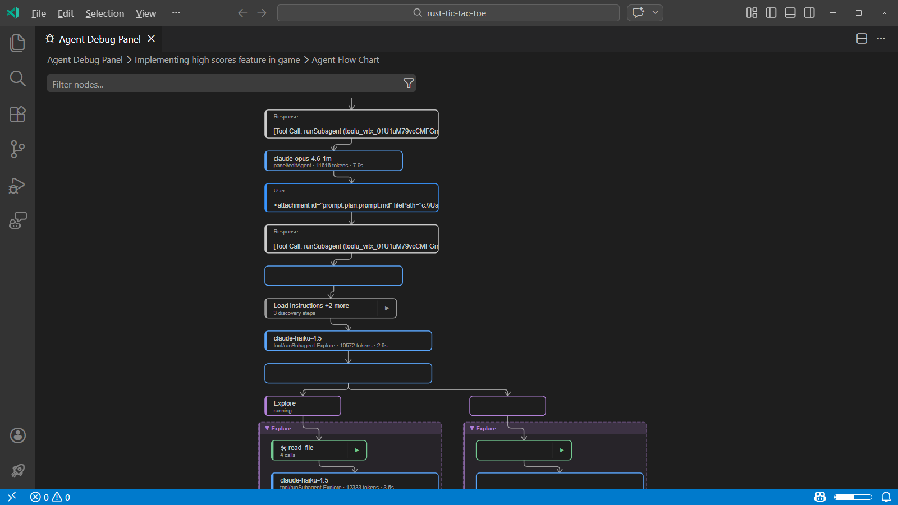
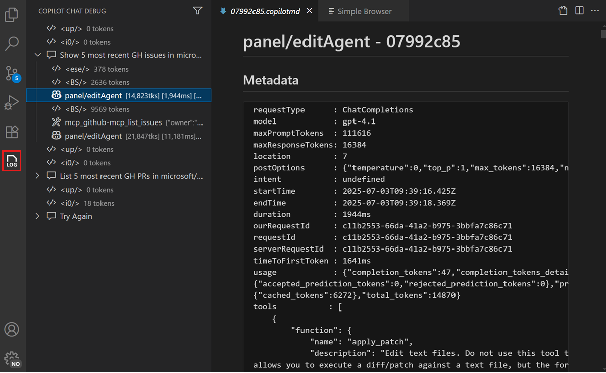

# Chat etkileşimlerinde hata ayıklama

Visual Studio Code AI'ya istem gönderdiğinizde ne olduğunu anlamanıza yardımcı olacak araçlar sunar. Bu araçları ajanların prompt dosyalarını nasıl keşfettiğini, araçları nasıl çağırdığını, dil modeli istekleri yaptığını ve yanıtlar ürettiğini incelemek için kullanın.

VS Code iki tamamlayıcı hata ayıklama aracı sunar:

* **Agent Logs** (Önizleme) chat oturumu sırasında olan her şeyin kronolojik olay günlüğünü gösterir; araç çağrıları, LLM istekleri, prompt dosyası keşfi ve hatalar dahil.
* **Chat Debug görünümü** her LLM isteğinin ve yanıtının ham detaylarını gösterir; tam sistem istemi, kullanıcı istemi, bağlam ve araç çağrısı yükleri dahil.

## Agent Debug paneli

> [!NOTE]
> Agent Debug paneli şu anda önizlemededir.

Agent Debug paneli bir istem gönderdiğinizde ne olduğunu anlamak için birincil araçtır. Chat oturumu sırasında ajan etkileşimlerinin kronolojik olay günlüğünü gösterir; [özel ajanlar](/docs/copilot/agents/local-agents.md) ve orkestre alt ajan iş akışlarında hata ayıklarken özellikle kullanışlıdır.

### Agent Debug panelini açın

Agent Debug panelini açmak için Chat görünümünde dişli simgesini seçin ve **Show Agent Logs** seçin.

Agent Debug paneli oturum özetiyle başlar; toplam araç çağrıları, token kullanımı, hata sayısı ve genel süre gibi toplu istatistikleri gösterir.

Özetin altında iki görünüm arasında geçiş yapabilirsiniz:

* **View Logs**: oturum sırasındaki olayların kronolojik listesi. Düz liste ile olayları alt ajana göre gruplayan ağaç görünümü arasında geçiş yapabilirsiniz. Belirli olay türlerine odaklanmak için kategori filtrelerini kullanın:

    

    | Kategori | Gösterdiği |
    |---|---|
    | **Chat özelleştirmeleri** | Prompt dosyası ve talimat dosyası keşfi; hangi dosyaların yüklendiği, atlandığı veya doğrulamada başarısız olduğu dahil. |
    | **Araç çağrıları** | Araç adı, argümanlar, süre, sonuç özeti ve çağrı başarısız olduysa hata detaylarıyla her araç çağrısı. |
    | **LLM model dönüşleri** | Token kullanımı (toplam ve önbelleğe alınmış) ve istek süresiyle dil modeli istekleri. |
    | **Alt ajan çağrıları** | Ajanların ne zaman başladığı, bittiği veya alt ajanlara devrettiği gibi ajan döngüsü yaşam döngüsü olayları. |

* **Agent Flow Chart**: oturum sırasında ajanlar ve alt ajanlar arasındaki etkileşimleri görselleştiren akış şeması.

    

    Akış şemasında panoramik ve yakınlaştırma yapabilir ve o olayla ilgili detayları görmek için akış şemasındaki herhangi bir düğümü seçebilirsiniz.

> [!NOTE]
> Agent Debug paneli şu anda yalnızca yerel chat oturumları için mevcuttur. Günlük verileri kalıcı değildir; yalnızca mevcut VS Code oturumunuzdaki chat oturumları için günlükleri görüntüleyebilirsiniz.

## Chat Debug görünümü

Chat Debug görünümü her AI isteğinin ve yanıtının ham detaylarını gösterir. Dil modeline gönderilen ve alınan tam sistem istemi, kullanıcı istemi, bağlam veya araç yanıt yüklerini incelemek gerektiğinde kullanın.

### Chat Debug görünümünü açın

Chat Debug görünümünü açmak için:

* Chat görünümünde taşma menüsünü seçin ve **Show Chat Debug View** seçin.
* Komut Paleti'nden **Developer: Show Chat Debug View** komutunu çalıştırın.

### Hata ayıklama çıktısını okuyun

Chat Debug görünümündeki her etkileşim genişletilebilir bölümler içerir:

| Bölüm | Gösterdiği | Bakılacaklar |
|---|---|---|
| **Sistem istemi** | AI'ın davranışını, yeteneklerini ve kısıtlamalarını tanımlayan talimatlar. | Özel talimatların veya ajan açıklamalarının doğru göründüğünü doğrulayın. |
| **Kullanıcı istemi** | Modele gönderilen isteminizin tam metni. | İsteminizin beklenen şekilde gönderildiğini doğrulayın; #-bahsetmelerin gerçek içeriğe çözüldüğü dahil. |
| **Bağlam** | İsteğe eklenen dosyalar, semboller ve diğer bağlam öğeleri. | Beklenen dosya ve bağlamın göründüğünü kontrol edin. Dosya eksikse indekslenmemiş veya bağlam penceresi dolu olabilir. |
| **Yanıt** | Modelin yanıtının tam metni; akıl yürütme dahil. | Modelin isteğinizi nasıl yorumladığını anlamak için ham yanıtı inceleyin. |
| **Araç yanıtları** | İstek sırasında çağrılan araçların girdi ve çıktıları. | Araçların doğru girdiler aldığını ve beklenen çıktıları döndürdüğünü doğrulayın. MCP sunucularında hata ayıklama için kullanışlı. |

Her bölümü tam detayları görmek için genişletebilirsiniz. Tek bir isteğin parçası olarak birden fazla aracın çağrılabileceği [ajanları kullanırken](/docs/copilot/agents/local-agents.md) özellikle kullanışlıdır.

## Yaygın sorun giderme senaryoları

### AI çalışma alanı dosyalarınızı yok sayıyor

AI kod tabanınıza referans vermek yerine genel bilgiyle yanıt veriyorsa:

1. Agent Logs'u açın ve çalışma alanı dosyalarının indekslendiğini doğrulamak için **Discovery** olaylarını kontrol edin.
1. Chat Debug görünümünü açın ve çalışma alanı dosyalarının bağlamda göründüğünü doğrulamak için **Context** bölümünü kontrol edin. Görünmüyorsa [çalışma alanı indekslemesinin](/docs/copilot/reference/workspace-context.md) etkin olduğunu kontrol edin.
1. Doğru dosyaların dahil edilmesini sağlamak için açık `#`-bahsetmeler (örneğin `#file` veya `#codebase`) eklemeyi deneyin. [Bağlam yönetimi](/docs/copilot/chat/copilot-chat-context.md) hakkında daha fazla bilgi edinin.

### MCP aracı çağrılmıyor

AI beklenen aracı çağırmıyorsa:

1. Agent Logs'u açın ve aracın çağrılıp çağrılmadığını veya atlanıp atlanmadığını görmek için **Tool calls** filtresini kontrol edin.
1. Chat Debug görünümünü açın ve aracın mevcut araçlarda listelendiğini doğrulamak için **System prompt** bölümünü kontrol edin.
1. Araç eksikse MCP sunucusunun çalıştığını ve doğru yapılandırıldığını doğrulayın.
1. İsteminizde `#tool-name` ile aracı açıkça bahsetmeyi deneyin.

### AI yanıtı eksik veya kesik

Yanıt kesilmiş görünüyorsa:

1. Token kullanımını incelemek için Agent Logs'ta **LLM requests** olaylarını kontrol edin.
1. Dolu bağlam penceresi modelin yanıtını kesmesine neden olabilir. Bağlamı sıfırlamak için [yeni chat oturumu](/docs/copilot/chat/chat-sessions.md) başlatın.

### Prompt dosyası uygulanmıyor

Özel talimat veya prompt dosyası etkili görünmüyorsa:

1. Agent Logs'u açın ve dosyanın yüklenip yüklenmediğini, atlanıp atlanmadığını veya doğrulamada başarısız olup olmadığını görmek için **Discovery** olaylarını kontrol edin.
1. Dosya konumunun ve `applyTo` deseninin mevcut bağlamla eşleştiğini doğrulayın.
1. Hata detayları için [chat özelleştirme tanı teşhislerini](/docs/copilot/troubleshooting.md#chat-customization-diagnostics) kontrol edin.

## İlgili kaynaklar

* [Chat genel bakış](/docs/copilot/chat/copilot-chat.md)
* [AI için bağlam yönetimi](/docs/copilot/chat/copilot-chat-context.md)
* [VS Code'da AI sorun giderme](/docs/copilot/troubleshooting.md)
* [VS Code'da AI kullanmanın güvenlik değerlendirmeleri](/docs/copilot/security.md)
