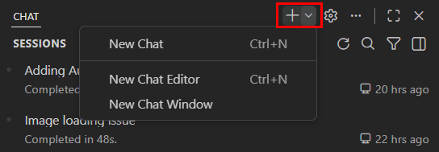
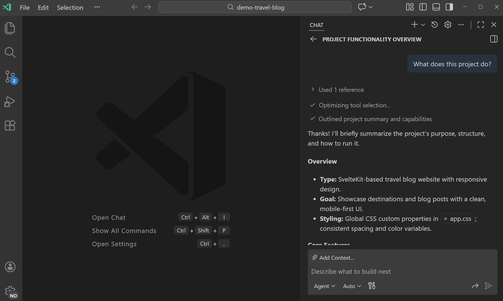
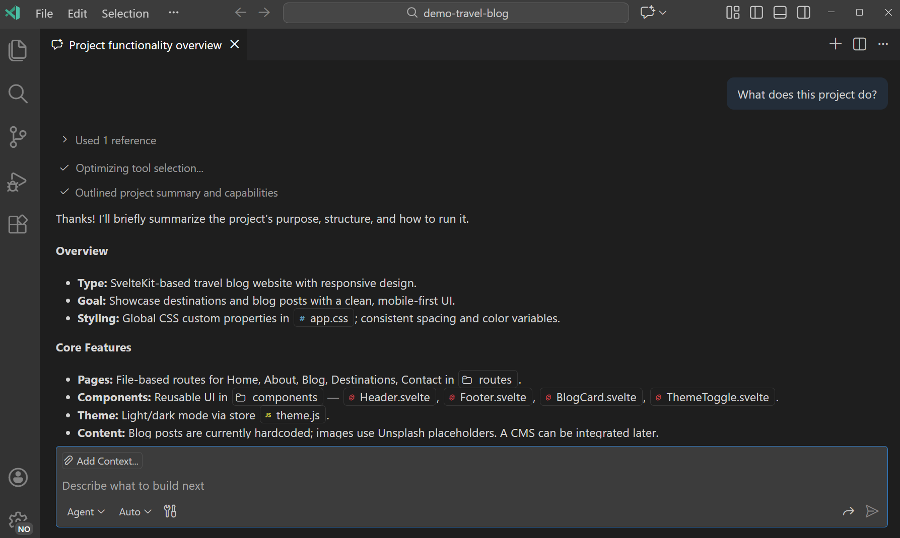
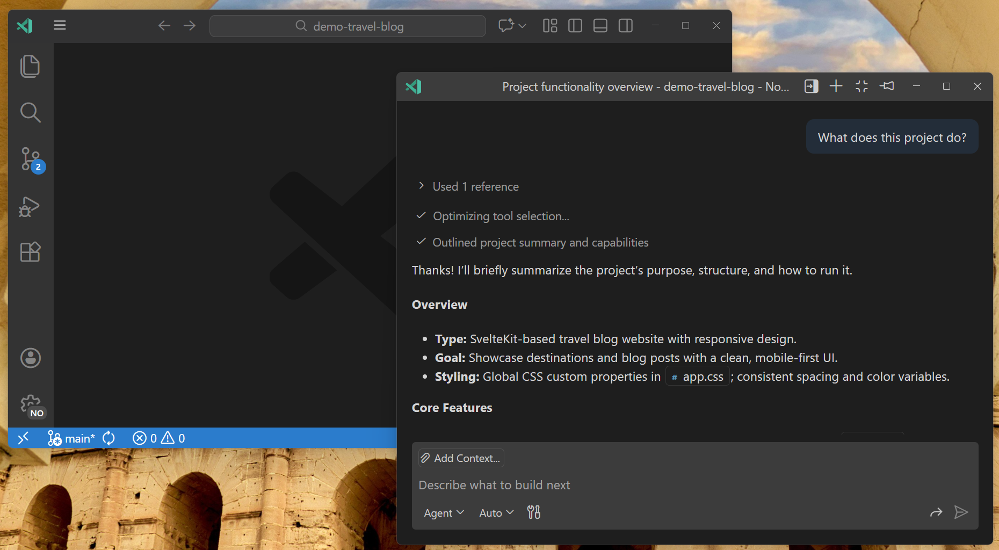
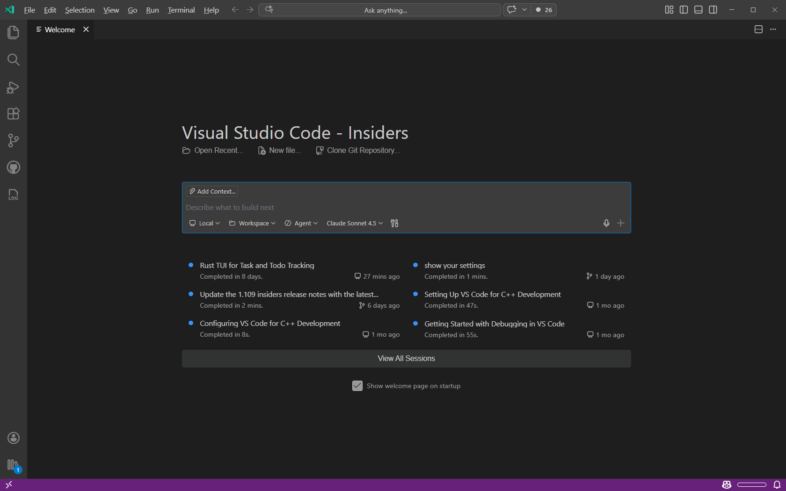
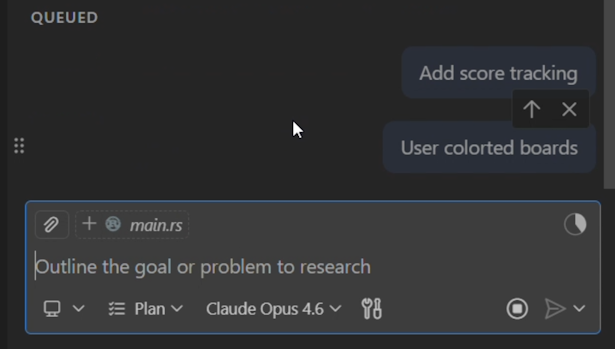

# Chat oturumlarını yönetin

Konuşma tabanlı AI etkileşimleri için Visual Studio Code'da chat kullanın. Bir chat oturumu sizin ve AI arasındaki istem ve yanıt dizisinden ve kodunuz veya dosyalarınızdan ilgili bağlamdan oluşur. Bu makale chat oturumları oluşturmayı ve yönetmeyi, chat oturumlarını dışa aktarmayı ve chat oturum geçmişini görüntülemeyi açıklar.

VS Code'da yerel, arka plan ve bulut ajanlarını deneyimlemek için uygulamalı öğreticiyi takip edin.

* [Öğreticiyi başlat](/docs/copilot/agents/agents-tutorial.md)

## Chat oturumu nedir?

Chat oturumu tüm istemler, yanıtlar ve bağlam dahil AI ile tek bir konuşmadır. Her oturum bağımsızdır; bir oturumdaki bağlam diğerine taşınmaz.

Chat oturumları hakkında bilmeniz gerekenler:

* **Bağlam penceresi**: sohbet ettikçe oturum bağlam biriktirir. Yeni oturum oluşturmak geçmişi temizler ve taze bağlam penceresi başlatır. [Bağlam penceresi kullanımını](/docs/copilot/chat/copilot-chat-context.md#monitor-context-window-usage) chat giriş kutusunda izleyebilirsiniz.
* **Kontrol noktaları**: herhangi bir anda önceki bir duruma geri dönebilir veya yönü değiştirmek için önceki bir istemi düzenleyebilirsiniz. [Kontrol noktaları](/docs/copilot/chat/chat-checkpoints.md) hakkında daha fazla bilgi edinin.
* **Oturum türleri**: oturumlar yerel, arka planda veya bulutta çalışabilir. [Ajanlar](/docs/copilot/agents/overview.md) hakkında daha fazla bilgi edinin.
* **Birden fazla oturum**: oturum türünden bağımsız olarak her biri farklı göreve odaklanan paralel birden fazla oturum çalıştırabilirsiniz. Ajan oturumları görünümüyle oturumları izleyebilir ve aralarında geçiş yapabilirsiniz. [Ajan oturumlarını yönetme](/docs/copilot/agents/overview.md#agent-sessions-list) hakkında daha fazla bilgi edinin.

> [!TIP]
> Konuyu değiştirmek istediğinizde AI'ın daha ilgili yanıtlar vermesine yardımcı olmak için yeni chat oturumu başlatın.

## Yeni chat oturumu başlatın

Çalışma tercihinize göre chat oturumlarını farklı görünümlerde açabilirsiniz. Herhangi bir anda paralel birden fazla oturum çalıştırabilirsiniz; her biri farklı göreve odaklanır.

Yeni chat oturumu başlatmak için Chat görünümündeki **New Chat (+)** düğmesini kullanın veya `kb(workbench.action.chat.newChat)` klavye kısayolunu kullanın.

Oturumun nerede açılacağını seçin:

* **Kenar çubuğu** (varsayılan): **New Chat (+)** > **New Chat** seçin veya **Chat: New Chat** komutunu çalıştırın. Chat'i kodunuzun yanında görünür tutmak için idealdir.

    

* **Editör sekmesi**: **New Chat (+)** > **New Chat Editor** seçin veya **Chat: New Chat Editor** komutunu çalıştırın. Chat'e daha fazla alan vermek veya oturumları yan yana karşılaştırmak için idealdir.

    

* **Ayrı pencere**: **New Chat (+)** > **New Chat Window** seçin veya **Chat: New Chat Window** komutunu çalıştırın. Çok monitör kurulumları için idealdir.

    

VS Code AI'ın nerede çalıştığını belirleyen farklı oturum türlerini (yerel, arka plan, bulut ve üçüncü taraf) da destekler. [Ajan türleri ve oturum yönetimi](/docs/copilot/agents/overview.md) hakkında daha fazla bilgi edinin.

## Chat oturumunu farklı görünüme taşıyın

Mevcut bir chat oturumunu istediğiniz zaman görünümler arasında taşıyabilirsiniz. Tam konuşma geçmişi ve bağlam korunur.

Chat görünümünde, editör sekmesinde veya chat penceresinde `...` menüsünü seçin ve **Move Chat into...** seçeneklerinden birini seçin.

Alternatif olarak Komut Paleti'nden şu komutlardan herhangi birini seçin:

* **Chat: Move Chat into Editor Area**
* **Chat: Move Chat into New Window**
* **Chat: Move Chat into Side Bar**

## Chat oturumunu çatallayın

Chat oturumunu çatallamak orijinal oturumdan konuşma geçmişini devralan yeni, bağımsız bir oturum oluşturur. Çatallanmış oturum orijinalden tamamen ayrıdır; bir oturumdaki değişiklikler diğerini etkilemez. Yeni oturum başlığı tanımanıza yardımcı olmak için "Forked:" ile ön eklenir.

Alternatif yaklaşım keşfetmek, yan sorusu sormak veya uzun konuşmayı orijinal bağlamı kaybetmeden farklı yönde dallandırmak istediğinizde çatallama kullanışlıdır.

Chat oturumunu çatallamanın iki yolu vardır:

* **Tüm oturumu çatallayın**: chat giriş kutusuna `/fork` yazın ve `kbstyle(Enter)` tuşuna basın. Mevcut oturumdan kopyalanan tam konuşma geçmişiyle yeni oturum açılır.

* **Kontrol noktasından çatallayın**: konuşmadaki bir chat isteğinin üzerine gelin ve **Fork Conversation** düğmesini seçin. Yalnızca o kontrol noktasına kadar olan istekleri içeren yeni oturum açılır.

    

## Oturum geçmişi

Chat görünümü nerede çalışırlarsa çalışsınlar son ve etkin chat oturumlarınızı gösterir. Listeden bir oturum seçtiğinizde o oturum için tam konuşma geçmişini ve bağlamı görebilirsiniz. O oturumda konuşmaya devam etmek için yeni istemler gönderin.

Aynı anda birden fazla oturumu etkin tutup aralarında geçiş yaparak farklı konuşmaları karşılaştırabilir veya paralel birden fazla görev üzerinde çalışabilirsiniz.

Oturum listesi mevcut çalışma alanınıza kapsamlıdır. Açık çalışma alanınız yoksa liste tüm çalışma alanlarınızdaki oturumları gösterir.

[Oturumları görüntüleme ve yönetme](/docs/copilot/agents/overview.md#agent-sessions-list) hakkında daha fazla bilgi edinin.

### VS Code karşılama sayfası

VS Code karşılama sayfası chat oturumlarıyla çalışmak için başlangıç deneyiminiz olarak işlev görebilir. Son chat oturumlarınıza hızlı erişim, yeni görevler başlatmak için gömülü chat bileşeni ve yaygın görevler için hızlı eylemler sunar.

VS Code karşılama sayfasını başlangıç deneyiminiz olarak yapılandırmak için `setting(workbench.startupEditor)` ayarını `agentSessionsWelcomePage` olarak ayarlayın.

## İstek çalışırken mesaj gönderme

Yanıtın bitmesini beklemeden bir sonraki mesajınızı gönderebilirsiniz. Bir istek devam ederken **Send** düğmesi yeni mesajın nasıl işleneceğine dair üç seçenek sunan bir açılır menüye dönüşür.

* **Add to Queue**: mesajınız bekler ve mevcut yanıt tamamlandıktan sonra otomatik gönderilir. Mevcut yanıt kesintisiz tamamlanır.
* **Steer with Message**: mevcut isteğe mevcut araç yürütmesini bitirdikten sonra vazgeçmesini işaret eder. Mevcut yanıt durur ve yeni mesajınız hemen işlenir. Ajan yanlış yöne giderken yönlendirmek için kullanın.
* **Stop and Send**: mevcut isteği tamamen iptal eder ve yeni mesajınızı hemen gönderir.

**Send** düğmesi için varsayılan eylem yapılandırılabilir. `setting(chat.requestQueuing.defaultAction)` ile bunu `steer` (varsayılan) veya `queue` olarak ayarlayın.

### Bekleyen mesajları yeniden sıralayın

Bekleyen birden fazla mesajınız (sıraya alınmış veya yönlendirilmiş) olduğunda işlenme sırasını değiştirmek için sürükleyip bırakabilirsiniz. Aynı türde birden fazla mesaj beklediğinde hover'da sürükleme tutacağı görünür.

## Chat yanıtları hakkında bildirim alın

Başka bir pencerede veya uygulamada çalışırken VS Code önemli chat etkinlikleri hakkında bilgilendirmek için size OS bildirimleri gönderebilir; böylece sürekli kontrol etmeniz gerekmez.

Chat yanıtı alındığında OS bildirimi ne zaman alacağınızı yapılandırmak için `setting(chat.notifyWindowOnResponseReceived)` ayarını kullanın. Bildirim yanıtın önizlemesini içerir ve seçtiğinizde chat oturumuna odaklanır.

Ajan devam etmek için girdinize veya onayınıza ihtiyaç duyduğunda OS bildirimi ne zaman alacağınızı yapılandırmak için `setting(chat.notifyWindowOnConfirmation)` ayarını kullanın.

Her iki ayarın da üç olası değeri vardır:

* `off`: bildirimleri asla gösterme
* `windowNotFocused` (varsayılan): VS Code penceresi odakta değilken yalnızca bildirimleri göster
* `always`: VS Code penceresi odaktayken bile bildirimleri göster

> [!TIP]
> Arka planda uzun ajan görevleri çalıştırırken VS Code'un diğer bölümlerinde çalışırken chat etkinliğinden haberdar olmak istiyorsanız değeri `always` olarak ayarlayın.

## Chat oturumunda istemler arasında gezinme

Chat oturumunda istemler arasında gezinmek için şu klavye kısayollarını kullanın:

* `kb(workbench.action.chat.previousUserPrompt)`: Chat oturumundaki önceki isteme git.
* `kb(workbench.action.chat.nextUserPrompt)`: Chat oturumundaki sonraki isteme git.
* `kb(workbench.action.chat.previousCodeBlock)`: Chat oturumundaki önceki kod bloğuna git.
* `kb(workbench.action.chat.nextCodeBlock)`: Chat oturumundaki sonraki kod bloğuna git.

## Chat oturumlarını kaydedin ve dışa aktarın

Önemli konuşmaları korumak veya benzer görevler için daha sonra yeniden kullanmak üzere chat oturumlarını kaydedebilirsiniz.

### Chat oturumunu JSON dosyası olarak dışa aktarın

Daha sonra referans için veya başkalarıyla paylaşmak için kaydetmek üzere chat oturumunu dışa aktarabilirsiniz. Chat oturumunu dışa aktarmak oturumdaki tüm istem ve yanıtları içeren bir JSON dosyası oluşturur.

Chat oturumunu dışa aktarmak için:

1. Dışa aktarmak istediğiniz chat oturumunu Chat görünümünde açın.

1. Komut Paleti'nden (`kb(workbench.action.showCommands)`) **Chat: Export Chat...** komutunu çalıştırın.

1. JSON dosyasını kaydetmek için bir konum seçin.

Alternatif olarak mesaja sağ tıklayıp **Copy** seçerek tek tek istem veya yanıtları panoya kopyalayabilirsiniz. Tüm chat oturumunu Markdown biçiminde kopyalamak için Chat görünümüne sağ tıklayın ve **Copy All** seçin.

### Chat oturumunu yeniden kullanılabilir istem olarak kaydedin

Chat oturumunu benzer görevler için yeniden kullanmak üzere [yeniden kullanılabilir istem](/docs/copilot/customization/prompt-files.md) olarak kaydedebilirsiniz.

Chat oturumunu yeniden kullanılabilir istem olarak kaydetmek için:

1. Kaydetmek istediğiniz chat oturumunu Chat görünümünde açın.

1. Chat giriş kutusuna `/savePrompt` yazın ve Enter tuşuna basın.

    Komut mevcut chat konuşmanızı yer tutuculu şablon halinde genelleştiren yeniden kullanılabilir [prompt dosyası](/docs/copilot/customization/prompt-files.md) olan `.prompt.md` dosyası oluşturur. Prompt dosyalarını farklı projeler veya kod tabanları genelinde aynı tür görevi çalıştırmak için kullanabilirsiniz.

1. Üretilen prompt dosyasını gerektiği gibi inceleyin ve düzenleyin, ardından çalışma alanınıza kaydedin.

## Chat oturumlarını yönetme ipuçları

Chat oturumlarıyla etkili çalışmanıza yardımcı olacak şu ipuçlarını göz önünde bulundurun:

* **Farklı konular için yeni oturum başlatın**: ilgisiz konuşmalardan bağlam taşımaktan kaçınmak için yeni chat oturumu başlatın. Bu daha ilgili yanıtlar almanıza yardımcı olur.

* **Yan yana karşılaştırmalar için editör sekmelerini kullanın**: farklı yaklaşımları veya çözümleri yan yana karşılaştırmak için birden fazla chat oturumunu editör sekmeleri olarak açın.

* **Çok monitör kurulumları için ayrı pencereler kullanın**: chat'i ikincil monitörde ayrı pencerede açarak ana pencerede kod üzerinde çalışırken görünür tutun.

* **Uzak ajanlarla arka plan görevleri**: VS Code'da çalışmaya devam ederken arka planda AI görevleri gerçekleştirmek için uzak kodlama ajanlarını kullanın.

* **Etkileşimli ajan oturumları**: gerçek zamanlı girdi ve geri bildirim gerektiren etkileşimli görevler için yerel ajan oturumlarını kullanın.

## İlgili kaynaklar

* [Chat genel bakış](/docs/copilot/chat/copilot-chat.md)
* [AI için bağlam yönetimi](/docs/copilot/chat/copilot-chat-context.md)
* [Kontrol noktalarıyla değişiklikleri geri alın](/docs/copilot/chat/chat-checkpoints.md)
* [AI ile üretilen kod düzenlemelerini inceleyin](/docs/copilot/chat/review-code-edits.md)
