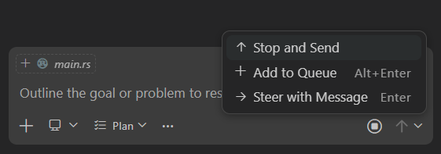
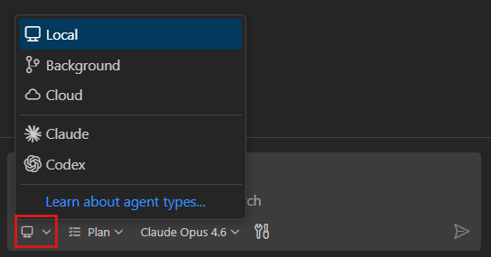
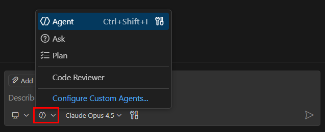
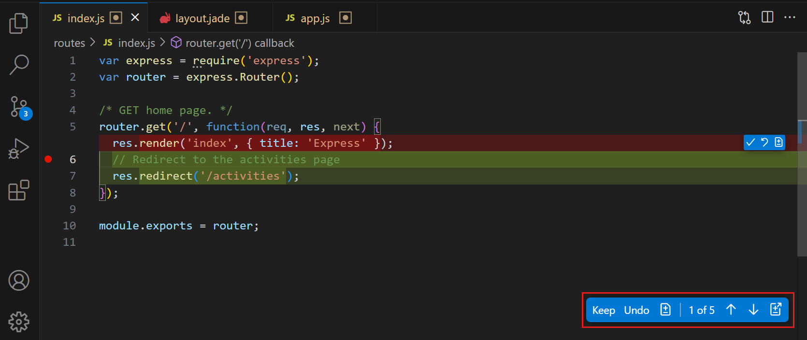

# Chat genel bakış

Visual Studio Code'daki Chat, AI destekli kodlama yardımı için doğal dil kullanmanızı sağlar. Kodunuz hakkında soru sorun, karmaşık mantığı anlamada yardım alın, yeni özellikler oluşturun, hataları düzeltin ve daha fazlası, hepsi sohbet arayüzü üzerinden. Bu makale chat arayüzlerine genel bakış, chat oturumunu yapılandırma, bağlam ekleme, etkili istemler yazma ve AI ile üretilen değişiklikleri inceleme sunar.

<div class="docs-action" data-show-in-doc="false" data-show-in-sidebar="true" title="Get started with agents">
VS Code'da yerel, arka plan ve bulut ajanlarını deneyimlemek için uygulamalı öğreticiyi takip edin.

* [Öğreticiyi başlat](/docs/copilot/agents/agents-tutorial.md)

</div>

## Önkoşullar

* [GitHub Copilot](/docs/copilot/setup.md) erişimi. Aboneliğiniz yoksa [Copilot Ücretsiz planına](https://github.com/github-copilot/signup) kaydolarak Copilot'u ücretsiz kullanabilirsiniz.

## VS Code'da chat'e erişin

VS Code AI sohbet konuşması başlatmak için farklı iş akışlarına optimize edilmiş birden fazla yol sunar. VS Code başlık çubuğundaki **Chat** menüsünü veya karşılık gelen klavye kısayollarını kullanın.


| Arayüz | Kısayol | En iyi kullanım | Daha fazla bilgi |
|---|---|---|---|
| **Chat görünümü** | `kb(workbench.action.chat.open)` | Çok turlu konuşmalar, ajantik iş akışları, çok dosyalı düzenlemeler. [Editör sekmesi veya ayrı pencere](/docs/copilot/chat/chat-sessions.md#start-a-new-chat-session) olarak da mevcut. | [Chat oturumları](/docs/copilot/chat/chat-sessions.md) |
| **Inline chat** | `kb(inlineChat.start)` | Yerinde kod düzenlemeleri ve terminal komut önerileri. | [Inline chat](/docs/copilot/chat/inline-chat.md) |
| **Quick chat** | `kb(workbench.action.quickchat.toggle)` | Mevcut görünümünüzden ayrılmadan hızlı sorular. Editörün üstünde hafif bir chat paneli açar. | [Quick Chat](/docs/copilot/chat/inline-chat.md#use-quick-chat) |
| **Komut satırı** | `code chat` | VS Code dışından chat başlatma. | [CLI dokümantasyonu](/docs/configure/command-line.md#start-chat-from-the-command-line) |

## İlk isteminizi gönderin

Chat'in nasıl çalıştığını görmek için temel bir uygulama oluşturmayı deneyin:

1. `kb(workbench.action.chat.open)` tuşuna basarak veya VS Code başlık çubuğundan **Chat** seçerek Chat görünümünü açın.

1. Ajan seçiciden bir ajan seçin. Örneğin chat'in ne yapılması gerektiğini otonom belirlemesi ve çalışma alanınızda değişiklik yapması için **Agent** seçin. [Yerleşik ajanlar](/docs/copilot/agents/overview.md) hakkında daha fazla bilgi edinin.

1. Aşağıdaki istemi chat giriş alanına yazın ve göndermek için `kb(workbench.action.chat.submit)` tuşuna basın:

    ```prompt
    Create a basic calculator app with HTML, CSS, and JavaScript
    ```

    Ajan değişiklikleri doğrudan çalışma alanınıza uygular ve örneğin bağımlılıkları yüklemek veya derleme betiklerini çalıştırmak için terminal komutları da çalıştırabilir.

1. Editörde [önerilen değişiklikleri inceleyin](/docs/copilot/chat/review-code-edits.md) ve korumayı veya atmayı seçin.

> [!TIP]
> Tam uygulamalı adım adım rehber için [ajanlar öğreticisini](/docs/copilot/agents/agents-tutorial.md) takip edin.

## İstek çalışırken mesaj gönderme

> [!NOTE]
> Mesaj yönlendirme ve sıraya alma deneysel özelliklerdir.

Yanıtın bitmesini beklemeden bir sonraki mesajınızı gönderebilirsiniz. Bir istek devam ederken **Send** düğmesindeki açılır menüden yeni mesajın nasıl işleneceğini seçin:

* **Add to Queue**: mesaj bekler ve mevcut yanıt tamamlandıktan sonra otomatik gönderilir.
* **Steer with Message**: mevcut istek vazgeçer ve yeni mesajınız hemen işlenir.
* **Stop and Send**: mevcut isteği iptal eder ve yeni mesajınızı hemen gönderir.



İstek çalışırken mesaj gönderme hakkında daha fazla bilgi için [sıraya ekleme, yönlendirme veya durdurup gönderme](/docs/copilot/chat/chat-sessions.md#send-messages-while-a-request-is-running) sayfasına bakın.

## Chat oturumunuzu yapılandırın

Chat oturumu başlattığınızda veya ayarladığınızda AI'ın nasıl yanıt vereceğini şekillendiren üç seçim vardır: hangi ajan kullanılacağı, oturumun nerede çalışacağı ve hangi dil modelinin güç vereceği.

### Nerede çalışacağını seçin

Ajan oturumları iş akışınıza uyacak şekilde farklı ortamlarda çalışabilir. Chat görünümündeki oturum türü açılır menüsünden oturum türünü seçin.



| Oturum türü | Açıklama |
|---|---|
| **Local** | Makinenizde VS Code'da etkileşimli çalışır. Anında geri bildirim gerektiren keşif görevleri için idealdir. |
| **Background** | CLI üzerinden makinenizde otonom çalışır. Arka planda çalıştırmak istediğiniz iyi tanımlanmış görevler için idealdir. |
| **Cloud** | Uzak altyapıda çalışır ve pull request açar. Ekip işbirliği ve iyi tanımlanmış görevler için idealdir. |
| **Third-party** | Anthropic veya OpenAI gibi harici sağlayıcılardan ajanlar kullanır. |

Konuşma ortasında bir türden diğerine oturum devredebilirsiniz; tam konuşma geçmişi aktarılır. [Ajan türleri](/docs/copilot/agents/overview.md#types-of-agents) ve [oturumları devretme](/docs/copilot/agents/overview.md#hand-off-a-session-to-another-agent) hakkında daha fazla bilgi edinin.

### Ajan seçin

Ajanlar chat'in belirli görevler için optimize edilmiş farklı rol veya kişilik üstlenmesini sağlar. Chat görünümündeki ajanlar açılır menüsünden bir ajan seçin. Oturum sırasında istediğiniz zaman ajanlar arasında geçiş yapabilirsiniz.



VS Code üç yerleşik ajan sunar:

* **Agent**: dosyalar genelinde değişiklikleri otonom planlar ve uygular, terminal komutları çalıştırır ve araçları çağırır.
* **Plan**: herhangi bir kod yazmadan önce yapılandırılmış, adım adım uygulama planı oluşturur. Doğru göründüğünde planı uygulama ajanına devreder.
* **Ask**: dosya değişikliği yapmadan kodlama kavramları, kod tabanınız veya VS Code hakkında soruları yanıtlar.

Daha özelleştirilmiş iş akışları için belirli rol, kullanılabilir araçlar ve dil modeli tanımlayan kendi [özel ajanlarınızı](/docs/copilot/customization/custom-agents.md) oluşturun.

[Yerleşik ajanlar ve yetenekleri](/docs/copilot/agents/local-agents.md) hakkında daha fazla bilgi edinin.

### Dil modeli seçin

VS Code farklı dil modelleri sunar; her biri farklı görevlere optimize edilmiştir. Bazı modeller hızlı kodlama görevleri için tasarlanmışken diğerleri karmaşık akıl yürütme ve planlamada üstündür. İhtiyaçlarınıza en uygun modeli seçmek için chat giriş alanındaki model açılır menüsünü kullanın.


Diğer sağlayıcılardan da modeller ekleyip sohbette kullanabilirsiniz. [VS Code'da dil modelleri](/docs/copilot/customization/language-models.md) hakkında daha fazla bilgi edinin.

> [!NOTE]
> Mevcut modellerin listesi Copilot aboneliğinize göre değişebilir ve zamanla güncellenebilir. [Mevcut dil modelleri](https://docs.github.com/en/copilot/using-github-copilot/ai-models/changing-the-ai-model-for-copilot-chat?tool=vscode) hakkında daha fazla bilgi için GitHub Copilot dokümantasyonuna bakın.

## İstemlerinize bağlam ekleyin

Doğru bağlamı sağlamak AI'ın daha ilgili ve doğru yanıtlar üretmesine yardımcı olur.

* **Örtülü bağlam**: VS Code etkin dosyayı, mevcut seçiminizi ve dosya adını otomatik olarak bağlam dahil eder. Ajanları kullandığınızda ajan ek bağlam gerekip gerekmediğini otonom karar verir.

* **`#`-bahsetmeler**: chat girişinde dosyalara (`#file`), klasörlere, sembollere, kod tabanınıza (`#codebase`), terminal çıktısına (`#terminalSelection`) veya `#fetch` ve `#githubRepo` gibi araçlara açıkça referans vermek için `#` yazın.

* **`@`-bahsetmeler**: `@vscode`, `@terminal` veya `@workspace` gibi özelleştirilmiş chat katılımcılarını çağırmak için `@` yazın; her biri kendi alanı için optimize edilmiştir.

* **Vision**: ekran görüntüleri veya UI taslakları gibi görüntüleri isteminize bağlam olarak ekleyin.

* **Tarayıcı öğeleri** (Deneysel): isteminize HTML, CSS ve ekran görüntüsü bağlamı eklemek için [entegre tarayıcıdan](/docs/debugtest/integrated-browser.md) öğeleri seçin.

[AI için bağlam yönetimi](/docs/copilot/chat/copilot-chat-context.md) hakkında daha fazla bilgi edinin.

## Değişiklikleri inceleyin ve yönetin

AI dosyalarınızda değişiklik yaptıktan sonra bunları inceleyin ve kabul edin veya atın.

* **Satır içi diff'leri inceleyin**: uygulanan değişikliklerin satır içi diff'lerini görmek için değiştirilmiş bir dosyayı açın. Düzenlemeler arasında gezinmek ve tek tek değişiklikleri **Keep** veya **Undo** ile incelemek için editör yer paylaşımı kontrollerini kullanın. Daha fazla bilgi için [AI ile üretilen kod düzenlemelerini inceleme](/docs/copilot/chat/review-code-edits.md) sayfasına bakın.

* **Kontrol noktaları kullanın**: VS Code chat etkileşimleri sırasında anahtar noktalarda dosyalarınızın anlık görüntülerini otomatik oluşturabilir; önceki bir duruma geri dönmenizi sağlar. Daha fazla bilgi için [kontrol noktaları ve düzenleme istekleri](/docs/copilot/chat/chat-checkpoints.md) sayfasına bakın.

* **Kabul etmek için stage edin**: Source Control görünümünde değişikliklerinizi stage etmek bekleyen düzenlemeleri otomatik kabul eder. Değişiklikleri atmak bekleyen düzenlemeleri de atar.



## Daha iyi yanıtlar alın

Chat AI yanıtlarının kalitesini ve ilgiselliğini artırmak için birkaç yol sunar:

* **Etkili istemler yazın**: ne istediğinizi belirtin, ilgili dosya ve sembollere referans verin ve yaygın görevler için `/` komutlarını kullanın. [İstem örneklerinden](/docs/copilot/chat/prompt-examples.md) ilham alın veya tam [istem mühendisliği rehberini](/docs/copilot/guides/prompt-engineering-guide.md) inceleyin.

* **AI'ı özelleştirin**: [özel talimatlar](/docs/copilot/customization/custom-instructions.md) ekleyerek, yeniden kullanılabilir [prompt dosyaları](/docs/copilot/customization/prompt-files.md) oluşturarak veya özelleştirilmiş iş akışları için [özel ajanlar](/docs/copilot/customization/custom-agents.md) oluşturarak AI'ın davranışını projenize göre uyarlayın. Örneğin kod kalitesi ve ekibinizin kodlama standartlarına uyum hakkında geri bildirim sağlayan bir "Code Reviewer" ajanı oluşturun.

* **Araçlarla genişletin**: ajana harici hizmetlere, veritabanlarına veya API'lere erişim vermek için [MCP sunucularına](/docs/copilot/customization/mcp-servers.md) bağlanın veya araç katkıda bulunan uzantılar yükleyin.

Daha fazla bilgi için [VS Code'da AI'ı özelleştirme](/docs/copilot/customization/overview.md) sayfasına bakın.

## Chat etkileşimlerinde sorun giderme

Bir istem gönderdiğinizde ne olduğunu incelemek için [Agent Logs ve Chat Debug görünümünü](/docs/copilot/chat/chat-debug-view.md) kullanın. Agent Logs araç çağrıları, LLM istekleri ve prompt dosyası keşfinin kronolojik olay günlüğünü gösterir. Chat Debug görünümü her etkileşim için ham sistem istemi, kullanıcı istemi, bağlam ve araç yüklerini gösterir. Bu araçlar AI'ın belirli bir şekilde neden yanıt verdiğini anlamak veya beklenmeyen sonuçlarda sorun gidermek için faydalıdır.

## İlgili kaynaklar

* [Chat oturumlarını oluşturun ve yönetin](/docs/copilot/chat/chat-sessions.md)

* [İstem örnekleri](/docs/copilot/chat/prompt-examples.md)

* [Ajanlar genel bakış](/docs/copilot/agents/overview.md)
