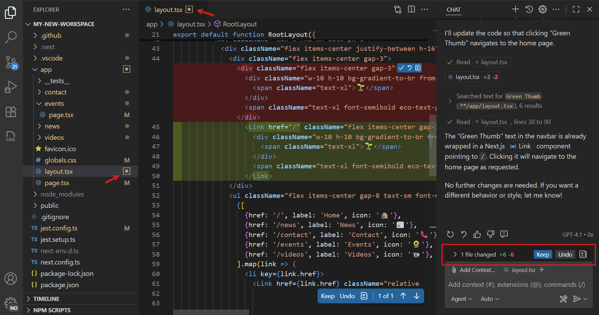

# AI ile üretilen kod düzenlemelerini inceleyin

Visual Studio Code'da chat ile etkileşim kurduğunuzda AI projenizdeki birden fazla dosyada kod düzenlemeleri üretebilir. Bu makale bu AI ile üretilen kod düzenlemelerini inceleme, kabul etme veya atlamayı açıklar.

<div class="docs-action" data-show-in-doc="false" data-show-in-sidebar="true" title="Get started with agents">
VS Code'da yerel, arka plan ve bulut ajanlarını deneyimlemek için uygulamalı öğreticiyi takip edin.

* [Öğreticiyi başlat](/docs/copilot/agents/agents-tutorial.md)

</div>

## Bekleyen değişiklikler

AI dosyalarınızda değişiklik yaptıktan sonra bunlar doğrudan uygulanır ve diske kaydedilir. VS Code hangi dosyalarda bekleyen düzenlemeler olduğunu takip eder ve bunları tek tek veya toplu incelemenize olanak tanır.

Chat görünümü düzenlenen ve incelemenizi bekleyen dosyaların listesini gösterir. Bekleyen düzenlemeleri olan dosyalar Explorer görünümünde ve editör sekmelerinde kare nokta simgesiyle gösterilir.



Değiştirilmiş bir dosyayı açtığınızda editör uygulanan değişikliklerin satır içi diff'ini gösterir.

VS Code kapattığınızda bekleyen düzenlemelerin durumu hatırlanır ve VS Code yeniden açıldığında geri yüklenir.

## Değişiklikleri inceleyin

Dosyadaki AI ile üretilen kod düzenlemelerini incelemek için şu adımları izleyin:

1. Chat görünümündeki değiştirilen dosyalar listesinden veya Explorer görünümünden bekleyen düzenlemeleri olan bir dosyayı seçerek açın.

1. Dosya içindeki tek tek düzenlemeler arasında gezinmek için editör yer paylaşımındaki `kbstyle(Up)` ve `kbstyle(Down)` kontrollerini kullanın.

1. Her düzenleme için şu eylemlerden birini seçin:
    * Düzenlemeyi kabul etmek için **Keep** seçin.
    * Düzenlemeyi reddetmek ve değişikliği geri almak için **Undo** seçin.
    * Dosyadaki diğer düzenlemeleri etkilemeden o satır içi değişikliği kabul etmek veya reddetmek için satır içi değişikliğin üzerine gelin.

1. Alternatif olarak tüm dosyalardaki tüm değişiklikleri Chat görünümünden bir seferde kabul edin veya reddedin.


Düzenlemeler arasında gezinmenize ve incelemenize yardımcı olacak klavye kısayolları:

| Eylem | Kısayol |
|---|---|
| Sonraki düzenlemeye git | Editör yer paylaşımında `kbstyle(Down)` |
| Önceki düzenlemeye git | Editör yer paylaşımında `kbstyle(Up)` |

## Source Control entegrasyonu

Source Control görünümünde değişikliklerinizi stage ederseniz bekleyen düzenlemeler otomatik kabul edilir. Öte yandan değişikliklerinizi atarsanız bekleyen düzenlemeler de atılır.

## Düzenlemeleri otomatik kabul et

Yapılandırılabilir gecikmeden sonra AI ile üretilen kod düzenlemelerini otomatik kabul etmek için `setting(chat.editing.autoAccept)` ayarıyla VS Code'u yapılandırabilirsiniz. Otomatik kabul geri sayımını durdurmak için editör yer paylaşımı kontrollerinin üzerine gelin.

> [!IMPORTANT]
> Tüm düzenlemeleri otomatik kabul ediyorsanız kaynak kontrolde taahhüt etmeden önce değişiklikleri incelemeniz şiddetle önerilir. [VS Code'da AI kullanmanın güvenlik değerlendirmeleri](/docs/copilot/security.md) hakkında daha fazla bilgi edinin.

## Hassas dosyaları düzenleyin

Çalışma alanı yapılandırma ayarları veya ortam ayarları gibi hassas dosyalara yanlışlıkla düzenleme yapılmasını önlemek için VS Code uygulanmadan önce düzenlemeler için onay ister. Sohbette önerilen değişikliklerin diff görünümünü görebilir ve onaylamayı veya reddetmeyi seçebilirsiniz.

Hangi dosyaların onay gerektirdiğini yapılandırmak için `setting(chat.tools.edits.autoApprove)` ayarını kullanın. Ayar çalışma alanınızdaki dosya yollarını eşleştirmek için glob desenleri kullanır.

Aşağıdaki örnek yapılandırma `.vscode` klasöründeki JSON dosyaları ve `.env` adlı dosyalar hariç tüm dosyalara yapılan düzenlemelere otomatik izin verir; bunlar için onay istenir:

```json
"chat.tools.edits.autoApprove": {
  "**/*": true,
  "**/.vscode/*.json": false,
  "**/.env": false
}
```

## İlgili kaynaklar

* [Kontrol noktalarıyla değişiklikleri geri alın](/docs/copilot/chat/chat-checkpoints.md)
* [Chat genel bakış](/docs/copilot/chat/copilot-chat.md)
* [Chat oturumları](/docs/copilot/chat/chat-sessions.md)
* [VS Code'da AI kullanmanın güvenlik değerlendirmeleri](/docs/copilot/security.md)
