# GitHub Copilot kodlama ajanı

[GitHub Copilot kodlama ajanı](https://docs.github.com/en/copilot/concepts/about-copilot-coding-agent) geliştirme görevlerini tamamlamak için arka planda bağımsız çalışan GitHub barındırmalı, otonom bir AI geliştiricidir. Kodlama ajanını tetiklemek için bir GitHub issue'yu Copilot'a atayın veya sohbetten bir görevi devredin; ajan kendi izole geliştirme ortamını kullanarak özellikleri uygulamak, hataları düzeltmek ve deponuzda değişiklikler yapmak için otonom çalışacaktır.

Bu, editörde etkileşimli geliştirme sunan ve kodlama oturumu sırasında aktif katılımınızı gerektiren [VS Code'da ajanları kullanmaktan](/docs/copilot/agents/local-agents.md) farklıdır.

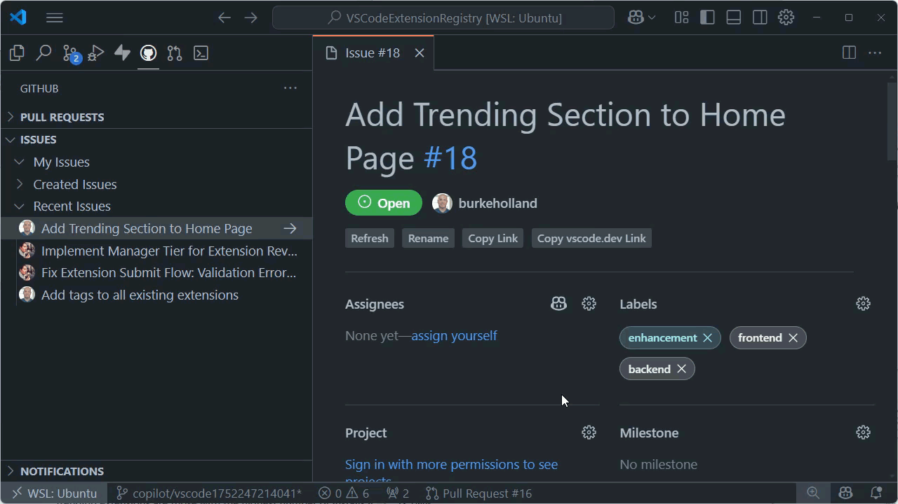

## Nasıl çalışır

Copilot kodlama ajanı iş akışı:

1. **Atama**: [GitHub issue'yu `@copilot`'a atarsınız](#method-1-assign-issues-to-copilot), [VS Code sohbetinden görev devredersiniz](#method-2-delegate-from-chat) veya [TODO kod eylemlerini kullanırsınız](#method-3-fix-todos-with-coding-agent)
1. **Analiz**: Ajan görevi ve depo yapınızı analiz eder
1. **Geliştirme**: Copilot şunları yapabildiği kendi izole GitHub Actions ortamında çalışır:
   * Kod tabanınızı keşfedin
   * Birden fazla dosyada değişiklik yapın
   * Derleme ve testleri çalıştırın
   * Linter'ları ve diğer otomatik kontrolleri çalıştırın
1. **Pull request**: Ajan uygulamayla bir pull request oluşturur
1. **İnceleme**: Değişiklikleri incelersiniz ve PR yorumları üzerinden değişiklik isteyebilirsiniz
1. **Yineleme**: Ajan geri bildirime yanıt verir ve uygulamayı günceller

## Önkoşullar

Copilot kodlama ajanını kullanmadan önce:

* **GitHub Copilot aboneliği**: Copilot Pro, Pro+, Business veya Enterprise planlarında mevcut
* **Yazma erişimi**: Depoya yazma izinleriniz olmalı
* **Ajanı etkinleştirin**: Copilot kodlama ajanı [hesabınız veya organizasyonunuz için etkinleştirilmiş olmalı](https://docs.github.com/copilot/concepts/coding-agent/enable-coding-agent)
* **VS Code kurulumu**: [GitHub Pull Requests uzantısını](https://marketplace.visualstudio.com/items?itemName=GitHub.vscode-pull-request-github) yükleyin

GitHub Pull Request uzantısına doğru GitHub hesabıyla oturum açtığınızdan emin olun.

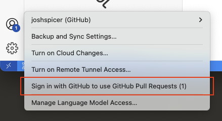

**İsteğe bağlı**: Daha kolay görev devri için Copilot Chat'te **Delegate to coding agent** düğmesini göstermek üzere deneysel `setting(githubPullRequests.codingAgent.uiIntegration)` ayarını etkinleştirin.

Ayrıca özel bir chat editöründen kodlama ajanı oturumlarını yönetebilir ve **Chat Sessions** görünümünü deneysel `setting(chat.agentSessionsViewLocation)` ayarını etkinleştirerek görüntüleyebilirsiniz.

> [!TIP]
> Henüz Copilot erişiminiz yoksa aylık etkileşim limiti ile [Copilot Ücretsiz planına](https://github.com/features/copilot/plans) kaydolabilirsiniz.

## VS Code'da Copilot kodlama ajanına iş atayın

### Yöntem 1: Copilot'a issue atayın

Copilot kodlama ajanını bir GitHub issue'yu Copilot'a atayarak tetikleyebilirsiniz; tıpkı bir issue'yu bir ekip üyesine atadığınız gibi. Copilot kodlama ajanı otomatik olarak issue'yu analiz eder ve üzerinde çalışmaya başlar.

1. **GitHub Pull Requests** görünümünde **Issues** bölümüne gidin

1. Copilot'a atamak istediğiniz issue'yu bulun

1. Issue'ya sağ tıklayın ve **Assign to Copilot** seçin veya **Assign** seçin ve ardından `@copilot` seçin

   > [!TIP]
   > Issue'ları doğrudan GitHub.com'da da `@copilot`'a atayabilirsiniz. Kodlama ajanı aynı şekilde çalışacak ve VS Code veya GitHub'da inceleyebileceğiniz bir pull request oluşturacaktır.

1. Ajan arka planda issue üzerinde çalışmaya başlayacaktır

1. VS Code'da Chat görünümünü açın (`kb(workbench.action.chat.open)`)
   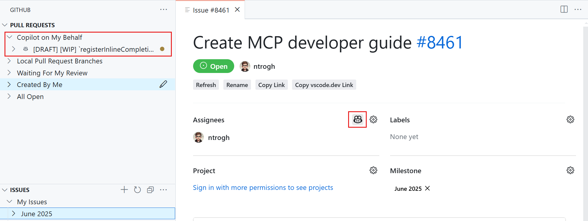

### Yöntem 2: Sohbetten devredin

Ayrıca sohbet konuşmanızdan doğrudan Copilot kodlama ajanına iş devredebilirsiniz. Ajanın değişiklikleri hemen editörde uygulaması yerine görevi kodlama ajanına devrederek arka planda otonom çalışmasını sağlayabilirsiniz.

1. VS Code'da Chat görünümünü açın (`kb(workbench.action.chat.open)`)

1. Uygulamak istediğiniz özellik veya değişiklik hakkında konuşun

1. Hazır olduğunuzda şu yöntemlerden biriyle ajana devredin:

   **Delegasyon düğmesini kullanın (Deneysel)**

   Ajanın etkin olduğu depolar için Chat görünümünde **Delegate to coding agent** düğmesini göstermek üzere deneysel `setting(githubPullRequests.codingAgent.uiIntegration)` ayarını etkinleştirin. Bu düğmeyi seçerek mevcut chat bağlamınızı kodlama ajanına devredin.

   Bir görev devrettiğinizde dosya referansları dahil ek bağlam kodlama ajanına iletilir; böylece tamamlanacak görevi kodlama ajanı için kesin planlayabilirsiniz. Gerçek zamanlı olarak kodlama ajanının ilerlemesini gösteren yeni bir chat editörü açılır.

   <video src="images/copilot-coding-agent/delegate-to-coding-agent.mp4" title="Video showing how to delegate to coding agent from VS Code chat." controls poster="images/copilot-coding-agent/delegate-to-coding-agent-poster.png"></video>

   **#copilotCodingAgent aracını kullanın**

   Ayrıca isteminizde `#copilotCodingAgent` aracına doğrudan referans vererek Copilot'tan yerel bir değişikliği arka planda sürdürmesini isteyebilirsiniz. Bu araç bekleyen değişiklikleri otomatik olarak uzak dala iter ve bir kodlama ajanı oturumu başlatır:

   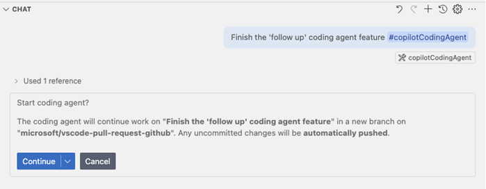

1. Ajan tartışılan değişikliklerle bir pull request oluşturacak ve uygulamaya başlayacaktır. (Kodlama ajanı oturumu `#copilotCodingAgent` veya **Delegate to coding agent** eylemiyle başlattığınızda) pull request Chat görünümünde kart olarak işlenir.

   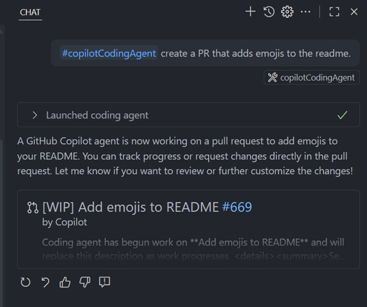

### Yöntem 3: TODO'larla kodlama ajanı kullanın

Kodunuzdaki `TODO` ile başlayan yorumlar artık hızlıca bir kodlama ajanı oturumu başlatmak için bir Code Action gösterir. Bu, belirli görevleri doğrudan kodunuzdan devretmenin uygun bir yolunu sağlar.

> [!TIP]
> `TODO` anahtar kelimesi `setting(githubIssues.createIssueTriggers)` ayarıyla yapılandırılabilir. Hangi yorum anahtar kelimelerinin kodlama ajanı kod eylemini tetikleyeceğini özelleştirebilirsiniz.

1. Kodunuzda bir `TODO` yorumuna gidin

1. Ampul simgesini arayın veya Hızlı Düzeltme menüsünü açmak için `kb(editor.action.quickFix)` kullanın

1. Mevcut kod eylemlerinden **Delegate to coding agent** seçin

   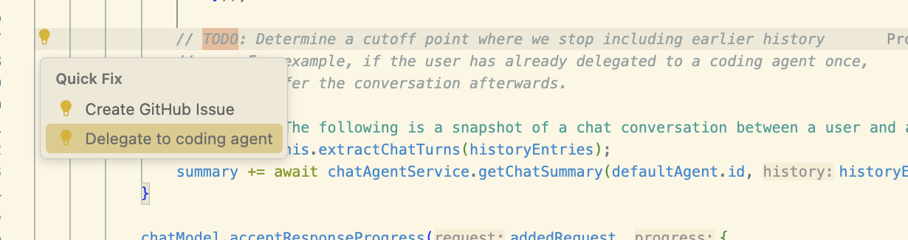

1. Kodlama ajanı TODO yorumunu analiz edecek ve istenen değişiklikleri yeni bir pull request'te uygulayacaktır

## Ajan ilerlemesini takip edin

### Kodlama ajanı iş akışını anlama

Copilot kodlama ajanına iş atadığınızda beklentilerinizden farklı olabilecek belirli bir iş akışı izler:

1. **İlk pull request oluşturma**: Ajan tüm değişikliklerin yapılacağı çalışma alanı ve dalı belirlemek için başlangıç boş commit'i olan hemen bir pull request oluşturur.

2. **Arka plan işleme**: Kodlama ajanı GitHub'ın bulut altyapısında (GitHub Actions ortamı) çalışır, yerel makinenizde değil. Bu şu anlama gelir:
   * Tüm geliştirme GitHub'ın sunucularında uzaktan gerçekleşir
   * Ajan tam depo bağlamına erişime sahiptir
   * VS Code'u kapatsanız bile iş devam eder

3. **Artımlı güncellemeler**: İlk commit'ten sonra ajan çözümü geliştirirken gerçek kod değişiklikleriyle ek commit'ler iter.

> [!NOTE]
> Değişiklik olmayan bir ilk commit görüyorsanız bu beklenen davranıştır. Ajan göreviniz üzerinde çalışırken sonraki commit'lerde gerçek kod değişiklikleri iter.

### VS Code'da işi izleyin

GitHub Pull Requests uzantısı şunları gösteren özel bir **Copilot on My Behalf** bölümü sunar:

* Tüm etkin Copilot kodlama ajanı oturumları
* Ajanın oluşturduğu pull request'ler
* Her görev için ilerleme durumu
* Yeni değişiklikleri veya güncellemeleri gösteren sayısal rozetler

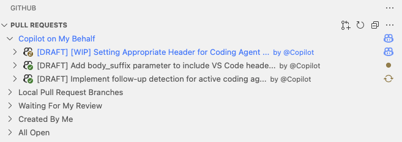

> [!TIP]
> GitHub.com üzerinden `@copilot`'a atadığınız işi de izleyebilirsiniz - tüm etkin oturumlar ve pull request'ler nerede başlattığınızdan bağımsız olarak bu bölümde görünecektir.

### Ayrıntılı oturum günlüklerini görüntüleyin

1. Pull Requests görünümünde **Copilot on My Behalf** altında ajanınızın işini bulun

1. Ajanın yaptığı her şeyin ayrıntılı günlüğünü görmek için **View Session** seçin:
   * Çalıştırılan komutlar
   * Değiştirilen dosyalar
   * Çalıştırılan testler
   * Karar verme süreci

   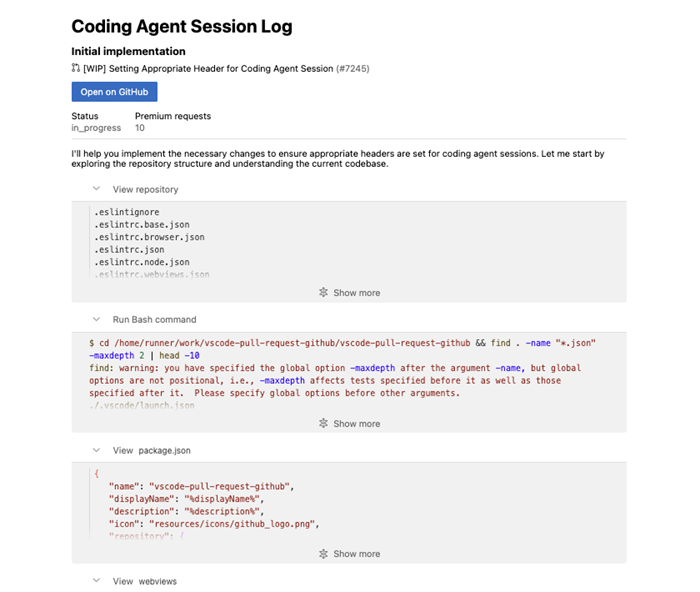

### Özel chat editörü ile oturumları yönetin (Deneysel)

Kodlama ajanı oturumlarını şunları yapmanızı sağlayan özel bir chat editöründen yönetebilirsiniz:

* Kodlama ajanının ilerlemesini gerçek zamanlı takip etme
* Sohbetten doğrudan takip talimatları verme
* Ajanın yanıtlarını özel bir ortamda görme
* Chat editöründen doğrudan kod değişikliklerini görüntüleme veya uygulama ve pull request'leri check out etme
* Yerel sohbetlerden GitHub ajan görevlerine geliştirilmiş süreklilikle sorunsuz geçişler
* Geliştirilmiş görsel netlikle daha iyi oturum işlemesi
* Daha hızlı oturum yüklemesiyle daha duyarlı deneyim

Bu özelliği denemek için deneysel `setting(chat.agentSessionsViewLocation)` ayarını etkinleştirin:

* `view` olarak ayarlandığında yerel ve kodlama ajanı oturumlarını yönetmek için VS Code Kenar Çubuğu'nda **Chat Sessions** görünümünü görürsünüz. Görünüm artık ilgili bilgiyi hızlıca bulmanıza yardımcı olacak ayrıntılı bağlamla zengin açıklamalar içerir.

   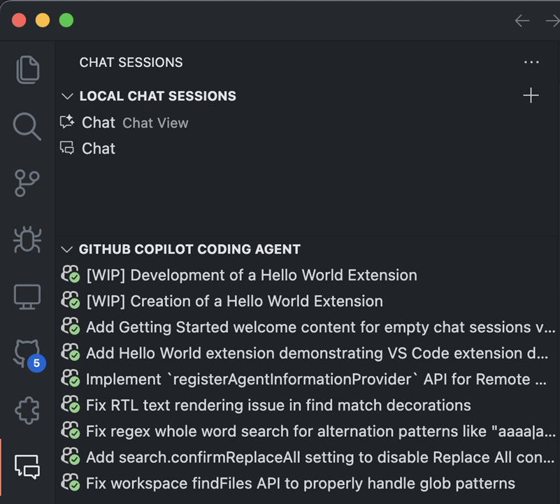

* `showChatsMenu` olarak ayarlandığında kodlama ajanı oturumları yerel chat geçmişiyle birlikte görünür

   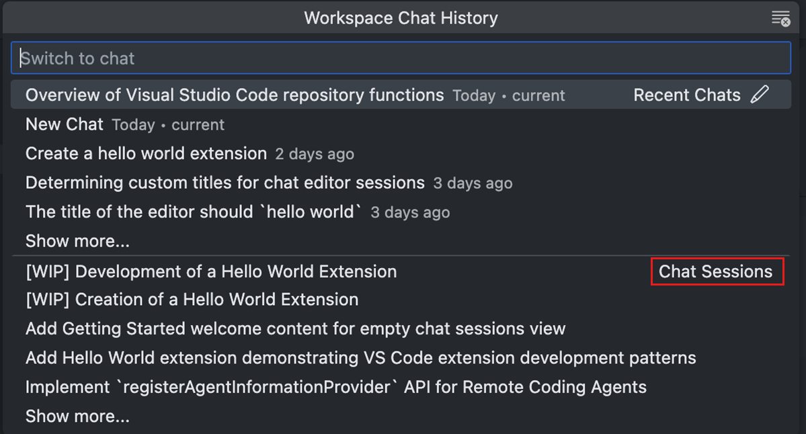

Kodlama ajanının oluşturduğu pull request'ler oturum başlattığınızda Chat görünümünde kart olarak da işlenir; daha iyi görsel entegrasyon sağlar.

### Geliştirilmiş devretme deneyimi

VS Code'dan GitHub kodlama ajanına devretme deneyimi son güncellemelerde önemli ölçüde iyileştirildi:

* **Daha iyi bağlam iletimi**: Sohbetten bir görev devrettiğinizde dosya referansları dahil ek bağlam otomatik olarak GitHub kodlama ajanına iletilir
* **Gerçek zamanlı ilerleme**: Kodlama ajanının ilerlemesini gerçek zamanlı gösteren yeni chat editörü açılır
* **Sorunsuz geçişler**: Yerel sohbetlerden GitHub ajan görevlerine geçerken geliştirilmiş süreklilik
* **Geliştirilmiş görsel entegrasyon**: Pull request'ler daha iyi gezinme için Chat görünümünde etkileşimli kartlar olarak işlenir

Bu iyileştirmeler kodlama ajanı için görevleri kesin planlamayı ve VS Code'dan ayrılmadan ilerlemelerini izlemeyi kolaylaştırır.

### Çalışan oturumu iptal edin

Ajanı durdurmak isterseniz VS Code'da kalıp PR genel bakış sayfasındaki **Cancel coding agent** düğmesini kullanabilirsiniz.

Ayrıca bir oturumu GitHub.com'dan da iptal edebilirsiniz:

1. GitHub.com'da deponuza gidin
1. **Actions** sekmesine gidin
1. Çalışan Copilot Coding Agent iş akışını bulun
1. **Cancel workflow** seçin

## İnceleyin ve yineleyin

### İş tamamlama

Copilot kodlama ajanı kodunuzu analiz edip görevi tamamlamak için gerekli değişiklikleri belirledikten sonra şu adımları gerçekleştirir:

* Tüm değişikliklerle bir pull request oluşturur
* İncelemeniz için PR'ı size atar
* Sizi reviewer olarak ister
* Uygulamayı açıklayan ayrıntılı açıklama ekler
* Uygulanabilir durumda (UI değişiklikleri için) ekran görüntüleri ekler

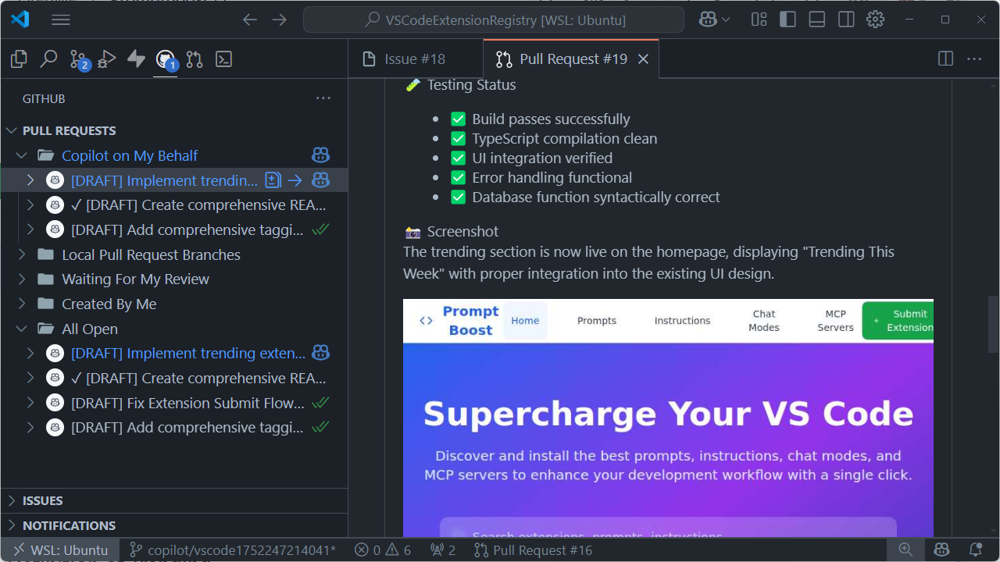

### Geri bildirim sağlayın

Pull request yorumları üzerinden ajanın çalışmasını yönlendirebilirsiniz. Ajanın yanıt vermesi için yorumlarınızda `@copilot` etiketlediğinizden emin olun:

1. **Değişiklik isteyin**: Değiştirilmesi gerekenler hakkında özel geri bildirim bırakın

   ```text
   @copilot Please update the login form to include password strength validation
   ```

1. **İyileştirmeler isteyin**: Ek özellikler veya iyileştirmeler isteyin

   ```text
   @copilot Can you add error handling for network timeouts?
   ```

Ajan geri bildiriminize yanıt verecek, istenen değişiklikleri yapacak ve pull request'i güncelleyecektir.

> [!TIP]
> Kodlama ajanının oluşturduğu pull request'lerle çalışırken `#activePullRequest` aracı chat oturumunuz için otomatik etkinleştirilir. Bu, chat'e hangi dosyaların değiştirildiği, kime atandığı ve durum (taslak veya incelemeye hazır) dahil PR bağlamı verir. Ardından bu PR hakkında soru sorup sohbette üzerinde daha fazla yineleyebilirsiniz.

## Sıkça sorulan sorular

### Copilot kodlama ajanı ile ajanları kullanma arasındaki fark nedir?

VS Code iki otonom kodlama deneyimi sunar. VS Code'da ajanları kullanmak editörde doğrudan etkileşimli geliştirme sağlarken, Copilot kodlama ajanı arka planda özellikleri uygulamak için GitHub'da bağımsız çalışır.

| Özellik | Copilot kodlama ajanı | Ajanları kullanma |
|---------|----------------------|-------------------|
| **Nerede çalışır** | GitHub bulutu | VS Code editörünüz |
| **Bağımsızlık** | Tamamen otonom | Kullanıcı etkileşimi ve yineleme içerir |
| **Çıktı** | Pull request oluşturur | Dosyaları doğrudan düzenler |
| **En iyi kullanım** | İyi tanımlanmış görevler, arka plan işi | Etkileşimli geliştirme, anında geri bildirim |

[VS Code'da ajanları kullanma](/docs/copilot/agents/local-agents.md) hakkında daha fazla bilgi edinin.

### Ajan neden başlamıyor?

* GitHub hesabınızda Copilot erişimini doğrulayın
* Depoya yazma izinleriniz olduğundan emin olun
* Copilot kodlama ajanının organizasyonunuz için etkinleştirildiğini kontrol edin

### İlk commit neden boş görünüyor?

Copilot kodlama ajanı çalışmaya başladığında pull request ve çalışma dalını belirlemek için başlangıç boş commit'i oluşturur. Bu beklenen davranıştır - ajan GitHub'ın bulut ortamında çalışırken gerçek kod değişiklikleriyle sonraki commit'leri iter.

İlerlemeyi pull request'ten erişilebilir oturum günlükleri, GitHub Pull Request uzantısının **Copilot on My Behalf** bölümü veya Chat Sessions görünümü üzerinden izleyebilirsiniz.

### Uygulamalar neden eksik?

* Karşılaşılan hatalar için oturum günlüklerini inceleyin
* Ajanın çalışması sırasında testlerin başarısız olup olmadığını kontrol edin
* Issue açıklamanızda daha ayrıntılı gereksinimler sağlayın

### Copilot kodlama ajanının hangi güvenlik korumaları var?

Copilot kodlama ajanı yerleşik güvenlik korumaları içerir ve GitHub'ın güvenlik çerçevesi içinde çalışır. Güvenlik önlemleri, izinler ve dal koruma uyumluluğu hakkında ayrıntılı bilgi için [GitHub Copilot kodlama ajanı güvenlik dokümantasyonuna](https://docs.github.com/en/copilot/concepts/about-copilot-coding-agent#built-in-security-protections) bakın.

### Copilot kodlama ajanını harici araçlarla genişletebilir miyim?

Gelişmiş senaryolar için Copilot kodlama ajanını Model Context Protocol (MCP) sunucularıyla genişleterek şunlara erişim sağlayabilirsiniz:

* Harici veritabanları
* Bulut hizmetleri
* API'ler ve üçüncü taraf entegrasyonları
* Özel geliştirme araçları

[Copilot kodlama ajanını MCP ile genişletme](https://docs.github.com/en/copilot/using-github-copilot/coding-agent/extending-copilot-coding-agent-with-mcp) hakkında daha fazla bilgi edinin.

### Mevcut sınırlamalar nelerdir?

* **Depolar arası değişiklikler**: Yalnızca issue atanan depo içinde çalışabilir
* **Görev başına birden fazla PR**: Atanan görev başına tam olarak bir pull request açar
* **Mevcut PR değişiklikleri**: Oluşturmadığı pull request'lerde çalışamaz

Sınırlamalar, uyumluluk ve kullanım maliyetleri hakkında ayrıntılı bilgi için [GitHub Copilot Kodlama Ajanı dokümantasyonuna](https://docs.github.com/en/copilot/using-github-copilot/coding-agent) bakın.

## Sonraki adımlar

* [GitHub kurulum rehberini](https://docs.github.com/en/copilot/using-github-copilot/coding-agent/enabling-copilot-coding-agent) takip ederek Copilot kodlama ajanını etkinleştirin
* Hemen, etkileşimli kodlama yardımı için [VS Code chat'te ajanları](/docs/copilot/chat/copilot-chat.md) deneyin

## İlgili kaynaklar

* [GitHub Copilot kodlama ajanı dokümantasyonu](https://docs.github.com/en/copilot/using-github-copilot/coding-agent)
* [GitHub Pull Requests uzantısı](https://marketplace.visualstudio.com/items?itemName=GitHub.vscode-pull-request-github)
* [Chat oturumlarını yönetme](/docs/copilot/chat/chat-sessions.md)
