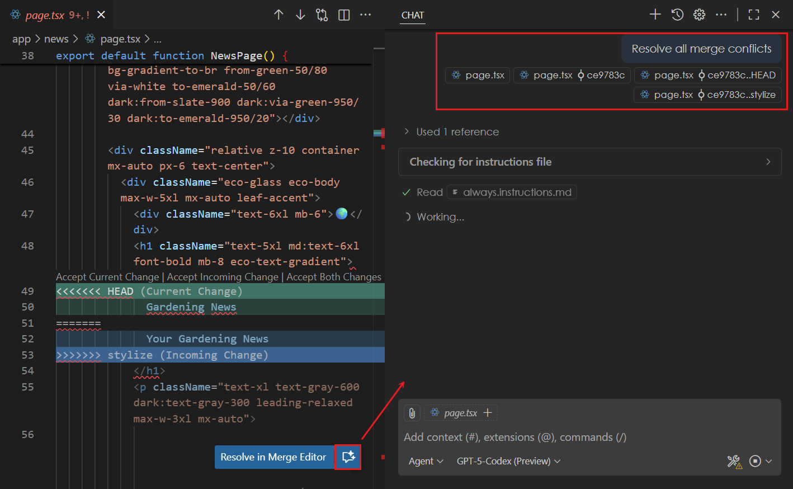
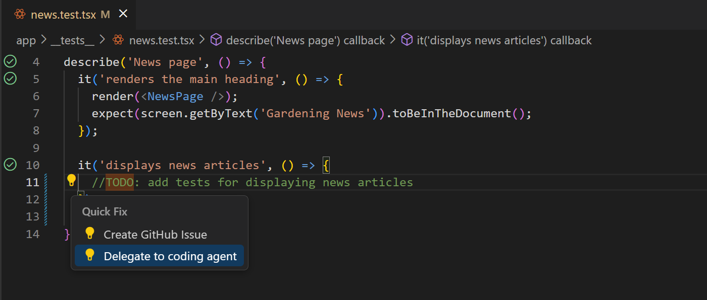
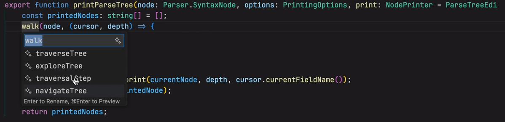
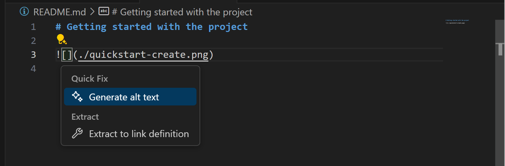
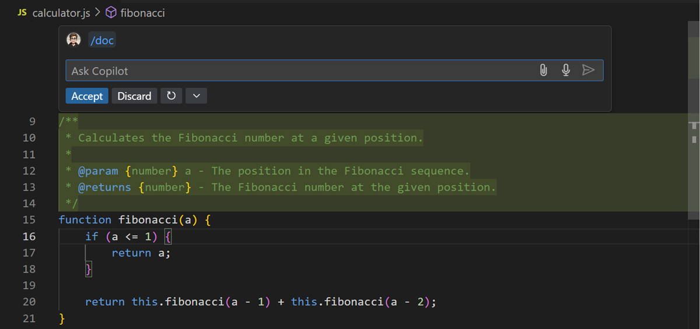
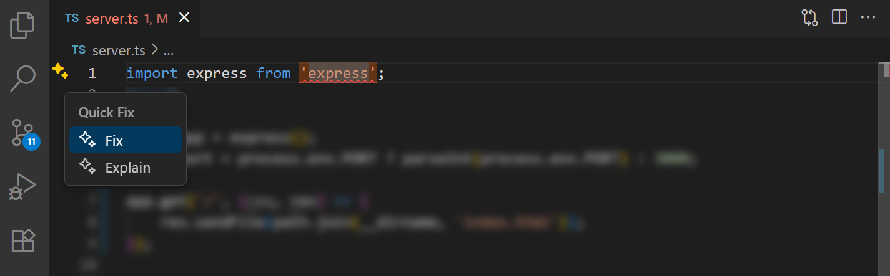
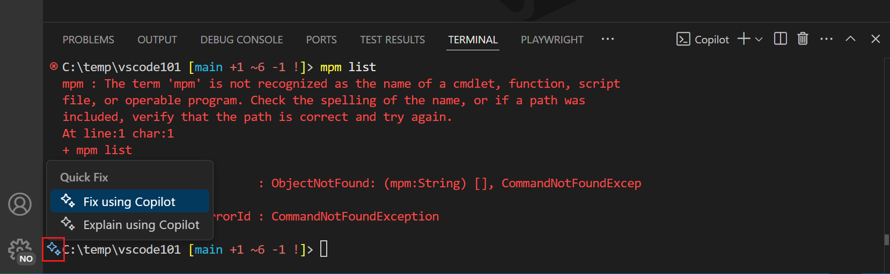
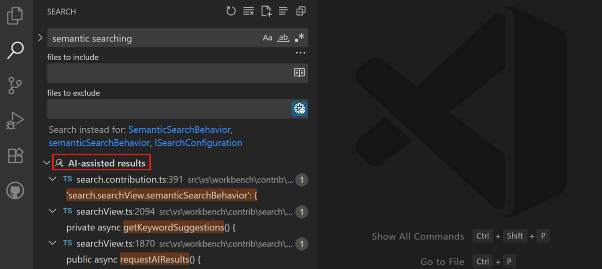
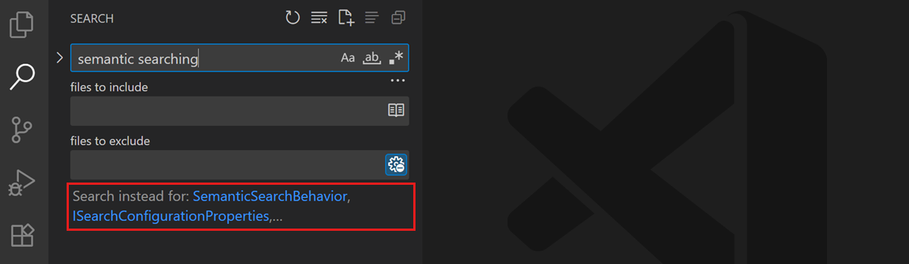
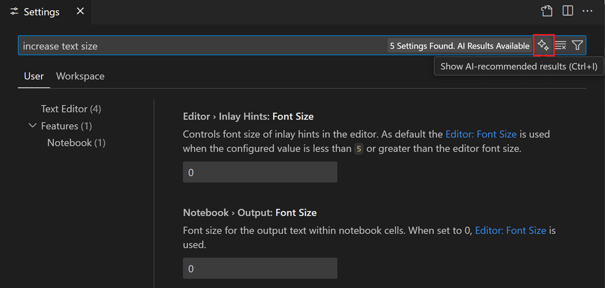

# Visual Studio Code'da AI akıllı eylemler

Birkaç yaygın senaryo için istem yazmadan AI'dan yardım almak üzere _akıllı eylemler_ kullanabilirsiniz. Bu akıllı eylem örnekleri commit mesajı oluşturma, dokümantasyon oluşturma, kodu açıklama veya düzeltme veya kod incelemesi yapmadır. Bu akıllı eylemler VS Code UI'ında her yerde mevcuttur.

VS Code'da AI ile ilk uygulamanızı oluşturmak için uygulamalı öğreticiyi takip edin.

* [Öğreticiyi başlat](/docs/copilot/getting-started.md)

## Commit mesajı ve PR bilgisi oluştur

Kod değişikliklerinize dayalı commit mesajları ve pull request (PR) başlıkları ile açıklamaları oluşturmada yardım alın. Değişikliklerinizi özetleyen başlık ve açıklama oluşturmak için Source Control görünümünde veya GitHub PR uzantısında _sparkle_ simgesini kullanın.

## AI ile merge çakışmalarını çözün (Deneysel)

Git merge çakışmalarını çözmede yardım için AI kullanın. Merge çakışmasını çözmek için Chat görünümünü açacak ve ajantik akışı başlatacak editördeki **Resolve Merge Conflict with AI** düğmesini seçin. Merge tabanı ve her dalın değişiklikleri AI için bağlam olarak sağlanır.

## Todo yorumlarını uygulayın

[GitHub Pull Requests](https://marketplace.visualstudio.com/items?itemName=GitHub.vscode-pull-request-github) uzantısı yüklüyse kodunuzdaki `TODO` yorumlarını [Copilot kodlama ajanı](/docs/copilot/agents/cloud-agents.md#github-copilot-coding-agent) ile AI ile uygulayabilirsiniz.

1. [GitHub Pull Requests](https://marketplace.visualstudio.com/items?itemName=GitHub.vscode-pull-request-github) uzantısının yüklü olduğundan emin olun.
1. Kodunuzda bir `TODO` yorumu ekleyin. Yorumun yanında bir kod eylemi (ampul) görünür.
1. Kod eylemini seçin ve **Delegate to coding agent** seçin.

    

## Sembolleri yeniden adlandır

Kodunuzda bir sembolü yeniden adlandırdığınızda sembolün ve kod tabanının bağlamına dayalı yeni isim için AI ile üretilen öneriler alın.

## Markdown'daki görüntüler için alt metin oluştur

Markdown dosyalarındaki görüntüler için alt metin oluşturmak veya güncellemek üzere AI kullanın. Alt metin oluşturmak için:

1. Bir Markdown dosyası açın.
1. İmleci bir görüntü bağlantısına koyun.
1. Kod Eylemi (ampul) simgesini seçin ve **Generate alt text** seçin.

    

1. Zaten alt metniniz varsa Kod Eylemini seçin ve **Refine alt text** seçin.

## Dokümantasyon oluştur

Birden fazla dil için kod dokümantasyonu oluşturmak üzere AI kullanın.

1. Uygulama kod dosyanızı açın.
1. İsteğe bağlı olarak belgelemek istediğiniz kodu seçin.
1. Sağ tıklayın ve **Generate Code** > **Generate Docs** seçin.

    

## Test oluştur

İstem yazmadan uygulama kodunuz için test oluşturmak üzere editör akıllı eylemlerini kullanabilirsiniz.

1. Uygulama kod dosyanızı açın.
1. İsteğe bağlı olarak test etmek istediğiniz kodu seçin.
1. Sağ tıklayın ve **Generate Code** > **Generate Tests** seçin.

    VS Code mevcut bir test dosyasında test kodu oluşturur veya yoksa yeni bir test dosyası oluşturur.

1. İsteğe bağlı olarak Inline Chat isteminde ek bağlam sağlayarak üretilen testleri iyileştirin.

## Kodu açıkla

Editörde bir kod bloğunu açıklamada yardım alın.

1. Uygulama kod dosyanızı açın.
1. Düzeltmek istediğiniz kodu seçin.
1. Sağ tıklayın ve **Explain** seçin.

    VS Code seçilen kod bloğunun bir açıklamasını sunar.

## Kodlama hatalarını düzelt

İstem yazmadan uygulama kodundaki kodlama sorunlarını düzeltmek üzere editör akıllı eylemlerini kullanabilirsiniz.

1. Uygulama kod dosyanızı açın.
1. Düzeltmek istediğiniz kodu seçin.
1. Sağ tıklayın ve **Generate Code** > **Fix** seçin.

    VS Code kodu düzeltmek için bir kod önerisi sunar.

1. İsteğe bağlı olarak chat isteminde ek bağlam sağlayarak üretilen kodu iyileştirin.

Alternatif olarak bir kod dosyasında derleme veya lint sorunu varsa VS Code sorunu çözmede yardımcı olmak için editörde bir kod eylemi gösterir.

## Test hatalarını düzelt

Test Explorer'dan doğrudan kod tabanınızdaki başarısız testleri düzeltmede yardım alın.

1. Test Explorer'da başarısız bir testin üzerine gelin
1. **Fix Test Failure** düğmesini (sparkle simgesi) seçin
1. Copilot'un önerilen düzeltmesini inceleyin ve uygulayın

Alternatif olarak:

1. Chat görünümünü açın
1. `/fixTestFailure` komutunu girin
1. Testi düzeltmek için Copilot'un önerilerini takip edin

> [!TIP]
> [Ajanları](/docs/copilot/agents/local-agents.md) kullanırken ajan test çalıştırırken test çıktısını izler ve başarısız testleri otomatik olarak düzeltmeyi ve yeniden çalıştırmayı dener.

## Terminal hatalarını düzelt

Terminalde bir komut çalıştırılamadığında VS Code ne olduğunu açıklayan Hızlı Düzeltme sunan kenar boşluğunda bir sparkle gösterir.

## Kodu incele

VS Code kod incelemesinde yardımcı olabilir; editörde bir kod bloğu veya pull request'e dahil tüm değişiklikler için ( [GitHub Pull Requests uzantısı](https://marketplace.visualstudio.com/items/?itemName=GitHub.vscode-pull-request-github) gerektirir).

Editörde bir kod bloğunu incelemek için:

1. Uygulama kod dosyanızı açın.
1. İncelemek istediğiniz kodu seçin.
1. Sağ tıklayın ve **Generate Code** > **Review** seçin.

    VS Code **Comments** panelinde inceleme yorumları oluşturur ve bunları editörde satır içi de gösterir.

Pull request'teki tüm değişiklikleri incelemek için:

1. GitHub Pull Requests uzantısıyla bir pull request oluşturun
1. **Files Changed** görünümünde **Code Review** düğmesini seçin.

    VS Code **Comments** panelinde inceleme yorumları oluşturur ve bunları editörde satır içi de gösterir.

## Semantik arama sonuçları (Önizleme)

VS Code'daki Search görünümü dosyalarınızda metin aramanıza olanak tanır. Semantik arama metinle tam eşleşmese bile arama sorgunuzla anlamsal olarak ilgili sonuçları bulmanızı sağlar. Bu, belirli bir terimden ziyade bir kavramla ilişkili kod parçacıkları veya dokümantasyon ararken veya aradığınız tam terimleri bilmediğinizde özellikle kullanışlıdır.

Semantik aramayı Search görünümünde `setting(search.searchView.semanticSearchBehavior)` ayarıyla yapılandırın. Semantik aramayı otomatik çalıştırmayı veya yalnızca açıkça istediğinizde çalıştırmayı seçebilirsiniz.

Ayrıca Search görünümünde ilgili alternatif arama terimleri sağlamak üzere AI ile üretilen anahtar kelime önerileri alabilirsiniz. Anahtar kelime önerilerini `setting(search.searchView.keywordSuggestions)` ayarıyla etkinleştirin.

Chat isteminizde **Add Context** Hızlı Seçim'den **Get results from the search view** seçerek arama sonuçlarına referans verebilirsiniz. Alternatif olarak chat istemine `#searchResults` yazın.

## AI ile ayarları arayın

Değiştirmek istediğiniz ayarın tam adını bilmiyorsanız arama sorgunuza dayalı ilgili ayarları bulmak için AI kullanabilirsiniz. Örneğin editör yazı tipi boyutunu kontrol eden ayarı bulmak için "increase text size" arayabilirsiniz.

Bu işlevselliği `setting(workbench.settings.showAISearchToggle)` ayarıyla etkinleştirin. Ayar editöründe **Search Settings with AI** düğmesiyle AI arama sonuçlarını açıp kapatabilirsiniz.

## İlgili kaynaklar

* [Copilot Hızlı Başlangıç ile başlayın](/docs/copilot/getting-started.md).
