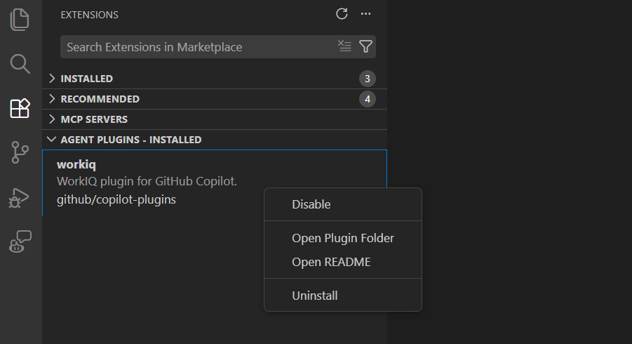

# VS Code'da ajan eklentileri (Önizleme)

Ajan eklentileri, Visual Studio Code'daki eklenti marketplace'lerinden keşfedip yükleyebileceğiniz önceden paketlenmiş sohbet özelleştirmeleri paketleridir. Tek bir eklenti eğik çizgi komutları, [ajan becerileri](/docs/copilot/customization/agent-skills.md), [özel ajanlar](/docs/copilot/customization/custom-agents.md), [hook'lar](/docs/copilot/customization/hooks.md) ve [MCP sunucuları](/docs/copilot/customization/mcp-servers.md) herhangi bir kombinasyonunda sağlayabilir.

Eklentiler yerel olarak tanımladığınız özelleştirmelerinizle birlikte çalışır. Bir eklenti yüklediğinizde komutları, becerileri, ajanları, hook'ları ve MCP sunucuları sohbette görünür.

> [!NOTE]
> Ajan eklentileri şu anda önizlemededir. Ajan eklentisi desteğini `setting(chat.plugins.enabled)` ayarıyla etkinleştirebilir veya devre dışı bırakabilirsiniz.

## Eklentiler ne sağlar

Bir ajan eklentisi aşağıdaki özelleştirme türlerinden birini veya daha fazlasını paketleyebilir:

* **Eğik çizgi komutları**: sohbette `/` ile çağırabileceğiniz ek komutlar
* **Beceriler**: isteğe bağlı yüklenen talimatlar, scriptler ve kaynaklarla [ajan becerileri](/docs/copilot/customization/agent-skills.md)
* **Ajanlar**: özelleştirilmiş kişilikler ve araç yapılandırmalarıyla [özel ajanlar](/docs/copilot/customization/custom-agents.md)
* **Hook'lar**: ajan yaşam döngüsü noktalarında kabuk komutları çalıştıran [hook'lar](/docs/copilot/customization/hooks.md)
* **MCP sunucuları**: harici araç entegrasyonları için [MCP sunucuları](/docs/copilot/customization/mcp-servers.md)

Yüklendikten sonra eklenti tarafından sağlanan özelleştirmeler yerel olarak tanımladıklarınızla birlikte görünür. Örneğin bir eklentiden gelen beceriler **Configure Skills** menüsünde görünür ve bir eklentiden gelen MCP sunucuları MCP sunucu listesinde görünür.

## Eklentileri keşfedin ve yükleyin

VS Code, Uzantılar kenar çubuğunda ajan eklentilerine göz atmak ve yönetmek için özel bir görünüm sağlar.

### Mevcut eklentilere göz atın

1. Uzantılar görünümünü (`kb(workbench.view.extensions)`) açın ve arama alanına `@agentPlugins` yazın.

    Alternatif olarak Uzantılar kenar çubuğundaki **More Actions** (üç nokta) simgesini seçin ve **Views** > **Agent Plugins** seçin.

1. Yapılandırılmış marketplace'lerinizden mevcut eklentilere göz atın.

    

1. Kullanıcı profilinize yüklemek için **Install** seçin.

### Yüklü eklentileri görüntüleyin

Uzantılar kenar çubuğundaki **Agent Plugins - Installed** görünümü yüklediğiniz eklentileri gösterir. Bu görünümden eklentileri etkinleştirebilir, devre dışı bırakabilir veya kaldırabilirsiniz.



Yüklü eklentileri Chat görünümünde **dişli simgesi** > **Plugins** seçerek de yönetebilirsiniz.

## Eklenti marketplace'lerini yapılandırın

Varsayılan olarak VS Code eklentileri [copilot-plugins](https://github.com/github/copilot-plugins) ve [awesome-copilot](https://github.com/github/awesome-copilot/) depolarından keşfeder. `setting(chat.plugins.marketplaces)` ayarıyla ek marketplace'ler ekleyebilirsiniz.

Marketplace'ler eklenti tanımları içeren Git depolarıdır. Bunlara birkaç biçimde referans verebilirsiniz:

* **Kısaltma**: genel GitHub depoları için `owner/repo`. Örneğin `anthropics/claude-code`.
* **HTTPS git remote**: `.git` ile biten tam URL. Örneğin `https://github.com/anthropics/claude-code.git`.
* **SCP tarzı git remote**: SSH tarzı referanslar. Örneğin `git@github.com:anthropics/claude-code.git`.
* **file URI**: diskte zaten klonlanmış marketplace deposuna `file:///` yolu.

Özel depolar da desteklenir. Genel arama başarısız olursa VS Code doğrudan depoyu klonlamaya geçer.

```json
// settings.json
"chat.plugins.marketplaces": [
    "anthropics/claude-code"
]
```

## Yerel eklentileri kullanın

Bir eklentiyi manuel olarak klonlarsanız veya indirirseniz `setting(chat.plugins.paths)` ayarıyla kaydedebilirsiniz. Bu ayar yerel eklenti dizin yollarını etkin veya devre dışı duruma eşler.

```json
// settings.json
"chat.plugins.paths": {
    "/path/to/my-plugin": true,
    "/path/to/another-plugin": false
}
```

Değeri `true` yaparak eklentiyi etkinleştirin veya kayıtlı ancak devre dışı tutmak için `false` yapın.

## İlgili kaynaklar

* [GitHub Copilot CLI için eklentileri bulma ve yükleme](https://docs.github.com/en/copilot/how-tos/copilot-cli/customize-copilot/plugins-finding-installing)
* [Agent Skills kullanın](/docs/copilot/customization/agent-skills.md)
* [MCP sunucuları ekleyin ve yönetin](/docs/copilot/customization/mcp-servers.md)
* [Yaşam döngüsü otomasyonu için hook'ları kullanın](/docs/copilot/customization/hooks.md)
* [Özel ajanlar oluşturun](/docs/copilot/customization/custom-agents.md)
