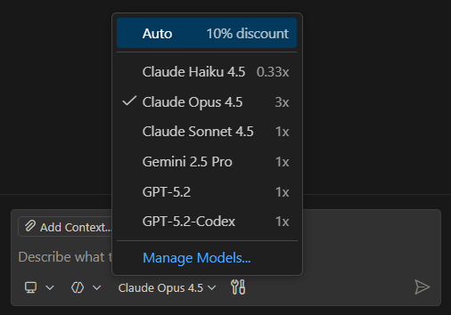
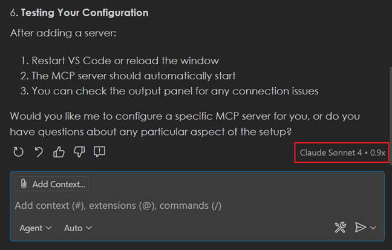
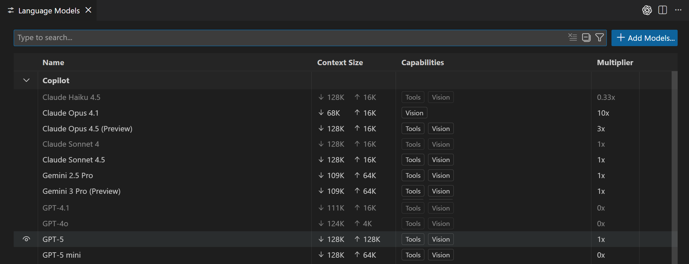
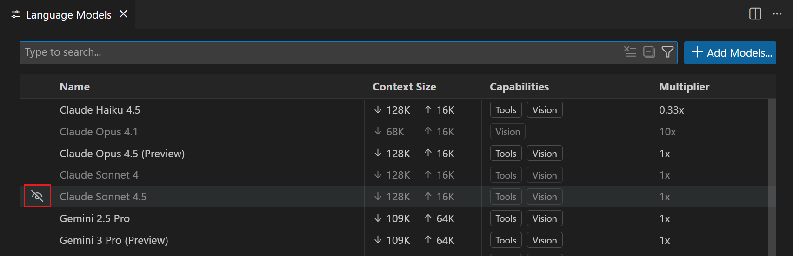
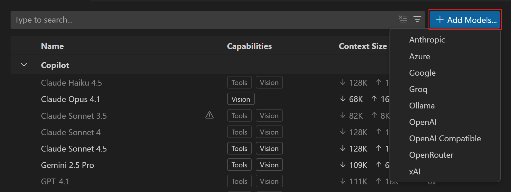
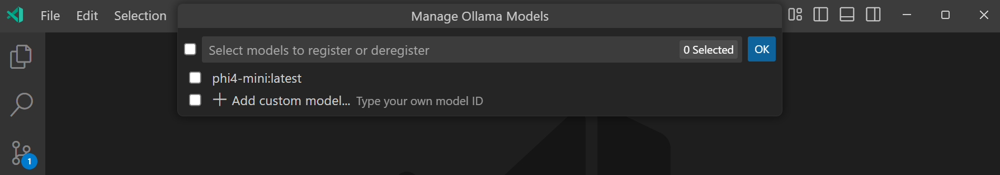
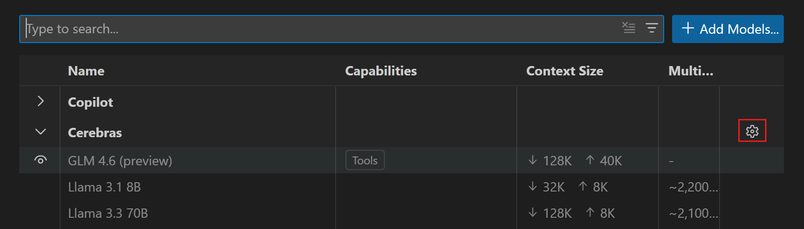

# VS Code'da yapay zeka dil modelleri

Visual Studio Code, farklı görevler için optimize edilmiş farklı yerleşik dil modelleri sunar. Ayrıca diğer sağlayıcılardan modeller kullanmak için kendi dil model API anahtarınızı getirebilirsiniz. Bu makale sohbet veya satır içi öneriler için dil modelini nasıl değiştireceğinizi ve kendi API anahtarınızı nasıl kullanacağınızı açıklar.

## Göreviniz için doğru modeli seçin

Varsayılan olarak sohbet, kodlama, özetleme, bilgi tabanlı sorular, mantık yürütme ve daha fazlası gibi geniş bir görev yelpazesi için hızlı ve yetenekli yanıtlar sağlamak üzere bir temel model kullanır.

Ancak yalnızca bu modeli kullanmakla sınırlı değilsiniz. Kendi [dil model seçeneklerinizden](https://docs.github.com/en/copilot/using-github-copilot/ai-models/changing-the-ai-model-for-copilot-chat#ai-models-for-copilot-chat-1) seçim yapabilirsiniz; her birinin kendine özgü güçlü yönleri vardır. Yapay zeka modellerinin ayrıntılı karşılaştırması için GitHub Copilot belgelerinde [Göreviniz için doğru yapay zeka modelini seçme](https://docs.github.com/en/copilot/using-github-copilot/ai-models/choosing-the-right-ai-model-for-your-task) bölümüne bakın.

Kullandığınız [ajana](/docs/copilot/customization/custom-agents.md) bağlı olarak kullanılabilir modellerin listesi farklı olabilir. Örneğin ajan modunda, model listesi araç çağırma için iyi destek sunanlarla sınırlıdır.

> [!NOTE]
> Copilot Business veya Enterprise kullanıcısıysanız, yöneticinizin [Copilot politika ayarlarında](https://docs.github.com/en/enterprise-cloud@latest/copilot/managing-copilot/managing-github-copilot-in-your-organization/managing-policies-for-copilot-in-your-organization#enabling-copilot-features-in-your-organization) GitHub.com'da `Editor Preview Features` için katılım yaparak kuruluşunuz için belirli modelleri etkinleştirmesi gerekir.

## Sohbet görüşmeleri için modeli değiştirin

Sohbet görüşmeleri ve kod düzenleme için kullanılan modeli değiştirmek üzere sohbet giriş alanındaki dil modeli seçicisini kullanın.

> [!TIP]
> GitHub Copilot yeteneklerini geliştirmek için daha fazla dil modeli eklemek üzere AI Toolkit uzantısını yükleyin.
>
> Daha fazla bilgi için [Sohbet modelini değiştir](https://docs.github.com/en/copilot/how-tos/use-ai-models/change-the-chat-model#adding-more-models) bölümüne bakın.

[kendi dil model API anahtarınızı kullanarak](#bring-your-own-language-model-key) kullanılabilir modellerin listesini daha da genişletebilirsiniz.

Ücretli Copilot planınız varsa, model seçici premium modeller için premium istek çarpanını gösterir. GitHub Copilot belgelerinde [premium istekler](https://docs.github.com/en/copilot/managing-copilot/monitoring-usage-and-entitlements/about-premium-requests#premium-requests) hakkında daha fazla bilgi edinin.

## Otomatik model seçimi

> [!NOTE]
> Otomatik model seçimi VS Code 1.104 sürümünden itibaren kullanılabilir.

Otomatik model seçimi ile VS Code en iyi performansı sağlamak ve belirli dil modellerinin aşırı kullanımından kaynaklanan oran limitlerini azaltmak için otomatik olarak bir model seçer. Zayıflayan model performansını algılar ve o anda en iyi modeli kullanır. İhtiyaçlarınız için en uygun modeli seçme özelliğini geliştirmeye devam ediyoruz.

Otomatik model seçimini kullanmak için sohbetteki model seçiciden **Auto** seçin.

Şu anda otomatik seçim Claude Sonnet 4, GPT-5, GPT-5 mini ve diğer modeller arasında yapılır. Kuruluşunuz [belirli modellerden çekildiyse](https://docs.github.com/en/copilot/how-tos/use-ai-models/configure-access-to-ai-models), otomatik bu modelleri seçmez. Bu modellerden hiçbiri kullanılabilir değilse veya premium istekleriniz tükenirse otomatik 0x çarpanlı bir modele geri döner.

### Çarpan indirimleri

Otomatik model seçimi kullanırken VS Code seçilen modele bağlı değişken bir [model çarpanı](https://docs.github.com/en/copilot/concepts/billing/copilot-requests#model-multipliers) kullanır. Ücretli kullanıcıysanız otomatik bir istek indirimi uygular.

Hangi model ve model çarpanının kullanıldığını görmek için sohbet yanıtının üzerine gelmeniz yeterlidir.

## Dil modellerini yönetme

Tüm mevcut modelleri görüntülemek, model seçicide hangi modellerin gösterileceğini seçmek ve yerleşik sağlayıcılardan veya uzantı tarafından sağlanan model sağlayıcılardan model ekleyerek daha fazla model eklemek için dil modelleri editörünü kullanabilirsiniz.

Dil Modelleri editörünü açmak için Sohbet görünümündeki model seçiciyi açın ve **Manage Models** seçin veya Komut Paleti'nden **Chat: Manage Language Models** komutunu çalıştırın. Dil Modelleri editörü varsayılan olarak editör alanının üzerinde [modal katman](/docs/getstarted/userinterface.md#modal-editors) olarak açılır.

Editör size mevcut tüm modelleri listeler; model yetenekleri, bağlam boyutu, faturalandırma ayrıntıları ve görünürlük durumu gibi temel bilgileri gösterir. Varsayılan olarak modeller sağlayıcıya göre gruplanır ancak bunları görünürlüğe göre de gruplayabilirsiniz.

Aşağıdaki seçeneklerle modellerde arama ve filtreleme yapabilirsiniz:

* Arama kutusu ile metin araması
* Sağlayıcı: `@provider:"OpenAI"`
* Yetenek: `@capability:tools`, `@capability:vision`, `@capability:agent`
* Görünürlük: `@visible:true/false`

### Model seçiciyi özelleştirin

Dil Modelleri editöründe modellerin görünürlük durumunu değiştirerek model seçicide hangi modellerin gösterileceğini özelleştirebilirsiniz. Herhangi bir sağlayıcıdan modelleri gösterebilir veya gizleyebilirsiniz.

Listedeki bir modelin üzerine gelin ve model seçicide modeli göstermek veya gizlemek için göz simgesini seçin.

## Kendi dil model anahtarınızı getirin

> [!IMPORTANT]
> Bu özellik şu anda Copilot Business veya Copilot Enterprise kullanıcılarına sunulmamaktadır.

VS Code'daki GitHub Copilot farklı görevler için optimize edilmiş çeşitli yerleşik dil modelleriyle gelir. Yerleşik model olarak mevcut olmayan bir model kullanmak istiyorsanız, diğer sağlayıcılardan modeller kullanmak için kendi dil model API anahtarınızı (BYOK) getirebilirsiniz.

VS Code'da kendi dil model API anahtarınızı kullanmanın birkaç avantajı vardır:

* **Model seçimi**: yerleşik modellerin ötesinde farklı sağlayıcılardan yüzlerce modele erişin.
* **Deneyim**: henüz yerleşik modellerde mevcut olmayan yeni modeller veya özelliklerle deneyler yapın.
* **Yerel hesaplama**: GitHub Copilot'ta zaten desteklenen modellerden biri için kendi hesaplamanızı kullanın veya henüz mevcut olmayan modelleri çalıştırın.
* **Daha fazla kontrol**: kendi anahtarınızı kullanarak yerleşik modellere uygulanan standart oran limitleri ve kısıtlamaları aşabilirsiniz.

VS Code daha fazla model eklemek için farklı seçenekler sunar:

* [Yerleşik model sağlayıcılardan](#add-a-model-from-a-built-in-provider) birini kullanın

* Visual Studio Market'ten bir [dil model sağlayıcı uzantısı](https://marketplace.visualstudio.com/search?term=tag%3Alanguage-models&target=VSCode&category=All%20categories&sortBy=Relevance) yükleyin, örneğin [Foundry Local ile AI Toolkit for VS Code](https://aka.ms/AIToolkit)

### Kendi model anahtarını kullanırken dikkat edilecekler

* Yalnızca sohbet deneyimine uygulanır; satır içi önerileri veya VS Code'daki diğer yapay zeka destekli özellikleri etkilemez.
* Yetenekler modele bağlıdır ve yerleşik modellerden farklı olabilir, örneğin araç çağırma, görüş veya düşünme desteği.
* Copilot hizmet API'si gömme gönderme, depo indeksleme, sorgu iyileştirme, niyet algılama ve yan sorgular gibi bazı görevler için hala kullanılır.
* BYOK kullanırken model çıktısına sorumlu yapay zeka filtrelemesinin uygulandığının garantisi yoktur.

### Yerleşik sağlayıcıdan model ekleme

VS Code, sohbetteki model seçiciye daha fazla model eklemek için kullanabileceğiniz birkaç yerleşik model sağlayıcıyı destekler.

Yerleşik sağlayıcıdan bir dil modelini yapılandırmak için:

1. Sohbet görünümündeki dil modeli seçiciden **Manage Models** seçin veya Komut Paleti'nden **Chat: Manage Language Models** komutunu çalıştırın.

1. Dil Modelleri editöründe **Add Models** seçin, ardından listeden bir model sağlayıcı seçin.

    

1. API anahtarı veya endpoint URL'si gibi sağlayıcıya özel ayrıntıları girin.

1. Sağlayıcıya bağlı olarak model ayrıntılarını girin veya listeden bir model seçin.

    Aşağıdaki ekran görüntüsü yerel olarak çalışan Ollama için model seçicisini gösterir; Phi-4 modeli dağıtılmış.

    

1. Artık sohbetteki model seçiciden modeli seçebilirsiniz.

    [Ajanlar](/docs/copilot/agents/overview.md) kullanırken bir modelin kullanılabilir olması için araç çağırma desteği sunması gerekir. Model araç çağırma desteği sunmuyorsa model seçicide gösterilmez.

> [!NOTE]
> Özel OpenAI uyumlu model yapılandırması şu anda VS Code 1.104 itibariyle [VS Code Insiders](https://code.visualstudio.com/insiders/)'da mevcuttur. `setting(github.copilot.chat.customOAIModels)` ayarında OpenAI uyumlu model yapılandırmanızı manuel olarak da ekleyebilirsiniz.

## Model sağlayıcı ayrıntılarını güncelleme

Daha önce yapılandırdığınız bir model sağlayıcının ayrıntılarını güncellemek için:

1. Sohbet görünümündeki dil modeli seçiciden **Manage Models** seçin veya Komut Paleti'nden **Chat: Manage Language Models** komutunu çalıştırın.

1. Dil Modelleri editöründe güncellemek istediğiniz model sağlayıcının yanındaki dişli simgesini seçin.

   

1. API anahtarı veya endpoint URL'si gibi sağlayıcı ayrıntılarını güncelleyin.

## Satır içi sohbet için modeli değiştirin

Editör satır içi sohbeti için varsayılan bir dil modeli yapılandırabilirsiniz. Bu, sohbet görüşmelerinden farklı bir modeli satır içi sohbet için kullanmanızı sağlar.

Satır içi sohbet için varsayılan modeli yapılandırmak üzere `setting(inlineChat.defaultModel)` ayarını kullanın. Ayar model seçiciden tüm mevcut modelleri listeler.

Satır içi sohbet oturumu sırasında modeli değiştirirseniz seçim oturumun geri kalanında korunur. VS Code'u yeniden yükledikten sonra model `setting(inlineChat.defaultModel)` ayarında belirtilen değere sıfırlanır.

## Satır içi öneriler için modeli değiştirin

Editörde satır içi öneriler oluşturmak için kullanılan dil modelini değiştirmek için:

1. VS Code başlık çubuğundaki Sohbet menüsünden **Configure Inline Suggestions...** seçin.

1. **Change Completions Model...** seçin, ardından listeden modellerden birini seçin.

> [!NOTE]
> Satır içi öneriler için mevcut modeller daha fazla model desteği ekledikçe zamanla değişebilir.

## Sık sorulan sorular

### Kendi model anahtarı Copilot Business veya Copilot Enterprise için neden kullanılamıyor?

Kendi model anahtarı getirme özelliği Copilot Business veya Copilot Enterprise için kullanılamıyor çünkü esas olarak kullanıcıların duyurulduğu anda ve henüz Copilot'ta yerleşik model olarak mevcut olmayan en yeni modellerle deney yapmasına olanak sağlamak içindir.

Kendi model anahtarı getirme özelliği kuruluşların bu işlevselliği ölçekte kullanma gereksinimlerini daha iyi anladıkça bu yılın ilerleyen zamanlarında Copilot Business ve Enterprise planlarına gelecektir. Copilot Business ve Enterprise kullanıcıları hala yerleşik, yönetilen modelleri kullanabilir.

### Copilot ile VS Code'da yerel olarak barındırılan modeller kullanabilir miyim?

[kendi dil model anahtarınızı getirerek](#bring-your-own-language-model-key) (BYOK) ve yerel modele bağlanmayı destekleyen bir model sağlayıcı kullanarak sohbette yerel olarak barındırılan modeller kullanabilirsiniz. Yerel modele bağlanmak için farklı seçenekleriniz vardır:

* Yerel modelleri destekleyen yerleşik model sağlayıcı kullanın
* [Visual Studio Market](https://marketplace.visualstudio.com/search?term=tag%3Alanguage-models&target=VSCode&category=All%20categories&sortBy=Relevance)'ten bir uzantı yükleyin, örneğin [Foundry Local ile AI Toolkit for VS Code](https://aka.ms/AIToolkit)

Şu anda satır içi öneriler için yerel modele bağlanamıyorsunuz. VS Code, uzantıların özel tamamlama sağlayıcısı katkıda bulunmasını sağlayan [`InlineCompletionItemProvider`](/api/references/vscode-api.md#InlineCompletionItemProvider) uzantı API'si sunar. [Satır İçi Tamamlamalar örneğimizle](https://github.com/microsoft/vscode-extension-samples/blob/main/inline-completions) başlayabilirsiniz.

> [!NOTE]
> Şu anda yerel olarak barındırılan modeller kullanmak hala bazı görevler için Copilot hizmetini gerektirir. Bu nedenle GitHub hesabınızın bir Copilot planına (örneğin Copilot Free) erişimi olması ve çevrimiçi olmanız gerekir. Bu gereksinim gelecek bir sürümde değişebilir.

### İnternet bağlantısı olmadan yerel model kullanabilir miyim?

Şu anda yerel model kullanımı Copilot hizmetine erişim gerektirdiği için çevrimiçi olmanız gerekir. Bu gereksinim gelecek bir sürümde değişebilir.

### Copilot planı olmadan yerel model kullanabilir miyim?

Hayır, şu anda yerel model kullanmak için bir Copilot planına (örneğin Copilot Free) erişiminiz olması gerekir. Bu gereksinim gelecek bir sürümde değişebilir.

## İlgili kaynaklar

* [GitHub Copilot'ta mevcut dil modelleri](https://docs.github.com/en/copilot/using-github-copilot/ai-models/changing-the-ai-model-for-copilot-chat?tool=vscode)
* [VS Code'da yapay zeka için güvenlik hususları](/docs/copilot/security.md)
