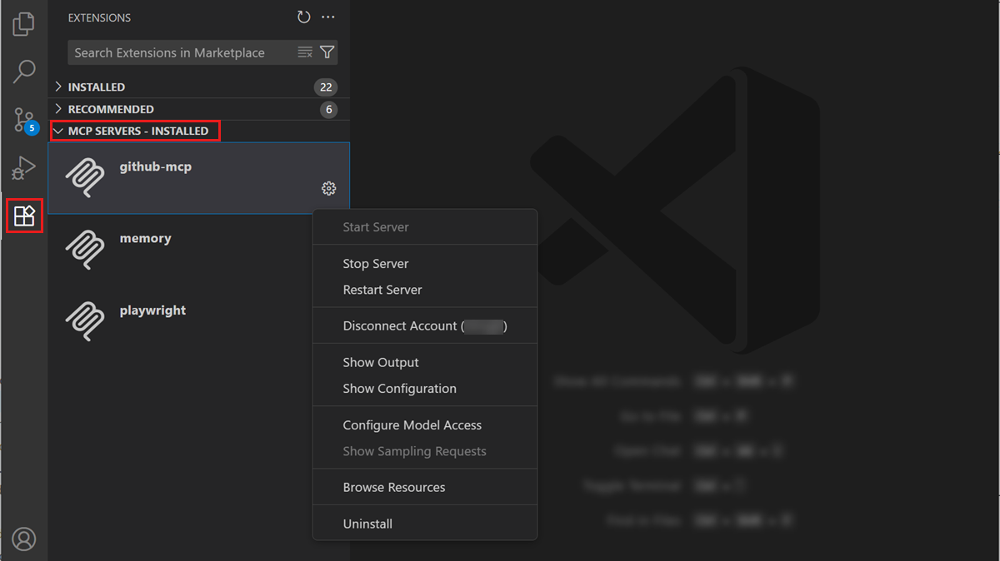
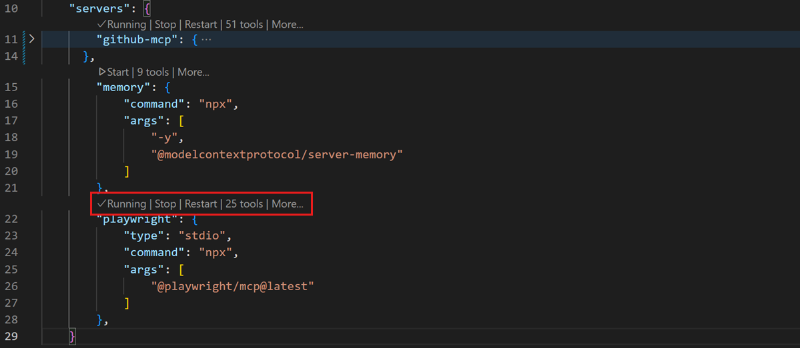
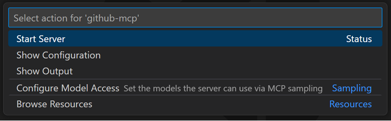
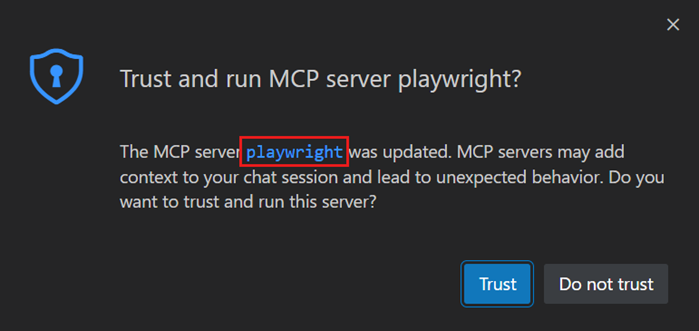
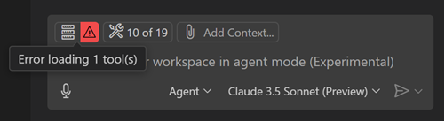

# VS Code'da MCP sunucuları ekleyin ve yönetin

[Model Context Protocol (MCP)](https://modelcontextprotocol.io/) AI modellerini harici araçlara ve hizmetlere bağlayan açık bir standarddır. Visual Studio Code'da MCP sunucuları dosya işlemleri, veritabanları veya harici API'ler gibi görevler için [araçlar](/docs/copilot/agents/agent-tools.md) sağlar. MCP sunucuları [kaynaklar, istemler ve etkileşimli uygulamalar](#other-mcp-capabilities) da sağlayabilir.

VS Code MCP sunucularını bir MCP sunucu galerisinden yüklemenizi sağlar. Varsayılan olarak bu galeri [GitHub MCP sunucu kayıt defterinden](https://github.com/mcp) sunucuları gösterir. Alternatif olarak çalışma alanınızda veya kullanıcı profilinizde `mcp.json` yapılandırma dosyasını güncelleyerek MCP sunucularını manuel ekleyebilirsiniz.

MCP sunucusu eklediğinizde VS Code otomatik olarak MCP sunucusu [araçlarını](/docs/copilot/agents/agent-tools.md), istemlerini ve kaynaklarını sohbette kullanılabilir hale getirir.

Bu makale MCP sunucularının nasıl ekleneceğini, yapılandırılacağını ve yönetileceğini kapsar. Sohbette araç kullanımı hakkında bilgi için [Ajanlarla araçları kullanın](/docs/copilot/agents/agent-tools.md) bölümüne bakın.

> [!TIP]
> Tüm sohbet özelleştirmelerinizi tek bir yerde keşfetmek, oluşturmak ve yönetmek için [Sohbet Özelleştirmeleri editörünü](/docs/copilot/customization/overview.md#chat-customizations-editor) (Önizleme) kullanın. Komut Paleti'nden **Chat: Open Chat Customizations** komutunu çalıştırın.

## Hızlı başlangıç: sohbette MCP sunucusu kullanın

MCP sunucusu yükleyip araçlarını sohbette kullanmak için şu adımları izleyin. Bu örnek tarayıcı aracılığıyla web sayfalarıyla etkileşim için [Playwright](https://github.com/microsoft/playwright-mcp) MCP sunucusunu kullanır.

1. Uzantılar görünümünü (`kb(workbench.view.extensions)`) açın ve arama alanına `@mcp playwright` yazın.

1. Kullanıcı profilinize Playwright MCP sunucusunu yüklemek için **Install** seçin.

1. İstendiğinde sunucuyu başlatmak için güvendiğinizi onaylayın. VS Code sunucunun araçlarını keşfeder ve sohbette kullanılabilir hale getirir.

1. Chat görünümünü (`kb(workbench.action.chat.open)`) açın ve Playwright araçlarını kullanan bir istem girin. Örneğin:

    ```prompt
    Go to code.visualstudio.com, decline the cookie banner, and give me a screenshot of the homepage.
    ```

    VS Code sayfayı tarayıcıda açmak ve ekran görüntüsü almak için Playwright araçlarını çağırır. Her araç çağrısı için onay istenebilir.

> [!TIP]
> Playwright MCP sunucusu için tüm kullanılabilir araçları görmek ve belirli araçları açıp kapatmak için sohbet girişindeki **Configure Tools** düğmesini seçin.

## MCP sunucusu ekleme

MCP sunucu galerisinden MCP sunucusu yüklemek için:

1. Uzantılar görünümünü (`kb(workbench.view.extensions)`) açın ve arama alanına `@mcp` yazın. Bu galerideki mevcut MCP sunucularının listesini gösterir.

1. MCP sunucusunu kullanıcı profilinize veya çalışma alanınıza yükleyebilirsiniz:

    * Kullanıcı profiline yüklemek için **Install** seçin.

    * Çalışma alanına yüklemek için MCP sunucusuna sağ tıklayın ve **Install in Workspace** seçin. Bu çalışma alanınızdaki `.vscode/mcp.json` dosyasını günceller.

1. MCP sunucu ayrıntılarını görüntülemek için listeden MCP sunucusunu seçerek ayrıntı sayfasını açın.

> [!CAUTION]
> Yerel MCP sunucuları makinenizde rastgele kod çalıştırabilir. Yalnızca [güvenilir kaynaklardan](#mcp-server-trust) sunucular ekleyin ve başlatmadan önce yayıncıyı ve sunucu yapılandırmasını inceleyin. AI kullanımının etkilerini anlamak için VS Code'da [Güvenlik dokümantasyonunu](/docs/copilot/security.md) okuyun.

### `mcp.json` dosyasını yapılandırma

MCP sunucularını `mcp.json` dosyasını düzenleyerek manuel yapılandırabilirsiniz. Bu dosyanın iki konumu vardır:

* **Çalışma alanı**: Projenizde `.vscode/mcp.json` oluşturun veya açın. MCP sunucu yapılandırmalarını ekibinizle paylaşmak için bu dosyayı sürüm kontrolüne dahil edin.
* **Kullanıcı profili**: [Kullanıcı profilinizdeki](/docs/configure/profiles.md) `mcp.json` dosyasını açmak için **MCP: Open User Configuration** komutunu çalıştırın. Burada yapılandırılan sunucular tüm çalışma alanlarınızda kullanılabilir. Birden fazla profil kullandığınızda her profilin kendi MCP sunucu yapılandırması olabilir.

Komut Paleti'nden (`kb(workbench.action.showCommands)`) **MCP: Add Server** çalıştırarak rehberli akışla sunucu ekleyebilirsiniz; hedef olarak **Workspace** veya **Global** seçebilirsiniz.

> [!IMPORTANT]
> API anahtarları gibi hassas bilgileri sabit kodlamaktan kaçının. Bunun yerine [giriş değişkenlerini](/docs/copilot/reference/mcp-configuration.md#input-variables-for-sensitive-data) veya ortam dosyalarını kullanın.

Aşağıdaki örnek uzak bir MCP sunucusu ve yerel bir MCP sunucusu yapılandıran `mcp.json` dosyasını gösterir:

```json
{
    "servers": {
        "github": {
            "type": "http",
            "url": "https://api.githubcopilot.com/mcp"
        },
        "playwright": {
            "command": "npx",
            "args": ["-y", "@microsoft/mcp-server-playwright"]
        }
    }
}
```

VS Code yapılandırma dosyası için IntelliSense sağlar. Tam yapılandırma şeması ve alan referansı için [MCP yapılandırma referansına](/docs/copilot/reference/mcp-configuration.md) bakın.

> [!NOTE]
> MCP sunucuları yapılandırıldıkları yerde çalışır. Kullanıcı profilinizdeki sunucular yerel olarak çalışır. [Uzak](/docs/remote/remote-overview.md) bağlıysanız ve sunucunun uzak makinede çalışmasını istiyorsanız bunu çalışma alanı ayarlarında veya uzak kullanıcı ayarlarında (**MCP: Open Remote User Configuration**) tanımlayın.

### MCP sunucusu eklemenin diğer seçenekleri

<details>
<summary>Dev container'a MCP sunucusu ekleme</summary>

MCP sunucuları `devcontainer.json` dosyası aracılığıyla Dev Container'larda yapılandırılabilir. Bu, MCP sunucu yapılandırmalarını konteynerize geliştirme ortamınızın parçası olarak dahil etmenizi sağlar.

Dev Container'da MCP sunucularını yapılandırmak için sunucu yapılandırmasını `customizations.vscode.mcp` bölümüne ekleyin:

```json
{
    "image": "mcr.microsoft.com/devcontainers/typescript-node:latest",
    "customizations": {
        "vscode": {
            "mcp": {
                "servers": {
                    "playwright": {
                        "command": "npx",
                        "args": ["-y", "@microsoft/mcp-server-playwright"]
                    }
                }
            }
        }
    }
}
```

Dev Container oluşturulduğunda VS Code otomatik olarak MCP sunucu yapılandırmalarını uzak `mcp.json` dosyasına yazar; konteynerize geliştirme ortamınızda kullanılabilir hale getirir.

</details>

<details>
<summary>MCP sunucularını otomatik keşfet</summary>

VS Code, Claude Desktop gibi diğer uygulamalardan MCP sunucu yapılandırmalarını otomatik olarak algılayabilir ve yeniden kullanabilir.

`setting(chat.mcp.discovery.enabled)` ayarıyla MCP sunucu yapılandırmasını keşfedecek araç(ları) seçebilirsiniz.

</details>

<details>
<summary>Komut satırından MCP sunucusu yükleme</summary>

MCP sunucusunu kullanıcı profilinize veya çalışma alanına eklemek için VS Code komut satırı arayüzünü de kullanabilirsiniz.

Kullanıcı profilinize MCP sunucusu eklemek için VS Code `--add-mcp` komut satırı seçeneğini kullanın ve `{\"name\":\"server-name\",\"command\":...}` biçiminde JSON sunucu yapılandırması sağlayın.

```bash
code --add-mcp "{\"name\":\"my-server\",\"command\": \"uvx\",\"args\": [\"mcp-server-fetch\"]}"
```

</details>

## Diğer MCP yetenekleri

Araçların ötesinde MCP sunucuları başka yetenekler de sağlayabilir:

| Yetenek | Açıklama | Nasıl kullanılır |
|------------|-------------|------------|
| **Kaynaklar** | MCP sunucularından dosyalar, veritabanı tabloları veya API yanıtları gibi verileri istemlerinizde bağlam olarak erişin. | Chat görünümünde **Add Context** > **MCP Resources** seçin. **MCP: Browse Resources** komutunu da kullanabilirsiniz. |
| **İstemler** | Yaygın görevler için MCP sunucularından önceden yapılandırılmış istemleri kullanın. | Sohbet girişinde `/<MCP sunucusu>.<istem>` yazın. |
| **MCP Uygulamaları** | Formlar, görselleştirmeler ve sürükle-bırak listeler gibi etkileşimli UI bileşenlerini doğrudan sohbette işleyin. | MCP sunucusu bunları desteklediğinde MCP Uygulamaları satır içi görünür. |

## MCP sunucularını sandbox'a alın

macOS ve Linux'ta yerel olarak çalışan stdio MCP sunucuları için dosya sistemi ve ağ erişimini kısıtlamak üzere sandbox'ı etkinleştirebilirsiniz. Sandbox'a alınan sunucular izole bir ortamda çalışır ve yalnızca açıkça izin verdiğiniz dosya yollarına ve ağ etki alanlarına erişebilir.

Bir sunucu için sandbox'ı etkinleştirmek için `mcp.json` dosyanızdaki sunucu yapılandırmasında `"sandboxEnabled": true` ayarlayın. `sandbox` nesnesiyle belirli dosya sistemi ve ağ kuralları ekleyerek sandbox kısıtlamalarını daha da özelleştirebilirsiniz.

Aşağıdaki örnek yerel bir MCP sunucusu için sandbox'ı etkinleştirmeyi ve erişimini yalnızca çalışma alanındaki dosyalara yazmaya ve belirli bir API etki alanına erişmeye kısıtlamayı gösterir:

```json
{
    "servers": {
        "myServer": {
            "type": "stdio",
            "command": "npx",
            "args": ["-y", "@example/mcp-server"],
            "sandboxEnabled": true,
            "sandbox": {
                "filesystem": {
                    "allowWrite": ["${workspaceFolder}"]
                },
                "network": {
                    "allowedDomains": ["api.example.com"]
                }
            }
        }
    }
}
```

Sandbox etkinleştirildiğinde sunucudan gelen araç çağrıları kontrollü ortamda çalıştığı için otomatik olarak onaylanır.

Tam sandbox yapılandırma şeması için [Sandbox yapılandırması](/docs/copilot/reference/mcp-configuration.md#sandbox-configuration) referansına bakın.

> [!NOTE]
> Sandbox şu anda Windows'ta mevcut değil.

## MCP sunucularını yönetme

VS Code MCP sunucularınızı başlatma veya durdurma, logları görüntüleme, kaldırma veya önbelleğe alınmış araçları temizleme gibi yönetmek için çeşitli seçenekler sağlar:

| Yöntem | Açıklama | |
|--------|-------------|---|
| **Uzantılar görünümü** | **MCP SERVERS - INSTALLED** bölümünde bir sunucuya sağ tıklayın veya dişli simgesini seçin. |  |
| **`mcp.json` editörü** | Yapılandırma dosyasını açın ve satır içi eylemleri (code lens) kullanın. Dosyayı açmak için **MCP: Open User Configuration** veya **MCP: Open Workspace Folder Configuration** kullanın. |  |
| **Komut Paleti** | **MCP: List Servers** çalıştırın, bir sunucu seçin ve bir eylem seçin. |  |

## VS Code'da MCP sunucularına erişimi merkezi yönetin

Kuruluşlar MCP sunucularına erişimi GitHub politikaları aracılığıyla merkezi olarak yönetebilir. [MCP sunucularına kurumsal erişim yönetimi](/docs/enterprise/ai-settings.md#configure-mcp-server-access) hakkında daha fazla bilgi edinin.

## MCP sunucularını otomatik başlatma

MCP sunucusu eklediğinizde veya yapılandırmasını değiştirdiğinizde VS Code sağladığı araçları keşfetmek için sunucuyu (yeniden) başlatması gerekir.

Yapılandırma değişiklikleri algılandığında MCP sunucusunun otomatik olarak yeniden başlaması için `setting(chat.mcp.autoStart)` ayarını (Deneysel) kullanabilirsiniz.

## MCP sunucu güveni

Çalışma alanınıza MCP sunucusu eklediğinizde veya yapılandırmasını değiştirdiğinizde başlatmadan önce sunucuya ve yeteneklerine güvendiğinizi onaylamanız gerekir. Sunucuyu ilk kez başlattığınızda VS Code sunucuya güvendiğinizi onaylamanız için bir iletişim kutusu gösterir. İletişim kutusunda MCP sunucu yapılandırmasını incelemek için bağlantıyı seçin.



MCP sunucusuna güvenmiyorsanız başlatılmaz ve sohbet istekleri sunucunun sağladığı araçlar kullanılmadan devam eder.

MCP sunucularınızın güvenini sıfırlamak için Komut Paleti'nden **MCP: Reset Trust** komutunu çalıştırın.

> [!WARNING]
> MCP sunucusunu doğrudan `mcp.json` dosyasından başlatırsanız sunucu yapılandırmasına güven onayı istenmez.

## MCP yapılandırmasını cihazlar arasında senkronize edin

[Ayarlar Senkronizasyonu](/docs/configure/settings-sync.md) etkinken ayarları ve yapılandırmaları cihazlar arasında senkronize edebilirsiniz; MCP sunucu yapılandırmaları dahil. Bu, tutarlı bir geliştirme ortamı korumanızı ve tüm cihazlarınızda aynı MCP sunucularına erişmenizi sağlar.

MCP sunucu yapılandırmasını Ayarlar Senkronizasyonu ile senkronize etmek için:

1. Komut Paleti'nden **Settings Sync: Configure** komutunu çalıştırın

1. Senkronize edilecek yapılandırmalar listesinde **MCP Servers** seçeneğini etkinleştirin

## MCP sunucularını giderme ve hata ayıklama

### MCP çıktı logu

VS Code MCP sunucusuyla bir sorunla karşılaştığında Chat görünümünde hata göstergesi görünür.



Sunucu loglarını görüntülemek için Chat görünümündeki hata bildirimini seçin, ardından **Show Output** seçeneğini seçin. Alternatif olarak Komut Paleti'nden **MCP: List Servers** çalıştırın, sunucuyu seçin, ardından **Show Output** seçin.


## Sık sorulan sorular

<details>
<summary>Docker kullanırken MCP sunucusu başlamıyor</summary>

Komut bağımsız değişkenlerinin doğru olduğunu ve konteynerin detached modda (`-d` seçeneği) çalışmadığını doğrulayın. MCP sunucu çıktısında hata iletileri için kontrol edebilirsiniz ([Sorun giderme](#troubleshoot-and-debug-mcp-servers) bölümüne bakın).

</details>

## İlgili kaynaklar

* [MCP yapılandırma referansı](/docs/copilot/reference/mcp-configuration.md)
* [Ajanlarla araçları kullanın](/docs/copilot/agents/agent-tools.md)
* [Model Context Protocol Dokümantasyonu](https://modelcontextprotocol.io/)
* [VS Code'da MCP Uygulamaları desteği](https://code.visualstudio.com/blogs/2026/01/26/mcp-apps-support)
* [Ajan eklentilerini keşfedin ve yönetin](/docs/copilot/customization/agent-plugins.md)
