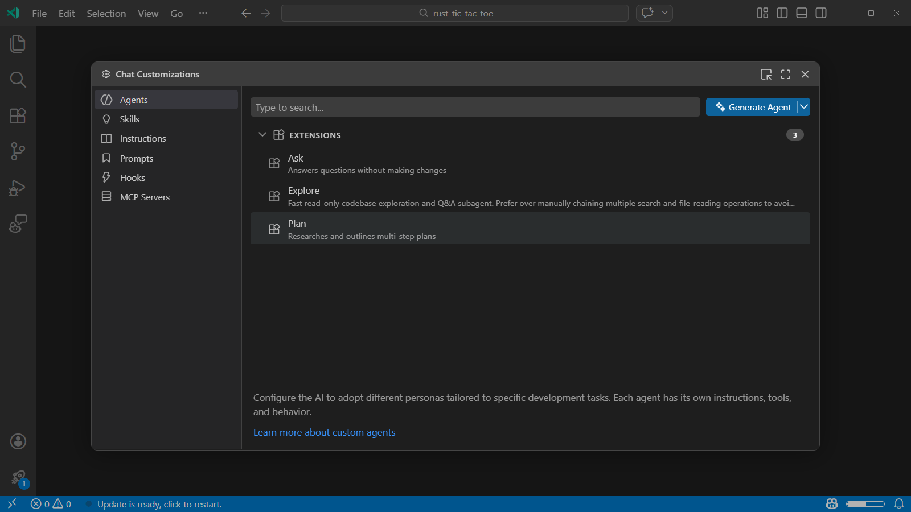

# Visual Studio Code'da AI'yı Özelleştirin

AI modelleri geniş genel bilgiye sahiptir ancak kod tabanınızı veya ekip uygulamalarınızı bilmez. AI'yı yetenekli yeni bir ekip üyesi gibi düşünün: harika kod yazar ama sizin sözleşmelerinizi, mimari kararlarınızı veya tercih ettiğiniz kütüphaneleri bilmez. Özelleştirme, bu bağlamı paylaşma yönteminizdir; böylece yanıtlar kodlama standartlarınıza, proje yapınıza ve iş akışlarınıza uyum sağlar.

Bu makale VS Code'daki özelleştirme seçeneklerini kapsar: özel talimatlar, prompt dosyaları, özel ajanlar, ajan becerileri, MCP sunucuları, ajan eklentileri ve dil modelleri.

## Hızlı referans

| Hedef | Kullanın | Ne zaman etkinleşir |
|------|-----|-------------------|
| Her yerde kodlama standartları uygula | [Her zaman açık talimatlar](#custom-instructions) | Her istekte otomatik olarak dahil edilir |
| Farklı dosya türleri için farklı kurallar | [Dosya tabanlı talimatlar](#custom-instructions) | Dosyalar bir desenle veya açıklamayla eşleştiğinde |
| Tekrarladığım yeniden kullanılabilir görev | [Prompt dosyaları](#prompt-files) | Eğik çizgi komutu çağırdığınızda |
| Scriptlerle çok adımlı iş akışını paketle | [Ajan becerileri](#agent-skills) | Görev beceri açıklamasıyla eşleştiğinde |
| Araç kısıtlamalarına sahip özelleştirilmiş AI kişiliği | [Özel ajanlar](#custom-agents) | Seçtiğinizde veya başka bir ajan ona devrettiğinde |
| Harici API'lere veya veritabanlarına bağlan | [MCP](#mcp-and-tools) | Görev araç açıklamasıyla eşleştiğinde |
| Ajan yaşam döngüsü noktalarında görevleri otomatikleştir | [Hooks](#hooks) | Ajan eşleşen yaşam döngüsü olayına ulaştığında |
| Marketplace'lerden önceden paketlenmiş özelleştirmeleri yükle | [Ajan eklentileri](#agent-plugins) (Önizleme) | Bir eklenti yüklediğinizde |

> [!TIP]
> **Prompt dosyaları vs özel ajanlar**: Prompt dosyaları, eğik çizgi komutları olarak çağrılan tek ve tekrarlanabilir görevler (örneğin bileşen iskelesi oluşturma) için en uygundur. Özel ajanlar, hangi araçların kullanılabilir olduğunu kontrol eden ve çok adımlı iş akışları için alt ajanları yönetebilen kalıcı kişilerdir.

## Özel talimatlar

[Özel talimatlar](/docs/copilot/customization/custom-instructions.md), AI'nın kod nasıl ürettiğini ve diğer geliştirme görevlerini nasıl yönettiğini otomatik olarak etkileyen ortak yönergeler ve kurallar tanımlamanızı sağlar. Her sohbet isteminde manuel olarak bağlam eklemek yerine, Markdown dosyasında özel talimatlar belirleyerek kodlama uygulamalarınız ve proje gereksinimlerinizle uyumlu tutarlı AI yanıtları sağlayın.

VS Code iki tür özel talimatı destekler:

* **Her zaman açık talimatlar**: her sohbet oturumuna otomatik olarak uygulanır.
* **Dosya tabanlı talimatlar**: dosya yolu desenlerine veya talimat açıklamasına göre uygulanır

Özel talimatları şunlar için kullanın:

* _Kodla nasıl_ çalışılacağını belgeleyin: kodlama standartları, tercih edilen teknolojiler veya proje gereksinimleri gibi
* Projenin hedefini, mimarisini ve dosya yapısını anlaması için AI'ya yardımcı olan proje genelinde bağlam sağlayın
* Test yazma, dokümantasyon veya kod incelemesi gibi görevlere özel yönergeler belirtin

## Ajan Becerileri

[Ajan Becerileri](/docs/copilot/customization/agent-skills.md), talimatlar, scriptler ve kaynaklar içeren klasörler aracılığıyla AI'ya özelleştirilmiş yetenekler ve iş akışları sunmanızı sağlar. Bu beceriler görev esasına göre isteğe bağlı yüklenir. Agent Skills, VS Code, GitHub Copilot CLI ve GitHub Copilot kodlama ajanı dahil birden çok AI ajanında çalışan [açık bir standarddır](https://agentskills.io).

Ajan Becerilerini şunlar için kullanın:

* Farklı GitHub Copilot araçları arasında çalışan yeniden kullanılabilir yetenekler oluşturun
* Test, hata ayıklama veya dağıtım süreçleri için özelleştirilmiş iş akışları tanımlayın
* Açık standart kullanarak yetenekleri AI topluluğuyla paylaşın
* Talimatlarla birlikte scriptler, örnekler ve diğer kaynakları dahil edin

## Prompt dosyaları

[Prompt dosyaları](/docs/copilot/customization/prompt-files.md), eğik çizgi komutları olarak da bilinir, yaygın görevler için istemi basitleştirmenizi, bunları doğrudan sohbette çağırabileceğiniz bağımsız Markdown dosyaları olarak kodlamanızı sağlar. Her prompt dosyası, göreve özel bağlam ve görevin nasıl gerçekleştirilmesi gerektiğine dair yönergeler içerir.

Prompt dosyalarını şunlar için kullanın:

* Yeni bileşen iskelesi oluşturma, testleri çalıştırma ve düzeltme veya pull request hazırlama gibi yaygın görevler için istemi basitleştirin
* Minimal bir uygulama planı oluşturma veya API çağrıları için mockup'lar oluşturma gibi özel ajanın varsayılan davranışını geçersiz kılın

## Özel ajanlar

[Özel ajanlar](/docs/copilot/customization/custom-agents.md), AI'nın veritabanı yönetimi, ön uç geliştirme veya planlama gibi belirli roller veya görevler için farklı kişilikler benimsemesini sağlar. Özel ajan, davranışını, yeteneklerini, araçlarını ve dil modeli tercihlerini tanımlayan bir Markdown dosyasında açıklanır.

Özel ajanları şunlar için kullanın:

* Belirli bir göreve veya role odaklanan uzman özel ajanlar oluşturun; yalnızca ilgili bağlam ve araçları verin
* Her ajanın sürecin belirli bir bölümünü yönettiği birden çok uzmanlaşmış ajanı orkestra ederek modüler iş akışları oluşturun
* Özel ajanları [alt ajanlar](/docs/copilot/agents/subagents.md) olarak çalıştırarak karmaşık görevler için bağlam kullanımını optimize edin

## MCP ve araçlar

[MCP ve araçlar](/docs/copilot/customization/mcp-servers.md), Model Context Protocol (MCP) aracılığıyla harici hizmetlere ve özelleştirilmiş araçlara bir geçit sağlar. Bu, ajanın kod ve terminalin ötesinde yeteneklerini genişletir; veritabanları, API'ler ve diğer geliştirme araçlarıyla etkileşime girmesini sağlar. MCP Uygulamaları, karmaşık etkileşimleri kolaylaştırmak için kontrol panelleri veya formlar gibi zengin kullanıcı deneyimleri tanımlamanızı sağlar.

MCP ve araçları şunlar için kullanın:

* Geliştirme ortamınızdan ayrılmadan veri sorgulamak ve analiz etmek için veritabanı araçlarına bağlanın
* Gerçek zamanlı bilgi almak veya işlem yapmak için harici API'lerle entegrasyon yapın

## Hooks

[Hooks](/docs/copilot/customization/hooks.md), ajan oturumları sırasında anahtar yaşam döngüsü noktalarında özel kabuk komutları çalıştırmanızı sağlar. Hook'lar, ajanın nasıl istendiğinden bağımsız olarak çalışan belirleyici, kod odaklı otomasyon sağlar.

Hook'ları şunlar için kullanın:

* Tehlikeli komutları çalıştırılmadan önce engelleyerek güvenlik politikalarını uygulayın
* Dosya düzenlemelerinden sonra biçimlendirici ve linter'ları çalıştırarak kod kalitesi iş akışlarını otomatikleştirin
* Uyumluluk için tüm araç çağrılarının denetim kaydını oluşturun
* Proje bağlamını ajan oturumlarına otomatik olarak enjekte edin

## Ajan eklentileri

> **Not:** Ajan eklentileri şu anda önizlemededir.

[Ajan eklentileri](/docs/copilot/customization/agent-plugins.md), eklenti marketplace'lerinden keşfedip yükleyebileceğiniz önceden paketlenmiş sohbet özelleştirmeleri paketleridir. Tek bir eklenti eğik çizgi komutları, beceriler, özel ajanlar, hook'lar ve MCP sunucuları sağlayabilir. Yüklenen eklentiler yerel olarak tanımladığınız özelleştirmelerin yanında görünür.

Ajan eklentilerini şunlar için kullanın:

* Eklenti marketplace'lerinden hazır özelleştirmeleri keşfedin ve yükleyin
* Topluluk tarafından katkıda bulunulan komutlar, beceriler ve araçlarla Copilot'u genişletin
* Özel depolar dahil ek marketplace'ler ekleyin

## Dil modelleri

[Dil modelleri](/docs/copilot/customization/language-models.md), belirli görevler için optimize edilmiş farklı AI modelleri arasından seçim yapmanızı sağlar. Kod üretimi, akıl yürütme veya görüntü işleme gibi özelleştirilmiş görevler için en iyi performansı almak için modeller arasında geçiş yapabilirsiniz. Daha fazla modele erişmek veya model barındırma üzerinde daha fazla kontrol sahibi olmak için kendi API anahtarınızı getirin.

Farklı dil modellerini şunlar için kullanın:

* Hızlı kod önerileri ve basit refactoring görevleri için hızlı bir model kullanın
* Karmaşık mimari kararlar veya detaylı kod incelemeleri için daha yetenekli bir modele geçin
* Deneysel modelleri kullanmak veya yerel olarak barındırılan modelleri kullanmak için kendi API anahtarınızı getirin

## Projenizi AI için ayarlayın

`/init` ile projenize özel özel talimatlar oluşturmak için projenizi AI için ayarlayın.

* [Open in VS Code](vscode://GitHub.Copilot-Chat/chat?prompt=%2Finit)

AI özelleştirmelerini artan şekilde uygulayın. Temellerle başlayın ve gerektikçe ekleyin.

1. **Projenizi başlatın**: Sohbette `/init` yazın; çalışma alanınızı analiz edecek ve kodlama standartları ve kod tabanınıza özel proje bağlamı içeren bir `.github/copilot-instructions.md` dosyası oluşturacaktır. Oluşturulan talimatları inceleyin ve iyileştirin.

1. **Hedefli kurallar ekleyin**: Kod tabanınızın farklı bölümleri için dil sözleşmeleri veya framework kalıpları gibi belirli kurallar uygulamak üzere dosya tabanlı `*.instructions.md` dosyaları oluşturun.

1. **Tekrarlayan görevleri otomatikleştirin**: Bileşen oluşturma, kod incelemeleri veya dokümantasyon gibi yaygın iş akışları için prompt dosyaları oluşturun. Sorun takipçileri veya veritabanları gibi harici hizmetlere bağlanmak için MCP sunucuları ekleyin.

1. **Özelleştirilmiş iş akışları oluşturun**: Belirli roller veya proje aşamaları için özel ajanlar oluşturun. Yeniden kullanılabilir yetenekleri paylaşmak ve bağlam kullanımını en aza indirmek için ajan becerileri olarak paketleyin.

1. **AI ile özelleştirmeler oluşturun**: Sohbette `/create-prompt`, `/create-instruction`, `/create-skill`, `/create-agent` veya `/create-hook` yazın; herhangi bir özelleştirme dosyasını AI yardımıyla oluşturun. İstediğinizi açıklayın; ajan açıklayıcı sorular sorar ve dosyayı üretir. Devam eden bir sohbetten "bunu beceri olarak kaydet" veya "bunu yeniden kullanılabilir prompt'a dönüştür" gibi doğal dilde sorarak özelleştirmeleri de çıkarabilirsiniz.

## Sohbet Özelleştirmeleri editörü

> [!NOTE]
> Sohbet Özelleştirmeleri editörü şu anda önizlemededir.

Sohbet Özelleştirmeleri editörü, tek tek dosyalar ve komutlarla çalışmak yerine tüm sohbet özelleştirmelerinizi tek bir yerde keşfetmenizi, oluşturmanızı ve yönetmenizi sağlar.

Sohbet Özelleştirmeleri editörünü açmak için Komut Paleti'nden (`kb(workbench.action.showCommands)`) **Chat: Open Chat Customizations** komutunu çalıştırın.

Editör kenar çubuğu yedi özelleştirme kategorisini listeler:

* **Agents** - özelleştirilmiş AI kişilikleri için özel ajanlar
* **Skills** - talimatlar, scriptler ve kaynaklarla ajan becerileri
* **Instructions** - kodlama standartları ve yönergeler için özel talimat dosyaları
* **Prompts** - tekrarlanabilir görevler için prompt dosyaları
* **Hooks** - yaşam döngüsü otomasyon scriptleri
* **MCP Servers** - marketplace tarama ve yükleme ile harici araç entegrasyonları

Mevcut özelleştirmeleri görüntülemek için bir kategori seçin. Her kategoriden şunları yapabilirsiniz:

* Çalışma alanınız veya kullanıcı profiliniz için yeni özelleştirmeler oluşturun (AI destekli oluşturma seçeneği ile)
* Ad, açıklama veya dosya adına göre arayın ve filtreleyin
* Düzenlemek için bir öğe seçin; gömülü kod editöründe açılır
* MCP sunucuları bölümünde marketplace'ten MCP sunucularına göz atın ve yükleyin

## Özelleştirme sorunlarını giderme

Özelleştirme dosyalarınız uygulanmıyorsa veya beklenmedik davranışlara neden oluyorsa, sorunları tanımlamak için sohbet özelleştirme tanılamaları görünümünü kullanın.

Yüklenen tüm özel ajanları, prompt dosyalarını, talimat dosyalarını ve becerileri sözdizimi hataları, geçersiz yapılandırmalar veya kaynak yükleme sorunları gibi hatalarla birlikte görmek için Chat görünümünde **Configure Chat (dişli simgesi)** > **Diagnostics** seçin. [VS Code'da AI sorun giderme](/docs/copilot/troubleshooting.md) hakkında daha fazla bilgi edinin.

## İlgili kaynaklar

* [Özel talimatlar oluşturun](/docs/copilot/customization/custom-instructions.md)
* [Ajan Becerilerini kullanın](/docs/copilot/customization/agent-skills.md)
* [Yeniden kullanılabilir prompt dosyaları oluşturun](/docs/copilot/customization/prompt-files.md)
* [Özel ajanlar oluşturun](/docs/copilot/customization/custom-agents.md)
* [Dil modelleri seçin](/docs/copilot/customization/language-models.md)
* [MCP sunucuları ekleyin ve yönetin](/docs/copilot/customization/mcp-servers.md)
* [Yaşam döngüsü otomasyonu için hook'ları kullanın](/docs/copilot/customization/hooks.md)
* [Ajan eklentilerini keşfedin ve yönetin](/docs/copilot/customization/agent-plugins.md)
