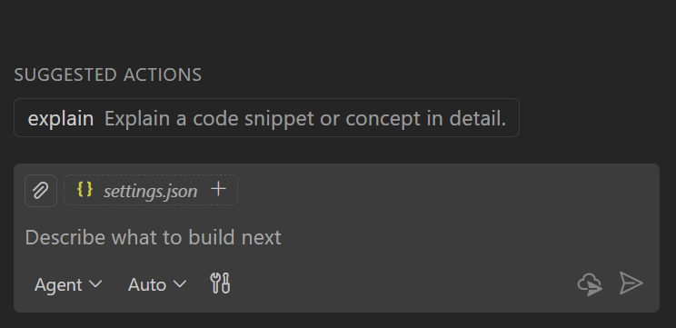

# VS Code'da prompt dosyaları kullanın

Prompt dosyaları, eğik çizgi komutları olarak da bilinir, yaygın görevler için istemi basitleştirmenizi; bunları doğrudan sohbette çağırabileceğiniz bağımsız Markdown dosyaları olarak kodlamanızı sağlar. Her prompt dosyası göreve özel bağlam ve görevin nasıl gerçekleştirilmesi gerektiğine dair yönergeler içerir.

Otomatik uygulanan [özel talimatlardan](/docs/copilot/customization/custom-instructions.md) farklı olarak, prompt dosyalarını sohbette manuel olarak çağırırsınız.

Prompt dosyalarını şunlar için kullanın:

* Yeni bileşen iskelesi oluşturma, testleri çalıştırma ve düzeltme veya pull request hazırlama gibi yaygın görevler için istemi basitleştirin
* Minimal bir uygulama planı oluşturma veya API çağrıları için mockup'lar oluşturma gibi özel ajanın varsayılan davranışını geçersiz kılın

> [!TIP]
> Tüm sohbet özelleştirmelerinizi tek bir yerde keşfetmek, oluşturmak ve yönetmek için [Sohbet Özelleştirmeleri editörünü](/docs/copilot/customization/overview.md#chat-customizations-editor) (Önizleme) kullanın. Komut Paleti'nden **Chat: Open Chat Customizations** komutunu çalıştırın.

## Prompt dosyası konumları

Belirli bir çalışma alanı için veya tüm çalışma alanlarınızda kullanılabilen kullanıcı düzeyinde prompt dosyalarını tanımlayabilirsiniz.

| Kapsam | Varsayılan dosya konumu |
|-------|-----------------------|
| Çalışma alanı | `.github/prompts` klasörü |
| Kullanıcı profili | Geçerli [VS Code profili](/docs/configure/profiles.md) `prompts` klasörü |

Çalışma alanı prompt dosyaları için ek dosya konumlarını `setting(chat.promptFilesLocations)` ayarıyla yapılandırabilirsiniz.

## Prompt dosyası formatı

Prompt dosyaları `.prompt.md` uzantılı Markdown dosyalarıdır. İsteğe bağlı YAML frontmatter başlığı prompt'un davranışını yapılandırır:

| Alan | Gerekli | Açıklama |
| --- | --- | --- |
| `description` | Hayır | Prompt'un kısa açıklaması. |
| `name` | Hayır | Sohbette `/` yazdıktan sonra kullanılan prompt adı. Belirtilmezse dosya adı kullanılır. |
| `argument-hint` | Hayır | Kullanıcıların promptla nasıl etkileşime gireceğine rehberlik etmek için sohbet giriş alanında gösterilen ipucu metni. |
| `agent` | Hayır | Prompt'u çalıştırmak için kullanılan ajan: `ask`, `agent`, `plan` veya [özel ajan](/docs/copilot/customization/custom-agents.md) adı. Varsayılan olarak geçerli ajan kullanılır. Araçlar belirtilirse varsayılan ajan `agent` olur. |
| `model` | Hayır | Prompt çalıştırılırken kullanılan dil modeli. Belirtilmezse model seçicide şu an seçili model kullanılır. |
| `tools` | Hayır | Bu prompt için kullanılabilir araç veya araç seti adları listesi. Yerleşik araçlar, araç setleri, MCP araçları veya uzantılar tarafından katkıda bulunulan araçları dahil edebilir. Bir MCP sunucusunun tüm araçlarını dahil etmek için `<server name>/*` formatını kullanın.<br/>[Sohbette araçlar](/docs/copilot/agents/agent-tools.md) hakkında daha fazla bilgi edinin. |

> [!NOTE]
> Prompt çalıştırılırken belirli bir araç kullanılamıyorsa yoksayılır.

Gövde Markdown formatında prompt metnini içerir. AI'nın takip etmesini istediğiniz belirli talimatları, yönergeleri veya diğer ilgili bilgileri sağlayın.

Markdown bağlantıları kullanarak diğer çalışma alanı dosyalarına atıfta bulunabilirsiniz. Bu dosyalara göreli yollarla referans verin ve prompt dosyasının konumuna göre yolların doğru olduğundan emin olun.

Gövde metninde ajan araçlarına atıfta bulunmak için `#tool:<tool-name>` sözdizimini kullanın. Örneğin `githubRepo` aracına atıfta bulunmak için `#tool:githubRepo` kullanın.

Bir prompt dosyası içinde değişkenlere `${variableName}` sözdizimiyle atıfta bulunabilirsiniz. Aşağıdaki değişkenlere atıfta bulunabilirsiniz:

* Çalışma alanı değişkenleri - `${workspaceFolder}`, `${workspaceFolderBasename}`
* Seçim değişkenleri - `${selection}`, `${selectedText}`
* Dosya bağlamı değişkenleri - `${file}`, `${fileBasename}`, `${fileDirname}`, `${fileBasenameNoExtension}`
* Giriş değişkenleri - `${input:variableName}`, `${input:variableName:placeholder}` (değerleri sohbet giriş alanından prompt'a geçirin)

Aşağıdaki örnekler prompt dosyalarının nasıl kullanılacağını gösterir. Topluluk tarafından katkıda bulunulan daha fazla örnek için [Awesome Copilot deposuna](https://github.com/github/awesome-copilot/tree/main) bakın.

<details>
<summary>Örnek: React form bileşeni oluştur</summary>

```markdown
---
agent: 'agent'
model: GPT-4o
tools: ['githubRepo', 'search/codebase']
description: 'Generate a new React form component'
---
Your goal is to generate a new React form component based on the templates in #tool:githubRepo contoso/react-templates.

Ask for the form name and fields if not provided.

Requirements for the form:
* Use form design system components: [design-system/Form.md](../docs/design-system/Form.md)
* Use `react-hook-form` for form state management:
* Always define TypeScript types for your form data
* Prefer *uncontrolled* components using register
* Use `defaultValues` to prevent unnecessary rerenders
* Use `yup` for validation:
* Create reusable validation schemas in separate files
* Use TypeScript types to ensure type safety
* Customize UX-friendly validation rules
```

</details>

<details>
<summary>Örnek: değişkenleri kullanma</summary>

```markdown
---
description: 'Generate unit tests for the current file'
agent: 'agent'
tools: ['search', 'read', 'edit']
---
Generate unit tests for [${fileBasename}](${file}).

* Place the test file in the same directory: ${fileDirname}
* Name the test file: ${fileBasenameNoExtension}.test.ts
* Test framework: ${input:framework:jest or vitest}
* Follow testing conventions in: [testing.md](../docs/testing.md)

If there is a selection, only generate tests for this code:
${selection}
```

Bu örnek çalışma alanı, dosya bağlamı, seçim ve giriş değişkenlerini birleştirir. Prompt'u çalıştırdığınızda Copilot `${file}`, `${fileBasename}`, `${fileDirname}` ve `${fileBasenameNoExtension}` değerlerini etkin editörden çözer, seçili metin için `${selection}` kullanır ve `${input:framework}` için bir değer girmenizi ister.

</details>

<details>
<summary>Örnek: REST API güvenlik incelemesi yap</summary>

```markdown
---
agent: 'ask'
model: Claude Sonnet 4
description: 'Perform a REST API security review'
---
Perform a REST API security review and provide a TODO list of security issues to address.

* Ensure all endpoints are protected by authentication and authorization
* Validate all user inputs and sanitize data
* Implement rate limiting and throttling
* Implement logging and monitoring for security events

Return the TODO list in a Markdown format, grouped by priority and issue type.
```

</details>

## Prompt dosyası oluşturma

Prompt dosyası oluşturduğunuzda çalışma alanınızda mı yoksa kullanıcı profilinizde mi saklayacağınızı seçin. Çalışma alanı prompt dosyaları yalnızca o çalışma alanına uygulanır; kullanıcı prompt dosyaları birden fazla çalışma alanında kullanılabilir.

Prompt dosyası oluşturmak için:

> [!TIP]
> **Configure Prompt Files** menüsünü hızlıca açmak için sohbet girişinde `/prompts` yazın.

1. Chat görünümünde **Configure Chat** (dişli simgesi) > **Prompt Files** seçin, ardından **New prompt file** seçin.

    

    Alternatif olarak Komut Paleti'nden (`kb(workbench.action.showCommands)`) **Chat: New Prompt File** veya **Chat: New Untitled Prompt File** komutunu kullanın.

1. Prompt dosyasının kapsamını seçin:

    * **Çalışma alanı**: yalnızca o çalışma alanında kullanmak için prompt dosyasını çalışma alanının `.github/prompts` klasöründe oluşturur. Çalışma alanınız için daha fazla prompt klasörü eklemek için `setting(chat.promptFilesLocations)` ayarını kullanın.

    * **Kullanıcı profili**: tüm çalışma alanlarınızda kullanmak için prompt dosyasını [mevcut profil klasöründe](/docs/configure/profiles.md) oluşturur.

1. Prompt dosyanız için bir dosya adı girin. Sohbette `/` yazdığınızda görünen varsayılan addır.

1. Markdown biçimlendirmesi kullanarak sohbet promptunu yazın.

    * Prompt'un açıklamasını, ajanını, araçlarını ve diğer ayarlarını yapılandırmak için dosyanın üst kısmındaki YAML frontmatter'ı doldurun.
    * Dosyanın gövdesine prompt için talimatlar ekleyin.

Mevcut bir prompt dosyasını değiştirmek için Chat görünümünde **Configure Chat** > **Prompt Files** seçin, ardından listeden bir prompt dosyası seçin. Alternatif olarak Komut Paleti'nden (`kb(workbench.action.showCommands)`) **Chat: Configure Prompt Files** komutunu kullanın ve Quick Pick'ten prompt dosyasını seçin.

### AI ile prompt dosyası oluşturma

Görevin açıklamasına dayalı olarak AI ile bir prompt dosyası oluşturabilirsiniz. Sohbette `/create-prompt` yazın ve otomatikleştirmek istediğiniz görevi açıklayın (örneğin, "birim testleri oluşturmak için bir prompt"). Ajan açıklayıcı sorular sorar, uygun frontmatter ve talimatlarla bir `.prompt.md` dosyası oluşturur ve çalışma alanı ile kullanıcı depolama arasında seçim sunar.

Devam eden bir sohbetteki yeniden kullanılabilir bir prompt'u da çıkarabilirsiniz. Örneğin, çok turlu bir sohbet oturumundan sonra "bunu yeniden kullanılabilir prompt'a dönüştür" veya "bu iş akışını prompt olarak kaydet" deyin; ajan iş akışını yakalayan bir prompt dosyası oluşturur.

## Sohbette prompt dosyası kullanma

Prompt dosyasını çalıştırmak için birkaç seçeneğiniz var:

* Chat görünümünde sohbet giriş alanına `/` ve ardından prompt adını yazın. [Ajan becerileri](/docs/copilot/customization/agent-skills.md) de prompt dosyalarıyla birlikte eğik çizgi komutları olarak görünür.

    Sohbet giriş alanına ek bilgi ekleyebilirsiniz. Örneğin `/create-react-form formName=MyForm` veya `/create-api for listing customers`.

* Komut Paleti'nden (`kb(workbench.action.showCommands)`) **Chat: Run Prompt** komutunu çalıştırın ve Quick Pick'ten bir prompt dosyası seçin.

* Prompt dosyasını editörde açın ve editör başlık alanındaki oynat düğmesine basın. Prompt'u mevcut sohbet oturumunda çalıştırmayı veya yeni bir sohbet oturumu açmayı seçebilirsiniz.

    Bu seçenek prompt dosyalarınızı hızlıca test etmek ve üzerinde çalışmak için kullanışlıdır.

> [!TIP]
> Yeni bir sohbet oturumu başlattığınızda önerilen eylemler olarak prompt'ları göstermek için `setting(chat.promptFilesRecommendations)` ayarını kullanın.
>
> 

## Araç listesi önceliği

Özel ajan ve prompt dosyası için `tools` meta veri alanını kullanarak kullanılabilir araç listesini belirtebilirsiniz. Prompt dosyaları ayrıca `agent` meta veri alanını kullanarak özel bir ajana atıfta bulunabilir.

Sohbette kullanılabilir araç listesi şu öncelik sırasına göre belirlenir:

1. Prompt dosyasında belirtilen araçlar (varsa)
2. Prompt dosyasındaki referans verilen özel ajandan araçlar (varsa)
3. Seçilen ajan için varsayılan araçlar (varsa)

## Kullanıcı prompt dosyalarını cihazlar arasında senkronize edin

VS Code, [Ayarlar Senkronizasyonu](/docs/configure/settings-sync.md) kullanarak kullanıcı prompt dosyalarınızı birden fazla cihazda senkronize edebilir.

Kullanıcı prompt dosyalarınızı senkronize etmek için prompt ve talimat dosyaları için Ayarlar Senkronizasyonu etkinleştirin:

1. [Ayarlar Senkronizasyonu](/docs/configure/settings-sync.md) etkin olduğundan emin olun.

1. Komut Paleti'nden (`kb(workbench.action.showCommands)`) **Settings Sync: Configure** komutunu çalıştırın.

1. Senkronize edilecek ayarlar listesinden **Prompts and Instructions** seçin.

## Etkili prompt yazma ipuçları

* Prompt'un ne başarması gerektiğini ve beklenen çıktı formatını açıkça açıklayın.

* AI yanıtlarına rehberlik etmek için beklenen giriş ve çıktı örnekleri sağlayın.

* Her promptta yönergeleri tekrarlamak yerine özel talimatlara atıfta bulunmak için Markdown bağlantıları kullanın.

* Prompt'ları daha esnek hale getirmek için `${selection}` gibi yerleşik değişkenlerden ve giriş değişkenlerinden yararlanın.

* Prompt'larınızı test etmek için editör oynat düğmesini kullanın ve sonuçlara göre iyileştirin.

## Sık sorulan sorular

### Prompt dosyasının nereden geldiğini nasıl anlarım?

Prompt dosyaları farklı kaynaklardan gelebilir: yerleşik, profilinizde kullanıcı tanımlı, mevcut çalışma alanınızda çalışma alanı tanımlı veya uzantı tarafından katkıda bulunulan.

Prompt dosyasının kaynağını belirlemek için:

1. Komut Paleti'nden (`kb(workbench.action.showCommands)`) **Chat: Configure Prompt Files** seçin.
1. Listede prompt dosyasının üzerine gelin. Kaynak konum bir ipucunda gösterilir.

> [!TIP]
> Yüklenen tüm prompt dosyalarını ve hataları görmek için sohbet özelleştirme tanılamaları görünümünü kullanın. Chat görünümünde sağ tıklayın ve **Diagnostics** seçin. [VS Code'da AI sorun giderme](/docs/copilot/troubleshooting.md) hakkında daha fazla bilgi edinin.

## İlgili kaynaklar

* [Özel talimatlar oluşturun](/docs/copilot/customization/custom-instructions.md)
* [Sohbette araçları yapılandırın](/docs/copilot/agents/agent-tools.md)
* [Topluluk tarafından katkıda bulunulan talimatlar, prompt'lar ve özel ajanlar](https://github.com/github/awesome-copilot)
