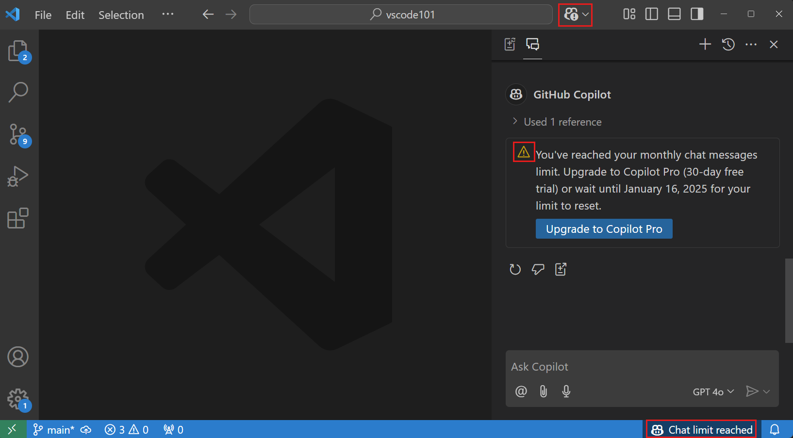
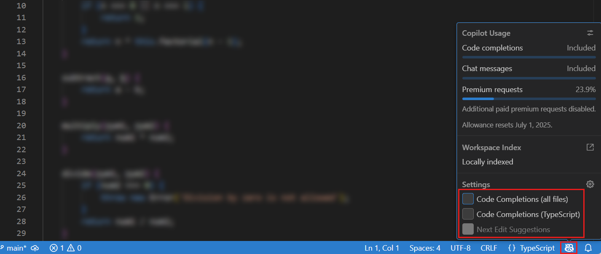
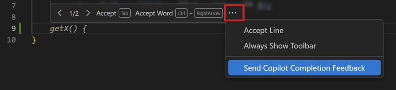
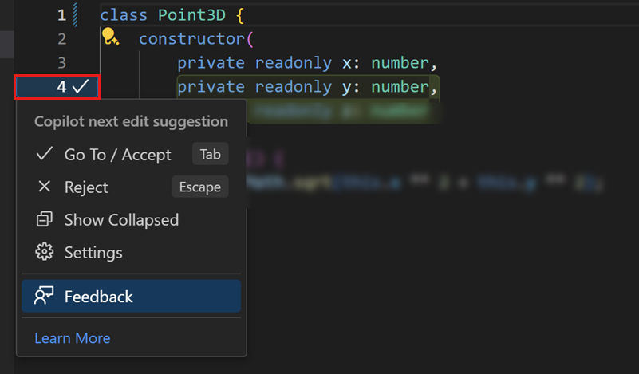
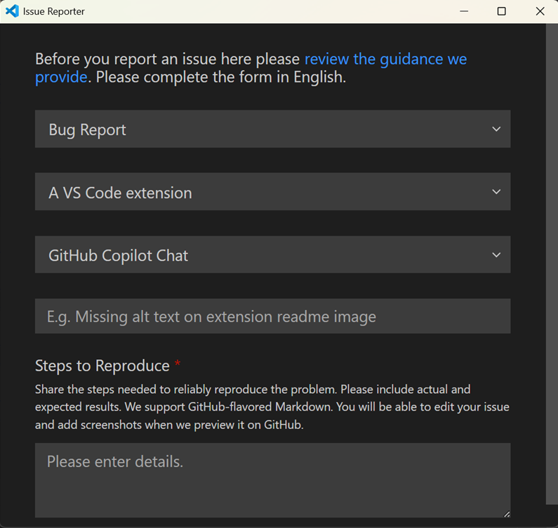

# GitHub Copilot sıkça sorulan sorular

Bu makale Visual Studio Code'da GitHub Copilot kullanımına ilişkin sıkça sorulan soruları yanıtlar.

## GitHub Copilot aboneliği

### Copilot aboneliğini nasıl alabilirim?

GitHub Copilot erişiminin farklı yolları vardır:

| Kullanıcı Türü | Açıklama |
|-----------------|----------|
| Bireysel | <ul><li>Ücretsiz satır içi öneriler ve sohbet etkileşimleri aylık limitiyle temel işlevselliği keşfetmek için GitHub Copilot Free kurulumu yapın.</li><li>Daha fazla esneklik ve premium özelliklere erişim için ücretli GitHub Copilot planına kaydolun.</li><li>Tüm seçenekler için [Kendiniz için GitHub Copilot kurulumu](https://docs.github.com/en/copilot/setting-up-github-copilot/setting-up-github-copilot-for-yourself) sayfasına bakın.</li></ul> |
| Organizasyon/Kurumsal üye | <ul><li>GitHub Copilot aboneliği olan bir organizasyonun veya kurumsal üyeyse, <https://github.com/settings/copilot> adresine gidip "Organizasyondan Copilot al" altında erişim talep ederek Copilot erişimi isteyebilirsiniz.</li><li>Organizasyonunuz için Copilot'u etkinleştirmek için [Organizasyonunuz için GitHub Copilot kurulumu](https://docs.github.com/en/copilot/setting-up-github-copilot/setting-up-github-copilot-for-your-organization) sayfasına bakın.</li></ul> |

### GitHub hesabıyla oturum açmanın avantajı nedir?

GitHub Copilot erişimi olan bir GitHub hesabıyla oturum açmanın şu faydaları vardır:

* [Artırılmış aylık sohbet etkileşimi limiti](https://docs.github.com/en/copilot/get-started/plans#comparing-copilot-plans)
* Otomatik model seçiminin ötesinde sohbette [premium dil modellerine erişim](https://docs.github.com/en/copilot/reference/ai-models/supported-models#supported-ai-models-per-copilot-plan)
* [Kendi dil modeli anahtarınızı getirme](/docs/copilot/customization/language-models.md#bring-your-own-language-model-key) (BYOK) ile daha fazla modele erişim
* [Uzak depo indekslemesi ve semantik kod araması](/docs/copilot/reference/workspace-context.md#remote-index)
* [Copilot kod incelemesi](https://docs.github.com/en/copilot/concepts/agents/code-review)
* [Copilot içerik hariç tutmaları](https://docs.github.com/en/copilot/how-tos/configure-content-exclusion/exclude-content-from-copilot)
* Arka plan yürütme için [Copilot kodlama ajanına görev devretme](/docs/copilot/agents/cloud-agents.md#github-copilot-coding-agent)

Copilot planınıza bağlı olarak farklı erişim ve limit düzeyleriniz olabilir. [GitHub Copilot planları](https://docs.github.com/en/copilot/get-started/plans) hakkında daha fazla bilgi için bakın.

### Copilot kullanımımı nasıl izleyebilirim?

Mevcut Copilot kullanımınızı VS Code Durum Çubuğu üzerinden erişilebilir Copilot durum panosunda görüntüleyebilirsiniz. Panel şu bilgileri gösterir:

- **Satır içi öneriler**: Mevcut ay boyunca kullandığınız satır içi öneri kotanızın yüzdesi.
- **Chat mesajları**: Mevcut ay boyunca kullandığınız chat istekleri kotanızın yüzdesi.
- **Premium istekler**: Mevcut ay boyunca kullandığınız premium istek kotanızın yüzdesi.
- **Premium istek aşımı**: Mevcut ay boyunca kullandığınız aşım premium istek sayısı.

[Kullanım ve hakları izleme](https://docs.github.com/en/copilot/managing-copilot/monitoring-usage-and-entitlements/monitoring-your-copilot-usage-and-entitlements) hakkında daha fazla bilgi için GitHub Copilot dokümantasyonunu ziyaret edin.

### Satır içi öneri veya chat etkileşimi limitime ulaştım

Satır içi öneri ve chat etkileşimi limitiniz her ay sıfırlanır. Yalnızca chat etkileşimi limitine ulaştıysanız satır içi önerileri kullanmaya devam edebilirsiniz. Benzer şekilde satır içi öneri limitine ulaştıysanız sohbeti kullanmaya devam edebilirsiniz.

Copilot Free kullanıcıları için daha fazla satır içi öneri ve chat etkileşimine erişmek üzere VS Code'dan doğrudan [ücretli plana](https://docs.github.com/en/copilot/concepts/billing/individual-plans) kaydolabilirsiniz. Alternatif olarak Copilot'u ücretsiz kullanmaya devam etmek için ay sonuna kadar bekleyebilirsiniz.

Ücretli plandaysanız ve tüm premium isteklerinizi kullandıysanız ayın geri kalanında dahil modellerden biriyle Copilot kullanmaya devam edebilirsiniz. Ayrıca plan limitinizin ötesinde ek premium istekler talep edebilirsiniz. [Ek premium istek alma](https://docs.github.com/en/copilot/concepts/billing/copilot-requests#what-if-i-run-out-of-premium-requests) hakkında daha fazla bilgi için GitHub Copilot dokümantasyonuna bakın.

### Copilot aboneliğim VS Code'da tespit edilmiyor

Visual Studio Code'da sohbet kullanmak için GitHub Copilot erişimi olan bir GitHub hesabıyla Visual Studio Code'a oturum açmış olmalısınız.

- Copilot aboneliğiniz başka bir GitHub hesabıyla ilişkiliyse mevcut GitHub hesabınızdan çıkış yapıp başka bir hesapla oturum açın. Mevcut GitHub hesabınızdan çıkış yapmak için Aktivite Çubuğu'ndaki **Accounts** menüsünü kullanın. Daha fazla bilgi için [Copilot ile farklı GitHub hesabı kullanma](/docs/copilot/setup.md#use-a-different-github-account-with-copilot) sayfasına bakın.

- Copilot aboneliğinizin [GitHub Copilot ayarlarında](https://github.com/settings/copilot) hala etkin olduğunu doğrulayın.

- GHE.com'da yönetilen kullanıcı hesabı için Copilot planı kullanıyorsanız oturum açmadan önce bazı ayarları güncellemeniz gerekir. [GHE.com hesabıyla GitHub Copilot kullanma](https://docs.github.com/en/copilot/managing-copilot/configure-personal-settings/using-github-copilot-with-an-account-on-ghecom) sayfasına bakın.

### Copilot için hesapları nasıl değiştirebilirim?

Copilot aboneliğiniz başka bir GitHub hesabıyla ilişkiliyse VS Code'daki GitHub hesabınızdan çıkış yapıp başka bir hesapla oturum açın.

Daha fazla bilgi için [Copilot ile farklı GitHub hesabı kullanma](/docs/copilot/setup.md#use-a-different-github-account-with-copilot) sayfasına bakın.

## Genel Copilot soruları

### Copilot'u VS Code'dan nasıl kaldırırım?

VS Code'daki yerleşik AI özelliklerini `setting(chat.disableAIFeatures)` ayarıyla devre dışı bırakabilirsiniz; VS Code'daki diğer özellikleri yapılandırdığınız gibi. Bu, VS Code'daki chat veya satır içi öneriler gibi özellikleri devre dışı bırakır ve gizler; Copilot uzantılarını da devre dışı bırakır. Ayarı çalışma alanı veya kullanıcı düzeyinde yapılandırabilirsiniz.

Alternatif olarak ayara erişmek için başlık çubuğundaki Chat menüsünden **Learn How to Hide AI Features** eylemini kullanın.

> [!NOTE]
> Daha önce yerleşik AI özelliklerini devre dışı bıraktıysanız seçiminiz yeni VS Code sürümüne güncellemede korunur.

### Copilot için ağ ve güvenlik duvarı yapılandırması

- Sizin veya organizasyonunuz güvenlik duvarı veya proxy sunucusu gibi güvenlik önlemleri kullanıyorsa belirli etki alanı URL'lerini "izin listesine" dahil etmek ve belirli bağlantı noktaları ile protokolleri açmak faydalı olabilir. [GitHub Copilot için güvenlik duvarı ayarlarında sorun giderme](https://docs.github.com/en/copilot/troubleshooting-github-copilot/troubleshooting-firewall-settings-for-github-copilot) hakkında daha fazla bilgi edinin.

- Şirket ekipmanında çalışıyorsanız ve kurumsal ağa bağlanıyorsanız VPN veya HTTP proxy sunucusu üzerinden internete bağlanıyor olabilirsiniz. Bazı durumlarda bu tür ağ kurulumları GitHub Copilot'un GitHub sunucusuna bağlanmasını engelleyebilir. [GitHub Copilot için ağ hatalarında sorun giderme](https://docs.github.com/en/copilot/troubleshooting-github-copilot/troubleshooting-network-errors-for-github-copilot) hakkında daha fazla bilgi edinin.

### İsteğim hız sınırına takıldı

Bu hata Copilot istekleri için hız limitini aştığınızı gösterir. GitHub herkesin Copilot hizmetine adil erişimini sağlamak ve kötüye kullanıma karşı korumak için hız limitleri kullanır.

Hız limitleri ve hız sınırına takıldığınızda ne yapılacağı hakkında [GitHub Copilot için hız limitleri](https://docs.github.com/en/copilot/troubleshooting-github-copilot/rate-limits-for-github-copilot) sayfasına bakın.

### Copilot uzantılarının ön sürüm yapıları var mı?

Evet, en son özellikleri ve düzeltmeleri denemek için Copilot uzantısının ön sürüm (gece) sürümüne geçebilirsiniz. Uzantılar görünümünde sağ tıklayın veya dişli simgesini seçerek bağlam menüsünü açın, ardından **Switch to Pre-Release Version** seçin:

Ön sürüm çalıştırdığınızı uzantı detaylarındaki "Pre-release" rozetinden anlayabilirsiniz:

## Satır içi öneriler

### Satır içi önerileri nasıl etkinleştirir veya devre dışı bırakırım?

VS Code Durum Çubuğu'ndaki Copilot durum panosundaki onay kutularını kullanarak satır içi önerileri etkinleştirebilir veya devre dışı bırakabilirsiniz. Satır içi önerileri genel olarak veya etkin editörün dosya türü için etkinleştirebilir veya devre dışı bırakabilirsiniz.

Alternatif olarak satır içi önerileri ve sonraki düzenleme önerilerini sırasıyla etkinleştirmek veya devre dışı bırakmak için `setting(github.copilot.enable)` ve `setting(github.copilot.nextEditSuggestions.enabled)` ayarlarını kullanın. Bu ayarları çalışma alanı veya kullanıcı düzeyinde yapılandırabilirsiniz.

### Satır içi öneriler editörde çalışmıyor

- [GitHub Copilot'un genel olarak veya bu dil için devre dışı bırakılmadığını](#how-do-i-enable-or-disable-inline-suggestions) doğrulayın
- [GitHub Copilot aboneliğinizin etkin ve tespit edildiğini](#my-copilot-subscription-is-not-detected-in-vs-code) doğrulayın
- [Ağ ayarlarınızın](#network-and-firewall-configuration-for-copilot) GitHub Copilot bağlantısına izin verecek şekilde yapılandırıldığını doğrulayın.
- [Copilot Ücretsiz planı](https://docs.github.com/copilot/managing-copilot/managing-copilot-as-an-individual-subscriber/about-github-copilot-free) ile ay için satır içi öneri limitine ulaşmadığınızı doğrulayın.

## Chat

### Chat özellikleri benim için çalışmıyor

Chat özelliklerinin Visual Studio Code'da çalışmasını sağlamak için şu gereksinimleri doğrulayın:

- Visual Studio Code'un en son sürümünde olduğunuzdan emin olun (**Code: Check for Updates** çalıştırın).
- [GitHub Copilot](https://marketplace.visualstudio.com/items?itemName=GitHub.copilot) ve [GitHub Copilot Chat](https://marketplace.visualstudio.com/items?itemName=GitHub.copilot-chat) uzantılarının her ikisinin de en son sürümünde olduğunuzdan emin olun.
- VS Code'a oturum açan GitHub hesabının etkin Copilot aboneliği olmalı. [Copilot aboneliğinizi](https://github.com/settings/copilot) kontrol edin.
- [Copilot Ücretsiz planı](https://docs.github.com/copilot/managing-copilot/managing-copilot-as-an-individual-subscriber/about-github-copilot-free) ile ay için chat etkileşimi limitinize ulaşmadığınızı doğrulayın.

### Sohbette ajanlar mevcut değil

Ajanların VS Code ayarlarınızda etkin olduğunu doğrulayın: `setting(chat.agent.enabled)`. Organizasyonunuzun bu özelliği devre dışı bırakmış olması mümkündür; ajanların etkinleştirilmesi için yöneticinizle doğrulayın.

### VS Code'da ajanlar ne yapabilir?

Ajanlar kodlama görevlerini otonom olarak ele alır. Çok adımlı uygulamaları planlar, birden fazla dosyada koordineli değişiklikler yapar, terminal komutları çalıştırır, araçları çağırır ve hata aldıklarında kendilerini düzeltir. Özellik uygulama, mimari düzeyinde yeniden düzenleme, framework geçişleri, hata ayıklama ve test oluşturma için ajanları kullanın. [Ajanları kullanma](/docs/copilot/agents/overview.md) hakkında daha fazla bilgi edinin.

### Copilot büyük kod tabanları ve monorepo'larla çalışır mı?

Evet. VS Code semantik arama, dil zekası (LSP) ve GitHub kod araması kullanarak çalışma alanınızı otomatik indeksler; deponuz genelinde derin anlayış sağlar. Büyük depolar için [uzak indeksleme](/docs/copilot/reference/workspace-context.md#remote-index) GitHub'ın indeksini ilgili depolar genelinde hızlı, kapsamlı sonuçlar için kullanır. Monorepo'larda bağlamı kapsamak için [çok köklü çalışma alanlarını](/docs/editing/workspaces/multi-root-workspaces.md) ve projenizin mimarisini tanımlamak için [özel talimatları](/docs/copilot/customization/custom-instructions.md) kullanın. [Büyük kod tabanları için en iyi uygulamalara](/docs/copilot/best-practices.md#work-with-large-codebases) bakın.

### Organizasyonum AI özelliklerini ve ajan erişimini kontrol edebilir mi?

Evet. Organizasyon yöneticileri [kurumsal AI ayarları](/docs/enterprise/ai-settings.md) ve [politikalar](/docs/enterprise/policies.md) aracılığıyla Copilot'u yönetebilir; ajanları etkinleştirip devre dışı bırakma, model erişimini kontrol etme, içerik hariç tutmalarını yapılandırma ve güven sınırlarını zorunlu kılma dahil. Uyumluluk detayları için [GitHub Copilot Güven Merkezi](https://resources.github.com/copilot-trust-center/)'ne bakın.

### Ajanlar kullanım limitli mi?

Ajanlar Copilot planınızdan premium istekler kullanır. Ücretli planlar aylık premium istek tahsisi içerir ve ek kapasite talep edebilirsiniz. Yerel, arka plan ve bulut ortamlarında paralel birden fazla ajan oturumu çalıştırabilirsiniz. Ücretsiz plandaki kullanıcılar aylık chat etkileşimi limitine sahiptir. [GitHub Copilot planları](https://docs.github.com/en/copilot/get-started/plans) hakkında detaylar için bakın.

### Dil modeli seçicisinde tüm modeller mevcut değil

Dil modeli seçicisinde hangi modellerin mevcut olacağını seçebilirsiniz. [Dil modeli seçicisini özelleştirme](/docs/copilot/customization/language-models.md#customize-the-model-picker) hakkında bilgi edinin.

Organizasyonlar belirli modellere erişimi kısıtlayabilir. Bir modelin mevcut olması gerektiğine inanıyorsanız organizasyon yöneticinizle iletişime geçin.

### Chat görünümünün otomatik açılmasını nasıl engellerim?

Varsayılan olarak Chat görünümü İkincil Kenar Çubuğu'nda açılır. Bir çalışma alanı için Chat görünümünü kapattığınızda VS Code bu ayarı hatırlar ve o çalışma alanını bir sonraki açışınızda Chat görünümünü otomatik açmaz.

Chat görünümünden doğrudan varsayılan görünürlüğü değiştirebilirsiniz:

1. Chat görünümünü açın (`kb(workbench.action.chat.open)`).
1. Chat görünümünün sağ üst köşesindeki `...` simgesini seçin.
1. Chat görünümünün otomatik açılmasını etkinleştirmek veya devre dışı bırakmak için **Show View by Default** seçin.

İkincil Kenar Çubuğu'nun varsayılan görünürlüğünü `setting(workbench.secondarySideBar.defaultVisibility)` ayarıyla da kontrol edebilirsiniz. Chat görünümünün otomatik açılmasını önlemek için `hidden` olarak ayarlayın.

## Sorun giderme ve geri bildirim

### Copilot hakkında nasıl geri bildirim verebilirim?

GitHub Copilot VS Code için sorunları ve özellik taleplerini [microsoft/vscode](https://github.com/microsoft/vscode) GitHub deposunda takip ediyoruz. Bu depoda sorun oluşturabilir veya VS Code'da şu geri bildirim mekanizmalarını kullanabilirsiniz:

- **Hayalet metin önerileri**

    Editörde hayalet metin önerisinin üzerine gelirken **Send Copilot Completion Feedback** eylemini kullanın. Sorun Raporlayıcı'da sorunu yeniden oluşturma adımları dahil net ve ayrıntılı bir açıklama sağlayın.

    

- **Sonraki düzenleme önerileri**

    Editör kenar boşluğundaki sonraki düzenleme önerileri menüsünde **Feedback** eylemini seçin. Sorun Raporlayıcı'da sorunu yeniden oluşturma adımları dahil net ve ayrıntılı bir açıklama sağlayın.

    

- **Genel sorunlar**

    VS Code Sorun Raporlayıcı'yı açın (**Help menüsü** > **Report Issue**), **VS Code Extension** kaynağını seçin ve ardından **GitHub Copilot Chat** uzantısını seçin. Sorunu yeniden oluşturma adımları dahil net ve ayrıntılı bir açıklama sağlayın.

    

Sorun bildirirken sorununuzun işlenebilir olmasını sağlamak için [wiki](https://github.com/microsoft/vscode/wiki/Copilot-Issues)'deki yönergeleri takip edin.

Sorun bildirirken Copilot günlüklerinden bilgi eklemek faydalı olabilir. [Günlükleri görüntüleme ve tanı teşhis toplama](/docs/copilot/troubleshooting.md) hakkında bilgi edinin.

## Ek kaynaklar

- [GitHub Copilot Güven Merkezi](https://resources.github.com/copilot-trust-center/)
- [VS Code'da AI için güvenlik değerlendirmeleri](/docs/copilot/security.md)
- GitHub dokümantasyonunda [GitHub Copilot SSS](https://github.com/features/copilot#faq)
