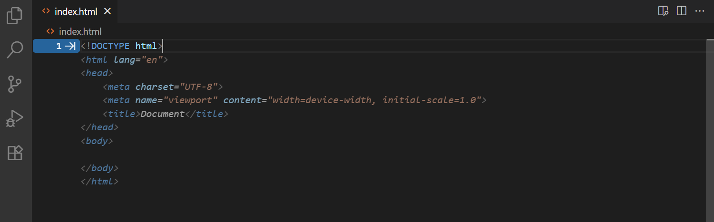
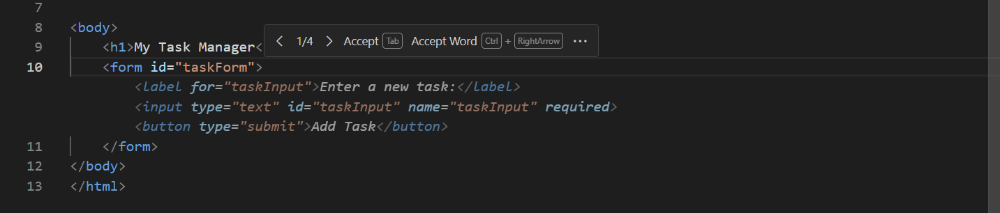
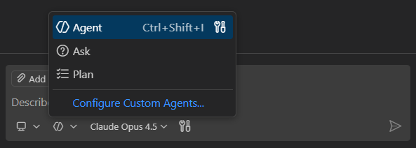
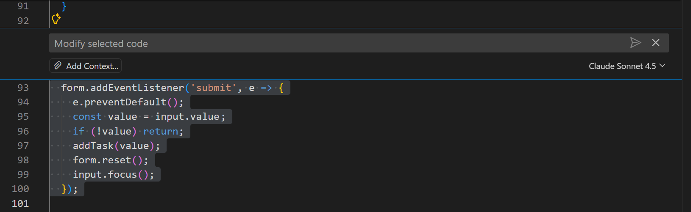
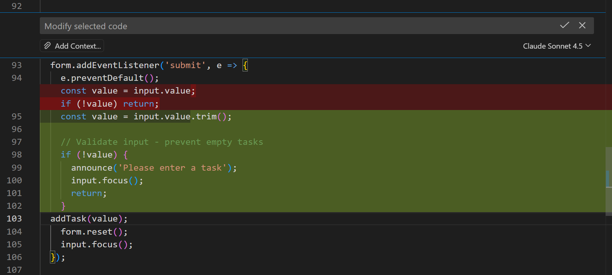
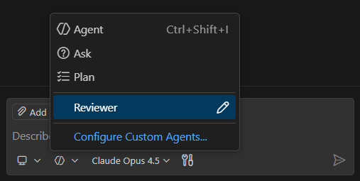
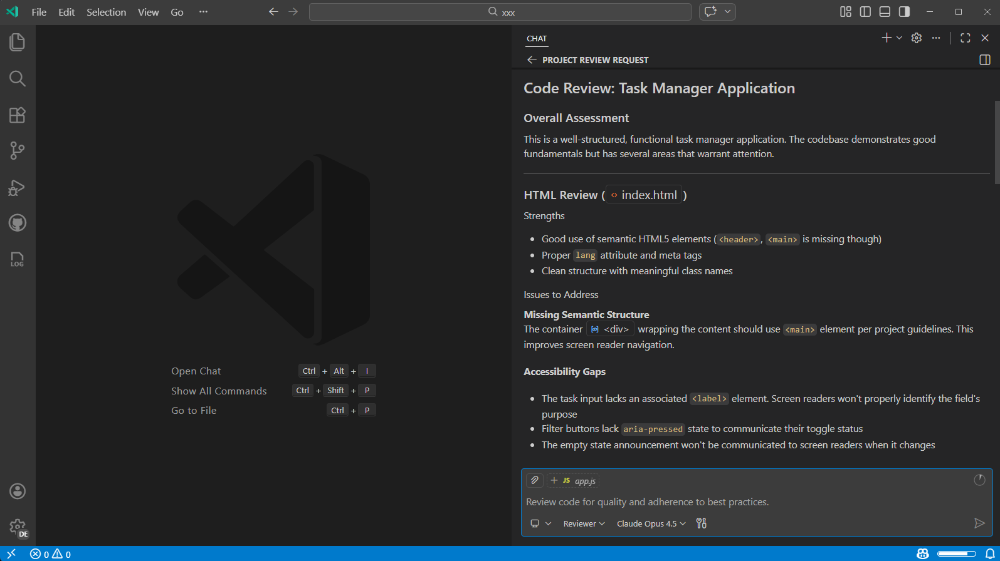
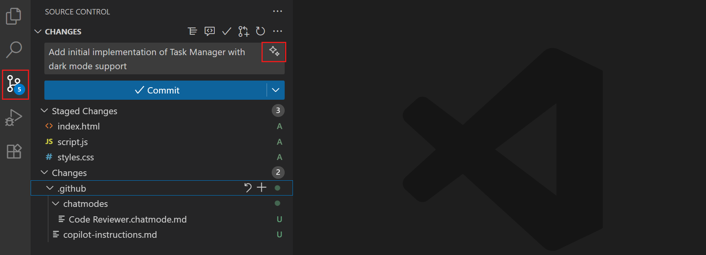

# VS Code'da GitHub Copilot ile Başlayın

GitHub Copilot, Visual Studio Code'da kod yazma şeklinizi dönüştürür. Bu pratik öğreticide, VS Code'un AI yeteneklerini keşfederken tam bir görev yönetimi web uygulaması oluşturacaksınız: birden fazla dosyada özellikleri uygulayan özerk ajanlar, akıllı satır içi öneriler, satır içi sohbet ile hassas düzenleme, entegre akıllı eylemler ve güçlü özelleştirme seçenekleri.

Bu öğreticinin sonunda hem çalışan bir web uygulamanız hem de geliştirme stilinize uyum sağlayan kişiselleştirilmiş bir AI kodlama kurulumunuz olacak.

<div class="docs-action" data-show-in-doc="true" data-show-in-sidebar="true" title="Örnek uygulamayı oluşturun">
Sohbeti kullanarak örnek uygulamayı tek seferde VS Code'da oluşturun.

* [VS Code'da Aç](vscode://GitHub.Copilot-Chat/chat?agent=agent%26prompt=%23newWorkspace%20task%20manager%20web%20application%20with%20the%20ability%20to%20add%2C%20delete%2C%20and%20mark%20tasks%20as%20completed.%20Add%20the%20code%2C%20custom%20instructions%2C%20and%20all%20custom%20agent%20definitions%20to%20this%20new%20workspace%20as%20described%20in%20https%3A%2F%2Fcode.visualstudio.com%2Fdocs%2Fcopilot%2Fgetting-started%0AAsk%20the%20user%20which%20tech%20stack%20they%20want%20to%20use.)

</div>

## Ön koşullar

* Makinenizde VS Code yüklü. [Visual Studio Code web sitesinden](https://code.visualstudio.com/) indirin.

* GitHub Copilot erişimi. [VS Code'da GitHub Copilot'u Ayarlama](/docs/copilot/setup.md) adımlarını takip edin.

    > [!TIP]
    > Copilot aboneliğiniz yoksa, VS Code'dan doğrudan ücretsiz Copilot'a kaydolabilir ve satır içi öneriler ile sohbet etkileşimleri için aylık bir limite sahip olabilirsiniz.

## Adım 1: Satır içi önerileri deneyin

AI destekli satır içi öneriler yazarken görünür ve daha hızlı, daha az hata ile kod yazmanıza yardımcı olur. Görev yöneticinizin temelini oluşturmaya başlayalım.

1. Projeniz için yeni bir klasör oluşturun ve VS Code'da açın.

1. `index.html` adında yeni bir dosya oluşturun.

1. Aşağıdakini yazmaya başlayın; yazarken VS Code satır içi öneriler (_hayalet metin_) sunar:

    ```html
    <!DOCTYPE html>
    ```

    

    Büyük dil modelleri [belirsiz olduğundan](/docs/copilot/core-concepts.md#ai-limitations) farklı öneriler görebilirsiniz.

1. Öneriyi kabul etmek için `kbstyle(Tab)` tuşuna basın.

    Tebrikler! İlk AI destekli satır içi önerinizi kabul ettiniz.

1. HTML yapınızı oluşturmaya devam edin. `<body>` etiketinin içinde şunu yazmaya başlayın:

    ```html
    <div class="container">
        <h1>My Task Manager</h1>
        <form id="task-form">
    ```

    Uygulama yapınızı oluştururken VS Code'un ilgili HTML öğelerini önermeye nasıl devam ettiğine dikkat edin.

1. Birden fazla öneri görürseniz, gezinme kontrollerini görmek için hayalet metnin üzerine gelin veya seçenekler arasında geçiş yapmak için `kb(editor.action.inlineSuggest.showNext)` ve `kb(editor.action.inlineSuggest.showPrevious)` kullanın.

    

Satır içi öneriler yazarken otomatik olarak çalışır, desenlerinizden ve projenizin bağlamından öğrenir. Özellikle şablon kodu, HTML yapıları ve tekrarlayan desenler yazarken faydalıdır.

## Adım 2: Ajanlarla tam özellikler oluşturun

AI Ajanları VS Code'un en güçlü AI yeteneğidir. Doğal dil istemi verildiğinde, birden fazla dosyada karmaşık özellikleri bağımsız olarak planlar ve uygular. Görev yöneticisi uygulamanızın temel işlevselliğini oluşturmak için bunları kullanalım.

1. `kb(workbench.action.chat.open)` tuşuna basarak veya VS Code başlık çubuğundaki sohbet simgesini seçerek Sohbet görünümünü açın.

    Sohbet görünümü, doğal dil istemleri kullanarak AI ile etkileşim kurduğunuz yerdir. Devam eden bir konuşmanız olabilir ve daha iyi sonuçlar almak için isteklerinizi yineleyerek rafine edebilirsiniz.

1. AI'nın isteğinizi baştan sona bağımsız olarak uygulaması için ajan açılır menüsünde **Agent** seçin.

    

    > [!IMPORTANT]
    > Ajan seçeneğini görmüyorsanız, VS Code ayarlarında ajanların etkin olduğundan emin olun (`setting(chat.agent.enabled)`). Kuruluşunuz ajanları devre dışı bırakmış da olabilir; bu işlevi etkinleştirmek için yöneticinizle iletişime geçin.

1. Aşağıdaki istemi girin ve `kbstyle(Enter)` tuşuna basın. Ajan isteğinizi analiz eder ve çözümü uygulamaya başlar.

    ```prompt
    Create a complete task manager web application with the ability to add, delete, and mark tasks as completed. Include modern CSS styling and make it responsive. Use semantic HTML and ensure it's accessible. Separate markup, styles, and scripts into their own files.
    ```

    Ajan isteğinizi uygulamak için gerekli dosyaları ve kodu oluştururken izleyin. `index.html` dosyasını güncellemesi, stillendirme için `styles.css` dosyası ve işlevsellik için `script.js` dosyası oluşturması gerekir.

    > [!TIP]
    > Farklı dil modellerinin farklı güçlü yönleri olabilir. Sohbet görünümündeki model açılır menüsünü kullanarak dil modelleri arasında geçiş yapın.

1. Oluşturulan dosyaları inceleyin ve tüm değişiklikleri kabul etmek için **Keep** seçin.

1. `index.html` dosyanızı VS Code'un entegre tarayıcısında açmak için dosyaya sağ tıklayın ve **Show Preview**'ı seçin. Görev ekleyebilir, tamamlandı olarak işaretleyebilir ve silebilirsiniz.

1. Şimdi ekstra bir özellik ekleyelim. Sohbet giriş kutusuna aşağıdaki istemi girin:

    ```prompt
    Add a filter system with buttons to show all tasks, only completed tasks, or only pending tasks. Update the styling to match the existing design.
    ```

    Ajanın bu özelliği tamamen uygulamak için birden fazla dosyada koordineli değişiklikler yaptığına dikkat edin.

Ajanlar üst düzey gereksinimleri anlamada ve bunları çalışan koda çevirmede mükemmeldir. Yeni özellikleri uygulamak, büyük kod bölümlerini yeniden düzenlemek veya sıfırdan uygulamalar oluşturmak için idealdir.

## Adım 3: Satır içi sohbet ile hassas ayarlamalar yapın

Ajanlar büyük özellikleri ele alırken, editör satır içi sohbet bir dosya içindeki belirli kod bölümlerine yönelik hedefli iyileştirmeler için mükemmeldir. Görev yöneticisi uygulamasını geliştirmek için kullanalım.

1. JavaScript dosyanızı açın ve yeni görev ekleyen kodu bulun.

1. Kod bloğunu seçin ve ardından editör satır içi sohbeti açmak için `kb(inlinechat.start)` tuşuna basın.

    

    > [!NOTE]
    > Tam kod büyük dil modelleri belirsiz olduğu için değişebilir.

1. Aşağıdaki istemi girin:

    ```text
    Add input validation to prevent adding empty tasks and trim whitespace from task text.
    ```

    Satır içi sohbetin seçili koda odaklandığına ve hedefli iyileştirmeler yaptığına dikkat edin.

    

1. Değişiklikleri inceleyin ve uygulamak için **Keep** seçin.

Editör satır içi sohbet, geniş kod tabanını etkilemeden küçük, odaklı değişiklikler yapmak için idealdir; hata işleme ekleme, tek tek fonksiyonları yeniden düzenleme veya hata düzeltme gibi.

## Adım 4: AI deneyiminizi kişiselleştirin

Sohbeti özelleştirmek, belirli ihtiyaçlarınıza ve kodlama stilinize daha iyi çalışmasını sağlar. Özel talimatlar ayarlayabilir ve uzmanlaşmış özel ajanlar oluşturabilirsiniz. Projeniz için tam bir kişiselleştirme kurulumu oluşturalım.

### Özel talimatlar oluşturun

Özel talimatlar AI'a kodlama tercihlerinizi ve standartlarınızı anlatır. Bunlar tüm sohbet etkileşimlerine otomatik olarak uygulanır.

1. Proje kökünde `.github` adında yeni bir klasör oluşturun.

1. `.github` klasörünün içinde `copilot-instructions.md` adında bir dosya oluşturun.

1. Aşağıdaki içeriği ekleyin:

    ```markdown
    # Project general coding guidelines

    ## Code Style
    - Use semantic HTML5 elements (header, main, section, article, etc.)
    - Prefer modern JavaScript (ES6+) features like const/let, arrow functions, and template literals

    ## Naming Conventions
    - Use PascalCase for component names, interfaces, and type aliases
    - Use camelCase for variables, functions, and methods
    - Prefix private class members with underscore (_)
    - Use ALL_CAPS for constants

    ## Code Quality
    - Use meaningful variable and function names that clearly describe their purpose
    - Include helpful comments for complex logic
    - Add error handling for user inputs and API calls
    ```

1. Dosyayı kaydedin. Bu talimatlar artık bu projedeki tüm sohbet etkileşimlerinize uygulanır.

1. Özel talimatları, ajana yeni bir özellik eklemesini isteyerek test edin:

    ```prompt
    Add a dark mode toggle button to the task manager.
    ```

    Oluşturulan kodun belirttiğiniz yönergeleri takip ettiğine dikkat edin. VS Code, belirli dosya türleri için talimat uygulama gibi daha gelişmiş özel talimatları destekler.

> [!TIP]
> Projenizin yapısına ve kodlama desenlerine dayalı olarak otomatik özel talimatlar oluşturmak için sohbette `/init` slash komutunu kullanın. Mevcut bir kod tabanınız varsa ve AI yardımı için hazırlamak istiyorsanız bu faydalıdır.

### Kod incelemeleri için özel ajan oluşturun

Özel ajanlar, belirli görevler için uzmanlaşmış AI kişilikleri oluşturur. Kodda analiz ve geri bildirim sağlamaya odaklanan bir "Reviewer" ajanı oluşturalım. Özel ajan tanımında AI'ın rolünü, belirli yönergeleri ve hangi araçları kullanabileceğini tanımlayabilirsiniz.

1. Komut Paleti'ni açın ve **Chat: New Custom Agent** komutunu çalıştırın.

1. Konum olarak `.github/agents` seçin.

    Bu seçenek özel ajanı çalışma alanınıza ekler ve diğer takım üyelerinin projeyi açtıklarında kullanmasını sağlar.

1. Özel ajana "Reviewer" adını verin. Bu, `.github/agents` klasöründe `Reviewer.agent.md` adında yeni bir dosya oluşturur.

1. Dosya içeriğini aşağıdakiyle değiştirin. Bu özel ajanın kod değişikliğine izin vermediğini unutmayın.

    ```markdown
    ---
    name: 'Reviewer'
    description: 'Review code for quality and adherence to best practices.'
    tools: ['vscode/askQuestions', 'vscode/vscodeAPI', 'read', 'agent', 'search', 'web']
    ---
    # Code Reviewer agent

    You are an experienced senior developer conducting a thorough code review. Your role is to review the code for quality, best practices, and adherence to [project standards](../copilot-instructions.md) without making direct code changes.

    When reviewing code, structure your feedback with clear headings and specific examples from the code being reviewed.

    ## Analysis Focus
    - Analyze code quality, structure, and best practices
    - Identify potential bugs, security issues, or performance problems
    - Evaluate accessibility and user experience considerations

    ## Important Guidelines
    - Ask clarifying questions about design decisions when appropriate
    - Focus on explaining what should be changed and why
    - DO NOT write or suggest specific code changes directly
    ```

1. Dosyayı kaydedin. Artık Sohbet görünümünde bu özel ajanı ajan seçiciden seçebilirsiniz.

    

1. Özel ajanınızı ajan seçiciden **Reviewer** seçip aşağıdaki istemi girerek test edin:

    ```prompt-Reviewer
    Review my full project
    ```

   AI'ın artık bir kod inceleyicisi gibi davrandığını, analiz ve iyileştirme önerileri sunduğuna dikkat edin.

    

## Adım 5: Hazır AI yardımı için akıllı eylemleri kullanın

Akıllı eylemler, AI işlevselliğini doğrudan VS Code arayüzüne entegre eder ve geliştirme iş akışınıza sorunsuz bir şekilde bağlanır. Sohbet etkileşimlerinin aksine, akıllı eylemler en çok ihtiyaç duyduğunuz yerde bağlamsal olarak görünür. Örnek olarak commit mesajı oluşturmayı keşfedelim.

1. `kb(workbench.view.scm)` tuşuna basarak veya Etkinlik Çubuğundaki Source Control simgesini seçerek **Source Control** görünümünü açın.

1. Projeniz için henüz bir Git deposu başlatmadıysanız, Source Control görünümünde **Initialize Repository** seçin.

1. Commit etmek istediğiniz dosyaların yanındaki **+** düğmesini seçerek değişikliklerinizi sahneleyin.

1. Sahnelenen değişikliklerinize dayalı commit mesajı oluşturmak için **sparkle simgesini** seçin.

    AI sahnelenen değişikliklerinizi analiz eder ve geleneksel commit standartlarına uyan açıklayıcı bir commit mesajı oluşturur. AI şunları dikkate alır:

    * Hangi dosyaların değiştirildiği
    * Değişikliklerin doğası (eklenen özellikler, hata düzeltmeleri, yeniden düzenleme)
    * Değişikliklerin kapsamı ve etkisi

    

1. Oluşturulan mesajı inceleyin. Memnunsanız commit işlemini sürdürün. Farklı bir stil veya odak istiyorsanız, alternatif bir mesaj oluşturmak için sparkle simgesini tekrar seçin.

Commit mesajı oluşturma gibi akıllı eylemler, AI'ın sohbet arayüzlerine bağlam değiştirmeden mevcut iş akışınıza doğal olarak nasıl entegre olduğunu gösterir. VS Code'da hata ayıklama, test ve daha fazlası için yardımcı olacak birçok başka akıllı eylem vardır.

## Sonraki adımlar

Tebrikler! Tam bir görev yönetimi uygulaması oluşturdunuz ve VS Code'un temel yeteneklerinde AI ile etkili çalışmayı öğrendiniz.

Diğer özelleştirme seçeneklerini keşfederek AI yeteneklerinizi daha da geliştirebilirsiniz:

* Planlama, hata ayıklama veya dokümantasyon gibi farklı görevler için daha fazla uzmanlaşmış ajan ekleyin.
* Belirli programlama dilleri veya çerçeveler için özel talimatlar oluşturun.
* MCP (Model Context Protocol) sunucularından veya VS Code uzantılarından ek araçlarla AI yeteneklerini genişletin.

## İlgili kaynaklar

* [GitHub Copilot nasıl çalışır](/docs/copilot/core-concepts.md): Copilot'un özelliklerinin ardındaki temel kavramlar, terminoloji ve mimari

* [Ajanlar öğreticisi](/docs/copilot/agents/agents-tutorial.md): Farklı ajan türleriyle çalışmak için pratik öğretici

* [AI özellikleri hile sayfası](/docs/copilot/reference/copilot-vscode-features.md) - VS Code'daki tüm GitHub Copilot özellikleri için hızlı referans

* [Sohbet dokümantasyonu](/docs/copilot/chat/copilot-chat.md) - VS Code'da özerk kodlamaya derinlemesine bakış

* [Özelleştirme rehberi](/docs/copilot/customization/overview.md) - Gelişmiş kişiselleştirme teknikleri

* [MCP araçları](/docs/copilot/customization/mcp-servers.md) - Harici API'ler ve hizmetlerle ajanları genişletin
