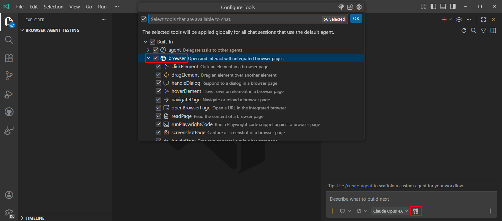

# Tarayıcı ajan araçlarıyla web uygulamaları oluşturma ve test etme

Tarayıcı ajan araçları yapay zekanın kapalı bir geliştirme döngüsünde web uygulamalarını özerk oluşturmasını ve doğrulamasını sağlar. Ajan HTML, CSS ve JavaScript oluşturabilir, uygulamayı entegre tarayıcıda açabilir, işlevselliği doğrulamak için etkileşimde bulunabilir, konsol hataları ve görsel inceleme aracılığıyla sorunları belirleyebilir ve manuel müdahale olmadan sorunları düzeltebilir.

Bu kılavuz tarayıcı ajan araçlarını kullanarak bir hesap makinesi uygulaması oluşturma ve ajanın otomatik testler aracılığıyla hataları keşfedip düzeltmesini izleme adımlarında size yol gösterir.

> [!NOTE]
> Tarayıcı ajan araçları şu anda deneyseldir ve gelecek sürümlerde değişebilir.

## Ön koşullar

Bu kılavuzu tamamlamak için gerekli:

* [Bilgisayarınıza yüklenmiş Visual Studio Code](/download)
* [GitHub Copilot aboneliği](/docs/copilot/setup.md)
* `setting(workbench.browser.enableChatTools)` ayarıyla etkinleştirilmiş tarayıcı ajan araçları

## Tarayıcı ajan araçları nasıl çalışır

Tarayıcı ajan araçları etkinleştirildiğinde ajanlar entegre tarayıcıdaki sayfalarla okuma ve etkileşim kurma araçlarına erişir. Bu araçlar şunları içerir:

* **Sayfa gezintisi:** `openBrowserPage`, `navigatePage`
* **Sayfa içeriği ve görünümü:** `readPage`, `screenshotPage`
* **Kullanıcı etkileşimi:** `clickElement`, `hoverElement`, `dragElement`, `typeInPage`, `handleDialog`
* **Özel tarayıcı otomasyonu:** `runPlaywrightCode`

Varsayılan olarak ajan tarafından açılan sayfalar diğer tarayıcı sekmelerinizle çerez veya depolama paylaşmayan özel, bellek içi oturumlarda çalışır. Bu ajanın erişebileceği tarama verileri üzerinde kontrol sağlar.

[VS Code'da entegre tarayıcı](/docs/debugtest/integrated-browser.md) hakkında daha fazla bilgi edinin.

## Adım 1: Ajan için tarayıcı araçlarını etkinleştirin

Ajan tarayıcı araçlarını kullanmadan önce bunları sohbet araç seçicisinde açıkça etkinleştirmeniz gerekir.

1. Sohbet görünümünü (`kb(workbench.action.chat.open)`) açın ve Agents açılır menüsünden **Agent** seçin.

1. Sohbet giriş alanındaki **Tools** düğmesini seçerek araç seçiciyi açın.

1. Tüm tarayıcı araçlarının etkin olduğunu doğrulayın (**Built-in** > **Browser** altında gruplanır).

    

Ajan artık web sayfalarıyla etkileşim için bu araçları kullanabilir.

## Adım 2: Ajanın hesap makinesi oluşturmasını isteyin

Tarayıcı araçları etkinleştirildiğinde ajanın basit bir hesap makinesi uygulaması oluşturmasını isteyin.

1. Yeni bir proje klasörü oluşturun ve VS Code'da açın.

1. Sohbet görünümünde aşağıdaki promptu girin:

    ```prompt
    Create a calculator with buttons for digits 0-9, operations (add, subtract, multiply, divide), clear, and equals. Use HTML, CSS, and JavaScript. Style it with a clean, modern design.
    ```

1. Ajan `index.html`, `styles.css` ve `script.js` oluştururken oluşturulan dosyaları inceleyin.

1. Dosyaları çalışma alanınıza kaydetmek için **Keep** seçin.

Ajan hesap makinesi uygulamasının temel yapısını oluşturdu.

## Adım 3: Ajanın hesap makinesini test etmesine izin verin

Şimdi ajanın hesap makinesini entegre tarayıcıda açıp doğru çalışıp çalışmadığını doğrulamasını isteyin.

1. Sohbet görünümünde aşağıdaki promptu girin:

    ```prompt
    Open the calculator in the browser and test if all the operations work correctly.
    ```

1. Ajanın `index.html`'i entegre tarayıcıda açtığını, sayfa içeriğini yapıyı anlamak için ayrıştırdığını ve her düğmeyi ve işlemi tıklamaları simüle ederek ve sonuçları kontrol ederek sistematik olarak test ettiğini izleyin.

    <video src="../images/browser-agent-testing-guide/agent-testing-calculator.mp4" title="Video showing the agent testing the calculator in the integrated browser." autoplay loop controls muted></video>

Ajan hangi işlemlerin doğru çalıştığını bildirir ve keşfettiği sorunları belirtir.

## Adım 4: Ajanın hata ayıklamasını ve düzeltmesini izleyin

Ajan test sırasında hata keşfederse sorunu otomatik analiz eder ve düzeltme uygular.

1. Sıfıra bölme kontrolünü kaldırarak bir hata ekleyelim:

    ```javascript
    function calculate() {
        if (!operator || shouldReset) return;

        const a = parseFloat(previous);
        const b = parseFloat(current);
        let result;

        switch (operator) {
        case '+': result = a + b; break;
        case '-': result = a - b; break;
        case '*': result = a * b; break;
        case '/': result = a / b; break;
    }
    ```

1. Ajanın bölme işlemini test etmesini ve bulduğu sorunları düzeltmesini isteyin:

    ```prompt
    Verify the division operation works correctly. If you find any issues, fix them.
    ```

1. Ajanın sıfıra bölme yapıldığında bir hata aldığını, ardından kodu analiz edip düzelttiğini ve son olarak hata düzeltmesini doğruladığını izleyin.

Ajan tarayıcı otomasyonu kullanarak tam bir geliştirme döngüsünü tamamladı: oluşturma, test etme, hata ayıklama ve düzeltme.

## Adım 5: Ajanla tarayıcı sayfası paylaşma (isteğe bağlı)

Web sayfalarını manuel açıp ajanla analiz veya etkileşim için açıkça paylaşabilirsiniz. Varsayılan olarak ajan yalnızca kendisi açtığı web sayfalarıyla etkileşim kurabilir.

1. Komut Paleti'nden (`kb(workbench.action.showCommands)`) **Browser: Open Integrated Browser** komutunu çalıştırarak entegre tarayıcıyı açın.

1. Ajanın analiz etmesini veya etkileşim kurmasını istediğiniz web sayfasına gidin.

1. Tarayıcı araç çubuğundaki **Share with Agent** düğmesini seçin.

    Tarayıcı sekmesindeki görsel gösterge sayfanın ajanla etkin olarak paylaşıldığını gösterir.

1. Ajanın paylaşılan sayfada eylemler gerçekleştirmesini isteyin:

    ```prompt
    What is the main heading on this page? Click the first link and tell me where it goes.
    ```

Ajan artık paylaşılan sayfaya erişebilir ve sizin adınıza etkileşimlerde bulunabilir. İşiniz bittiğinde erişimi iptal etmek için **Share with Agent** düğmesini tekrar seçin.

> [!TIP]
> Paylaşılan sayfalar mevcut tarayıcı oturumunuzu kullanır; çerezler ve giriş durumu dahil. Ajan tarafından açılan sayfalar izole geçici oturumlar kullanır; diğer tarayıcı sekmelerinizle çerez veya depolama paylaşmaz.

## Bu senaryoları deneyin

Tarayıcı ajan araçlarının nasıl çalıştığını anladığınıza göre farklı kullanım senaryolarını keşfetmek için bunları deneyin:

* **Form doğrulama testi**: Ajanın iletişim formu oluşturup test ederek doğrulama kurallarını, hata mesajlarını ve başarılı gönderimini doğrulamasını sağlayın

* **Duyarlı düzen doğrulama**: Ajanın sayfayı farklı görüntü alanı boyutlarında ekran görüntüsü almasını ve duyarlı davranışı doğrulamasını isteyin (örneğin gezinme menüleri olan landing sayfası)

* **Kimlik doğrulama akışı testi**: Ajanın giriş sayfasında kimlik bilgisi doğrulamasını, hata işlemeyi ve başarılı yönlendirmeleri test etmesine izin verin

* **Etkileşimli işlevsellik testi**: Ajanın kullanıcı etkileşimlerini ve durum yönetimini doğrulamasını sağlayın

* **Erişilebilirlik denetimleri**: Ajanın herhangi bir web sayfasında eksik alt metni, başlık hiyerarşisini, klavye gezintisini ve renk kontrastı sorunlarını kontrol etmesini isteyin

## İlgili kaynaklar

* [Entegre tarayıcı](/docs/debugtest/integrated-browser.md)
* [VS Code'da yapay zeka temel kavramları](/docs/copilot/core-concepts.md)
* [Ajanlara genel bakış](/docs/copilot/agents/overview.md)
* [Copilot ile test etme](/docs/copilot/guides/test-with-copilot.md)
