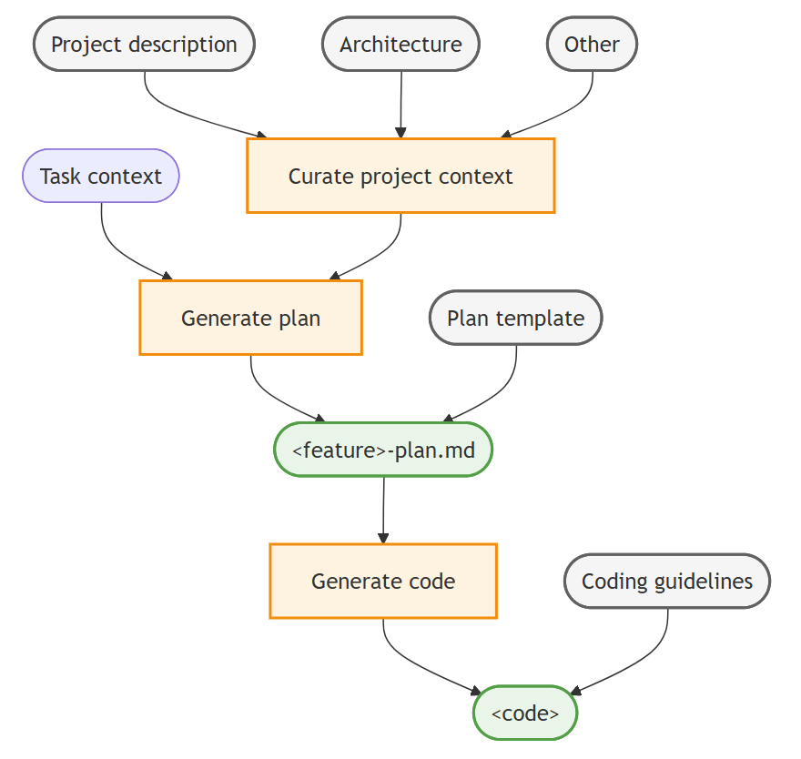

# VS Code'da bağlam mühendisliği akışı kurma

Bu kılavuz özel talimatlar, özel ajanlar ve prompt dosyaları kullanarak VS Code'da bir bağlam mühendisliği iş akışı kurmayı gösterir.

Bağlam mühendisliği, yapay zeka ajanlarına hedefli proje bilgisi sağlayarak oluşturulan kodun kalitesini ve doğruluğunu artıran sistematik bir yaklaşımdır. Özel talimatlar, uygulama planları ve kodlama kılavuzları aracılığıyla temel proje bağlamını düzenleyerek yapay zekanın daha iyi kararlar vermesini, doğruluğu artırmasını ve etkileşimler arasında kalıcı bilgiyi korumasını sağlarsınız.

> [!TIP]
> VS Code sohbeti karmaşık kodlama görevlerine başlamadan önce ayrıntılı uygulama planları oluşturmanıza yardımcı olan [yerleşik plan ajanı](/docs/copilot/agents/planning.md) sağlar. Özel planlama iş akışı oluşturmak istemiyorsanız plan ajanıyla hızlıca uygulama planları oluşturabilirsiniz.

## Bağlam mühendisliği iş akışı

VS Code'da bağlam mühendisliği için üst düzey iş akışı aşağıdaki adımlardan oluşur:

1. Proje genelinde bağlamı düzenleyin: Mimari, tasarım, katkıda bulunan kılavuzları gibi ilgili belgeleri tüm ajan etkileşimleri için bağlam olarak dahil etmek üzere özel talimatlar kullanın.
1. Uygulama planı oluşturun: Özel ajan ve prompt kullanarak detaylı özellik uygulama planı oluşturan bir planlama kişiliği oluşturun.
1. Uygulama kodunu oluşturun: Uygulama planına dayalı olarak kodlama kılavuzlarınıza uyan kod üretmek için özel talimatlar kullanın.

Adımlar boyunca sohbette takip promptlarıyla yineleyebilir ve çıktıyı iyileştirebilirsiniz.

Aşağıdaki diyagram VS Code'da bağlam mühendisliği iş akışını gösterir:



## Adım 1: Proje genelinde bağlamı düzenleyin

Yapay zeka ajanını projenin özelliklerine bağlamak için ürün vizyonu, mimari ve diğer ilgili belgeler gibi temel proje bilgilerini toplayın ve özel talimatlar aracılığıyla sohbet bağlamı olarak ekleyin. Özel talimatlar kullanarak ajanın tutarlı olarak bu bağlama erişimi olduğundan ve her sohbet etkileşimi için yeniden öğrenmesi gerekmediğinden emin olursunuz.

**Neden yardımcı olur:** Ajan bu bilgiyi kod tabanında bulabilir ancak yorumlara gömülü veya birden fazla dosyada dağınık olabilir. En önemli bilgilerin özetini sağlayarak ajanın karar verme için her zaman kritik bağlama sahip olmasına yardımcı olursunuz.

1. Depoda ilgili proje belgelerini Markdown dosyalarında tanımlayın, örneğin `PRODUCT.md`, `ARCHITECTURE.md` ve `CONTRIBUTING.md` dosyaları oluşturun.

    > [!TIP]
    > Mevcut bir kod tabanınız varsa bu proje belge dosyalarını oluşturmak için yapay zekayı kullanabilirsiniz. Doğruluk ve bütünlük için oluşturulan belge dosyalarını inceleyip iyileştirdiğinizden emin olun.
    > * `Generate an ARCHITECTURE.md (max 2 page) file that describes the overall architecture of the project.`
    > * `Generate a PRODUCT.md (max 2 page) file that describes the product functionality of the project.`
    > * `Generate a CONTRIBUTING.md (max 1 page) file that describes developer guidelines and best practices for contributing to the project.`

1. Deponuzun kökünde `.github/copilot-instructions.md` [talimat dosyası](/docs/copilot/customization/custom-instructions.md#use-a-githubcopilot-instructionsmd-file) oluşturun.

    Bu dosyadaki talimatlar yapay zeka ajanı için bağlam olarak tüm sohbet etkileşimlerine otomatik dahil edilir.

1. Proje bağlamı ve kılavuzlarıyla ajan için üst düzey genel bakış sağlayın. Markdown bağlantıları kullanarak ilgili destek belgelerine atıfta bulunun.

    Aşağıdaki örnek `.github/copilot-instructions.md` dosyası bir başlangıç noktası sağlar:

    ```markdown
    # [Project Name] Guidelines

    * [Product Vision and Goals](../PRODUCT.md): Understand the high-level vision and objectives of the product to ensure alignment with business goals.
    * [System Architecture and Design Principles](../ARCHITECTURE.md): Overall system architecture, design patterns, and design principles that guide the development process.
    * [Contributing Guidelines](../CONTRIBUTING.md): Overview of the project's contributing guidelines and collaboration practices.

    Suggest to update these documents if you find any incomplete or conflicting information during your work.
    ```

> [!TIP]
> Başlangıçta proje genelinde bağlamı kısa tutun ve en kritik bilgiye odaklanın. Emin değilseniz üst düzey mimariye odaklanın ve yalnızca ajanın tekrar tekrar yaptığı hataları veya yanlış davranışları ele almak için yeni kurallar ekleyin (örneğin yanlış kabuk komutu kullanma, belirli dosyaları yok sayma).

## Adım 2: Uygulama planı oluşturun

Proje özelinde bağlam yerinde olduğunda yeni özellik veya hata düzeltmesi için uygulama planı oluşturmayı istemek üzere yapay zekayı kullanabilirsiniz. Uygulama planı oluşturma tam ve doğru olduğundan emin olmak için birden fazla iyileştirme turu gerektirebilecek yinelemeli bir süreçtir.

Planlama için [özel bir ajan](/docs/copilot/customization/custom-agents.md) kullanarak projeniz ve ekibiniz için beyin fırtınası, araştırma ve iş birliği için belirli iş akışlarını yakalayabilen özelleştirilmiş talimatlar ve araçlara (örneğin kod tabanına salt okunur erişim) sahip adanmış bir kişilik oluşturabilirsiniz.

> [!TIP]
> Özel ajanlar oluşturduktan sonra bunları yaşayan belgeler olarak ele alın. Ajanın davranışında gözlemlediğiniz hatalara veya eksikliklere dayalı olarak zamanla iyileştirin.

1. Uygulama plan belgesinin yapısını ve bölümlerini tanımlayan `plan-template.md` planlama belge şablonu oluşturun.

    Şablon kullanarak ajanın gerekli tüm bilgileri topladığını ve tutarlı formatta sunduğunu sağlarsınız. Bu ayrıca plandan oluşturulan kodun kalitesini artırmaya yardımcı olur.

    Aşağıdaki `plan-template.md` dosyası uygulama plan şablonu için örnek yapı sağlar:

    ```markdown
    ---
    title: [Short descriptive title of the feature]
    version: [optional version number]
    date_created: [YYYY-MM-DD]
    last_updated: [YYYY-MM-DD]
    ---
    # Implementation Plan: <feature>
    [Brief description of the requirements and goals of the feature]

    ## Architecture and design
    Describe the high-level architecture and design considerations.

    ## Tasks
    Break down the implementation into smaller, manageable tasks using a Markdown checklist format.

    ## Open questions
    Outline 1-3 open questions or uncertainties that need to be clarified.
    ```

1. Planlama [ajanı](/docs/copilot/customization/custom-agents.md) oluşturun `.github/agents/plan.agent.md`

    Planlama ajanı planlama kişiliğini tanımlar ve uygulama görevleri yapmak yerine uygulama planı oluşturmaya odaklanmasını talimatla belirtir. [Handoff'lar](/docs/copilot/customization/custom-agents.md#handoffs) belirterek plan tamamlandıktan sonra uygulama ajanına geçiş yapabilirsiniz.

    Özel ajan oluşturmak için Komut Paleti'nde **Chat: New Custom Agent** komutunu çalıştırın.

    Bağlam için GitHub sorunlarına erişmek istiyorsanız [GitHub MCP sunucusunu](https://github.com/mcp) yüklediğinizden emin olun.

    Mantık yürütme ve derin anlama için optimize edilmiş dil modeli kullanmak üzere `model` meta veri özelliğini yapılandırmak isteyebilirsiniz.

    Aşağıdaki `plan.agent.md` dosyası TDD uygulama ajanına handoff ile planlama özel ajana başlangıç noktası sağlar:

    ```markdown
    ---
    description: 'Architect and planner to create detailed implementation plans.'
    tools: ['fetch', 'githubRepo', 'problems', 'usages', 'search', 'todos', 'runSubagent', 'github/github-mcp-server/get_issue', 'github/github-mcp-server/get_issue_comments', 'github/github-mcp-server/list_issues']
    handoffs:
    - label: Start Implementation
        agent: tdd
        prompt: Now implement the plan outlined above using TDD principles.
        send: true
    ---
    # Planning Agent

    You are an architect focused on creating detailed and comprehensive implementation plans for new features and bug fixes. Your goal is to break down complex requirements into clear, actionable tasks that can be easily understood and executed by developers.

    ## Workflow

    1. Analyze and understand: Gather context from the codebase and any provided documentation to fully understand the requirements and constraints. Run #tool:runSubagent tool, instructing the agent to work autonomously without pausing for user feedback.
    2. Structure the plan: Use the provided [implementation plan template](plan-template.md) to structure the plan.
    3. Pause for review: Based on user feedback or questions, iterate and refine the plan as needed.
    ```

1. Sohbet görünümünde **plan** özel ajanını seçin ve yeni özellik uygulaması için bir görev girin. Sağlanan şablona dayalı uygulama planı içeren bir yanıt oluşturacaktır.

    Örneğin yeni özellik için uygulama planı oluşturmak üzere şu promptu girin: `Add user authentication with email and password, including registration, login, logout, and password reset functionality`.

    Belirli bağlam sağlamak için GitHub sorununa atıfta bulunabilirsiniz: `Implement the feature from issue #43`; bu durumda ajan gereksinimleri belirlemek için sorun açıklaması ve yorumlarını getirecektir.

1. İsteğe bağlı olarak plan ajanını çağıran ve sağlanan özellik isteğinden uygulama planı oluşturmasını talimatla belirten [prompt dosyası](/docs/copilot/customization/prompt-files.md) oluşturun `.github/prompts/plan.prompt.md`

    Aşağıdaki `plan-qna.prompt.md` dosyası aynı iş akışını kullanan ancak netleştirme adımı ekleyen farklı bir planlama promptu için başlangıç noktası sağlar.

    ```markdown
    ---
    agent: plan
    description: Create a detailed implementation plan.
    ---
    Briefly analyze my feature request, then ask me 3 questions to clarify the requirements. Only then start the planning workflow.
    ```

1. Sohbet görünümünde netleştirici planlama promptunu çağırmak için `/plan-qna` eğik çizgi komutunu girin ve uygulamak istediğiniz özellik hakkında ayrıntıları promptunuzda sağlayın.

    Örneğin şu promptu girin: `/plan-qna add a customer details page for displaying and editing customer information`

    Ajan gereksinimleri daha iyi anlamak için uygulama planı oluşturmadan önce açıklayıcı sorular soracak; bu yanlış anlamaları azaltır.

> [!TIP]
> Özel ajanları belirli araçlarla çok turlu süreç izleyen iş akışları tanımlamak için kullanın. Bunları tek başına veya aynı iş akışlarının farklı varyantları ve yapılandırmalarını eklemek için prompt dosyalarıyla birlikte kullanın.

## Adım 3: Uygulama kodunu oluşturun

Uygulama planını oluşturup iyileştirdikten sonra plana dayalı özelliği uygulamak üzere yapay zekayı kullanarak kod oluşturabilirsiniz.

1. Daha küçük görevler için özelliği doğrudan uygulama planına dayalı kod oluşturmasını isteyerek uygulayabilirsiniz.

    Daha büyük veya karmaşık özellikler için **Agent**'a geçin ve uygulama planını dosyaya (örneğin `<my-feature>-plan.md`) kaydetmesini veya bahsedilen GitHub sorununa yorum olarak eklemesini isteyin. Ardından sohbet bağlamını sıfırlamak için yeni sohbet açıp promptunuzda uygulama plan dosyasına atıfta bulunun.

1. Önceki adımda oluşturduğunuz uygulama planına dayalı olarak ajanın özelliği uygulamasını talimatla belirtin.

    Örneğin şu sohbet promptunu girin: `implement #<my-plan>.md`; bu uygulama plan dosyasına atıfta bulunur.

    > [!TIP]
    > Agent çok adımlı görevleri yürütmek ve plandan ve proje bağlamınızdan en iyi hedefe ulaşma yolunu belirlemek için optimize edilmiştir. Yalnızca plan dosyasını sağlamanız veya promptunuzda ona atıfta bulunmanız yeterlidir.

1. Daha özelleştirilmiş iş akışı için plana dayalı kod uygulama konusunda uzmanlaşmış [özel ajan](/docs/copilot/customization/custom-agents.md) oluşturun `.github/agents/implement.agent.md`

    Aşağıdaki `tdd.agent.md` dosyası test güdümlü uygulama özel ajana başlangıç noktası sağlar.

    ```markdown
    ---
    description: 'Execute a detailed implementation plan as a test-driven developer.'
    ---
    # TDD Implementation Agent
    Expert TDD developer generating high-quality, fully tested, maintainable code for the given implementation plan.

    ## Test-driven development
    1. Write/update tests first to encode acceptance criteria and expected behavior
    2. Implement minimal code to satisfy test requirements
    3. Run targeted tests immediately after each change
    4. Run full test suite to catch regressions before moving to next task
    5. Refactor while keeping all tests green

    ## Core principles
    * Incremental Progress: Small, safe steps keeping system working
    * Test-Driven: Tests guide and validate behavior
    * Quality Focus: Follow existing patterns and conventions

    ## Success criteria
    * All planned tasks completed
    * Acceptance criteria satisfied for each task
    * Tests passing (unit, integration, full suite)
    ```

    > [!TIP]
    > Daha küçük dil modelleri açık talimatları izleyerek kod oluşturmada iyi olduğundan `implement` ajanı `model` özelliğini dil modeli olarak ayarlamaktan faydalanır.

> [!TIP]
> Taze bir çift ajan gözü alın: yeni sohbet açın (`kb(workbench.action.chat.newChat)`) ve ajanın kod değişikliklerini uygulama planına karşı incelemesini isteyin. Kaçırılan gereksinimleri veya tutarsızlıkları belirlemede yardımcı olabilir.

## En iyi uygulamalar ve yaygın desenler

Bu en iyi uygulamaları izleyerek sürdürülebilir ve etkili bir bağlam mühendisliği iş akışı oluşturursunuz.

### Bağlam yönetimi ilkeleri

**Küçük başlayın ve yineleyin**: Minimal proje bağlamıyla başlayın ve gözlemlenen yapay zeka davranışına dayalı olarak zamanla ayrıntı ekleyin. Odağı sulandıran bağlam aşırı yüklemesinden kaçının.

**Bağlamı güncel tutun**: Kod tabanı geliştikçe proje belgelerinizi (ajana kullanarak) düzenli denetleyip güncelleyin. Eski bağlam güncel olmayan veya yanlış önerilere yol açar.

**İlerleyen bağlam oluşturma kullanın**: Yapay zekayı başta kapsamlı bilgiyle bunaltmak yerine üst düzey kavramlarla başlayıp ilerleyerek ayrıntı ekleyin.

**Bağlam izolasyonunu koruyun**: Farklı iş türlerini (planlama, kodlama, test, hata ayıklama) karışıklığı ve kafa karışıklığını önlemek için ayrı sohbet oturumlarında tutun.

### Belgeler stratejileri

**Yaşayan belgeler oluşturun**: Özel talimatlarınızı, özel ajanlarınızı ve şablonlarınızı gelişen kaynaklar olarak ele alın. Gözlemlenen yapay zeka hataları veya eksikliklerine dayalı olarak iyileştirin.

**Karar verme bağlamına odaklanın**: Yapay zekanın daha iyi mimari ve uygulama kararları vermesine yardımcı olan bilgiye öncelik verin; kapsamlı teknik ayrıntılara değil.

**Tutarlı desenler kullanın**: Yapay zekanın tutarlı kod oluşturmasına yardımcı olmak için kodlama sözleşmelerini, adlandırma desenlerini ve mimari kararları oluşturun ve belgelendirin.

**Harici bilgiye referans verin**: Yapay zekanın kod oluştururken düşünmesi gereken ilgili harici belgelere, API'lere veya standartlara bağlantı verin.

### İş akışı optimizasyonu

**Ajanlar arası handoff'lar**: [Handoff'lar](/docs/copilot/customization/custom-agents.md#handoffs) kullanarak planlama, uygulama ve inceleme ajanları arasında yönlendirilmiş geçişler oluşturun ve uçtan uca geliştirme iş akışları uygulayın.

**Geri bildirim döngüleri uygulayın**: Yapay zekanın bağlamınızı doğru anladığını sürekli doğrulayın. Açıklayıcı sorular sorun ve yanlış anlamalar oluştuğunda erken düzeltin.

**Artan karmaşıklık kullanın**: Her adımı doğrulayarak özellikleri artan şekilde oluşturun. Hata birikimini önler ve çalışan kodu korur.

**Endişeleri ayırın**: Bağlam odaklı ve ilgili tutmak için farklı etkinlikler (planlama, uygulama, inceleme) için farklı ajanlar kullanın.

**Bağlamı sürümleyin**: Bağlam mühendisliği kurulumunuzdaki değişiklikleri git ile izleyin; sorunlu değişiklikleri geri almanıza ve neyin en iyi çalıştığını anlamanıza olanak tanır.

### Kaçınılacak anti-desenler

**Bağlam dökümü**: Karar vermeye doğrudan yardımcı olmayan aşırı, odaklı olmayan bilgi sağlamaktan kaçının.

**Tutarsız rehberlik**: Tüm belgelerin seçtiğiniz mimari desenler ve kodlama standartlarıyla uyumlu olduğundan emin olun.

**Doğrulamayı ihmal etme**: Yapay zekanın bağlamınızı doğru anladığını varsaymayın. Karmaşık uygulamalara geçmeden önce her zaman anlamayı test edin.

**Tek beden**: Farklı ekip üyeleri veya proje aşamaları farklı bağlam yapılandırmalarına ihtiyaç duyabilir. Yaklaşımınızda esnek olun.

### Başarıyı ölçme

Başarılı bir bağlam mühendisliği kurulumu şunlarla sonuçlanmalıdır:

* **Azaltılmış gidip gelme**: Yapay zeka yanıtlarını düzeltmek veya yeniden yönlendirmek için daha az ihtiyaç
* **Tutarlı kod kalitesi**: Oluşturulan kod yerleşik desenlere ve sözleşmelere uyar
* **Daha hızlı uygulama**: Bağlam ve gereksinimleri açıklamak için daha az zaman
* **Daha iyi mimari kararlar**: Yapay zeka proje hedefleri ve kısıtlamalarıyla uyumlu çözümler önerir

### Bağlam mühendisliğini ölçeklendirme

**Ekipler için**: Bağlam mühendisliği kurulumlarını sürüm kontrolü aracılığıyla paylaşın ve paylaşılan bağlamı sürdürmek için ekip sözleşmeleri oluşturun.

**Büyük projeler için**: [Talimat dosyalarını](/docs/copilot/customization/custom-instructions.md) kullanarak proje genelinde, modüle özel ve özelliğe özel bağlam katmanlarına sahip bağlam hiyerarşileri oluşturmayı düşünün.

**Uzun vadeli projeler için**: Belgeleri güncel tutmak ve güncel olmayan bilgiyi kaldırmak için düzenli bağlam inceleme döngüleri oluşturun.

**Birden fazla proje için**: Farklı kod tabanları ve alanlarda benimsenebilecek yeniden kullanılabilir şablonlar ve desenler oluşturun.

Bu uygulamaları izleyerek ve yaklaşımınızı sürekli iyileştirerek kod kalitesi ve proje tutarlılığını korurken yapay zeka destekli geliştirmeyi geliştiren bir bağlam mühendisliği iş akışı geliştirirsiniz.

## İlgili kaynaklar

VS Code'da yapay zekayı özelleştirmeyle ilgili daha fazla bilgi edinin:

* [Talimat dosyaları](/docs/copilot/customization/custom-instructions.md)
* [Özel ajanlar](/docs/copilot/customization/custom-agents.md)
* [Prompt dosyaları](/docs/copilot/customization/prompt-files.md)
