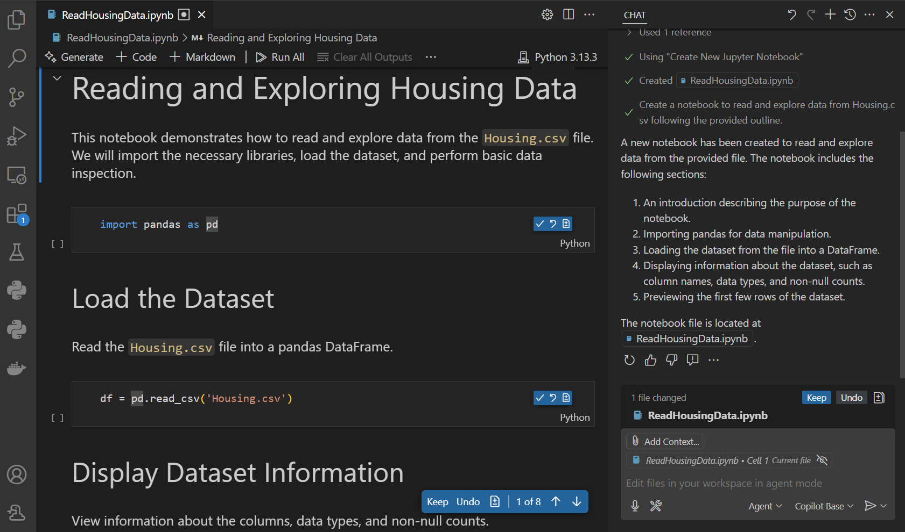
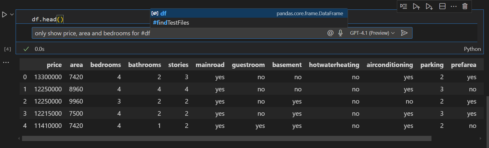
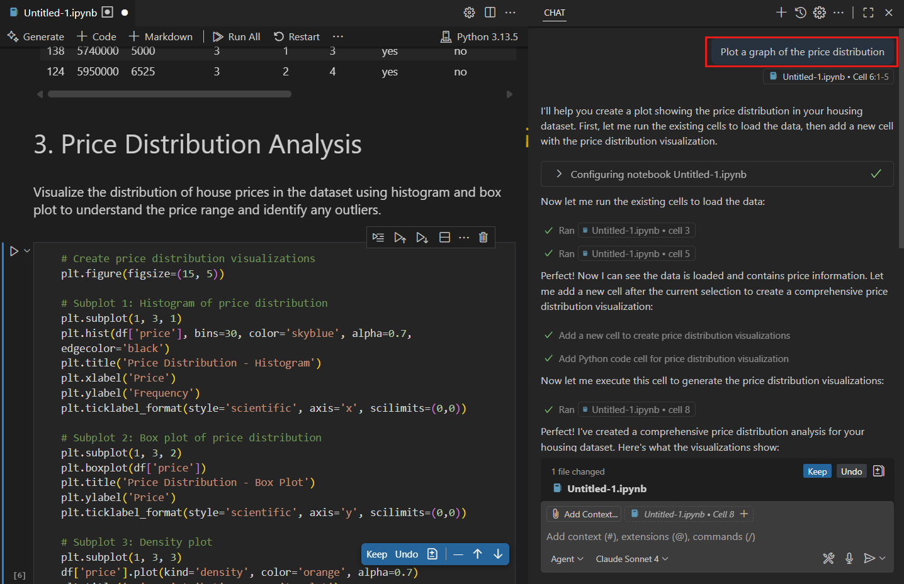
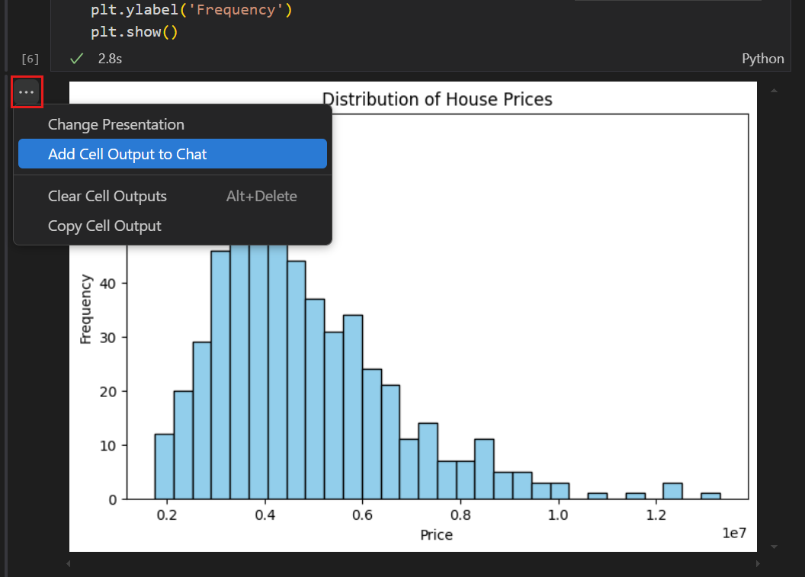
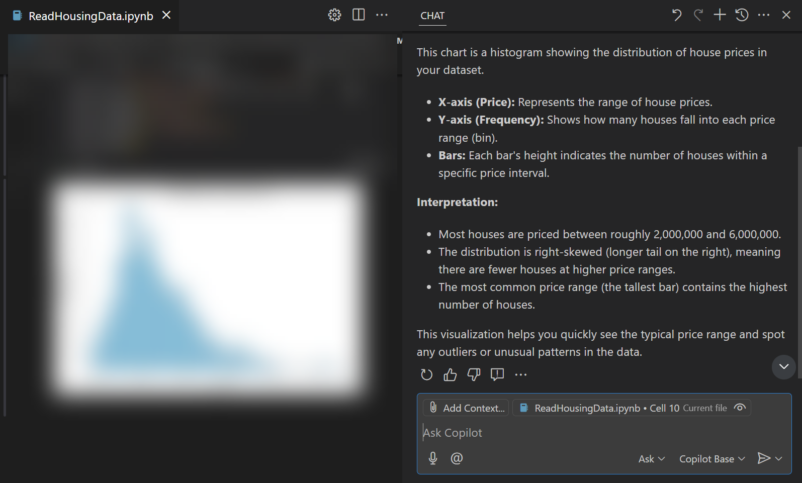
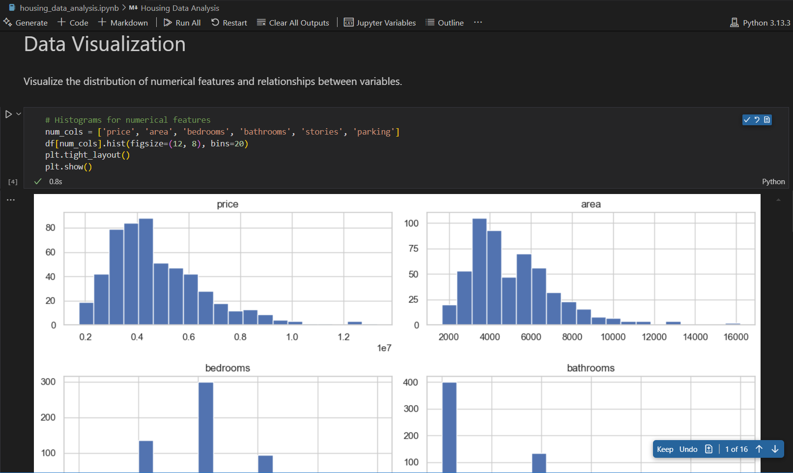

# VS Code'da yapay zeka ile Jupyter notebook'ları düzenleme

Visual Studio Code [Jupyter notebook'lar](/docs/datascience/jupyter-notebooks.md) ve [Python kod dosyaları](/docs/python/jupyter-support-py.md) ile yerel olarak çalışmayı destekler. VS Code'daki yapay zeka özellikleri notebook oluşturma ve düzenlemenin yanı sıra veri analizi ve görselleştirmede size yardımcı olabilir. Bu makalede VS Code'da Jupyter notebook'larla çalışmak için yapay zeka özelliklerini nasıl kullanacağınızı öğrenirsiniz.

## Yeni notebook iskeleti oluşturma

Yeni notebook ile hızlı başlamak için VS Code'un yapay zeka özelliklerini kullanarak notebook iskeleti oluşturabilirsiniz. Eklemek istediğiniz işlevsellik ve kullanmak istediğiniz kütüphaneler hakkında doğal dil kullanarak ayrıntıları sağlayın.

Yapay zeka ile yeni notebook oluşturmak için şu seçeneklerden birini seçin:

* Sohbet giriş kutusuna `/newNotebook` eğik çizgi komutunu yazın, ardından oluşturulacak notebook hakkında ayrıntıları ekleyin.

* [Agent](vscode://GitHub.Copilot-Chat/chat?mode=agent) seçin ve yeni notebook oluşturma isteyen doğal dil promptu yazın.

Etkili notebook promptları için [Prompt örnekleri](/docs/copilot/chat/prompt-examples.md#working-with-jupyter-notebooks) makalesine bakın.

Aşağıdaki ekran görüntüsü *Create a Jupyter notebook to read data from #housing.csv* promptuna ajan yanıtını gösterir (bu veri setini [Kaggle](https://www.kaggle.com/search?q=housing+dataset+in%3Adatasets)'dan alabilirsiniz):

Yeni bir `.ipynb` dosyası oluşturulduğunu fark edin; CSV dosyasını okumak ve verinin ilk birkaç satırını göstermek için Markdown ve kod hücreleri içerir.

Notebook'u manuel olarak daha fazla düzenleyebilir veya satır içi düzenlemeler yapmak veya notebook'u değiştirmek için takip sohbet istekleri göndermek üzere yapay zekayı kullanabilirsiniz.

## Notebook hücrelerinde satır içi düzenleme yapma

Zaten bir notebook'unuz varsa ve bir hücrede satır içi değişiklikler yapmak istiyorsanız kod dosyasında olduğu gibi satır içi sohbeti kullanabilirsiniz.

Hücrede satır içi düzenleme yapmak için `kb(notebook.cell.chat.start)` tuşuna basın. Bu satır içi sohbet görünümünü açar; promptunuzu girebilirsiniz.

> [!TIP]
> Sohbet promptunuzda çekirdek değişkenlerine atıfta bulunabilirsiniz. Atıfta bulunmak için `#` ve ardından değişken adını yazın. Örneğin `df` adında bir değişkeniniz varsa sohbet promptunuzda buna atıfta bulunmak için `#df` yazabilirsiniz.

Yanıt oluşturulduğunda kodun notebook hücresinde güncellendiğini fark edin. Değişiklikleri **Accept** ile kabul edebilir ve hücre değişikliklerini **Accept and Run** ile çalıştırmaya karar verebilirsiniz.

Yapay zeka ile yeni hücre oluşturmak için notebook görünümünde **Generate** düğmesini seçin veya bir hücreye odaklanmadan `kb(notebook.cell.chat.start)` tuşuna basarak yeni hücre için satır içi sohbet görünümünü açın.

## Birden fazla hücrede düzenleme yapma

Daha büyük düzenlemeler, birden fazla hücrede yapmak için [Agent](vscode://GitHub.Copilot-Chat/chat?mode=agent) kullanarak Sohbet görünümüne geçin. Notebook'ta değişiklik isteyen bir prompt sağlayın; ajan değişiklikleri uygulamak için görevler üzerinde yineleyecektir.

Farklı düzenleme önerileri arasında gezinmek ve değişiklikleri korumak veya geri almak için yer paylaşımı kontrollerini kullanabileceğinizi fark edin.

## Notebook içeriği hakkında soru sorma

Notebook içeriği hakkında sorular sormak için sohbet arayüzünü kullanabilirsiniz. Kod, veri veya görselleştirmeler hakkında açıklamalar almak için yararlıdır. Hücre çıktısı, grafikler veya hatalar gibi ek bağlamı sohbet isteğinize ekleyebilirsiniz.

Aşağıdaki örnek notebook'taki bir görselleştirme hakkında nasıl soru sorulacağını gösterir.

1. Grafiğin yanındaki `...` seçin ve grafiği sohbet isteğinize bağlam olarak eklemek için **Add Cell Output to Chat** seçin.

    

1. Sohbet giriş alanına *Explain this chart* promptunu girin.

    Grafiğin ayrıntılı açıklamasını aldığınızı fark edin.

    

## Veri analizi ve görselleştirme gerçekleştirme

Sohbette ajanları kullanarak bir veri setinin tam veri analizi ve görselleştirme notebook'unu oluşturabilirsiniz. Ajan veri setini analiz eder, ardından veri analizi gerçekleştirmek için kodu uygulayan yeni bir notebook oluşturur ve veriyi işlemek ve görselleştirmek için hücreleri çalıştırır. Gerekirse ajan görevlerini tamamlamak için ilgili araçları ve terminal komutlarını çağırır.

Örneğin housing veri setinin veri analizini gerçekleştirmek için:

1. Sohbet görünümündeki ajan seçiciden [Agent](vscode://GitHub.Copilot-Chat/chat?mode=agent) seçin.

1. Sohbet giriş alanına şu promptu girin: *Perform data analysis of the data in #housing.csv*.

    Ajanın farklı görevler üzerinde yinelediğini fark edin. Gerektiğinde araç ve komut çağrılarını onaylayın.
1. Sonuç veri temizleme, veri görselleştirme ve istatistiksel analizi içeren veri setinin tam veri analiziyle yeni bir notebook'tur.

    

Artık notebook'u manuel olarak daha fazla düzenleyebilir veya satır içi düzenlemeler yapmak veya notebook'u değiştirmek için takip sohbet istekleri göndermek üzere yapay zekayı kullanabilirsiniz.

## Sonraki adımlar

* [VS Code'da Jupyter notebook'lar hakkında daha fazla bilgi edinin](/docs/datascience/jupyter-notebooks.md)
* [VS Code'daki yapay zeka özellikleri hakkında daha fazla bilgi edinin](/docs/copilot/overview.md)
* [VS Code'da sohbet hakkında daha fazla bilgi edinin](/docs/copilot/chat/copilot-chat.md)
