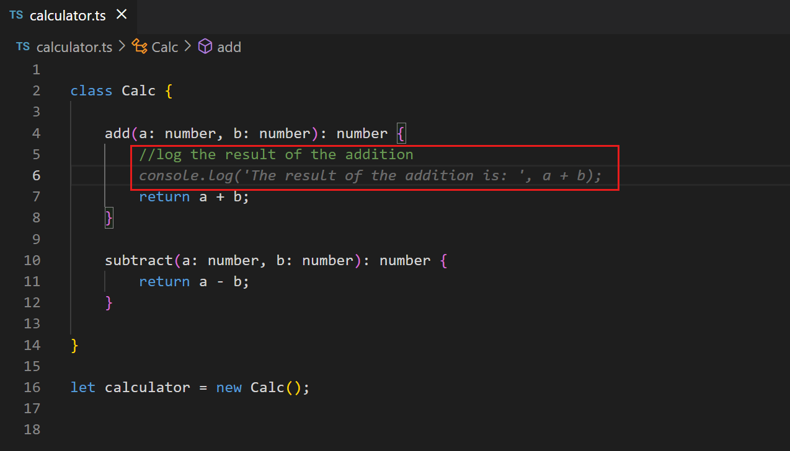
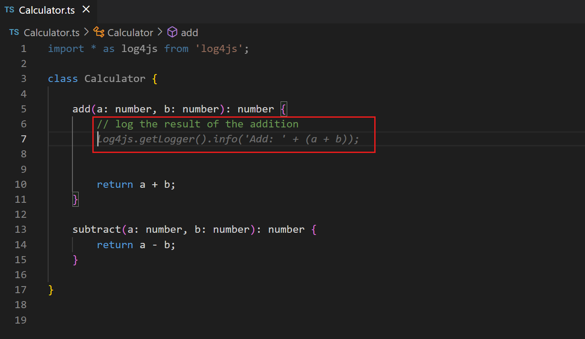
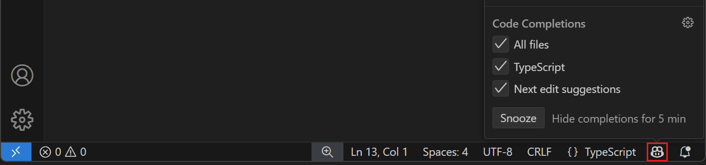
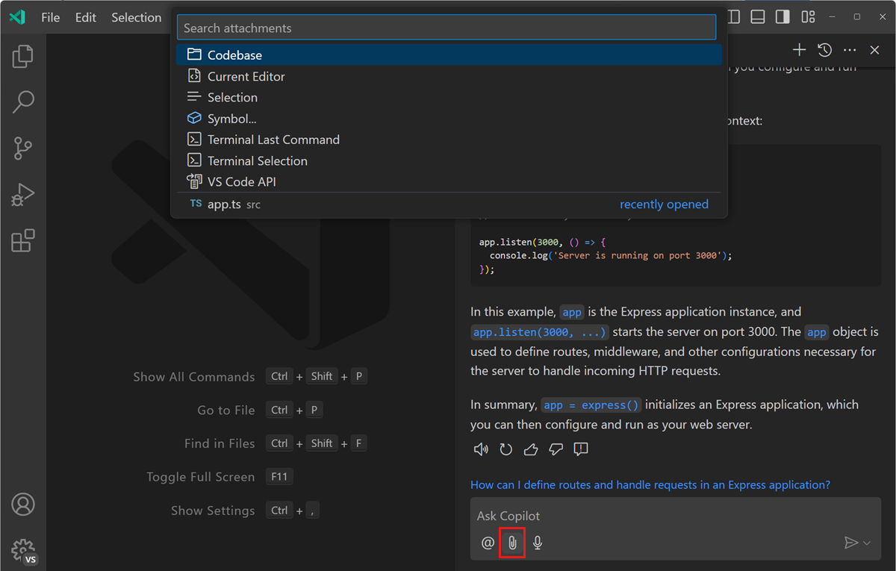
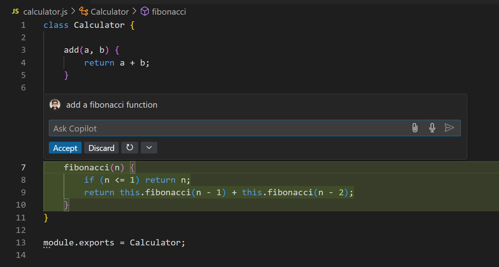
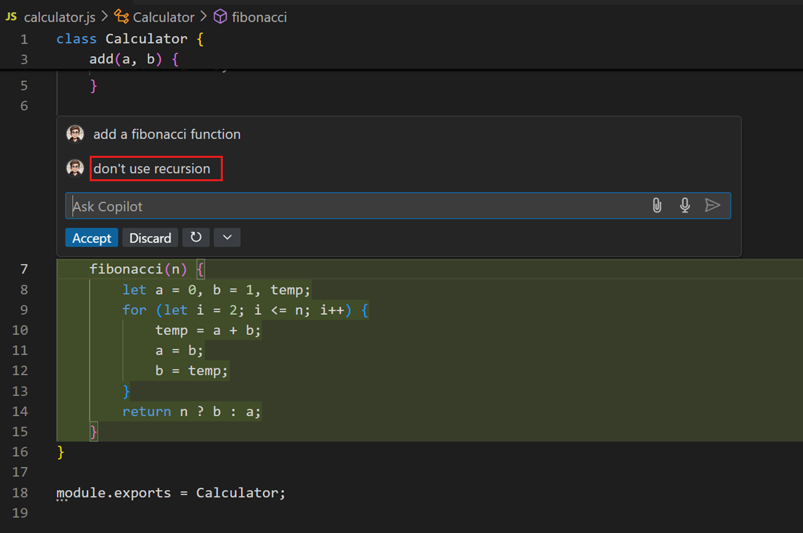
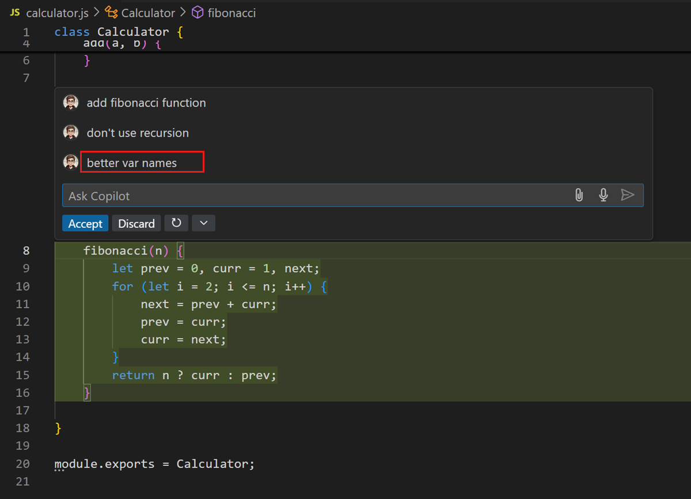

# VS Code'da prompt mühendisliği

Bu makale Visual Studio Code'da yapay zekadan daha iyi ve daha alakalı yanıtlar almak için prompt yazma ipuçlarını kapsar. _Prompt mühendisliği_ veya _prompt oluşturma_, yapay zeka tartışılırken duyacağınız yaygın bir terimdir ve bilginin bir yapay zeka API uç noktasına nasıl ve ne şekilde paketlenip gönderildiğini ifade eder.

<iframe width="560" height="315" src="https://www.youtube-nocookie.com/embed/hh1nOX14TyY" title="Core principles of prompt engineering with GitHub Copilot" frameborder="0" allow="accelerometer; autoplay; clipboard-write; encrypted-media; gyroscope; picture-in-picture" allowfullscreen></iframe>

VS Code veya yapay zekaya yeniyseniz önce [VS Code'da Yapay Zeka Genel Bakış](/docs/copilot/overview.md) makalesini incelemek veya doğrudan [Başlarken](/docs/copilot/getting-started.md) öğreticisine dalma isteyebilirsiniz.

## Satır içi önerilerden en iyi şekilde yararlanma

Satır içi öneriler kodunuzu, yorumlarınızı, testlerinizi ve daha fazlasını otomatik olarak tamamlamayı önerir. Yapay zekanın size mümkün olan en iyi önerileri vermesine yardımcı olacak şeyler ("prompt" vermek) yapabilirsiniz.

### Bağlam sağlayın

Yapay zeka, ne yaptığınızı ve neye yardım istediğinizi bilmek için yeterli bağlama sahip olduğunda en iyi çalışır. Belirli bir programlama görevinde yardım isterken bir meslektaşınıza bağlam sağladığınız gibi yapay zekaya da aynısını yapabilirsiniz.

#### Açık dosyalar

Satır içi öneriler için VS Code editördeki mevcut ve açık dosyalara bakar, bağlamı analiz eder ve uygun öneriler oluşturur. Satır içi öneriler kullanırken VS Code'da ilgili dosyaların açık olması bağlamı belirlemede yardımcı olur ve yapay zekanın projenizin daha büyük resmini görmesini sağlar.

#### Üst düzey yorum

Çalıştığınız dosyadaki üst düzey bir yorum, bir meslektaşa kısa, üst düzey giriş yaptığınız gibi yapay zekanın oluşturduğunuz parçaların genel bağlamını anlamasına yardımcı olabilir.

#### Uygun include ve referanslar

Çalışmanız için gereken include'ları veya modül referanslarını manuel ayarlamanız en iyisidir. Yapay zeka önerilerde bulunabilir ancak hangi bağımlılıkları include etmeniz gerektiğini muhtemelen siz daha iyi bilirsiniz. Bu ayrıca öneriler oluştururken hangi çerçeveleri, kütüphaneleri ve sürümlerini kullanması gerektiğini yapay zekaya bildirmeye yardımcı olur.

Aşağıdaki TypeScript örneğinde `add` metodunun çıktısını günlüğe kaydetmek istiyoruz. Hiç include olmadığında yapay zeka `console.log` kullanmayı önerir:

Öte yandan `Log4js`'e referans eklediğinizde yapay zeka o çerçeveyi kullanarak günlüğe kaydetmeyi önerir:

#### Anlamlı fonksiyon adları

`fetchData()` gibi bir metod bir meslektaşa (veya birkaç ay sonra size) fazla anlam ifade etmeyeceği gibi yapay zeka için de `fetchData()` yardımcı olmaz. Anlamlı fonksiyon adları kullanmak yapay zekanın istediğinizi yapan bir gövde sağlamasına yardımcı olur.

#### Belirli ve iyi kapsamlı fonksiyon yorumları

Fonksiyon adı yalnızca belirli bir uzunlukta açıklayıcı olabilir. Fonksiyon yorumları yapay zekanın bilmesi gerekebilecek ayrıntıları doldurabilir.
<!-- Örnek anlamlı fonksiyon/metot yorumu -->

#### Örnek kodla yapay zekayı hazırlayın

Yapay zekayı doğru sayfaya getirmenin bir püf noktası, aradığınıza yakın örnek kodu açık editöre kopyalayıp yapıştırmaktır. Küçük bir örnek sağlamak yapay zekanın istediğiniz dili ve görevleri eşleşen öneriler oluşturmasına yardımcı olabilir. Yapay zeka size istediğiniz ve gerçekten kullanacağınız kodu vermeye başladığında örnek kodu dosyadan silebilirsiniz. Yapay zekayı varsayılan olarak daha eski kod önerileri verdiği durumda daha yeni kütüphane sürümüne başlatmak için özellikle yararlı olabilir.

### Tutarlı olun ve kalite çıtasını yüksek tutun

Yapay zeka mevcut deseni takip eden öneriler oluşturmak için kodunuza tutunacaktır; "garbage in, garbage out" (kötü girdi, kötü çıktı) atasözü geçerlidir.
Her zaman yüksek kalite çıtasını korumak disiplin gerektirebilir. Özellikle hızlı ve serbest kodlarken bir şeyleri çalışır hale getirmek için tamamlamaları "hacking" modundayken geçici olarak devre dışı bırakmak isteyebilirsiniz. Satır içi önerileri geçici olarak ertelemek için Status Bar'daki Copilot menüsünü seçin ve **Snooze** düğmesini seçerek erteleme süresini beş dakika artırın. Satır içi önerilere devam etmek için Copilot menüsündeki **Cancel Snooze** düğmesini seçin.

## Sohbetten en iyi şekilde yararlanma

Sohbet kullanırken deneyiminizi optimize etmek için yapabileceğiniz birkaç şey vardır.

### İlgili bağlam ekleyin

Bahsetmek istediğiniz bağlam öğesinden sonra `#` yazarak promptunuza açıkça bağlam ekleyebilirsiniz. VS Code farklı bağlam öğesi türlerini destekler: dosyalar, klasörler, kod sembolleri, araçlar, terminal çıktısı, kaynak denetim değişiklikleri ve daha fazlası.

Sohbet giriş alanına `#` sembolünü yazarak mevcut bağlam öğelerinin listesini görün veya Sohbet görünümünde **Add Context** seçerek bağlam seçiciyi açın.

Örneğin `#<dosya adı>` veya `#<klasör adı>` ile çalışma alanınızdaki belirli dosya veya klasörlere sohbet promptunuzda atıfta bulunabilirsiniz. Bu Copilot Sohbet yanıtlarını çalıştığınız dosyayla ilgili bilgi sağlayarak daha alakalı hale getirir. "#package.json'a iyileştirme önerir misin?" veya "#devcontainer.json'da uzantı nasıl eklenir?" gibi sorular sorabilirsiniz.

Tek tek dosyaları manuel eklemek yerine `#codebase` kullanarak VS Code'un sorunuzla ilgili doğru dosyaları kod tabanından otomatik bulmasını sağlayabilirsiniz.

[Sohbette bağlam kullanma](/docs/copilot/chat/copilot-chat-context.md) hakkında daha fazla bilgi edinin.

### Belirli olun ve basit tutun

Sohbetten bir şey yapmasını istediğinizde isteğinizde belirli olun ve büyük görevi ayrı, daha küçük görevlere bölün. Örneğin sohbete TypeScript ve Pug kullanan, MongoDB veritabanından veri çeken ürün sayfası olan bir Express uygulaması oluşturmasını istemeyin. Bunun yerine önce TypeScript ve Pug ile Express uygulaması oluşturmasını isteyin. Sonra ürün sayfası eklemesini isteyin ve son olarak müşteri verilerini veritabanından çekmesini isteyin.

Sohbete belirli bir görev yaptırdığınızda kullanmak istediğiniz girdiler, çıktılar, API'ler veya çerçeveler hakkında belirli olun. Prompt ne kadar belirli olursa sonuç o kadar iyi olur. Örneğin "veritabanından ürün verilerini oku" yerine "kategoriye göre tüm ürünleri oku, veriyi JSON formatında döndür ve Mongoose kütüphanesini kullan" kullanın.

### Çözümünüz üzerinde yineleyin

Sohbetten yardım isterken ilk yanıtla sıkışıp kalmazsınız. Çözümü iyileştirmek için sohbetle yineleyebilir ve prompt verebilirsiniz. Sohbet hem oluşturulan kodun bağlamına hem de mevcut görüşmenize sahiptir.
Satır İçi Sohbet kullanarak Fibonacci sayıları hesaplayan fonksiyon oluşturma örneği:

Belki özyineleme kullanmayan bir çözüm tercih edersiniz:

Kodlama sözleşmelerine uymasını veya değişken adlarını iyileştirmesini bile isteyebilirsiniz:

Sonucu zaten kabul etmiş olsanız bile kod üzerinde daha sonra yineleme isteyebilirsiniz.

## Copilot için prompt verme hakkında daha fazla kaynak

GitHub Copilot'u verimli kullanmayı öğrenmek isterseniz bu videoları ve blog yazılarını takip edebilirsiniz:

* [GitHub Copilot için Etkili Prompt Verme](https://www.youtube.com/watch?v=ImWfIDTxn7E)
* [GitHub Copilot'tan en iyi şekilde yararlanmak için pragmatik teknikler](https://www.youtube.com/watch?v=CwAzIpc4AnA)
* [VS Code'da GitHub Copilot'a prompt verme en iyi uygulamaları](https://www.linkedin.com/pulse/best-practices-prompting-github-copilot-vs-code-pamela-fox)
* [GitHub Copilot nasıl kullanılır: Promptlar, ipuçları ve kullanım senaryoları](https://github.blog/2023-06-20-how-to-write-better-prompts-for-github-copilot/)
