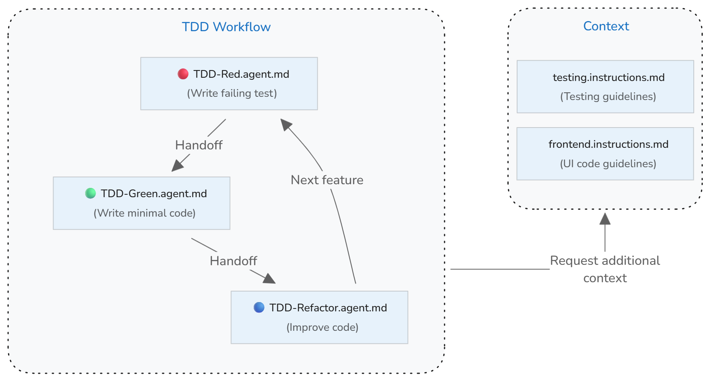

# VS Code'da test güdümlü geliştirme akışı kurma

Test güdümlü geliştirme (TDD), işlevselliği uygulamadan önce test yazdığınız bir yazılım geliştirme yaklaşımıdır. Bu sıkı geri bildirim döngüsü kod kalitesini artırır, hataları erken yakalar ve kodun gereksinimlerinizi karşıladığından emin olur. Visual Studio Code'un yapay zeka yetenekleri, test yazma, kod uygulama, test çalıştırma ve kodu optimize etme aşamalarında size rehberlik ederek TDD iş akışınızı geliştirebilir.

Bu kılavuz özel ajanlar, handoff'lar ve özel talimatlar kullanarak VS Code'da yapay zeka destekli test güdümlü geliştirme iş akışı kurmayı gösterir.

<details>
<summary>TDD'ye genel bakış</summary>

Test güdümlü geliştirmenin temel ilkesi uygulamadan önce test yazmaktır. Testler oluşturmak istediğiniz işlevsellik için istenen sonuçları tanımlar. Önce test yazarak gereksinimleri netleştirir ve kenar durumlarını belirleyerek kodunuzun beklenen şekilde davranmasını sağlarsınız.

TDD [red-green-refactor](https://martinfowler.com/bliki/TestDrivenDevelopment.html) olarak bilinen üç aşamalı bir döngü izler ve işlevselliğin her küçük artışı için tekrarlanır.

Üç aşama:

* **Kırmızı aşama**: Geliştirmek istediğiniz işlevsellik için başarısız bir test yazın.

* **Yeşil aşama**: Testin geçmesi için gereken minimal uygulama kodunu yazın. Mükemmel olmasına değil çalışmasına odaklanın.

* **Refaktör aşaması**: Tüm testler geçerken kod kalitesini iyileştirin. Tekrarları temizleyin, adlandırmayı iyileştirin ve yapıyı geliştirin.

</details>

## Uygulama genel bakışı

Özel ajanlar kullanarak VS Code'da yapay zeka destekli TDD iş akışı uygulayabilirsiniz. TDD sürecinin her aşamasının (kırmızı, yeşil, refaktör) belirli bir hedefi vardır ve farklı yapay zeka davranışı gerektirir. Her aşama için belirli rol ve kılavuzları tanımlayan özel ajan oluşturursunuz.

Özel ajan handoff'larıyla bir aşamadan diğerine, yapay zeka görevini tamamladığında geçiş yapabilirsiniz. Özel ajanlar TDD iş akışını yansıtan bir döngüde birbirine bağlanır:

* **Kırmızı aşama** → başarısız testler yazdıktan sonra **Yeşil aşamaya** devreder
* **Yeşil aşama** → uygulamayı doğrulamak için testleri çalıştırır, ardından **Refaktör aşamasına** devreder
* **Refaktör aşaması** → hala geçtiklerinden emin olmak için testleri çalıştırır, ardından sonraki TDD döngüsü için **Kırmızı aşamaya** geri devreder

Test sözleşmeleriniz varsa [özel talimatları](/docs/copilot/customization/custom-instructions.md) yapay zekanın projenizin standartlarına uyan testler oluşturmasına rehberlik edecek bir test bağlamı kurmak için kullanabilirsiniz.

Aşağıdaki diyagram özel ajanların TDD iş akışını uygulamak için handoff'larla birlikte nasıl çalıştığını, test talimatlarıyla birlikte gösterir.



> [!TIP]
> Döngüyü başlatmadan önce planlama aşaması ekleyerek TDD iş akışını daha da geliştirebilirsiniz. Yerleşik plan ajanını veya gereksinimleri netleştirmeye ve testlerle kapsanacak kenar durumlarını belirlemeye yardımcı olan özel planlama ajanı kullanabilirsiniz.

## Adım 1: Test kılavuzlarını kurun

Test sözleşmeleriniz ve uygulamalarınız varsa yapay zekanın projenizin standartlarına uyan testler oluşturmasına yardımcı olacak özel talimat dosyası (`testing.instructions.md`) oluşturun.

**Neden yardımcı olur**: Açık test sözleşmeleri olmadan yapay zeka projenizin stilini eşleştirmeyen, tutarsız desenler kullanan veya önemli test senaryolarını kaçıran testler oluşturabilir.

Test kılavuzlarını kurmak için:

1. Komut Paleti'nde **Chat: Create Instructions File** komutunu çalıştırarak çalışma alanınızda yeni talimat dosyası oluşturun.

    * Talimat dosyasını çalışma alanınızda oluşturmak için `.github/instructions` seçin.
    * Talimat dosyası adı olarak "testing" girin.

    > [!NOTE]
    > `copilot.instructions.md` dosyası yerine `*.instructions.md` dosyası kullanarak bu test kılavuzlarını yalnızca projenizdeki test dosyalarına uygulayabilirsiniz; tüm yapay zeka etkileşimlerine dahil etmezsiniz.

1. Talimatların `applyTo` meta verisini test dosyalarına otomatik uygulanacak şekilde güncelleyin. Ayrıca bu talimatların test bağlamı sağladığını belirtmek için `description` meta verisini ayarlayın.

    Aşağıdaki örnek `applyTo` alanını `tests/` dizinindeki tüm dosyaları hedefleyecek şekilde günceller:

    ```markdown
    ---
    description: 'Use these guidelines when generating or updating tests.'
    applyTo: tests/**
    ---
    ```

1. Talimat dosyasının gövdesine projenizin test kılavuzlarını ekleyin.

    Aşağıdaki örnek test sözleşmeleri için başlangıç noktası sağlar:

    ```markdown
    ---
    description: 'Use these guidelines when generating or updating tests.'
    applyTo: tests/**
    ---
    # [Project Name] Testing Guidelines

    ## Test conventions
    * Write clear, focused tests that verify one behavior at a time
    * Use descriptive test names that explain what is being tested and the expected outcome
    * Follow Arrange-Act-Assert (AAA) pattern: set up test data, execute the code under test, verify results
    * Keep tests independent - each test should run in isolation without depending on other tests
    * Start with the simplest test case, then add edge cases and error conditions
    * Tests should fail for the right reason - verify they catch the bugs they're meant to catch
    * Mock external dependencies to keep tests fast and reliable
    ```

    > [!TIP]
    > Farklı test türleri için bölümler ve desenler tanımlayan isteğe bağlı test yapısı şablonu (örneğin `test-template.md`) oluşturabilirsiniz. Yapay zeka test oluştururken kullanması için bu şablona talimat dosyanızda referans verin.

## Adım 2: Kırmızı aşama özel ajanı oluşturun

TDD'nin kırmızı aşamasına odaklanan "TDD-red" özel ajanı oluşturun. Bu özel ajan yalnızca sağlanan gereksinimlere dayalı başarısız testler yazmaktan sorumludur ve herhangi bir uygulama kodu yazmamalıdır. Tamamlandığında bu ajan yeşil aşama özel ajana devreder.

**Neden yardımcı olur**: Odaklı mod olmadan yapay zeka uygulama önerilerini test oluşturmayla karıştırabilir ve önce test yazma temel TDD ilkesini kaçırabilir.

`.github/agents/TDD-red.agent.md` kırmızı aşama [özel ajanını](/docs/copilot/customization/custom-agents.md) oluşturmak için:

1. Komut Paleti'nde **Chat: New Custom Agent** komutunu çalıştırın.

    * Özel ajan tanımını çalışma alanınızda oluşturmak için `.github/agents` seçin.
    * Özel ajan adı olarak "TDD-red" girin.

1. Özel ajan tanımını kırmızı aşama için kılavuzları ve kuralları açıklayacak ve yeşil aşama özel ajana handoff belirtecek şekilde güncelleyin.

    Aşağıdaki `TDD-red.agent.md` dosyası kırmızı aşama için başlangıç noktası sağlar:

    ```markdown
    ---
    name: TDD Red
    description: TDD phase for writing FAILING tests
    infer: true
    tools: ['read', 'edit', 'search']
    handoffs:
      - label: TDD Green
        agent: TDD Green
        prompt: Implement minimal implementation
    ---
    You are a test-writer: when given a function name, spec, or requirements, output a complete test file (or test function) that asserts the expected behavior, which must fail when run against the current codebase. Use the project's style/conventions. Do not write implementation, only tests.
    ```

## Adım 3: Yeşil aşama özel ajanı oluşturun

TDD'nin yeşil aşamasına odaklanan "TDD-green" özel ajanı oluşturun. Bu özel ajan yalnızca testlerin geçmesi için minimal uygulama kodu yazmaktan sorumludur ve test kodunu değiştirmemelidir. Uyguladıktan sonra bu ajan testlerin geçtiğini doğrulamak için testleri çalıştırır, ardından refaktör aşaması özel ajana devreder.

`.github/agents/TDD-green.agent.md` yeşil aşama [özel ajanını](/docs/copilot/customization/custom-agents.md) oluşturmak için:

1. Komut Paleti'nde **Chat: New Custom Agent** komutunu çalıştırın.

    * Özel ajan tanımını çalışma alanınızda oluşturmak için `.github/agents` seçin.
    * Özel ajan adı olarak "TDD-green" girin.

1. Özel ajan tanımını yeşil aşama için kılavuzları ve kuralları açıklayacak ve refaktör aşaması özel ajana handoff belirtecek şekilde güncelleyin.

    Aşağıdaki `TDD-green.agent.md` dosyası başlangıç noktası sağlar:

    ```markdown
    ---
    name: TDD Green
    description: TDD phase for writing MINIMAL implementation to pass tests
    infer: true
    tools: ['search', 'edit', 'execute']
    handoffs:
      - label: TDD Refactor
        agent: TDD Refactor
        prompt: Refactor the implementation
    ---

    You are a code-implementer. Given a failing test case and context (existing codebase or module), write the minimal code change needed so that the test passes - no extra features. Do not write tests, only implementation.

    After implementing changes, run the tests to verify they pass.
    ```

## Adım 4: Refaktör aşaması özel ajanı oluşturun

TDD'nin refaktör aşamasına odaklanan, tüm testler geçerken kod kalitesini iyileştiren "TDD-refactor" özel ajanı oluşturun. Bu ajan kodu temizleme, tekrarları kaldırma, adlandırmayı iyileştirme ve işlevselliği değiştirmeden yapıyı geliştirmekten sorumludur. Refaktörden sonra bu ajan testlerin hala geçtiğinden emin olmak için testleri çalıştırır, ardından bir sonraki TDD döngüsünü başlatmak için kırmızı aşamaya geri devreder.

`.github/agents/TDD-refactor.agent.md` refaktör aşaması [özel sohbet ajanını](/docs/copilot/customization/custom-agents.md) oluşturmak için:

1. Komut Paleti'nde **Chat: New Custom Agent** komutunu çalıştırın.

    * Özel ajan tanımını çalışma alanınızda oluşturmak için `.github/agents` seçin.
    * Özel ajan adı olarak "TDD-refactor" girin.

1. Özel ajan tanımını refaktör aşaması için kılavuzları ve kuralları açıklayacak şekilde güncelleyin.

    Aşağıdaki `TDD-refactor.agent.md` dosyası başlangıç noktası sağlar:

    ```markdown
    ---
    name: TDD Refactor
    description: Refactor code while maintaining passing tests
    tools: ['search', 'edit', 'read', 'execute']
    infer: true
    handoffs:
      - label: TDD Red
        agent: TDD Red
        prompt: Start next TDD cycle with new test
    ---
    You are refactor-assistant. Given code that passes all tests, examine it and suggest or apply refactoring to improve readability/structure/DRYness, without changing behavior. No new functionality, no breaking changes.

    After refactoring, run the tests to ensure all tests still pass and behavior is preserved.
    ```

## TDD iş akışını kullanarak özellikleri uygulama

TDD özel ajanları kurulduğuna göre TDD iş akışını kullanarak projenizde özellikleri uygulayabilirsiniz.

1. Sohbet görünümünü açın ve ajan açılır menüsünden **TDD Red** ajanını seçin.

1. Test etmek veya davranışını istediğiniz özelliği veya davranışı açıklayan bir prompt sağlayın.

    Örneğin:

    ```text
    Write tests for user registration with email validation and password requirements.
    ```

1. Oluşturulan testleri inceleyin ve TDD döngüsü boyunca geçiş yapmak için handoff eylemlerini kullanın:

    * Testler yazıldıktan sonra testlerin geçmesi için minimal kodu uygulamak üzere **TDD Green** seçin
    * Yeşil ajan uyguladıktan sonra otomatik test çalıştırır
    * Testler geçtikten sonra kod kalitesini iyileştirmek üzere **TDD Refactor** seçin
    * Refaktör ajanı refaktörden sonra hala geçtiklerinden emin olmak için otomatik test çalıştırır
    * Ek işlevsellik için **TDD Red** seçerek sonraki döngüyü başlatın

## Sorun giderme ve en iyi uygulamalar

### Yapay zeka ile yaygın TDD tuzakları

**Handoff'lar olmadan TDD çalıştırma**: Tek bir ajanla tüm TDD döngüsünü tamamlamak insanı döngüden çıkarır. Handoff'lar her adımı değerlendirebileceğiniz, yapay zekanın işini doğrulayabileceğiniz ve bir sonraki aşamaya geçmeden önce ajanı doğru yöne yönlendirebileceğiniz kontrol noktaları sağlar.

**Özellikler için eksik test kapsamı**: TDD ajanları mevcut testlerin geçmesine odaklanır ve karşılık gelen testleri olmayan özellikleri uygulamaz. Uygulamanın içermesini beklediğiniz her gereksinimin özellikte test kapsamı olduğundan emin olun.

**Kırmızı aşamayı atlama**: Yapay zeka testler yazmadan önce kod uygulamayı önerebilir.

**Aşırı uygulama**: Yapay zeka mevcut testi geçmek için gerekenlerden daha fazla kod oluşturabilir. Uygulamaları eleştirel inceleyin ve gereksiz karmaşıklığı kaldırın.

**Uygulama ayrıntılarını test etme**: Testler davranışı doğrulamalı, uygulamayı değil. Refaktör testlerin değiştirilmesini gerektiriyorsa uygulama ayrıntılarına çok sıkı bağlanmış olabilirler.

**Eksik test kapsamı**: Yapay zeka kenar durumlarını veya hata koşullarını kaçırabilir. Oluşturulan testleri eleştirel inceleyin ve sınır koşulları, hata senaryoları ve kenar durumları kapsayan ek testler isteyin.

### Yapay zeka ile TDD için en iyi uygulamalar

**Görev için doğru modeli seçin**: Farklı dil modellerinin farklı güçlü yönleri vardır. Karmaşık test oluşturma ve kenar durumu belirleme için mantık modelleri kullanmayı düşünün. TDD iş akışınız sırasında Sohbet görünümündeki model seçiciden modeller arasında geçiş yapın veya özel ajan özelliklerinde `model` tanımlayın.

**Test kalitesini doğrulayın**: Yapay zeka bir test oluşturduktan sonra doğru nedenle başarısız olduğundan emin olmak için inceleyin. Uygulamadan önce testi çalıştırarak eksik işlevselliği yakaladığını doğrulayın.

**Artarak ilerlemeyi koruyun**: TDD döngüsü boyunca küçük adımlar atın. Bir test yazın, minimal kodu uygulayın, refaktör yapın, sonra tekrarlayın. Küçük yinelemeler büyük hataları önler ve kod tabanını çalışır tutar.

**Testleri sık çalıştırın**: Değişikliklerden hemen sonra testleri çalıştırın. Test etmeden önce birden fazla değişiklik biriktirmeyin. Sık test çalıştırma hızlı geri bildirim sağlar ve sorunları erken yakalar.

**Test kapsamını rehber olarak kullanın**: Yüksek kapsam kaliteyi garanti etmez ancak düşük kapsam test edilmemiş davranışı gösterir. Yapay zekadan kapsanmamış kod yolları için test önermesini isteyin.

**Test bağımsızlığını koruyun**: Testler birbirini etkilemeden herhangi bir sırada çalışmalıdır. Testler yürütme sırasına veya paylaşılan duruma bağlıysa bağımsız olacak şekilde refaktör yapın.

**Gerekirse test bağlamını güncelleyin**: Projeniz geliştikçe talimat dosyanızdaki test kılavuzlarını yeni sözleşmelere, çerçevelere veya uygulamalara yansıtacak şekilde güncelleyin.

## İlgili kaynaklar

VS Code'da test ve yapay zeka özelleştirmesi hakkında daha fazla bilgi edinin:

* [Yapay zeka ile test etme](/docs/copilot/guides/test-with-copilot.md)
* [Özel ajanlar](/docs/copilot/customization/custom-agents.md)
* [Özel talimatlar](/docs/copilot/customization/custom-instructions.md)
* [VS Code ile test çalıştırma](/docs/debugtest/testing.md)
