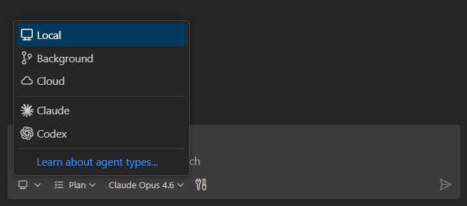
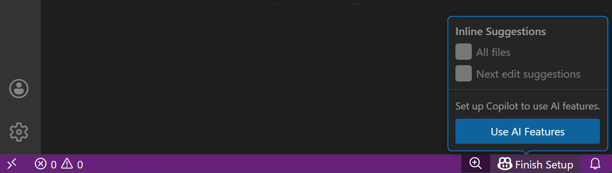
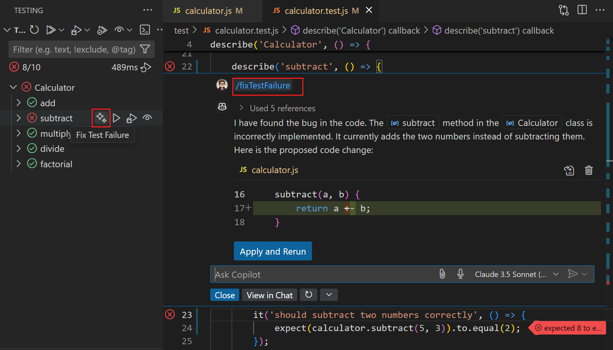

# VS Code'da GitHub Copilot

GitHub Copilot, Visual Studio Code'da AI destekli ajanlar ve kodlama araçları sunar. Kod tabanınızın derin anlamsal anlayışıyla projenizin tamamında değişiklikleri planlayan, uygulayan ve doğrulayan özerk ajanları kullanın. Yerel olarak, arka planda veya bulutta birden fazla ajan oturumunu paralel çalıştırın. Copilot, Claude ve Codex gibi üçüncü taraf ajanlardan veya kendi özel ajanlarınızdan birini seçin. Hepsini merkezi bir görünümden yönetin. Satır içi öneriler, satır içi sohbet ve akıllı eylemler kodlama iş akışınızın geri kalanında size yardımcı olur.

<div class="docs-action" data-show-in-doc="false" data-show-in-sidebar="true" title="AI ile Başlayın">
VS Code'da AI ile ilk uygulamanızı oluşturmak için adım adım öğreticiyi takip edin.

* [Öğreticiye Başlayın](/docs/copilot/getting-started.md)

</div>

## Ajanlar ve ajan oturumları

Ajanlar, kodlama görevlerini baştan sona ele alır. Bir ajana üst düzey bir görev verin; çalışmayı adımlara ayırır, dosyaları düzenler, terminal komutları çalıştırır, araçları kullanır ve hata veya başarısız testlerle karşılaştığında kendini düzeltir. Her görev, takip edebileceğiniz, duraklatabileceğiniz, devam ettirebileceğiniz veya başka bir ajana devredebileceğiniz kalıcı bir konuşma olan **ajan oturumu** içinde çalışır.

<video src="images/overview/agents-intro.mp4" title="VS Code'da tam bir özelliği oluşturan bir ajan oturumunu gösteren video." loop controls muted></video>

> [!IMPORTANT]
> Kuruluşunuz ajanları VS Code'da devre dışı bırakmış olabilir. Bu işlevi etkinleştirmek için yöneticinizle iletişime geçin.

### Oturumları merkezi bir görünümden yönetin

Paralel olarak her biri farklı bir göreve odaklanan birden fazla ajan oturumu çalıştırın. **Sohbet** panelindeki **Oturumlar** görünümü, ister yerel, ister arka planda veya bulutta çalışsın tüm etkin oturumları izlemek için tek bir yer sunar. Her oturumun durumunu görün, aralarında geçiş yapın, dosya değişikliklerini inceleyin ve kaldığınız yerden devam edin.

<video src="images/overview/agent-sessions-demo.mp4" title="Oturumları filtreleme, gösterme ve arşivleme işlemlerini gösteren ajan oturumları listesi videosu." loop controls muted></video>

[ajan oturumlarını yönetme](/docs/copilot/chat/chat-sessions.md) hakkında daha fazla bilgi edinin.

### Ajanları her yerde çalıştırın

Ajanlar etkileşimli çalışma için VS Code'da yerel olarak, özerk görevler için makinenizde arka planda veya takım iş birliği için çekme talepleri aracılığıyla bulutta çalışabilir. Anthropic ve OpenAI gibi sağlayıcıların üçüncü taraf ajanlarını da kullanabilirsiniz. Herhangi bir noktada, bir ajan türünden diğerine görev devredebilirsiniz ve tam konuşma geçmişi aktarılır.



[ajan türleri ve devretme](/docs/copilot/agents/overview.md) veya [ajanlar öğreticisi](/docs/copilot/agents/agents-tutorial.md) hakkında daha fazla bilgi edinin.

### Önce planlayın, sonra oluşturun

Herhangi bir kod yazmadan önce bir görevi yapılandırılmış bir uygulama planına dönüştürmek için yerleşik **Plan** ajanını kullanın. Plan ajanı kod tabanınızı analiz eder, açıklayıcı sorular sorar ve adım adım bir plan üretir. Plan doğru görünüyorsa, onu yerel, arka plan veya bulutta yürütmek üzere bir uygulama ajana devredin.

<video src="images/overview/plan-intro.mp4" title="Uygulamaya kimlik doğrulama eklemek için Plan ajandının yapılandırılmış bir uygulama planı oluşturmasını gösteren video." loop controls muted></video>

[ajanlarla planlama](/docs/copilot/agents/planning.md) hakkında daha fazla bilgi edinin.

<div class="docs-action" data-show-in-doc="false" data-show-in-sidebar="true" title="Ajanlarla bir özellik planlayın">
Yeni bir özellik için yapılandırılmış bir uygulama planı oluşturmak üzere Plan ajanını kullanın.

* [VS Code'da Aç](vscode://GitHub.Copilot-Chat/chat?agent=agent%26prompt=%2Fplan%20a%20terminal%20UI%20app%20to%20track%20my%20todo%20list.)

</div>

## Neler yapabilirsiniz

* **Baştan sona bir özellik oluşturun.** Doğal dilde bir özellik tanımlayın; ajan projeyi iskelet halinde oluşturur, mantığı birden fazla dosyada uygular ve sonucu doğrulamak için testleri çalıştırır.

* **Hata ayıklayın ve başarısız testleri düzeltin.** Başarısız bir testi bir ajana işaret edin; hata mesajını okur, kod tabanınızda kök nedeni izler, bir düzeltme uygular ve doğrulamak için testi yeniden çalıştırır. [AI ile hata ayıklama](/docs/copilot/guides/debug-with-copilot.md) hakkında daha fazla bilgi edinin.

* **Kod tabanını yeniden düzenleyin veya taşıyın.** Örneğin bir çerçeveden diğerine geçiş planlamasını bir ajana sorun; koordineli değişiklikleri dosyalara uygular ve derlemelerle doğrular.

* **Web uygulamalarını test edin ve etkileşime girin.** _(Deneysel)_ Bir ajandan web uygulamanızı [entegre tarayıcıda](/docs/debugtest/integrated-browser.md) açmasını isteyin, bir özelliğin çalıştığını doğrulayın, yerleşim sorunlarını kontrol edin veya ekran görüntüleri alın. [tarayıcı ajan test rehberi](/docs/copilot/guides/browser-agent-testing-guide.md)'ni takip edin.

* **Çekme talepleri ile iş birliği yapın.** Bir dal oluşturan, değişiklikleri uygulayan ve ekibinizin incelemesi için çekme talebi açan bir bulut ajana görev devredin. [bulut ajanlar](/docs/copilot/agents/cloud-agents.md) hakkında daha fazla bilgi edinin.

## Başlarken

### Adım 1: Copilot'u ayarlayın

1. Durum Çubuğundaki Copilot simgesinin üzerine gelin ve **Copilot'u Ayarla**'yı seçin.

    

1. Bir giriş yöntemi seçin ve istemleri takip edin. Henüz Copilot aboneliğiniz yoksa, [Copilot Ücretsiz planına](https://docs.github.com/en/copilot/managing-copilot/managing-copilot-as-an-individual-subscriber/managing-copilot-free/about-github-copilot-free) kaydolursunuz.

### Adım 2: İlk ajan oturumunuzu başlatın

1. **Sohbet** görünümünü açın (`kb(workbench.action.chat.open)`).

1. Ne oluşturmak istediğinizi açıklayan bir istem girin, örneğin:

    ```prompt-agent
    Create a basic Node.js web app for sharing recipes. Make it look modern and responsive.
    ```

1. Oluşturulan kodu inceleyin. Ajan gerekli dosyaları oluşturur, bağımlılıkları yükler ve komutları çalıştırır.

1. Projenizi AI için yapılandırmak için `/init` yazın. Bu, [özel talimatlar](/docs/copilot/customization/custom-instructions.md) oluşturarak ajanın kod tabanınızı anlamasına ve daha iyi kod üretmesine yardımcı olur.

Satır içi öneriler, ajanlar, satır içi sohbet ve özelleştirmeyi kapsayan kapsamlı adım adım öğretici için [VS Code'da GitHub Copilot ile Başlayın](/docs/copilot/getting-started.md)'a bakın.

## AI ile kodlamanın daha fazla yolu

### Satır içi öneriler

Copilot, tek satır tamamlamalardan tam fonksiyon uygulamalarına kadar yazarken kod önerileri sunar. Sonraki düzenleme önerileri, mevcut düzenlemelerinize dayanarak bir sonraki mantıksal değişikliği tahmin eder.

<video src="images/inline-suggestions/nes-video.mp4" title="Editörde hayalet metin olarak görünen satır içi kod önerilerini gösteren video." loop controls muted poster="./images/inline-suggestions/point3d.png"></video>

[VS Code'da satır içi öneriler](/docs/copilot/ai-powered-suggestions.md) hakkında daha fazla bilgi edinin.

### Satır içi sohbet

Editörde doğrudan bir sohbet istemi açmak için `kb(inlinechat.start)` tuşuna basın. Bir değişiklik tanımlayın; Copilot düzenlemeleri yerinde önerir, böylece kodlama akışında kalırsınız. Hedefli yeniden düzenlemeler, açıklamalar veya hızlı düzeltmeler için bağlam değiştirmeden kullanın.

[VS Code'da satır içi sohbet](/docs/copilot/chat/inline-chat.md) hakkında daha fazla bilgi edinin.

### Akıllı eylemler

VS Code, yaygın görevler için önceden tanımlanmış AI destekli eylemler içerir: commit mesajı oluşturma, sembolleri yeniden adlandırma, hataları düzeltme ve projenizde anlamsal arama yürütme.



[VS Code'da akıllı eylemler](/docs/copilot/copilot-smart-actions.md) hakkında daha fazla bilgi edinin.

## AI'yı iş akışınıza göre özelleştirin

Ajanlar projenizin sözleşmelerini anladığında, doğru araçlara sahip olduğunda ve göreve uygun bir model kullandığında en iyi çalışır. VS Code, AI'yı [özelleştirmenin](/docs/copilot/customization/overview.md) birkaç yolunu sunarak, baştan kod tabanınıza uyan kod üretmesini sağlar; sonradan manuel düzeltmeler gerektirmez.

* **[Özel talimatlar](/docs/copilot/customization/custom-instructions.md)**: AI'nın kodunuzun stiliniza uygun kod üretmesi için proje genelinde kodlama sözleşmeleri tanımlayın.
* **[Ajan yetenekleri](/docs/copilot/customization/agent-skills.md)**: VS Code, GitHub Copilot CLI ve GitHub Copilot coding agent arasında çalışan özelleştirilmiş yetenekler öğretin.
* **[Özel ajanlar](/docs/copilot/customization/custom-agents.md)**: Kod inceleyicisi veya dokümantasyon yazarı gibi belirli bir rol üstlenen, kendi araçları ve talimatlarıyla ajanlar oluşturun.
* **[MCP sunucuları](/docs/copilot/customization/mcp-servers.md)**: MCP sunucuları veya Marketplace uzantılarından araçlarla ajanları genişletin.
* **[Hooks](/docs/copilot/customization/hooks.md)**: Otomasyon ve politika uygulaması için belirli olaylarda özel komutlar çalıştırın.

<div class="docs-action" data-show-in-doc="false" data-show-in-sidebar="true" title="AI'yı Özelleştirin">
AI deneyimini iş akışınıza uyarlamanın tüm yollarını keşfedin.

* [Özelleştirme Genel Bakışını Aç](/docs/copilot/customization/overview.md)

</div>

## Destek

GitHub Copilot Chat için destek GitHub tarafından sağlanır ve <https://support.github.com> adresinden ulaşılabilir.

Copilot'un güvenliği, gizliliği, uyumluluğu ve şeffaflığı hakkında daha fazla bilgi için [GitHub Copilot Güven Merkezi SSS](https://copilot.github.trust.page/faq)'ne bakın.

## Fiyatlandırma

Satır içi öneriler ve sohbet etkileşimleri için aylık limitlerle GitHub Copilot'u ücretsiz olarak kullanmaya başlayabilirsiniz. Daha kapsamlı kullanım için çeşitli ücretli planlardan seçebilirsiniz.

[Detaylı GitHub Copilot fiyatlandırmasını görüntüleyin](https://docs.github.com/en/copilot/get-started/plans)

## Sonraki adımlar

* [GitHub Copilot nasıl çalışır](/docs/copilot/core-concepts.md)
* [Ajanlarla başlayın](/docs/copilot/agents/agents-tutorial.md)
* [GitHub Copilot ile pratik hızlı başlangıç](/docs/copilot/getting-started.md)
* [Ajan türleri hakkında bilgi edinin](/docs/copilot/agents/overview.md)
* [AI'yı iş akışınıza göre özelleştirin](/docs/copilot/customization/overview.md)
* [VS Code'da AI kullanımı için en iyi uygulamalar](/docs/copilot/copilot-tips-and-tricks.md)
* [VS Code'da Copilot'u ayarlayın](/docs/copilot/setup.md)
