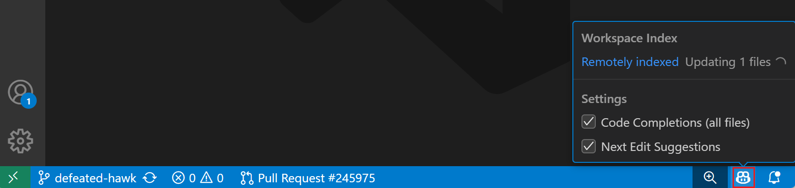
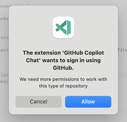

# Copilot çalışma alanınızı nasıl anlar

Copilot yalnızca tek tek dosyaları değil tüm kod tabanınızı anladığında en iyi çalışır. Çalışma alanı bağlamı, ajanların ve sohbetin dosyalar arasında mantık yürütmesini, bileşenlerin nasıl bağlandığını anlamasını ve gerçek kodunuza dayalı yanıtlar vermesini sağlayan temel mekanizmadır. "Kimlik doğrulama nerede ele alınıyor?" veya "yeni API endpoint nasıl eklenir?" gibi geniş sorular sorabilir ve belirli kod tabanınıza dayalı doğru yanıtlar alabilirsiniz.

Bu makale çalışma alanı bağlamının nasıl çalıştığını, çalışma alanı indeksinin nasıl oluşturulduğunu ve bağlamın farklı modlarda nasıl toplandığını açıklar.

Çalışma alanı bağlamı projenizin boyutuna ve kurulumuna göre otomatik ayarlanır. Küçük kişisel projede veya birden fazla depo içeren büyük kurumsal kod tabanında çalışıyor olsanız da doğru sonuçlar alırsınız. Ajan oturumları sırasında ajan kod tabanınızı özerk olarak arar; dosyalar arasında koordineli değişiklikler için ihtiyaç duyduğu bağlamı toplamak üzere genellikle birden fazla hedefli arama turu yapar.

## Çalışma alanı bağlamı nasıl çalışır

VS Code promptlarınız için en ilgili kodu bulmak üzere akıllı arama stratejileri kullanır. Tek bir yaklaşıma güvenmek yerine proje boyutunuza ve mevcut kaynaklara göre otomatik olarak en iyi yöntemi seçer. VS Code birden fazla stratejiyi paralel çalıştırır ve en iyi sonuçları en hızlı üreteni kullanır.

### Bağlam için hangi kaynaklar kullanılır?

Çalışma alanı bağlamı VS Code'da kod tabanında gezinirken bir geliştiricinin kullanacağı aynı kaynaklarda arar:

* `.gitignore` dosyası tarafından yok sayılanlar hariç çalışma alanındaki (çalışma alanı indeksi) tüm [indekslenebilir dosyalar](#what-content-is-included-in-the-workspace-index)
* İç içe klasörler ve dosya adlarıyla dizin yapısı
* Kod sembolleri ve tanımları (sınıflar, fonksiyonlar, değişkenler)
* Etkin editörde şu anda seçili metin veya görünür metin

Çalışma alanı indeksi GitHub tarafından uzaktan veya makinenizde yerel olarak tutulabilir. Ayrıntılar için [çalışma alanı indeksi](#workspace-index) bölümüne bakın.

> [!IMPORTANT]
> Yoksayılan bir dosya açıksanız veya yoksayılan dosyada metin seçiliyse `.gitignore` atlanır.

### Arama stratejisi

Küçük projeler için tüm çalışma alanı doğrudan bağlama dahil edilebilir. Daha büyük projeler için VS Code promptunuz için en ilgili bilgiyi bulmak üzere farklı stratejiler kullanır.

Aşağıdaki adımlar VS Code'un çalışma alanı bağlamını nasıl oluşturduğunu özetler:

1. Sorunuzu yanıtlamak için çalışma alanından hangi bilginin gerekli olduğunu belirleyin; sohbet geçmişi, çalışma alanı yapısı ve mevcut editör seçimi dahil.

1. [Çalışma alanı indeksinden](#workspace-index) çeşitli yaklaşımlar kullanarak ilgili kod parçalarını toplayın:

    * GitHub deponuz ve GitHub'daki ilgili depolar genelinde hızlı, kapsamlı arama için [GitHub'un kod araması](https://github.blog/2023-02-06-the-technology-behind-githubs-new-code-search)
    * Sorunuzun anlamına eşleşen kodu bulmak için yalnızca tam anahtar kelimeler değil anlam arayan yerel anlamsal arama
    * Metin tabanlı dosya adı ve içerik araması
    * Sembolleri, fonksiyon imzalarını, tür hiyerarşilerini ve çapraz dosya referanslarını çözmek için VS Code'un dil zekası (IntelliSense, LSP)

1. Ortaya çıkan bağlam _bağlam penceresine_ sığmak için çok büyükse yalnızca en ilgili kısımlar tutulur.

## Çalışma alanı indeksi

Copilot ilgili kod parçalarını hızlı ve doğru aramak için kod tabanınızda bir indeks kullanır. GitHub barındırma sağlayıcısından bağımsız olarak açtığınız her çalışma alanını otomatik indeksler. İndeks GitHub veya Azure DevOps tarafından desteklenmeyen depolar için makinenizde yerel olarak da depolanabilir.

Uzak indeks deponuzun commit edilmiş durumundan oluşturulur. Yerel çalışma alanınızdaki commit edilmemiş değişiklikler uzak indekse dahil değildir.

Yerel commit edilmemiş değişiklikleriniz olduğunda VS Code uzak indeks ile yerel dosya izlemeyi birleştiren hibrit yaklaşım kullanır. VS Code indekslenen commit'ten bu yana hangi dosyaların değiştirildiğini algılar ve gerçek zamanlı bağlam için editörden mevcut dosya içeriğini de okur.

VS Code Status Bar'daki Copilot durum panosunda kullanılan indeks türünü ve indeksleme durumunu görüntüleyebilirsiniz.

### Uzak indeks

GitHub çalışma alanınız için uzak kod arama indeksini otomatik oluşturur ve sürdürür. Bu büyük kod tabanları için bile hızlı, kapsamlı arama sonuçları sağlar.

#### GitHub uzak indeksleme

VS Code'da çalışma alanı açtığınızda GitHub depoyu otomatik indeksler. GitHub hesabınızla oturum açın ve Copilot uzak indeksi hemen kullanmaya başlar. Komut Paleti'nde (`kb(workbench.action.showCommands)`) **Build Remote Workspace Index** komutunu çalıştırarak indekslemeyi manuel de tetikleyebilirsiniz.

İndeksin depo başına yalnızca bir kez oluşturulması gerekir. Bundan sonra otomatik güncel tutulur. İndeks oluşturma küçük ve orta boy projeler için hızlıdır ancak deponuz yüz binlerce dosya içeriyorsa biraz zaman alabilir. Uzak indeks GitHub'ın kodunuzun nispeten güncel bir sürümüne sahip olması durumunda en iyi çalışır; bu nedenle kodunuzu GitHub'a düzenli push edin.

Uzak indeksleme GitHub.com veya GitHub Enterprise Cloud'ta barındırılan GitHub depoları için çalışır. GitHub Enterprise Server kullanan depolar için desteklenmez.

#### Azure DevOps uzak indeksleme

VS Code Azure DevOps depoları için uzak indeksleri de kullanabilir. Bu indeksler otomatik oluşturulur ve sürdürülür. Copilot'un uzak indeksleri kullanmaya başlaması için VS Code'da Microsoft hesabınızla oturum açın. Mevcut indeks durumu ve Azure DevOps depo erişimi için doğru izinlere sahip değilseniz oturum açma bağlantısı için Copilot Status Bar öğesini kontrol edin.

### Yerel indeks

Örneğin GitHub veya Azure DevOps deposu kullanmadığınız için [uzak indeksi](#remote-index) kullanamıyorsanız VS Code hızlı, yüksek kaliteli arama sonuçları sağlamak için makinenizde depolanan gelişmiş anlamsal indeksi kullanabilir. Şu anda yerel indeksler 2500 indekslenebilir dosyayla sınırlıdır.

Yerel indeks oluşturmak için:

* Proje 750'den az indekslenebilir dosyaya sahipse: VS Code gelişmiş yerel indeksi otomatik oluşturur.

* Proje 750 ile 2500 indekslenebilir dosya arasındaysa: Komut Paleti'nde (`kb(workbench.action.showCommands)`) **Build local workspace index** komutunu çalıştırın - bu yalnızca bir kez çalıştırılmalıdır.

* Proje 2500'den fazla indekslenebilir dosyaya sahipse: [temel indeksi](#basic-index) kullanın.

İlk yerel indeksi oluşturmak veya örneğin git dalları arasında geçiş yaparken birçok dosya değiştiyse indeksi güncellemek biraz zaman alabilir. Status Bar'daki Copilot durum panosunda mevcut yerel indeks durumunu izleyebilirsiniz.

### Temel indeks

Projenizde [uzak indeks](#remote-index) yoksa ve 2500'den fazla [indekslenebilir dosya](#what-content-is-included-in-the-workspace-index) varsa VS Code kod tabanınızı aramak için temel indekse geri döner. Bu indeks kod tabanınızı aramak için daha basit algoritmalar kullanır ve daha büyük kod tabanları için yerel olarak çalışacak şekilde optimize edilmiştir.

Temel indeks birçok sohbet promptu türü için gayet iyi çalışmalıdır. Ancak sohbetin kod tabanınızla ilgili sorulara ilgili yanıtlar vermekte zorlandığını fark ederseniz [uzak indekse](#remote-index) geçmeyi düşünün.

### Çalışma alanı indeksine hangi içerik dahil edilir

VS Code mevcut projenizin parçası olan ilgili metin dosyalarını indeksler. Bu belirli dosya türleri veya programlama dilleriyle sınırlı değildir; ancak VS Code `.tmp` veya `.out` dosyaları gibi genellikle çalışma alanı sorularıyla ilgili olmayan bazı yaygın dosya türlerini otomatik atlar.

Çalışma alanı indeksi ayrıca `setting(files.exclude)` ayarı kullanılarak VS Code'dan hariç tutulan veya `.gitignore` dosyasının parçası olan dosyaları da hariç tutar.

VS Code şu anda görüntüler veya PDF'ler gibi ikili dosyaları indekslemez.

## Çalışma alanı bağlamı nasıl kullanılır

Çalışma alanı bağlamının nasıl toplandığı sohbette kullandığınız moda bağlıdır:

* **Agent ve Plan**

    Ajanlar promptunuza dayalı özerk kod tabanı aramaları gerçekleştirir. İlk aramadan sonra ajan sonuçlara bağlı olarak daha fazla bağlam toplamak için ek hedefli aramalar yapabilir. Ajanlar değişiklik yapmadan önce ilgili kodun tam resmini oluşturmak için `codebase`, `grep`, `file` ve dil zekası gibi araçları kullanır.

* **Ask**

    Ask modu ajanlarla aynı ajanik araç tabanlı yaklaşımı kullanır. Copilot kendisine mevcut araçlarla kod tabanınızı otomatik arar ve ilgili kod parçalarını toplar. Ayrıca promptunuzda dosyalara, sembollere veya diğer [bağlam öğelerine](/docs/copilot/chat/copilot-chat-context.md) açıkça atıfta bulunabilirsiniz.

* **Edit** _(kullanım dışı)_

    Edit modu kullanım dışıdır. Bunun yerine ajanları veya ask modunu kullanın. Edit modu ilgili bağlam için çalışma alanını arar ancak takip aramaları yapmaz.

## Daha iyi çalışma alanı bağlamı ipuçları

Promptunuzu nasıl ifade ettiğiniz bağlamın kalitesini ve yanıtın doğruluğunu etkiler.

* Belirli ve ayrıntılı olun; "bu ne yapıyor" gibi "bu"nun son yanıt, mevcut dosya veya tüm proje olarak yorumlanabileceği belirsiz terimlerden kaçının.
* Kodunuzda veya belgelerinde görünmesi muhtemel terimler ve kavramlar kullanın.
* Kod seçerek, dosyalara referans vererek veya hata ayıklama bağlamı, terminal çıktısı ve daha fazlası gibi [bağlam öğelerine #-mention](/docs/copilot/chat/copilot-chat-context.md) ile açıkça ilgili bağlamı dahil edin.
* Yanıtlar "catch bloğu olmayan istisnaları bul" veya "handleError'ın nasıl çağrıldığına örnekler ver" gibi birden fazla referanstan çekilebilir. Ancak "bu fonksiyon kaç kez çağrılıyor?" veya "bu projedeki tüm hataları düzelt" gibi tüm kod tabanı genelinde kapsamlı kod analizi beklemeyin.
* "Bu dosyaya kim katkıda bulundu?" gibi kodun ötesindeki bilgiler için ilgili [araçları veya MCP sunucularını](/docs/copilot/agents/agent-tools.md) yapılandırın.

## Özel depolar

Özel depolar için daha fazla çalışma alanı arama özelliğini etkinleştirmek için ek izinler gereklidir. Bu izinlere zaten sahip olmadığımızı algılarsak başlangıçta sizden isteriz. Verildiğinde gelecekte kullanım için güvenli şekilde depolayacağız.

Güvenlik, gizlilik ve şeffaflık hakkında [GitHub Copilot Trust Center](https://resources.github.com/copilot-trust-center/)'da daha fazla bilgi edinin.

## Sık sorulan sorular

### Promptlarımda `@workspace` veya `#codebase` kullanmam gerekiyor mu?

Çoğu durumda hayır. Ajanlar ve ask modu ilgili bağlam için çalışma alanınızı otomatik arar. Promptunuzda çalışma alanı bağlamına açıkça atıfta bulunmanız gerekmez.

Belirli bir promptun çalışma alanı araması tetiklemesini sağlamak istiyorsanız yine de promptunuzda [bağlam öğesi](/docs/copilot/chat/copilot-chat-context.md) olarak `#codebase` ekleyebilirsiniz. `@workspace` [sohbet katılımcısı](/docs/copilot/chat/copilot-chat-context.md#-mentions) geriye dönük uyumluluk için hala mevcuttur.
