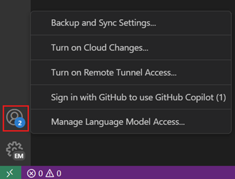

# VS Code'da GitHub Copilot Kurulumu

Bu rehber sizi Visual Studio Code'da GitHub Copilot kurulumu boyunca yönlendirir. VS Code'da Copilot kullanmak için GitHub hesabınızla GitHub Copilot erişimine sahip olmanız gerekir.

<video src="./images/setup/vscode-copilot-setup.mp4" poster="./images/setup/setup-copilot-sign-in.png" title="Visual Studio Code'da GitHub Copilot kurulumu" loop controls muted></video>

<div class="docs-action" data-show-in-doc="false" data-show-in-sidebar="true" title="AI ile Başlayın">
VS Code'da AI ile ilk uygulamanızı oluşturmak için adım adım öğreticiyi takip edin.

* [Öğreticiye Başlayın](/docs/copilot/getting-started.md)

</div>

VS Code'da Copilot ile başlamak için şu adımları izleyin:

1. Durum Çubuğundaki Copilot simgesinin üzerine gelin ve **Use AI Features** seçin.

1. Bir giriş yöntemi seçin ve istemleri takip edin.

    * Hesabınız için zaten Copilot aboneliğiniz varsa, VS Code bu aboneliği kullanır.

    * Henüz Copilot aboneliğiniz yoksa, [Copilot Ücretsiz planına](https://docs.github.com/en/copilot/managing-copilot/managing-copilot-as-an-individual-subscriber/managing-copilot-free/about-github-copilot-free) kaydolursunuz ve satır içi öneriler ile sohbet etkileşimleri için aylık bir limite sahip olursunuz. Farklı [GitHub Copilot planları](https://docs.github.com/en/copilot/get-started/plans) hakkında daha fazla bilgi edinin.

1. VS Code'da Copilot kullanmaya başlayın!

    Temelleri [Copilot Hızlı Başlangıç](/docs/copilot/getting-started.md) ile öğrenin.

1. Projenizi AI için ayarlamak üzere sohbet oturumunda `/init` yazın.

    `/init` komutu kod tabanınızı analiz eder ve AI'ın kodlama uygulamalarınıza uygun kod üretmesine yardımcı olmak için [özel talimatlar](/docs/copilot/customization/custom-instructions.md) oluşturur.

> [!IMPORTANT]
> GitHub Copilot'un ücretsiz sürümünde telemetri şu anda etkindir. Varsayılan olarak, VS Code ve [github.com](http://github.com/copilot) deneyiminde kod referansları dahil olmak üzere genel kodla eşleşen kod önerilerine izin verilir. `setting(telemetry.telemetryLevel)` ayarını `off` yaparak telemetri veri toplamadan vazgeçebilir veya [Copilot Ayarları](https://github.com/settings/copilot)'nda hem telemetri hem de kod önerisi ayarlarını ayarlayabilirsiniz.

## GHE hesabı ile Copilot kullanma

Copilot aboneliğiniz bir GitHub Enterprise (GHE) hesabıyla ilişkiliyse, VS Code'da Copilot'a GHE kimlik bilgilerinizle giriş yapabilirsiniz.

1. Henüz yapmadıysanız, Durum Çubuğundaki Copilot simgesinin üzerine gelin ve **Use AI Features** seçin.

1. Giriş iletişim kutusunda **Continue with GHE.com** seçin ve GHE örnek URL'nizi ve kimlik bilgilerinizi girin.

GitHub.com hesabı ile GHE hesabı arasında geçiş yapmanız gerekiyorsa, talimatlar için [çalışma alanı veya profil başına farklı GitHub hesabı kullanma](#use-a-different-github-account-per-workspace-or-profile) bölümüne bakın.

## Copilot ile farklı GitHub hesabı kullanma

Copilot aboneliğiniz başka bir GitHub hesabıyla ilişkiliyse, VS Code'daki mevcut GitHub hesabınızdan çıkış yapıp başka bir hesapla giriş yapmak için şu adımları izleyin.

1. Etkinlik Çubuğundaki **Accounts** menüsünü seçin ve ardından şu anda giriş yaptığınız hesap için **Sign out** seçin.

    

1. Aşağıdaki yöntemlerden herhangi biriyle GitHub hesabınıza giriş yapın:

    * Durum Çubuğundaki Copilot menüsünden **Sign in to use Copilot** seçin.

        

    * Etkinlik Çubuğundaki **Accounts** menüsünü seçin ve ardından **Sign in with GitHub to use GitHub Copilot** seçin.

        

    * Komut Paleti'nde (`kb(workbench.action.showCommands)`) **GitHub Copilot: Sign in** komutunu çalıştırın.

## Çalışma alanı veya profil başına farklı GitHub hesabı kullanma

VS Code çalışma alanı veya profil başına Copilot için farklı GitHub hesapları kullanabilirsiniz. Bu, iş ve kişisel projeler için Copilot'u farklı hesaplarla kullanmanız veya GitHub kimlik doğrulaması kullanan farklı uzantılar için farklı hesaplar kullanmanız durumunda kullanışlıdır.

Copilot için hangi GitHub hesabının kullanılacağını yapılandırmak için şu adımları izleyin. Bu yapılandırma çalışma alanı ve profil başına kaydedilir.

* GitHub.com hesapları için:

    1. Etkinlik Çubuğundaki Accounts menüsünde **Manage Extension Account Preferences** seçin
    1. Uzantı listesinden **GitHub Copilot Chat** seçin
    1. Mevcut çalışma alanı ve profil için Copilot'ta kullanmak istediğiniz GitHub hesabını seçin

* GHE.com hesapları için:

    > [!TIP]
    > Copilot için yalnızca GHE hesabı kullanmak istiyorsanız, GHE hesabınızla giriş yapmak için [GHE hesabı ile Copilot kullanma](#use-copilot-with-a-ghe-account) bölümündeki adımları izleyin.

    1. Komut Paleti'nden (`kb(workbench.action.showCommands)`) **Preferences: Open User Settings (JSON)** veya **Preferences: Open Workspace Settings (JSON)** çalıştırın

    1. Copilot için kimlik doğrulama sağlayıcısı olarak GitHub Enterprise belirtmek üzere aşağıdaki ayarı ekleyin:

        ```json
        "github.copilot.advanced": {
            "authProvider": "github-enterprise"
        }
        ```

    1. Zaten giriş yapmadıysanız GitHub Enterprise hesabınıza yeniden giriş yapın

## VS Code'dan AI özelliklerini kaldırma

VS Code'da diğer özellikleri yapılandırdığınız gibi, `setting(chat.disableAIFeatures)` ayarıyla yerleşik AI özelliklerini devre dışı bırakabilirsiniz. Bu, VS Code'da sohbet veya satır içi öneriler gibi özellikleri devre dışı bırakır ve Copilot uzantılarını devre dışı bırakır. Ayarı çalışma alanı veya kullanıcı düzeyinde yapılandırabilirsiniz.

Alternatif olarak, ayara erişmek için başlık çubuğundaki Chat menüsünden **Learn How to Hide AI Features** eylemini kullanın.

> [!NOTE]
> Yerleşik AI özelliklerini daha önce devre dışı bıraktıysanız, tercihiniz VS Code'un yeni bir sürümüne güncellemede korunur.

## Belirli çalışma alanı için AI özelliklerini devre dışı bırakma

Belirli bir çalışma alanı için AI özelliklerini devre dışı bırakmak için, `setting(chat.disableAIFeatures)` ayarını çalışma alanı ayarlarında yapılandırın. Bu ayar Ayarlar editöründe (`kb(workbench.action.openSettings)`) mevcuttur veya çalışma alanındaki `settings.json` dosyasını düzenleyebilirsiniz.

## Sonraki adımlar

* VS Code'da AI destekli geliştirmenin temel özelliklerini keşfetmek için [AI kullanımı Hızlı Başlangıç](/docs/copilot/getting-started.md) ile devam edin.
